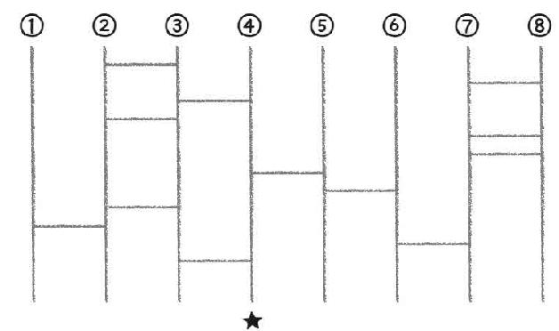
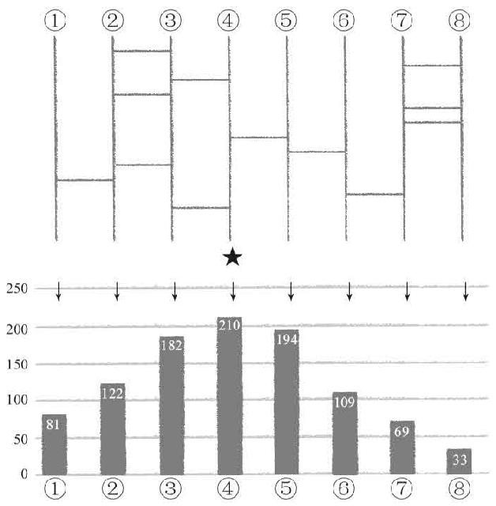

> 第一章  
>  为什么统计学是最牛的学问？

> 01 没有统计学思维的人将会吃大亏的时代

赫伯特·乔治·威尔斯关于统计学的预言

“1903年，赫伯特·乔治·威尔斯曾经预言，在未来社会，统计学思维将像阅读能力一样成为社会人必不可少的能力。”哈佛大学医学院的统计学教材的开篇写着这样一句话。

赫伯特·乔治·威尔斯是被称为“科幻小说之父”的作家和思想家。在威尔斯的著作中首次出现了时间机器和透明人等科幻概念，他凭借自己丰富的科学知识与预见性，准确地预言了核武器与联合国乃至现在被我们称为维基百科的百科事典的出现。

在现代统计学还处于黎明期的1903年，威尔斯为何做出这样的预言，我们无从得知。但是在接近100年后的今天，统计学的思考方法对我们来说毫无疑问已经成为与阅读能力同样重要的能力。就好像一个没有阅读能力的人在现代社会寸步难行，没有统计学思维的人同样难以在现代社会生存。

没有阅读能力就无法理解合同和法律中的内容，没有统计学思维就无法了解概率和数据。这两者缺一不可，否则就会陷入毫无防备的状态，成为那些合法诈骗的受害者，而你自己又无法抱怨。

让抽签必胜的统计学思维

举一个我身边的例子，在上大学的时候，我经常与研究室的朋友抽签决定谁去便利店买东西。

抽签有很多种方法，那天我们选择的方法是由4名参与者画出8条竖线，然后我在其他人都看不见的情况下，从左边数起，在第4条竖线下面画了一颗星星，剩下的3人则在我看不见的情况下，每人画4条横线。参加者猜拳决定顺序，从1~8条竖线中选择一条，一轮结束后顺序调转过来继续。选中星星符号的人要替其他人去便利店买东西（图1–1）。

图1–1

要是全凭直觉来玩这个游戏，那么你获胜的概率一定很低。

我们尝试按照这个规则重复1 000次，将每条竖线选中星星的次数进行模拟试验，结果如图1–2所示。

选中星星概率最高的是正上方的4，在1 000次的试验中选中了210次，也就是说有21.0%的概率。紧接着，就是右边的19.4%概率。最右边的概率最低，只有3.3%。

实际上，在类似这样的抽签游戏中，或许是出于人类的心理倾向，最先选择两端竖线的人少之又少。

也就是说，看上去好像是每人1/4，也就是25%概率的公平比赛，但实际上一直选择两端的我可能去便利店的概率只有11.4%［=（81+33）/1 000］。凭直觉选择靠近中心竖线的朋友，则有40.4%［=（210+194）/1000］的概率选中。对于抽签的结果，他们每次都会带着“最近运气真差”的感觉去便利店买东西。

图1–2

另外，似乎有的地方政府在对公共工程进行招标时的最后选择是“相同条件的情况下采用抽签方式作决定”，也许有的公司就利用概率知识提高了公司的中标率。

掌握统计学的人就能够掌握世界

当然，画横线的过程就像模拟试验一样是完全随机的，所以不管概率有多低，我也不能完全规避。但是，只要掌握一定程度的统计学，就能够在这种不确定的情况下稍微耍一点手段，抢得先机。

比如，我为一家零售企业作数据分析，我将他们之前漫无目的投放直接邮寄广告（DM）的目标群体，分成了“应该发送的客户”和“不应该发送的客户”，经过优化选择后他们的销售额增加了6%。因为他们之前的销售额是1 000亿日元，增加的6%也就是60亿日元。

我并没有增加DM的投放量，所以没有增加成本，只是通过分析找出发送DM后“能够增加销售额的顾客”和“不会增加销售额的顾客”，就好像在抽签中所使用的手段一样，使销售额提高6%的“手段”也是存在的。

假如你和你的公司没有使用这种手段，而竞争对手的公司却使用了，那就会抢走你的顾客与利益。

对于生存在21世纪的我们来说，统计学已经是必不可少的技能，同时对于很多人来说也是最强的武器。在商业领域应用统计学解决问题被称为商务智能，其中的智能指的就是经常出现在谍战电影中的中央情报局（CIA）的“I”。而且，从中国古代的《孙子兵法》开始，就一直强调战争中情报的重要性。

掌握情报的人就能够掌握世界，这句话放在现代社会，就应该是“掌握统计学的人，就能够掌握世界”。

> 02 统计学是能够得出最好、最快答案的正确方法

统计学成为最强武器的原因

为什么统计学会成为最强的武器呢？

用一句话来回答，那就是不管在什么领域，收集数据进行分析都是得出最好、最快答案的方法。

如果你在一家零售企业工作，总裁打算召开全体会议研究如何增加销量，那么这究竟会是怎样一种情况呢？

首先，先对增加销量提出方案，然后那些老资历的员工就会主观地提出“我感觉……”或者“根据我常年的经验……”之类的建议。

我可以断言，如果你的公司拥有足够多的数据，但是却不对数据进行分析，而只是根据直觉和经验来进行讨论的话，那完全是在浪费时间。不仅如此，还会白白地浪费会议参加者的人工费。日本有很多公司，对于那些时薪为800日元的年轻人非常苛刻，经常呵斥他们偷懒，但是却对那些时薪高于他们几倍甚至几十倍的老员工在会议上浪费时间的情况毫不在意。

单凭感觉做出的决定导致犯错误的情况，会给经营者、员工以及客户造成困扰，但是在这个世界上有些情况是绝对不允许出现错误的，比如说人命相关的情况。

如果你的一个错误选择会导致10万人失去性命的话，你究竟应该以什么为依据做出判断呢？在这种时候，你还会依靠领导的直觉和经验来做出决定吗？

或者说，像日本首相或者日本厚生劳动大臣这些手握重权的人，如果由他来决定包括你和你的家人在内的10万人的性命，他若是只凭借毫无根据的个人意见来进行决定的话，你会是什么感觉呢？

一个错误的判断就会导致10万人失去生命，这种状况像是科幻电影中出现的场面。但是在医疗领域，特别是我从事的“公共卫生”以及“社会医学”、“保健行政”等领域，这类情况却时有发生。

日本每年有35万人死亡，其中约19万人死于心脏病，约3万人死于自杀。但是，如果能够采取适当的预防和治疗措施，就可以拯救其中几万人的性命。

为了在面对像这样关系到大量人命的问题时不会做出错误的选择，在19世纪的伦敦，人类历史上第一次利用统计学的力量与夺走数以万计人类性命的原因展开了战斗。

为了遏止原因不明的流行病而诞生的学问叫作“流行病学”，世界上最早的流行病学研究开始于19世纪的伦敦，针对的是一种叫作霍乱的流行病。在流行病学之中，统计学也发挥了巨大的作用。

当时霍乱在英国本土爆发了4次，据说总共夺走了十几万人的性命。尽管当时的科学技术没有现代这么先进，但是当时的伦敦也聚集了大量接受过高等教育的科学家和医生，还有优秀的政府官员。虽然他们都是非常聪明且能力很强的人，面对霍乱的流行却一筹莫展。甚至可以说，他们的一些决定对当时的局面是有害无利的。

比如，有的医生提议用他调制的特别除臭剂来阻止霍乱的流行。

当时的伦敦正处于工业革命的高潮期，在这一时期，依靠农业无法养家糊口的人全都挤进城市，进入工厂变成劳动者。城市的建设跟不上急剧增加的人口数量，于是城市中充满了狭窄而肮脏的房屋，房屋中又挤满了蜂拥而入的人群，因为没有完善的排水系统，垃圾与排泄物充斥着庭院、地下室以及街头巷尾。这些恶臭当然使人难以忍受，或许这位提议用除臭剂的医生是认为，既然死于霍乱的人大多是那些居住在“恶臭之地”的散发着恶臭的劳动者们，那么只要消除这些恶臭就能够控制霍乱的肆虐。

但是，有更加果敢的官员认为应该把“脏东西”彻底清除。这位官员组织清扫城中的垃圾，疏通排水管道，让污物流入河中。这位官员采取行动的时间正是霍乱第一次和第二次大爆发的期间，但是第二次霍乱的大爆发（约死亡7万人）却比最初爆发时（约死亡2万人）导致了更高的死亡率。

总之，看上去充满知识和见识的他们，绞尽脑汁想出的办法，消耗大量时间和劳力进行的工作，都白白浪费了，甚至还造成了更糟糕的结果。

简单的方法就能拯救10万人的生命

那么，他们究竟应该怎么做呢？被称为“流行病学之父”的外科医生约翰·斯诺所做的事情相当简单。

> 访问有家人因霍乱去世的家庭，询问具体情况并且仔细观察周围环境。

> 对比在同样状况下，感染霍乱的人和没感染霍乱的人的区别。

> 做出假设后收集大量数据，针对霍乱发病与不发病之间的区别，对假设是否准确进行验证。

约翰·斯诺将自己的调查结果制作成一个详细的报告书，其中最能够显示出霍乱预防方法的内容如表1–1所示。

表1–1 斯诺的报告

| | | | |
| --- | --- | --- | --- |
| | 家庭数 | 因霍乱死亡人数 | 每1万户死亡人数 |
| 使用供水公司A | 40 046 | 1 263 | 315 |
| 使用供水公司B | 26 107 | 98 | 37 |

出处：约翰·斯诺《霍乱的传染模式》

当时在伦敦有许多家供水公司，即便同一个地区的邻居也可能选择不同的公司。表1–1中斯诺所进行的分析，是在同样贫穷肮脏的地区之中，使用不同供水公司的家庭数以及因霍乱死亡的人数。

在调查中，使用供水公司A的家庭有1 263人死于霍乱，而使用供水公司B的家庭则只有98人死于霍乱。当然，单纯地比较死者数字是不公平的，所以必须通过“家庭数量”来进行调整。如果家庭数量多的话，出现霍乱感染者的概率也会增加。

于是，斯诺将家庭数量限制在1万户，然后再对两者的霍乱死亡人数进行比较。但即便如此，使用供水公司A的家庭死亡率仍然是使用供水公司B家庭的8.5倍。

当时伦敦社会还没有专门选择供水公司的习惯，而在同一个地区一户人家的房屋面积以及居住于其中的人数是基本相同的。所以，在同样的条件下，只是因为所使用的供水公司不同，就会有高出8.5倍的死亡风险，这究竟是因为什么呢？

斯诺提出的解决霍乱爆发的方法非常简单。

> “停止使用供水公司A的水！”

在斯诺发表这一研究结果之后的30年，德国的微生物学家罗伯特·科霍才发现霍乱的病原体“霍乱弧菌”，并且证明了霍乱弧菌能够存活于水中，霍乱患者的排泄物中也含有此种细菌，而饮用了含有霍乱弧菌的水就会感染霍乱。

实际上，供水公司A和供水公司B的区别就在于，前者在流经伦敦中心的泰晤士河下游取水，而后者从泰晤士河上游取水。而当时的泰晤士河，正因为前面提到过的那位“果敢官员”的努力，充满了大量的霍乱患者的排泄物。也就是说，那位官员在无意间创造了一个非常高效的“扩大再生产”霍乱患者的社会系统。

虽然科霍的发现具有很高的科学价值，但是即便知道病原体究竟是什么，以及霍乱的发病原因，但是要想阻止霍乱的流行，还是需要改变饮用水的水源。

遗憾的是，斯诺的主张因为“缺乏科学依据”或者“没有足够的证据”而没有被学会和政府所采纳，可是听从他的建议放弃使用被霍乱污染水源的城镇却成功地防止了霍乱的继续传播。

正如霍乱的故事所表明的那样，一群优秀的聪明人聚集在一起，不一定能够提出简单而强力的解决方法，甚至还有可能互相制约。而且他们提出的方法，虽然乍看上去很有道理，但实际上却经常是无益甚至有害的。

流行病学研究延长了人类的寿命

斯诺提出的“流行病学”的概率思考方式，逐渐成为整个医学领域不可缺少的知识。吸烟导致患胃癌的风险上升、高血压导致患心脏病和脑溢血的风险上升等情况，对于现在的我们来说已经是理所当然的常识。但50年前，在美国一个叫作弗明汉的小村庄中进行的大规模流行病学研究结果公布之前，这还不是人人皆知的常识。在此之前，医生和科学家对吸烟是否有害健康，以及高血压是否对身体不好一直众说纷纭。

但是，正因为“要想减少癌症的发病率就降低吸烟率”以及“要想减少心脏病的发病率就降低血压”这些流行病学研究的简单结论，使得我们的医学研究与健康政策方针都发生了改变，而我们的寿命相比50年前也有了实质性的延长。

如果这一判断到现在还被认为只是基于讨论的错误判断的话，那么究竟会有多少人因此而失去性命。由此可见，统计学所发挥的作用实在是难以估量。

> 03 所有的学问都从统计学开始

统计学的“实证”方法改变了医学界

“流行病学”这种基于数据和统计分析做出最佳判断的思考方法，在被斯诺发现之后100年的今天，已经成为医学领域不可缺少的东西。

现代医疗最重要的手段叫作EBM（Evidence–Based Medicine），翻译过来就是“基于实证的医疗”，也叫“循证医学”。而在上述的实证之中最重要的一环，就是通过科学的方法所得出的统计数据和分析结果。

斯诺的流行病学仅仅根据基本的数据采集就揭晓了霍乱产生的原因，但是随着现代统计学的进步，流行病学的方法论也逐渐变得更加完善，因此可以做出更加准确的判断。

人类的身体充满了不确定性，如果对数据进行分析就会发现很多问题。在生理学理论上完全正确的治疗方法有可能对某些人群完全没有疗效，著名医院的那些权威医师到目前为止一直使用的治疗方法，实际上是完全错误的。

因此，不能仅凭医师的经验和直觉，而应该重视数据以及分析结果，也就是基于实证做出最合适的判断，这已经成为现代医学主流的思考方法。

EBM的思考方法从20世纪80~90年代才逐渐扩展到全世界，而对于目前活跃在医疗第一线的医师们来说，大多都“在学生时代基本没有学过这个知识”。

对医师进行统计学教育似乎在美国也是一个非常严峻的问题，美国医师协会甚至在他们发行的学术杂志上发表了一篇文章称“对医学生进行的基础统计学测试结果令人非常遗憾”。要将EBM彻底拓展到医学第一线，想必还有很长的路要走。

但是即便困难重重，统计学的实证方法在医学中所处的重要地位还是没有变的。比如说一家制药公司要开发新药品的时候，首先，需要用缜密地计划出来的研究方法对采集来的数据进行适当的统计分析。其次，还必须将分析结果提交给厚生劳动省，如果没有做到这些，新药品就无法得到批准，也无法适用于医疗保险。当这款药品上市之后，制药公司如果希望自己的商品能够得到更好的销量，那就必须投入巨额的研究费用进行临床试验，并且凭借研究的结果将药品推销给医师们。

正如我在上一节中说过的那样，实证方法可以略过讨论直接得出最佳答案。当然，所依据数据的提取方法和分析方法，对最终结论的准确性会有一定的影响。但是即便如此，要想反驳实证，仅凭理论和个人经验是远远不够的，只能针对统计学数据和方法的局限性来进行反驳，或者另外建立一个新的实证数据模型来进行对抗。

活用在教育中的实证方法

现在大家多少对实证方法的优势有了一些了解，实际上实证方法并不只局限于应用在医学领域。

比如说，近年来在美国教育界也非常积极地提倡实证方法的重要性，并且开始对基于实证研究的教育方法进行评价。

其中最具代表性的当属从小布什执政时期提出的《不让一个孩子掉队法》开始的WWC工程。

在《不让一个孩子掉队法》中类似“针对处于不利状况的学生的教育服务计划，必须根据科学的研究结果进行考虑”和“只有具备科学研究依据的预防年轻人采取暴力行为和吸毒的政策，才会得到财政预算”这样带有同“基于实证研究”相似的说法的的表述总共出现了100次以上。

为了对基于实证研究的教育程序进行计划和评价，WWC工程将到目前为止所有与教育相关的实证研究全部收集到一起，并且进行了系统整理。研究的结果被公布在互联网上，阐明“什么样的教育方法是科学的”，希望借此提高全美国的教育质量。虽然《不让一个孩子掉队法》这个政策本身褒贬不一，但是将科学的研究方法引入教育领域这件事情，本身却是一件非常了不起的功绩。

不可思议的是，一旦提到教育相关的问题，就算是对教育一无所知的人也会提出自己的意见和看法。任何一个居住在先进国家的正常人，基本上都接受过某种形式的学校教育，孩子们一出生也要接受教育。

因此，这些人出于“我接受过教育”或者“我教育过孩子”的个人经验，对教育的优劣做出判断，并且提出自己的意见。还有些人，只是因为在上大学时就当上了律师，或者所有的孩子都进了东京大学，就将其个人经验奉为真理、深信不疑。

究竟什么样的教育方法才是最好的，对于这个问题的回答也与医疗问题一样属于充满不确定性的领域，因为受教育者的特性和能力以及周围的环境都会对最终的结果产生重要影响。当自己生病的时候，想必没有人会马上去找百岁老人询问长寿的秘诀吧？可是，那些为孩子成绩烦恼的家长，却争先恐后地购买将所有孩子都送进东京大学的老年人所写的个人经验，会出现这种现象难道大家不觉得很莫名其妙吗？

比如下面这些情况：

> 让教师根据学生的成绩进行竞争，教师奖金的发放也与成绩挂钩。

> 孩子在念小学之前就接受精英教育，一定会培养出天才少年。

> 在数学教育中，更多地使用计算机就可以进一步提高教学效率。

不管是教育学者还是教育家，甚至普通的老百姓都纷纷提倡这些建议。但实际上，要想知道这些建议是否真的正确，最终还是要靠数据和统计学的力量进行判断。

顺便说一下，对于“教师奖金的发放与成绩挂钩”这一建议，2006~2009年在美国纳什维尔的许多公立学校中，有人以2.4万名学生以及3 000名教师为对象进行了数据采集。结果显示“在统计学上看不出有任何的改善，甚至有不好的影响”。

关于早期精英教育，有人在美国纳什维尔的公立学校中选择了4 700名3~4岁的孩子对其进行读写和算数的早期教育，结果显示在3~4岁这个年龄段的孩子读写与算数的成绩确实高于同年龄段的其他孩子，但是到小学1年级进行的追踪调查却发现两者之间的成绩差已经消失。

使用计算机进行教育，是上述3个建议中唯一有希望的，与接受传统教育方法的学生相比，使用计算机学习的学生的数学成绩有明显提高，这一点在统计学上也已经得到了明确的证实，有一个被称为“我可以学习”的项目就是最好的例子。

当然，美国人研究的结果是否放之四海而皆准还需要进一步讨论，但是能够对假设的教育方法进行是否行之有效的判断，正是统计学的作用所在。

任何领域都需要统计学思维方法

不只在教育学方面，从心理学方面、社会学方面、自然科学方面来说，只要是需要对假设进行验证的时候，都需要利用统计学的知识选取适当数据且进行分析。

有一部叫作《点球成金》的电影，里面展示了如何运用被称为“SABER metrics”的棒球记录统计学思维方法，使一个平民球队在大联盟中取得季后赛胜利的故事。除了棒球之外的其他各项体育运动，也纷纷开始了对数据进行分析并以此取得胜利的尝试。

另外，在经济学中，多年以来都是以几个假设条件（假设人类采取理性的行动、假设交易成本为零）为基础通过理论思考数据模型，但是在利用电子设备收集整理过去几百年间各国的经济相关数据（性别、年龄、人口、国民收入、储蓄额、物价等）之后，我们终于可以通过统计学的分析来对诸如“如何对是否出现经济增长进行说明”这样的问题给出明确回答。

经济增长中最重要的一点当属“技术的进步”，而技术的进步则要依靠教育水平和技术开发，是否能够将经济增长的成果适当地分配给开发者，则基于“社会制度”（比如说一些优惠政策）。相反，天然资源的有无则与经济增长的关系并不密切。这一点，是在进行数据整理和统计学分析之后，才初次被世人所了解的事实。

当然，经营管理、市场营销、改革创新等营销领域的内容也不例外。

> “好的领导力和坏的领导力区别在哪里？”

> “怎样才能够划分出最有潜力的市场区域？”

> “如何激励研究人员才能够使技术开发更有效率？”

面对这些问题，很多领导和经济学家都会提出各自的见解，但就像教育学的例子一样，只有统计学才能够给出“针对现状最佳的答案”。

不管人们希望也好，不希望也罢，几乎任何领域相关学者都必须学习使用统计学的时代已经来临了，只要拥有统计学思维，即便在自己的人生中遭遇超出自身经验和直觉的问题，也能够轻松化解。

拥有了统计学思维，你甚至有可能直接得出世界顶尖学者经过多年研究才能取得的结论。是否拥有这种能力，一定会对大家的人生产生非常重大的影响。

> 04 大数据时代，统计学火了

为什么统计学现在这么火？

为什么直到现在，统计学才在各个领域得到重视呢？

通过数据之间的关联性、利用因果关系进行推论的现代统计学的基本思考方法，早在20世纪初期就已经确立，主要的统计分析方法则在20世纪60年代全部出现。如今，距离被称为现代统计学之父的罗纳德·艾尔默·费希尔去世已经过了半个世纪。如果统计学真的如前文所说具有如此强大的力量，那为什么在之前的社会中没有被大规模应用呢？实际上这个问题并不在于统计学本身，而是在于能够活用统计学的外部环境发生了变化。

为了使大家能够更好地理解这一变化，让我对第二节中提到过的将弗明汉居民全部卷入其中的大规模流行病学研究作进一步的详细介绍。

这项流行病学研究一般被称为弗明汉研究，是在第二次世界大战结束之后不久的1948年，为了查明当时持续增加的心脏病患者的病因而成立的调查。科霍的研究证明了包括霍乱细菌在内的各种细菌是造成传染病的原因，由此产生了利用疫苗和抗生素来进行治疗的方法。但是，在因为细菌感染而死亡的人数减少之后，与细菌没有关系的病症，比如心脏病和癌症以及脑中风等疾病却成了以美国为首的发达国家中死亡率最高的疾病，这也成为当时医学界的一大难题。

在这样的背景下，以施行新政而闻名的富兰克林·罗斯福总统对此非常重视（顺便说一句，罗斯福总统本人也是死于心脏病），并且由此展开了可以称为人类史上第一次的大规模流行病学研究项目。不管是心脏病还是霍乱，只要是不明原因的病症，要想查明其发病原因，只有进行慎重且大规模的数据采集，并且对采集的数据进行仔细分析。除此之外别无他法。

弗明汉当时有大约2.8万名居民，其中29~69岁的居民中有5 127人响应了研究小组的号召参加了这项研究，占这部分人数的2/3。因为当时对心脏病的成因几乎没有任何线索，所以除了性别、年龄等基本信息之外，还记录了每个人的过往病史与生活习惯、血压、心电图、血液成分、社会经济学指标等各种各样的项目。当时采集的血液，随着后来检查方法的不断进步又追加了很多检查项目，因此一直冷冻保存至今。

弗明汉研究一直到今天仍在继续，每当有其他研究出现新进展的时候都会对其进行追加的项目调查，如今参加最初研究的那些人的后代还参加了对遗传因子的调查研究。

弗明汉研究针对5 000余名对象定期进行检查与询问，调查频率是每两年1次。

如此大规模而且彻底的调查研究，为什么不每年进行呢？实际上当时的研究者也非常渴望能够做到1年1次。但是，由于当时的技术能力所限，每两年进行一次就已经是调查频率的极限了。

至于限制调查频率的原因，则是数据输入、管理以及采集所花费的时间和精力。

弗明汉研究小组在最初进行数据采集时所使用的设备，据说只有一台大型穿孔卡片机。

说起穿孔卡片，可能很多人连实物都没有见过吧。简单来说就是在一个厚纸片上利用物理手段打孔，根据打孔的位置记录数据。

首先，人工记录5 000人的生活习惯和血液检查的结果，再将数值转换为穿孔卡片进行保存，检查是否有错误，然后对各个调查项目的平均值和比例进行综合统计。进行这样的工作，每两年一次的频率已经是极限了。

至于弗明汉研究的目标“找到心脏病的成因”，需要对各个变量和多样的调查项目之间的关联性进行分析，这就需要用到逻辑回归的分析方法（实际上，逻辑回归分析本身就是因弗明汉研究而诞生的方法）。但是，对5 000名研究对象的数据进行分析，就相当于使用5 000个质数的矢量，进行包括对数变换在内的非常繁杂的矩阵计算，只有这样才能够得出最终答案。

一直到20世纪60年代国际商业机器公司（IBM）发明了大型通用计算机，并且将其应用到研究中之后，弗明汉研究才能够对10年间的调查数据进行分析。

无聊的“纸和笔的统计学”已经过时了

从那以后的计算机技术进步，可以说是突飞猛进。

穿孔卡片上记录的数据可以非常简单地记录在只读光盘（CD–ROM）或者硬盘上，数据输入也可以看着画面非常简单地进行。获得的数据可以通过互联网非常方便地收集和传送，至于统计分析，不仅可以通过个人电脑来进行，甚至连现在的智能手机都能够胜任。

以前的统计学家们常用的研究方法有两种，或者省去计算的麻烦直接进行类似的准确度较高的推测，或者尽可能少地对数据进行计算并得出准确度较高的推测，但是这些研究方法现在基本上已经不会出现在实际分析当中。随着计算机技术的进步，不管是庞大的数据还是繁杂的计算，都已经不再是统计分析的瓶颈。

另外，以前的统计学教育只能依靠黑板和粉笔，或者纸和笔，主要以理解算式，对几十个数据进行手工计算和分析为主。但是，现在的统计分析只需要写一个简单的程序，或者使用现成的统计分析工具，对大规模的数据进行实际分析也成为可能。

虽然我们现在主要使用的统计学思考方法和分析方法，早在几十年前就已经基本完成，但是像现在这样让每个人都能够随时随地地简单使用，还是在20世纪末计算机技术发生革命性进步之后，才得以实现的。

以前的纸和笔的统计学与现代的计算机统计学之间存在着巨大的差距，现代的统计学家必须在精通数理知识的同时，还掌握计算机技术的应用。

如果本书的读者朋友们在大学时代对统计学课程留下了一种无聊的印象，那么可能是因为只接受过“纸和笔的统计学”教育，所以对于一直在时代最前沿给出最佳解答的计算机统计学的力量没有切身感受，这也是情有可原的。

“大数据”时代浓浓的统计学气息

统计学在近几年的变化，可以说受计算机的影响最为强烈。

计算机使商业模式发生了翻天覆地的变化。商品的采购、库存、销售等记录基本上全都已经数据化，成本和销量的把控与用纸笔进行管理的时代相比也变得更加简单。顾客资料与消费记录、工作人员的工作时间与评定、健康状态、支付的报酬与成本核算等信息，都可以存储在公司内部系统和Excel电子表格中。为了生产而进行的机械操作、到自己公司网站的链接，基本上所有的登录情况都会被记录下来，必要时可以综合统计作为经营的参考。就算说那些大型公司几乎所有的业务流程已经全部实现电子化，也不为过。

但是，当一系列的业务都实现计算机化之后，那些从事计算机业务的企业却遭遇了瓶颈。不管他们如何提高硬件和软件的处理性能，如果需要计算机化的业务流程没有增加，顾客对性能没有特别需求，那么他们就无法继续销售自己的商品。所以，不管是硬件厂商还是软件厂商，还是使用这些提供计算机服务的厂商，所有与计算机相关的企业，都必须对已经得到满足的顾客们，提供一个购买他们更新技术的“理由”。

从好的方面来看，要想将已经足以满足顾客需要的性能更好地加以利用，就要考虑“如何创造更多的价值”。而实际上，计算机企业所考虑的是向顾客传达“为了找出创造更多价值的方法，必须进行大量的数据处理”，为了让顾客接受这一提议，必须有一个“明显对商业有价值的理由”。

以现在的计算机技术来看，不管是多么庞大的数据量或者多么繁杂的计算都能够胜任，因此需要考虑的问题就变成了应该针对什么进行计算，而答案除了统计分析之外再无其他。当然，如果只是将“统计分析”这个简单的词语作为题目，会让人感觉缺乏吸引力，于是就诞生出“大数据”和“商务智能”的概念。现在大家之所以都对这两个题目和统计学如此关注，恐怕就是出于上述原因。

计算机行业的业界巨人，在弗明汉研究使用穿孔卡片和大型计算机时代就为其提供技术支持的IBM公司在这一点上表现得最为突出。IBM斥资数十亿美元收购了在商务智能方面非常有名的Cognos公司，以及开发统计分析软件的SPSS公司，这两家公司都是在这一领域拥有丰富经验和影响力的公司。据说2005~2011年之间，IBM公司对统计学和商务智能相关企业的投资金额已经超过140亿美元。

除了IBM之外，微软公司以及在数据库领域非常有名的甲骨文公司，还有NTT数据公司，都开始积极地收购与统计学和商务智能相关的企业。

或许这几家公司都已经发现，在接下来的时间里从自己的商业领域产生价值的主营产业，都在其中。

最能够证明这一推测的根据，来自于微软在专门用于招聘的网页上于2010年8月23日发表的一篇文章，其中提到技术领域今后最热门的3个专业，如下所示。

> 数据分析、机械学习、人工智能、自然语言处理。

> 商务智能、竞争分析。

> 分析、统计——特别是网页分析、分离测试（A/B测试）、统计分析。

只要是学过“计算机统计学”知识的人，都能够从上述内容里感觉到浓浓的统计学气息吧。

为了再现人类的认知机能，而从计算程序算法研究发展而来的机械学习与人工智能领域，如今若是没有统计学的理论基础就很难深入学习，至于商务智能则完全可以说是统计学在商业领域的应用。要想完成A/B测试的计划，20世纪中叶现代统计学之父罗纳德·艾尔默·费希尔所完成的被称为“试验设计”的统计学相关知识，则是最为重要的基础。

未来10年最受欢迎的职业是统计

另外，谷歌（Google）则比微软更加明确地表达了对统计学家的赞誉。谷歌的首席经济学家哈尔·范里安博士曾经在2009年1月麦肯锡公司发行的杂志上这样说道：

> 我一直坚信，未来10年最受欢迎的职业是统计。

最近，美国人经常使用“sexy”这个词来表达“受欢迎的”或者“有魅力的”，比如，“新款苹果手机的设计非常sexy”。哈尔认为统计学家也是“sexy”的。

作为一名统计学家，我对于哈尔的发言感到非常光荣，而且这绝对不是什么只停留在口头上的赞誉。统计学如今已经得到了计算机这个强有力的伙伴，可以被应用在所有领域，可以出现在世界上的每一个角落，以及人生中的每一个瞬间，能够对所有渴望得到回答的问题给出最佳答案。

曾经人类为了得到（自认为）正确的答案而只能寻求神的启示，后来在漫长时间中只能服从权威人士的意见。

但是，现在的情况不一样了。最佳答案就存在于每个人周围的数据之中。只要掌握统计学这个最强的学问，不管是想要健康、聪明，还是富裕，都变得非常简单。正如之前所说过的那样，这是世界上的学者们通过统计学证明的事实。

而想掌握这个最强、最受欢迎的学问，不必像IBM那样支付数额庞大的资金，只要在你的人生中投入一些学习时间就足够了。