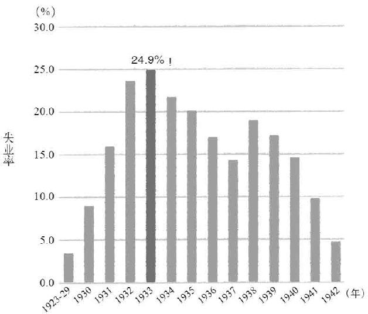
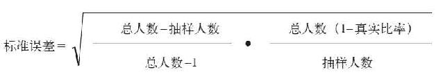
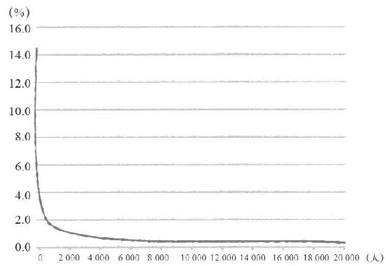

> 第二章  
>  大幅减少信息成本的抽样调查

> 05 统计学家的大数据“狂想曲”

正如前一章所说的那样，“大数据”这个词从诞生到流行经历了很长一段时间。

而现在的企业几乎每周都会发布关于“大数据”的报告，杂志和网络媒体上也时常出现“大数据今后的发展”或者“如何在大数据时代生存”等相关文章。如今，只要是稍微关心计算机信息的人，对于“大数据”这个词一定不会感到陌生。

在硬件供应商、系统集成商、独立咨询公司等，有很多期待“大数据”概念可以带来商业机会的人。顺便说一下，那些对计算机和统计学都不太了解的商业评论家们，也纷纷断言“今后是大数据的时代”。

就连那些一提起与阻止列表和收支记录等工作相关的数据记录就只能想到Excel表格的人，也对新数据库的技术很感兴趣，对100多年以前发明的统计方法一窍不通的人也对“数据挖掘”充满期待。由此可见，现在对统计学家来说是最适合大展拳脚的时代。

演奏大数据“狂想曲”的专业术语

但是，对于“大数据”，或者说对于“大数据”的分析会产生什么样的价值，会给投资成本的核算带来多少好处，这些内容究竟又有多少人能够理解呢？

是没有人能够理解，还是理解的人因为与自己的商业利益没有太大的关联，所以没有进一步的宣扬和提倡？不管怎样，对于这方面的问题我们很少会见到与之有关的回答。

取而代之的是，我们经常会听到为了更有效率地处理大规模的数据，推出新产品、新规格、新功能等。

比如在硬件方面，甲骨文公司引以为傲的Exadata系统的性能比以前的数据库系统强大10倍以上，而被称为Hadoop的工作模式，则可以允许在复数硬件上同时对大规模数据进行高速处理。相信很多人都听说过这些信息吧。

表2–1 专业术语简单介绍

| | |
| --- | --- |
| 数据挖掘 | 从已经存在的大量数据中找出有价值的信息和假设的方法，被称为数据挖掘。这种方法在拥有一定准确度的前提下更加重视速度，通过重复比较简单的计算过程就能够实现，所以应用比较广泛。最常见的例子是对超市的POS（销售终端）数据进行数据挖掘，结果显示同时购买尿片与啤酒的概率出人意料得高。 |
| 文本挖掘 | 对文字进行数据分析的方法。将语言学的方法延展，使其也能够应用于商务活动。通过被称为语素分析（将文章拆分成单词）的过程，对出现过的某些单词，以及单词之间的关联性进行分析。 |
| Exadata系统 | 常年以来，一直占据数据库业界老大地位的甲骨文公司经过巨额收购后终于完成的大数据相关主力商品。在软件和硬件两方面都能够最快地分散数据进行高速处理。性能和价格都很高。 |
| Greenplum系统 | Exadata系统的竞争对手。充分地利用了开源技术，比Exadata系统便宜很多，同时也能够对庞大的数据进行高速处理。 |
| 分散处理 | 对于难以处理的庞大数据，如果分散到100台服务器上分别处理，最后将结果统计一下就能够得到比单一处理高100倍的效率。由于数据的构造和计算程序算法的不同，想要实现“完美分散后统计结果”所消耗的时间也不同，这是这种方法最大的难点所在。 |
| 内存数据库 | 为了提高数据读写的速度，将数据记录在内存（RAM）上的方法。当然，如果切断电源数据就会消失，所以为了弥补这一缺陷尝试使用SSD（固态硬盘）和RAM相结合的方法。 |
| Hadoop系统 | 对数据进行分散处理的JAVA（一种程序语言）软件工作模式，主要负责分散处理“最关键的部分”。最近，我们所听说的大规模数据分散处理软件大部分都是基于Hadoop系统运行的。 |
| AWS平台 | 亚马逊开发的数据库和数据分析云计算服务，也能够对应大数据的分散处理。 |
| 非结构化数据 | 以甲骨文为首的传统数据库（RDB）是以“构造化的表”与“表之间的联系”为基础对数据进行保存和检索的。这种传统的数据库形式无法很好地进行整理的数据被称为非构造化数据。 |
| NoSQL | RDB的处理是使用结构化查询语言（SQL）记述的，使用其他不同方法保存数据进行处理的方法就被称为NoSQL。 |
| KVS | Key Value Store的简称。RDB是以既定的格式对表和表之间的联系进行处理，而KVS则是利用表中的值（Value）和值之间的联系（Key）来对数据进行处理。对包括非结构化数据的大规模数据进行分散处理非常方便。 |
| R语言 | 开源的统计分析用语言。全世界的专家们可以随心所欲地制作分析方法并且将其公开的库。那些买不起收费软件的贫穷学者们都喜欢使用这个，最近忽然受到了大家的关注。似乎可以直接从Exadata系统、Greenplum系统甚至“统计产品与服务解决方案”软件（SPSS）之中直接调用R语言库。 |

与“大数据”相关的商品和专业术语如表2–1所示。

通过高速化的数据处理，网站就算面对大量增加的用户也能够提供快捷的服务，公司内部系统也能够在短时间内收集指定的数据并且完成作业。由此应该也会带来人工费的节约与效率的提高。我们所听到的“大数据技术的成功体验”多数来自这些方面。

像这样卖出新型的高价技术，对于计算机相关企业来说无疑是一个喜闻乐见的好消息。比如“能够提高数据处理速度10倍以上”，或者“这就是如今最流行的大数据”，还有“免费赠送数据挖掘工具”之类的话一定会成为现代营销中最常用的宣传语。每天，各家公司的推销员们为了提高销售额肯定都在绞尽脑汁地想这些点子。

统计学让企业不用再烧钱

但是，像这样纯粹的技术进步，往往和商业利益并没有必然的联系……比如说我经常接到的以下咨询，就非常具有代表性。

“我们公司（或者是老客户的企业）存储了好几万亿字节的庞大数据，配备了专门的服务器。那么，接下来我们还应该做什么？”

每当我听到这样的疑问时，总会感到非常不可思议。我真想问他们：“连这东西的用处都不知道，为什么还花这么多钱投资设备呢？”实际上，我也确实这样问过，得到的都是一些诸如“好像有点用吧”或者“至少能够把握现在的状况”之类含混不清的回答。

Exadata系统这样的高价货自不必说，即便是用几台高性能的服务器构建起来的系统也需要几千万日元的投资。一些庞大的系统甚至需要花费上亿日元。可是，那些拥有决策权的大人物却对于“不知道究竟有什么作用的东西”投资起来毫不犹豫。

如果你的公司现在正打算在降低日常业务成本和稳定服务之外寻求更多的好处，也就是“通过对数据进行分析，从而更有效率地进行经营判断”，那么你一定要将这本书再继续往后读几十页。只要你掌握了本书中提到的统计学的基础知识，那么你就会明白在基于数据进行正确的经营判断时，根本不需要花费几千万日元的投资，甚至连几十万日元都不用花费。

为什么这么说呢？要想知道答案，就让我们从下一节开始看看20世纪30年代的美国究竟发生了什么。

> 06 准确度令人震惊的抽样调查

怎样统计超常的“大数据”？

诺贝尔经济学奖获得者保罗·克鲁格曼将自从次贷危机以来一直笼罩整个世界的萧条状况称为“第二次全球金融危机”，而第一次“全球金融危机”则是从1929年纽约证券交易所的股价大跌开始的。

不只美国，除了当时的苏联之外，几乎世界上所有的发达国家都遭到了股价大跌的冲击，国内生产总值（GDP）急剧减少，甚至引发了第二次世界大战这样一个非常严重的结果。小津安二郎以这一时代为背景拍摄了一部影片，讲述一群年轻人在大学毕业以后找不到工作，为了求职而四处奔走的故事，同样的状况在美国也比比皆是。

与现在基本上1/2的学生都能够考入大学就读不同，那个时代的大学毕业生可以说全是精英中的精英，可是在经济不景气的大环境下，即便是精英分子也同样找不到工作。当时的失业率最高达到25%，如果说现在的日本被称为“就业的冰河期”的话，那么当时的情景简直就是一幅地狱画卷（2012年11月，日本的失业率是4.1%）。

图2–1 金融危机时美国可怕的失业率

但是，对当时的美国政府来说，这种状况在某种意义上也是一件好事。由于这些大学毕业生的高失业率，使得国家可以从当时大量学习过统计学的优秀数学家和经济学家中随意挑选最优秀的人才出任政府职员。

在失业率创纪录地达到24.9%的1939年，美国总统富兰克林·罗斯福领导的新政府为了扭转大萧条的局面，采取了一系列被称为“新政”的政策。也正是在这个时候，政府才能够大量雇用那些走投无路的优秀年轻人，并且将他们的能力充分地发挥出来。我在本书之前的章节中提到过的弗明汉流行病学研究，就是美国总统罗斯福组织实施的项目，而在该项目中负责核心任务的统计学家，就是在这一时期被雇用的优秀年轻人中的一员。

新政的目标是摆脱大萧条的不利局面，并且降低失业率，为此美国政府需要准确地掌握失业者的人数。不只政治家，就连包括普通民众在内的很多人都认为居高不下的失业率是一个非常严重的问题。但是，针对100万人失业与1 000万人失业所采取的政策应该有根本上的区别。当时对失业者人数的统计却是“300万~1 500万人”这样一个非常模糊的数字。

值得我们注意的是，只拥有穿孔卡片的弗明汉研究对5 000人进行调查，就已经非常困难，而这件事发生的时间还在弗明汉研究之前。

对于当时拥有1.2亿~1.3亿人口的美国来说，进行这样的调查就相当于现在对几万亿字节的数据进行处理，毫无疑问，这是一个完全超越常规的“大数据”。

全面调查与抽样调查，哪种更节约、更高效？

为了解决这一问题，美国政府当时提出了两种方案。

一种是美国联邦政府议会提议“所有的失业者有义务在登记卡上填写必要项目，然后到最近的邮局将登记卡邮寄给政府”。

另一种方案则是由学习过当时最先进统计学理论的年轻人们提出的“随机选取人口总数的0.5%进行抽样调查”。

美国政府先采用了后一种方案，除了准确的失业率之外，政府还发现社会存在着极大的贫富差距，既占人口总数10%的人竟然拥有占人口总数40%的收入。而得知这一结果的人们却纷纷表示“随机抽选的结果根本没有科学根据，怎么能够证明这个数据是正确的呢”，可见这些人似乎更支持前一种方案。

但是，假设我们是那个时代的失业者，如果没有任何好处的话，谁会傻到将自己的信息写在登记卡上，然后特意跑到邮局去将这个登记卡邮出去呢？至少我是不会那么做的。如果我是当时的失业者，就算这样做会得到商品券，我都会因为麻烦而放弃，我想当时大多数人应该不知道有这么一回事。

实际上，确实有非常多的失业者对这项调查不买账，事后也证明这个调查数据远远小于实际失业者的数量。很多失业者认为这样的方式过于麻烦，因为美国政府无法准确掌握怕麻烦的失业者数量，所以由此得到的数据比实际数据少得多也是理所当然的。

另外，由年轻的统计学家们提出的抽样调查所得出的结果，经过随后十几年的慎重检验，发现其准确程度令人震惊。从1940年将这一调查制度化至今，美国政府已经将利用随机抽样调查作为各种政策方针讨论的基础。

假设前一种方案的全面调查方式能够得到失业者的支持，那么就要对大概超过1 000万人以上的登记卡进行收集和整理，与之相比，对占总人口数的0.5%的人（约60万~70万人）的调查结果进行收集和整理，两者谁更节约、更高效呢？毫无疑问一定是后者吧。

后来，美国率先摆脱了大萧条的局面，这究竟是否应该归功于罗斯福与年轻统计学家们的新政，在经济学家中众说纷纭、尚无定论。但不管怎样，由新政主导的大规模公共工程建设开始后，失业率开始下降的事实已经被统计学家们所设计的调查的数据所证实。

能够在当时有限的财政预算之内，准确地计算出失业率实际下降了多少，可以说完全是当时那些优秀的统计学家们的功劳。

后来，这些统计学家们又对消费者物价指数以及工业统计进行了调查，并且针对这些反映一国宏观经济状况的重要指标设计了利用样本进行的定期调查。如果没有统计学家的贡献，后世的经济学家们关于“面对经济萧条的局面应该采取什么政策”的讨论就会缺乏重要的数据基础，那么一切或许都会变成“纸上谈兵”。

如果日本难以摆脱“第二次全球金融危机”的话，不妨也积极地雇用那些找不到工作的优秀大学毕业生，充分地发挥他们的力量。

我经常从现代的一些人口中听到“抽样调查的结果根本没有可信度”这样的话，似乎日本的行政部门所掌握的统计能力与80年前的美国相比，没有一丁点儿的进步。

当然，抽样调查的准确率确实比全面调查要低，但问题在于究竟低多少，以及准确率较低的结果对实际判断和应该采取的行动会产生怎样的影响。反过来说，对判断和行动不会产生影响的准确率是毫无意义的，为了这些毫无意义的准确率所花费的成本都是一种浪费。

当面对难以处理的庞大数据之时，适当地进行抽样调查可以大幅减少为了获取必要信息所花费的成本，这一点不管在80年前还是现在都是一样的。可即便如此，那些热衷于大数据的商人们还是不断地提倡对大数据原原本本地进行计算。

> 07 为了1%的准确率值得花费几千万吗？

抽样调查中“经常出现的悖论”

很多人出于直觉认为，只有进行全面调查才能够得到正确的结果。比如说，上一节提到的关于失业率的调查，假设随机选取的0.5%的人全部都是失业者，而剩下的99.5%的人则全都没有失业，那么实际上整体的失业率只有0.5%，而抽样调查的结果却是失业率为100%，这就是抽样调查中“经常出现的悖论”。

可是，这个“经常出现的悖论”所举的例子究竟会不会出现？严格来说答案是“有可能出现”。但是对统计学家来说，不能仅仅回答“有可能出现”，还必须回答“有可能出现的概率”。

如果失业率真的只有0.5%，那么对总人口1.2亿中的0.5%，也就是60万人进行调查，结果这60万人全部是失业者的概率当然不可能为0。因为在数学上，不管一个数字多么无限接近于0，严格地说都不能将其称为0。

如果要将这个数字以小数的形式准确地表示出来，那恐怕要多达100万位数字以上，而且前面所有的数字都以0表示。

或许有人不知道为什么会出现这个数字，让我们换一种说法。0.5%的概率，也就是抽签200次只能中1次，那么要连续抽中60万次的概率有多大呢？

虽然将抽中的签再次放回抽签箱中的方法（统计学中将其称为重复抽样），与不放回的方法（不重复抽样）相比抽中的概率更高，但即便如此，仍然需要“在60万次抽签中维持1/200概率”的奇迹。这就是之前提到的那个无限接近于0的小数。

重复抽样可以在60万次的抽样中维持“1/200”的概率，而实际上，失业率调查属于不重复抽样，在最后第60万次的抽样中需要从剩下的约1.194亿人中选出唯一的失业者，这完全可以说是一个奇迹。

由此可见，提出“经常出现的悖论”的人实在是相当悲观，要不然就是骗子。既然没有人担心“小行星撞击地球的危险”，为什么对“导致抽样调查结果不准确的概率”表现得如此不信任？

如果说0.5%的概率连续抽中不太现实，那么如果是99%的概率，连续抽中60万次的可能性有多大呢？实际上，也只有0.24%，60万次的话就要在这个基础上除以1 000，这又是一个称得上是奇迹的概率。

为了使计算的过程更简单，我们经常能够见到以“调查对象全部准确”为例进行命题，但即便不是那样，对10万人进行调查的话，调查结果和真正的结果之间出现1%误差的概率，也是非常小的。

实际上在计算误差的时候，并不是像这样直接地进行概率计算，而是通过图2–2所示的公式来进行计算的。

图2–2 标准误差计算公式

比如之前提到过的那个例子，总人数即美国的所有人口数也就是1.2亿，真实比率则是“真实失业率”的值。当然这个值我们并不知道，我们只要填入通过抽样调查得到的失业率数值即可，基本上填上这个值是不会错的。

因为在真实比率达到50%的时候，“标准误差”值为最大，所以如果不放心的话可以用50%这个值进行计算，用“能够想到的最大标准误差”进行判断，这也是一种慎重的做法。

为什么真实比率达到50%的时候，标准误差最大呢？因为  
 0.5×（1–0.5）所得到的结果比0.6×（1–0.6）和0.3×（1–0.3）所得到的结果都大，因此我们选择50%作为最大值的标准。

至于标准误差的使用方法，因为从抽样调查中得到的比率（比如说失业率）是用标准误差除以2得到的数值，因此只要将算出的标准误差结果乘以2就是真实比率的范围。这一数据的可信度高达95%。

比如说抽样调查的结果显示失业率为25%，假设其标准误差为0.5%，那么全面调查得到的真实失业率数值应该在24%~26%之间，这一事实早已在80多年以前就已经被统计学家们证明过了。

增加1万个样本也只能改变0.1%的标准误差

那么，对于那些不喜欢看数学公式的人，让我们换一种说法解释标准误差的变化程度。

比如说，从10万名顾客的数据中对男女性别比率进行调查的结果，假设顾客中女性的比率占70%。那么关于这一结果的标准误差，在增加抽样调查的人数之后会发生怎样的变化呢。结果如图2–3所示。

图2–3　抽样人数对标准误差的影响

当抽样人数只有100名的时候，标准误差为4.6%，那么“顾客中女性比率占70%”的结果实际上在综合考虑后就应该是“女性比率占61%~79%”。但是当抽样人数增加到1 000人时，标准误差就降低到1.4%，综合的结果为“女性比率占67%~73%”；当抽样人数增加至8 000人时，标准误差为0.5%，综合的结果为“女性比率占69%~71%”。

而在此基础上“继续增加抽样调查人数对标准误差的影响越来越小”，当抽样人数为1万人时，标准误差为0.4%，抽样人数为2万人时，标准误差为0.3%。

这一结果，就算与花高价投资的数据处理服务器所得到的“女性比率占70%”的准确结果相比，对于判断可以说也几乎没有影响。

随机抽取8 000名顾客的数据，对于数据库管理员来说易如反掌，而将这8 000条数据记录在Excel表格中，就连打工的学生也能轻松完成。至于数据库管理员的加班费和学生的报酬大概只要几万日元就搞定了吧。为了那仅仅不到1%的准确度，有必要投资数千万日元吗？

虽然这种方法与现在大数据时代的思考方式刚好相反，但是每当有人向我进行数据分析的咨询时，我都会推荐他们“先找到为了进行正确的判断所必需的最少数据”。如果1%的误差在今后几年内不断累积，会对数千万日元的销售额和成本产生影响，那么在这种情况下大数据分析技术就会派上用场吧。可是即便在这种情况下，也没有必要从一开始就对全部数据进行分析。

数据分析的过程，实际上就是一个不断探索的过程。需要分析的数据越复杂就越是如此，随着分析的不断深入，发现的问题就会越多，甚至会出现与实际情况完全相反的结果，为此就要尝试不同的分析方法，而在分析中使用的数据如果发现有什么问题也要及时地进行修正，上述这些问题即便是经验非常丰富的统计学家也无法避免。实际上为了避免出现错误，越是经验丰富的统计学家，在分析的准备上所花费的时间就越多。

在对参考结果选择各种各样的方法与数据作为突破口的探索分析之中，尝试的次数是非常重要的。因此，那些必须使用特殊工具或者奇妙程序的情况，以及必须长时间等待分析结果的情况都应该尽可能地避免。这样的话，就算最后必须以全部数据为对象进行分析和验证，也可以事先获取一定量的抽样数据，并且通过探索分析找到建立假设的依据。

虽然为了建立假设寻找一定量抽样数据的方法，需要相当专业的统计学知识，但如果只是为了掌握数据概况的话，有上万条数据就够了，这种程度的统计工作仅靠一个熟练应用Excel的人就可以搞定。

当然，对庞大的数据进行高速且符合一定条件的随机抽样调查，以及对最终的分析结果是否准确进行验证的时候，还是需要大数据技术发挥实力。但是，这种速度和准确度究竟有多大的价值呢？这个问题的答案，就要取决于分析结果能够产生多大的价值了。

实际上分析本身并没有价值，如何活用分析的结果，最终得到的价值也是不同的。