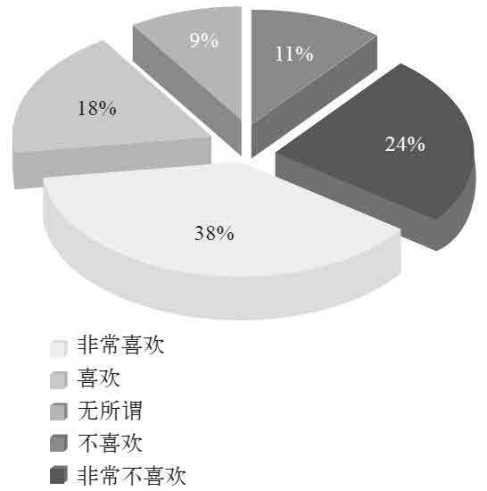
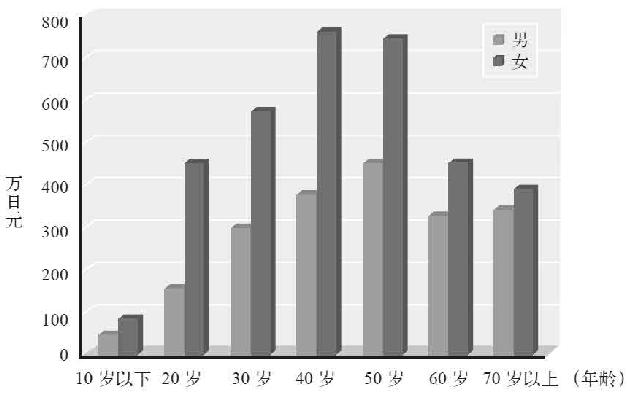
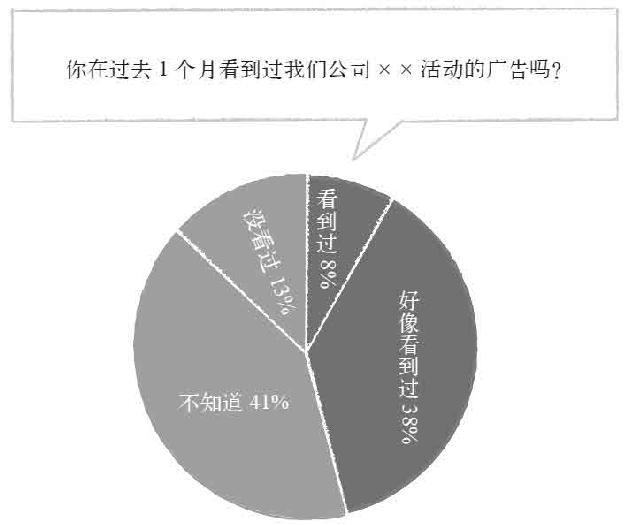
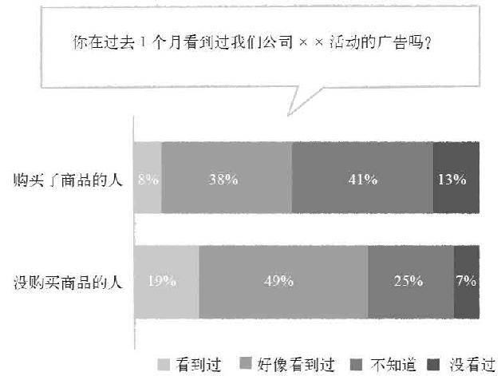
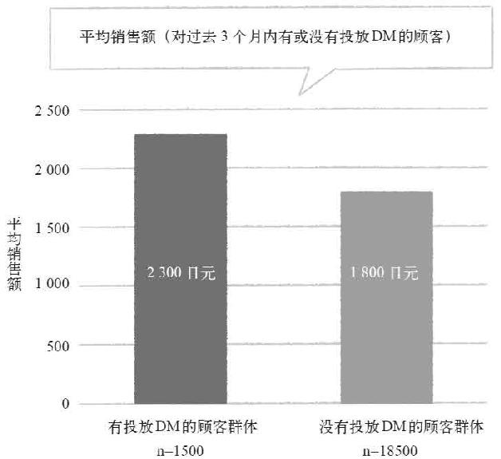
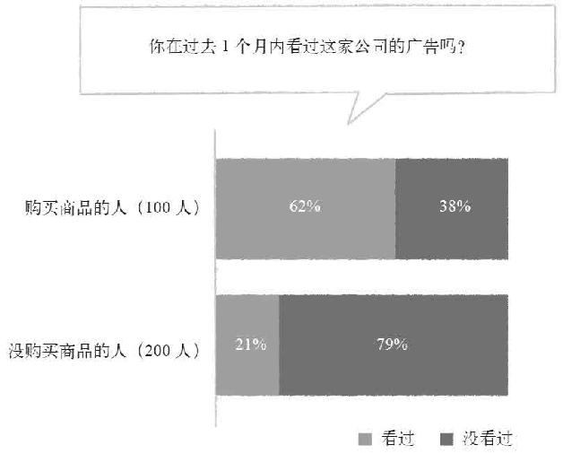

> 第三章  
>  统计学的关键：误差与因果关系

> 08 抛弃传统的统计方法吧！

只会让老板毫无反应的图表

数据分析中最重要的问题是，“统计分析的结果所带来的利益能够大于所消耗的成本吗？”

顾客的性别与年龄、居住区域的分布等所占的比率，或者问卷调查中回答“非常满意”的人数所占的比率，很多人将这些数据称为“分析结果”。就连那些自称为专家和顾问的人中，也不乏将调查问卷的结果收集起来制作成漂亮的图表，并且以此谋生的家伙。

但是，像这样的分析结果除了“对现状有所掌握”之外，还有更多的意义吗？如果你将这样的结果汇报给上司或者老板的话，对方不会有任何反应。

要想令对方不至于无动于衷，就必须让分析结果“在商业中与具体的行动联系起来”。要想引发具体的行动，就必须回答以下“3个问题”。

> 问题1 做出何种改变能够增加利益？

> 问题2 是否能够做出这种改变？

> 问题3 如果能够做出这种改变，那么带来的利益是否大于所消耗的成本？

如果能够回答这3个问题，那么接下来就可以采取行动增加利益，否则的话则没有必要按照统计分析的结果采取行动了。

比如说，那些了不起的专家和顾问，经常会拿出像图3–1那样非常漂亮的“品牌好感度调查”，那么这个分析结果能够回答上述的3个问题吗？

之所以会对品牌好感度进行调查，是因为在购买商品时，“对品牌好感度高的人消费金额相对较多”。与之相反，如果品牌不受欢迎或者因为其他因素，产品的销量长期没有发生任何变化的话，就不用考虑这个问题了。所谓“破罐子破摔”的经营策略，有时候也是存在的。

你对××品牌的看法如何？

图3–1 没有任何有用信息的图表

那么，“做出何种改变（比如举办活动之类）能够提升好感度”，以及“这样做需要多少成本，又能带来多少利益”就是我们需要考虑的问题了。

如果无论如何都不能提升品牌好感度的话，那就只能接受现状。如果为了提升好感度、增加销量，而投入大量成本导致公司财政出现赤字，这是得不偿失的。

遗憾的是对于这些关键性的问题，图3–1根本无法给出任何解释。

还有一种情况，假设你的公司从数据库中抽取了“庞大”的顾客数据，统计出如图3–2那样的表格。

虽然这个表格直接显示出了销售额，这还有点作用，但遗憾的是我们没有改变顾客性别，或者改变顾客年龄的魔法。

我们能做的只有将价格比较高的商品针对特定性别、年龄的顾客群体举办促销活动。

顾客的性别、年龄与平均销售额（月销售额）

图3–2 使用大数据的表格内容空洞

> 问题2 是否能够做出这种改变？

> 问题3 如果能够做出这种改变，那么带来的利益是否大于所消耗的成本？

即便如此，这仍然是一个无法回答上述两个问题的“空洞”信息。

如果你要做的分析，或者你委托别人做的分析，无法回答前面提到的这3个问题，那么在讨论分析结果的准确度之前，应该考虑的是这个分析究竟有没有用。恐怕等到实际拿到分析结果之后，其价值也只有让人“了解到一些数据”而已。

我在工作中所遇到的商务人士，经常对我说“数据分析的结果对商业判断没什么帮助”。如果他们所说的是类似于“什么问题都无法回答的单纯统计结果对商业判断没什么帮助”的话，那我绝对举双手赞成。而实际上，只不过是因为他们碰到的人“只能提供这些对商业判断没什么帮助的数据分析”罢了。

古典统计学的时代早就结束了

计算百分比的古典统计学，在19世纪初就已经被世界各国所应用。比如非常著名的护士南丁格尔所做的最大贡献之一，就是对战争中士兵的死因进行统计分析。分析的结果显示，受伤后因为救治不及时导致细菌感染死亡的士兵数量远远超出因为战斗受伤直接导致死亡的士兵数量。

南丁格尔以统计结果为依据，向军方领导以及政治家施压，“如果不想因为战争让更多士兵和人民失去生命，就必须保证在战场上配备干净整洁的医院”。也许这就是“统计”的力量之一。

但是，统计学从南丁格尔的时代到现在已经飞速发展了100多年。南丁格尔的统计结果，虽然大致上能够证明死亡原因，可是对于配备干净整洁的医院后是否能够减少战死者的数量，以及配备医院花费的成本能够拯救多少生命等问题，却与之前提到的那两个例子一样，无法做出回答。

要想回答这些问题，就必须使用20世纪先进的现代统计学方法。

利用大数据技术将所有的数据进行单纯统计，只不过是将最新技术应用在两个世纪前的方法而已。这种行为无异于拿最新型的智能手机当作锤子砸核桃。

> 09 单纯收集数据会得出“禁食米饭”的荒谬结论

促销活动中漏洞百出的图表

上一节中提到，对于统计分析中的3个问题，即

> 问题1 做出何种改变能够增加利益？

> 问题2 是否能够做出这种改变？

> 问题3 如果能够做出这种改变，那么带来的利益是否大于所消耗的成本？

必须全部回答。

当然根据情况的不同，仅凭统计分析的结果可能无法回答全部的3个问题，对于通过数据无论如何都难以做出判断的部分，就只能凭借经验和直觉了。

与无法完全搞清楚的统计分析相比，从一开始就凭借经验和直觉来作决定反而更好。

比如说，我以前遇到过一位市场营销员，他给我看了一份如图3–3所示的“促销活动调查表”。

图3–3 “漏洞百出”的图表

这位市场营销员根据图表的结果，认为回答“看到过”和“好像看到过”这个答案的人数共占46%，由此可见活动获得了近半数的超高认知率。可喜可贺。促销活动非常成功。可实际上，我和我身边的人对于这项活动一无所知。

值得庆贺的并不是他负责的这项促销活动的成果，而是他的统计能力。

面对这幅漏洞百出的图，我一时间不知道该从何说起，这幅图最大的问题在于，这个数据的来源是以购买了促销商品的顾客为对象进行调查。不管是通过网络还是去实体店，凡是购买了这款商品的人，可能是通过带有促销广告的弹出页面、海报或者传单等，总之是处于容易见到宣传的环境之中。

用具有很高倾向性的数据来证明促销活动的认知率很高，对于这种情况，我究竟应该说什么好呢。

没被彻底理解就开始应用的指标

不过，就算这个促销活动的认知率是从全日本随机抽样调查得到的正确数据，也同样没有逃出之前提到过的“3个问题”。不管促销活动的内容被多少人所知，如果不能与实际的购买行为联系起来的话就毫无意义。

这不只局限于认知率，像“总观看人数”“活动网站访问数”、“好感度”等在促销活动中经常被提到的指标，对实际的销量究竟有多大的影响呢。这些指标往往没被彻底理解就开始被应用。

想必大家都有这样的感觉，“经常会看到某个广告，虽然挺喜欢广告宣传片，但是并没有因此想购买广告宣传的商品”。比如说，我经常会看到朝日干啤的广告，每次都觉得这个广告宣传片的创意真好，可是我在家却只喝麒麟啤酒。即便如此，那些市场销售却仍然将“有多少人看到了”、“有多少人说喜欢了”这样的调查结果的统计作为“分析结果”提交给客户。

举一个极端的例子，当一名市场销售看到像图3–4那样的问答结果时，或许会感到非常难过。

图3–4 有可能会出现这样的结果

购买商品的人的结果沿用了与之前相同的数据。所以与之前一样，购买商品的人有近半数看到过促销活动的广告。但是，没购买商品的人中有68%的人看到过促销活动的广告。根据这一结果，我们可以得出这样的结论，“看到广告的人，反倒不会购买这件商品”。

这种时候，是否应该好好想一想广告宣传中究竟包含什么致命性的错误，导致消费者看到广告后反而不买了呢。

会引发死亡、犯罪和暴动的食物是米饭？

为了证明对于上述问题不进行比较，只是单纯地收集统计数据的做法有多么愚蠢，用一个比较通俗的事例来说明一下，相信就连小学生也能够明白。

> 想一想是否应该禁止食用这种食物。

> 死于心肌梗死的日本人中，有95%以上在生前一直吃这种食物。

> 抢劫犯与杀人犯中，有70%以上的人在犯罪前24个小时内吃过这种食物。

> 如果禁止日本人摄取这种食物，会导致精神紧张的状态。

> 江户时代以后，日本发生的暴动基本上都与这种食物有关。

这种食物就是“米饭”。不管是病人还是犯人，基本上所有的日本人都要吃饭，禁止吃饭的话人会变得精神紧张。如果因为社会因素导致没饭吃，即便是善良温厚的人也会发生暴动。

只看到这个单纯的统计结果，甚至会得出“禁止食用米饭”的愚蠢结论。如果只有这样的“统计分析”，也难怪有人会觉得“统计学根本就是骗人的”。

我不是故意举例抹黑那些不诚实的市场销售员。不仅在市场营销领域，像这样毫无意义的“分析”实际上比比皆是。就连海外一流的商业学院中使用的教材，也以像这样毫无意义的分析结果为根据，证明“促销活动大获成功”。

但是，只要基于“准确的数据”进行“适当的比较”，掌握统计学的因果推论基础，就能够找到比经验和直觉更加简单地使商业能力突飞猛进的诀窍。

> 10 改变投放广告单的方式就能赚取60亿日元

购买的人和不买的人区别在哪里？

在这个世界上，对于同样一种商品，总是会有购买的人和不购买的人。如果能够找到购买的人和不购买的人的区别，是否就可以通过改变两者之间的区别而增加购买的人数呢。

至于“改变两者之间区别的方法”在本书之中被称为“秘籍”。

比如说看没看到某个特定的广告，仅仅因为这个区别导致商品的购买率相差几十个百分点，那样的话就应该大规模地投放这种广告从而达到增加销量的目的。

如果朋友推荐对销量有很大影响，那就应该向现有的顾客推出促销活动鼓励他们向朋友推荐这种商品。

几乎每一位商务人士都有这样的思考方式。而且在绝大多数的情况下，对于应该注意的“差别”，他们并不是通过数据和统计分析，而是通过“经验和直觉”来发现的。比如说，“根据我的经验，很多顾客最初都是由朋友介绍而来的”，根据这样的判断来发现“区别”，并且灵活地应用在经营战略之上。

但是，经验时常并不准确。比如以下3条“墨菲定律”，相信很多人都有过这样的经历吧。

> 突然下雨的时候在外面买了一把雨伞，结果买完之后天马上晴了。

> 面包掉在地上的时候，总是涂了黄油的那一面落地。

> 每当快要迟到的时候，电车总会晚点。

但实际上，这些都是被“记忆偏差”所影响的认知，心理学家和认知科学家们早已经通过实例证实过了，只要稍微想一下就会明白。人这一生可能会有很多次突然下雨的时候在外面买雨伞的经历，那么“就这样打着伞回家的记忆”与“结果天马上就晴了的记忆”相比，哪个事后留下的印象更深呢？

与雨伞和面包的事例一样，你在商业上的成功定理，实际上也只是将几次成功体验当成普遍存在的定律而已。人类或多或少都有先入为主的习惯，一旦接受了某种事物，就会尽可能地找理由使之合理化。

统计学则可以弥补人性上的这个弱点。如果仅凭经验和直觉无法找出会左右利益的区别，那么只要对数据进行一下比较就会清楚地发现区别在哪儿了。

提高销售额只需要改变DM的投放方式

比如说，以前有一家零售企业委托我进行的数据分析的结果显示，对购买区别影响最大的是“有没有投放DM（直接邮寄广告）”（图3–5）。

在本书中，经常会出现我亲身经历过的事例。但是出于保护商业机密的考虑，企业名称和行业、销售数字等信息都是在不影响理解统计学原理的基础上虚构的，敬请谅解。

这家零售企业的规模极其庞大，平均年销售额有几千日元的顾客人数就有1 000万人以上，公司全年的总销售额超过1 000亿日元。

这家企业的工作人员从登记的会员中选取了100万人，用于查询这些人的顾客信息和消费记录，希望通过这些数据改善自己的服务。除此之外，工作人员每年会向会员随机投放4次共计30万份的带优惠券的DM（投放数据也有记录）。DM费用是每份100日元，因此这部分每年就要投入3 000万日元的成本。

图3–5 某零售企业分析结果

将随机抽取的2万名顾客数据以3个月为单位进行分析，结果显示1 500人（2万人的7.5%）在过去3个月内收到了DM，其余的1.85万人（2万人的92.5%。再重复一次这些数据都是虚构的，实际上的结果并不是这么整齐的数字）则没有收到DM。收到DM的顾客群体在分析期间的平均销售额为2 300日元，而没收到DM的顾客群体的平均销售额为1 800日元，这部分的结果正如之前的图表所示。

从这个结果中我们可以得出一个推论，只要投放DM就有可能在3个月内使平均销售额增加500日元。如果我们假设DM的投放与否对销售额会产生影响，那么向未投放DM的顾客群体投放DM的话，就能够将这一群体的平均销售额从1 800日元提高到2 300日元。

现在这2万名顾客3个月的销售额是

> 2 300日元/人×1 500人+1 800日元/人×18 500人=3 675万日元

换算为年销售额就是上述结果的4倍，即1. 47亿日元。

那么，假设向这2万人全部投放DM的话会怎样呢？

> 2 300日元/人×2万人=4 600万日元

减去向18 500人投放DM的费用（每份100日元）之后，还剩下4 415万日元，年销售额就是每年1. 766亿日元。也就是说，仅仅通过积极发送DM这一做法，在减掉追加投放DM所需的成本后，也能够使销售额提高1.2倍。

如果将这一做法扩大到登记信息的所有会员，又会怎样呢。假设会员的销售额占总销售额的10%，那么通过向全体会员发送DM的做法使销售额提到1.2倍，则公司整体的销售额会增加约2%。因为是总销售额1 000亿日元的2%，也就相当于增加了20亿日元的年销售额。

实际上，我向这家公司提供的分析报告，并不是单纯的“增加DM投放就会增加销售额”这样的建议，而是更进一步的“投放DM能够增加销售额的顾客和不能增加销售额的顾客之间的区别”，或者“能够增加销售额的DM与不能增加销售额的DM之间的区别”，以及对区别进行判断的方法。

根据判断方法对DM的发送对象进行划分，这样在几乎没有增加DM发送数量的前提下总销售额却提高了约6%，换成之前的说法就是相当于“赚取60亿日元的秘籍”。

在此之前，该企业已经知道发送DM能够增加销量，并且了解“对DM有良好反应的顾客特征”，可以说这一切都是建立在这个基础之上的结果。

所以通过使用实际的数据进行全面的比较，可以将“得到的结果”与具体的利益联系起来，并且能够明确地显示出“现在最应该采取什么行动”这样一个战略性的目标。

这实际上并不能完全说是统计学的力量。当然，像这样为了对主要因素进行比较而进行的收集统计（统计学术语叫作交叉表统计），也是统计学上非常重要的工具，但仅仅做到这些是远远不够的。

那么，究竟应该怎么做才能够更加准确地表示出“区别”呢？

> 11 真的增加了一亿销售额，还是只是误差？

不考虑“误差”的计算都不准确

在上一节内容中，我们通过单纯的交叉表统计证明了有可能增加销售额的主要因素，并且对可能增加的额度进行了计算，但这些都是不准确的。

为什么这样说呢？因为这些计算全都没有考虑“误差”因素。

可以说费希尔时代与之前的统计学之间最大的区别，就在于是否考虑误差。数据究竟有多大的误差，这个误差对真正的结果有多大影响，考虑误差对于结果是否有意义，费希尔最大的贡献就是证明了上述这些问题。

在上文提到的事例中，“投放DM的群体与未投放DM的群体之间销售额的区别”就是我们真正关心的值。单纯的推测销售额是500日元，但实际上这500日元是包含误差的值。如果今后继续追加数据进行同样的分析，那么这个数值可能是300日元，也可能是1 000日元，甚至有时候可能未投放DM的群体的销售额反而更高。

最坏的情况是，投放DM的群体与未投放DM的群体之间的销售额几乎没有区别，而得出投放DM的群体平均销售额更高的数据只是误差导致的结果。或者虽然有区别，但是差额甚至不足以弥补投放DM所需的成本。如果在这样的情况下，做出“积极投放DM”的战略决定，那么投放DM所花费的资金就全打水漂儿了。

A/B测试只是小孩子的把戏

实际上，除了在上文中提到过的毫无意义的单纯统计之外，像这样不考虑误差的交叉表统计所导致的不准确结果，也经常出现在商业领域。

以前有一家聘请我做他们统计学讲师的电子商务企业，就非常热衷于进行“A/B测试”。比如，双击改变广告条的大小、改变页面之间的跳转画面、改变页面文字和字体等，对设计细节和功能方面进行变更的时候，总是会进行“哪一种设计看上去更好”的讨论和分析。

所谓“A/B测试”，是指在对设计或者功能进行更改时，同时提出A方案和B方案进行比较的一种方法。最近在硅谷，为A/B测试提供工具和服务，似乎成了最热门的项目，Adobe公司也斥巨资收购了在这一领域占主导地位的Omniture公司，另外谷歌公司出身并且出任奥巴马总统竞选参谋的丹·西罗克所成立的Optimizely公司，也在这一领域大放异彩，博得世人瞩目。

绝大多数情况下，A/B测试的方法是在用户访问网站的时候随机打开A方案或B方案的页面，收集一定时间内访问量的数据，然后对A方案和B方案的结果进行比较（无法随机分配的情况下，可以按照一定时间为单位，比如1周时间，分别打开A方案或B方案）。

用于进行比较的数据包括广告条点击率和商品销量，付费会员的加入率等与利益直接挂钩的数据，判断出A方案与B方案哪个更好之后，接下来就将那个更好的方案正式应用于网站之上。

另外，同时进行3种或以上的方案比较时，并不称为“A/B/C测试”，而是仍然称为“A/B测试”。顺便说一句，在统计学上像这样的数据选取方法并不叫作“A/B测试”，而是叫作随机对照试验（A方案与B方案的条件改变中不包含随机因素的试验叫作准试验）。

稍微有点儿跑题了，总之这家电子商务企业每个月都会非常卖力地进行详细的A/B测试。因为每年购买率的改变都会影响上亿日元的销售额，所以这家企业专门成立了研究小组，随时根据购买率的变更情况研究新的网页方案，可以说是一个非常了不起的战略。

提出增加购买率改变方案的员工，会在公司的例会上得到表扬，负责执行的全体工作人员都会“沐浴”在一片赞誉声中。可以说，他们是一个非常优秀的将数据灵活应用在经营当中的例子。

但是，这里却存在着一个陷阱，那就是他们没有考虑误差。

在我作为讲师给他们上完课之后，负责进行A/B测试的小组成员之一向我提出了这样一个问题：A/B测试的结果也能够进行分析吗？她向我提供了一个像表3–1那样的结果（实际数据与此不同）。

也就是说，他们将现有的页面A和改良后的页面B，随机分配给网站的访问者，并且各取10万次的访问量进行分析，结果显示现有的页面A购买率为9.5%，而改良后的页面B购买率为9.6%。

表3–1 某电子商务企业的A/B测试结果

| | | | |
| --- | --- | --- | --- |
| | 购买商品 | 没购买商品 | 总计 |
| A（现有） | 9500人（9.5%） | 90500人（90.5%） | 10万人 |
| B（改良） | 9600人（9.6%） | 90400人（90.4%） | 10万人 |

按照上文内容中的思考方法，采用改良后的页面有可能使销售额提高到原来的1.01倍（9.6%÷9.5%）。也就是说如果这家企业现在的销售额为10亿日元，那么就是提高约1 000万日元，如果是100亿日元的话则有可能增加1亿日元的销售额。而且，他们根本不必进行什么特别的投资，只是对网页进行细微的设计变更即可。由此可见执行人员“沐浴”在一片赞誉声中也是情有可原的。

但遗憾的是，我们并不知道这个区别究竟是有意义的区别，抑或仅仅是误差？

卡方检验与p值的登场

对于像这样的交叉表，要想知道究竟是“有意义的区别”，还是“误差导致的区别”，就需要用到一种被称为“卡方检验”的分析方法。

对上述A/B测试的结果进行卡方检验之后，发现实际上两者之间没有任何区别，只是因为数据的误差导致出现这种程度（10万人中有100人或者更多）区别的概率为44.7%。

像这种“实际上没有任何区别，只是因为误差或偶然产生数据差（甚至有可能包括极端的差距）的概率”在统计学上称为p值。

这个p值越小（一般在5%以下），数据就越准确，证明其不是偶然导致的结果。

而本应在5%以下的p值在上一个实例中竟然高达44.7%，也就是说使这些试验员“沐浴”在一片赞誉声中的结果，是否真的能够在今后带来上亿日元的销售额，还是一个未知数。

试验员进行的这种测试，其实就相当于一个人只投了一次硬币刚好正面朝上，因此就欣喜若狂地声称“了不起！我找到了一个能够连续投出正面的魔法硬币”或者“了不起！我拥有了连续使硬币正面朝上的魔法”。

在不知道这样做究竟有没有意义的情况下，定期对网站进行更改，结果可能是时好时坏，而试验员的工作究竟对增加收益有没有帮助，同样无从得知。

当然，我不只告诉她“这个区别不知道是否有意义”，还告诉她“就算是0.1%的微小区别，如果实际上确实存在的话，可以通过增加样本数量的方法证明”。之前我们已经知道，数据的样本数量越多，误差就越小。所以，要想通过数据来证明购买率有0.1%的提高，可以将各自的样本数量提高到100万人次再进行分析。

只要稍微掌握一点统计学的知识，这种程度的计算很快就可以搞定。

另外，试验员在临走前还说：“今天我学到的东西如果能够让大家都了解，那么公司的业务流程，甚至经营方针恐怕都会发生改变。”当然，我也是这样想的。这家公司虽然在数据应用方面看上去非常先进，但是却陷入了难以找到真正区别的A/B测试的误区。

只有理解误差，并且将误差考虑进去的结果才有意义。掌握了这种统计学的思考方式，就能够从陷阱和误区之中解脱出来。

> 12 值得分析的数据都是与利益明显相关的

究竟应该对什么样的数据进行比较分析？

“进行适当的比较”、“不只进行单纯的收集统计，还清楚误差与p值”，只要掌握了这两点，就能够找到远超经验与直觉的秘籍。

但是，在打算利用这两点进行数据分析的时候，经常会遇到这样一个问题，那就是“适当的比较”究竟指的是什么，或者更具体一点说“究竟应该如何比较才好呢”。

在这里，让我们用比较典型的事例来进行分析，首先，“消费金额”和“购买率”是与销量直接相关的重要指标。但是，在商业活动之中需要进行比较的信息不仅限于销量。

掌握了一定程度的统计学知识之后，我们会知道“如何对数据进行分析”。但是，在实际进行调查研究的时候我们会发现，“如何收集数据进行分析”才是更重要的。很多时候，人们将其称为统计学家的直觉，但仔细分析后我们会发现任何人都能够拥有这种直觉。

那么，我们究竟应该对什么样的数据进行比较，并且从中找出产生区别的主要因素呢？

答案其实很简单。只要将“能够达成目标的事物”和“不能够达成目标的事物”进行比较即可。

不过如果这么说，或许有人会问“所要达成的目标又是什么呢？”对于这个问题我所能给出的回答就是“不知道”，或者，更加绅士的回答是“每个人都不尽相同”。

比如说在医学和公共卫生领域，“健康长寿的人”与“英年早逝的人”、“持续遭受病痛折磨的人”就是进行比较的对象。而与教育相关的方面则用“学习能力强的孩子”和“不爱学习的孩子”进行比较。“幸福的人”和“不幸福的人”经常被心理学家拿来进行比较。

以前我曾经写过一本对日本职业足球联赛的数据进行统计分析的书，其中非常明确地表明了在对“取胜的场次”和“平局的场次”或者“失败的场次”进行比较时，各个统计数值分别有哪种相关度。

通过上述几个例子来看，商业中所要达成的目标就非常明显了。商业的目标就是“获得利益”。

让我们再仔细地思考一下通往利益这个商业目标的途径，就会发现一些更加明显的因素，比如是否能够扩大顾客的需求，是否能够提高公司内部的生产力（在没有浪费成本的前提下生产商品）。

而这些与需求和生产力挂钩的因素，就是人力资源、计算机以及市场营销等部门在自己的领域所需要完成的目标。

如果在上述部门的工作中没有与利益相连的目标，那么不管他们如何努力工作都不可能为公司创造利益。比如说，人力资源部门只关注自己的工作，那么或许对员工的满意度和离职率这些数字非常敏感。但是，如果满意度高的员工业绩很低，入职时间长的员工的薪水与生产力不成正比，那么只关注个别数据就是远远不够的。

不管是研究者还是实干派，人类在收集数据的时候经常会想着“有了这些数据总会发现一些问题”。当然，对数据进行适当的分析一定会有所发现，但这种发现却可能对任何人都没有帮助。很多大学和研究机构常常打着“学术自由”的幌子，投入大笔经费去搞一些毫无价值的研究，虽然这在学术领域无人追究，但是如果换在商业领域的话恐怕就不行了。

所以，在商业领域检验一个数据是否值得分析的指标，就是是否能够带来直接利益，或者是否能够表明带来利益的因果关系。只要能够在商业领域证明“这是明显与利益相连的指标”，那么就可以说这是与销售额一样值得进行比较的数据。

哪些数据与公司利益相连？

在你的工作中，哪些指标是与利益直接相关的，对于这个问题诸位应该比我更加清楚，甚至还有一定的个人见解。

公司本身就是为了赢利而成立的组织，大家的工作基本上也都是为了创造利益而安排的。如果能够通过更广阔的视野进行更灵活的思考，应该就会从自己的工作中找到分析和改善的方法。

比如说，我曾经听说过这样一件事，根据服务器内中央处理器（CPU）的温度和内存使用情况的监视记录，对“服务器死机的状况”和“不死机的状况”进行比较的结果显示，升级系统能够大幅削减管理成本。

同样的，根据工厂的机械故障情况的监视记录，对发生故障的状况和不发生故障的状况进行比较，结果发现成本可以进一步削减。对销售业绩高的推销员与销售业绩低的推销员进行各种调查数据的比较，可以发现对今后的销售有利的方法。

现在很多企业的各种部署都存在着大量的数据，而想要进行某种新的调查的时候，并不需要花费太多的成本。最重要的问题不是“发现了什么”，而是从这些数据之中，能够找到与利益相连的关系。

如果诸位今后想要对公司内部的数据进行分析，并将结果应用在经营上，那么首先要做的就是超越部署的屏障，将“我们都拥有哪些数据”这一信息共享给所有人。将信息统一整理起来之后，就能够得知“如何与利益相连”、“什么和利益联系最为紧密”，到时候你自然就会知道怎样进行比较，以及如何明确地表示出区别。

相信现在大家的“硬盘”中，就隐藏着数千万甚至上亿日元的与利益相连的秘密。

> 13 统计学中的重大问题：“因果关系的方向”

游戏与少年犯罪的因果关系能够明确化吗？

按照我之前说过的方法进行“比较”以及“包含p值计算的分析”之后，一定能够迅速地找到有意义的数据，而只要能够控制这些数据，就可以找到有效地增加利益的方法。

但是，在进行统计分析之后，必须注意“因果关系的方向”这个问题。

比如通过图3–5所示的图来对“广告的效果”进行分析。通过这个图，我们可以发现购买者对广告的认知率较高。

直接考虑的话，可以理解为看到广告的人，或者对广告印象深刻的人，购买商品的可能性更高。而这一结果的p值，即“本来没有什么区别，只是由于误差导致出现这种偶然情况的概率”在0.1%以下。

图3–6　是因为看到广告才买的？还是因为买了之后才对广告印象深刻？

但是，这一数据和统计分析的结果，将因果关系的方向反过来也成立。

也就是说，“因为看了广告而购买商品”和“因为购买了商品之后对广告才印象深刻”，这两个假设究竟哪一个是正确的，对于这种单一时间点的调查数据及其分析结果，哪怕p值再小也没有意义。

像这样的问题还经常出现在科学调查当中。

比如，根据对家长进行的问卷调查结果，将儿童是否玩过具有暴力倾向的游戏与儿童犯罪的关联性进行分析，发现少年犯罪者之中玩过具有暴力倾向游戏的比率极高。但即便如此，对于减少暴力游戏是否能够控制犯罪率这一判断目前尚无定论。

假设儿童都玩过同样一款游戏，有的孩子成为少年犯，他们的父母大概会认为“都是那个暴力游戏的错”。而有的孩子则健康成长，那么他们的父母对同一款游戏的印象，大概是“男孩子喜欢的战斗游戏”。

另外，对同一款游戏，认为是暴力游戏而感到愤怒的父母，他们孩子的犯罪率可能很高。不管是遗传因素还是环境因素，对待同样一款游戏，视若洪水猛兽的父母与并没有偏见的父母，他们孩子的犯罪率也是不同的，这种可能性也应该考虑进去。

更进一步地说，就算不是父母影响的问题，长时间玩暴力游戏的孩子确实比不玩暴力游戏的孩子犯罪率高，那么对游戏进行限制是否能够阻止少年犯罪，结果仍然无从得知。

之所以这么说，是因为即便没有游戏的影响，人类本身也有“暴力倾向”的存在。那些“暴力倾向”严重的孩子更喜欢玩暴力游戏，并且容易进行犯罪活动，这种因果关系或许才是最正确的。在这种情况下，虽然看上去少年犯罪者玩暴力游戏的时间更长，但是对游戏进行限制仍然无法控制儿童的暴力倾向。也就是说，即便没有暴力游戏，他们仍然会犯下同样的罪行。

用统计学的方法让数据分析更“公平”

那么，统计分析就真的毫无作用吗？

答案当然是否定的。不管是少年犯罪与游戏时间的数据，还是广告认知与购买率的数据，只要能够从这些现有的数据中找到那些并不属于误差的准确区别，就可以将其作为非常宝贵的假设依据。快速且准确地提出这种有根据的假设，才是统计学在现代最重要的意义，比永无休止的会议和毫无意义的争辩要强上百倍。

但是，仅凭着这一阶段得到的假设是否能够创造价值还不确定。不过，我们可以更进一步地对这个假设是否正确进行实际验证。根据不同的验证方法，我们可以在不同程度上了解到假设的准确性，这也是统计学的重要作用之一。

虽然我们之前说过，通过适当的比较找出有意义的区别就能够发现秘籍，但仅凭一时的数据是无法搞清楚因果关系的方向的，实际上进行比较的两者并非处在同样的条件下，也就是说并不“公平”。

比如，刚才提到过的暴力游戏与少年犯罪之间的关联性，将“其他条件完全相同，只有是否接触暴力游戏这一点有所区别”的两者进行比较，才是最理想的状态。

但实际上，接受问卷调查的对象，“其他条件”可以说完全不同。玩暴力游戏的孩子和不玩暴力游戏的孩子之间，正如之前提到过的那样，包括他们的父母性格和思维方式在内的家庭环境等因素可能都不同，而且孩子本身的心理倾向可能也有区别。

统计学针对这一问题，大体上有两个解决办法。

一个方法是针对父母性格、家庭环境以及本人的心理倾向等“相关条件”进行后续的追踪调查，利用统计学的方法，至少在进行比较的条件上实现“公平比较”。

另一个方法是在选取数据的时候就“准备好公平的条件”。比如说在教育学领域，经常会选取双胞胎作为试验对象，就是因为他们的遗传因素完全相同，可以进行公平比较。但就算不用如此苛刻的条件，我们同样可以进行“公平比较”，在下一章中我就将为大家介绍费希尔这一彻底改变了科学哲学的历史性发现。

虽然将人类作为试验对象感觉上好像有些难以接受，但只要在伦理上多加注意就不会造成恶劣影响。像这种利用统计学的方式证明“什么是最正确的方法”的形式，已经被广泛应用于经营、医疗、教育，甚至全世界所有的领域。

只要利用适当的方法进行实证试验，就能够最大限度地保证比较的公平性。医疗领域的新款药品和新的治疗方法，如果没有适当的实证试验就无法获得各国政府的批准与认可。为了获知人类目前所能够了解到的最正确的真理，利用统计学进行适当的实证试验可以说是必不可少的过程。