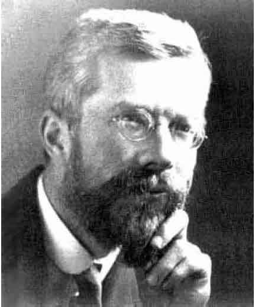
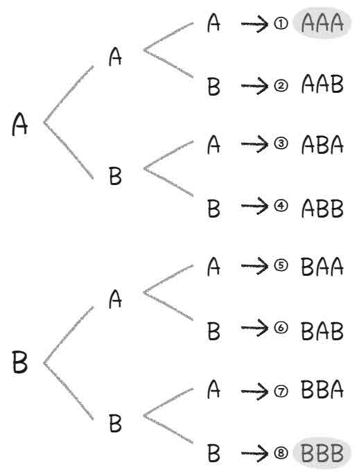

> 第四章  
>  最强的统计学武器：随机对照试验

> 14 先放牛奶还是先放红茶？

正如前文中说过的那样，只对片面的数据进行交叉表统计，就连“因果关系的方向”都难以确定。

之前提到过的暴力游戏的游戏时间与犯罪率之间的关系，即使这两个项目在统计学上显示出非常明显的相关性，但究竟前者是后者的原因，还是后者是前者的原因，抑或其中没有显示出来的第三者（比如家庭环境的影响和本人的暴力倾向等）对其两者产生了影响，这些仅仅通过单纯的交叉表统计和p值是无法确定的。

不过，这只能说通过片面的数据，或者说只进行简单的统计分析，无法确定。如果仔细地选取数据，或者采用更加缜密复杂的分析方法，那么即便无法得到完美的答案，也可以找出原因和结果，甚至能够分析出结果。如果对“原因”进行控制的话，又会出现怎样的“结果”？

特别值得我们关注的，应该是“仔细地选取数据”的方法。具体来说，就是近年来网络上十分热门的“A/B测试”，同时也是被统计学家们称为“随机对照试验”的方法，让我们围绕着它来进行分析，看看它究竟有多么强大。

妇人与奶茶：世界上第一次随机对照试验

之所以在这部分内容中对随机对照试验究竟有多么强大进行说明，最重要的原因是“人类对于任何能够控制的东西，都可以分析其因果关系”。

假如要证明“超能力是否存在”，那么统计学家们一定很乐于为此提供帮助。如果统计学无法科学地证实超能力的存在，那么理由只有一个，就是超能力在这个世界上根本不存在。

像占卜师和超能力者之类依靠神秘术为生的人，或者对此深信不疑（甚至被欺骗）的人，总是会说“这个世界上有现代科学无法解释的现象存在”。

但这根本是无稽之谈！费希尔几乎凭借一己之力创造的被称为随机对照试验的方法，不但改变了科学哲学，甚至使科学能够影响到的领域爆炸性地扩大。虽然有伦理性和可控性等现实的制约，但科学无法解释的东西已经不存在了。

图4–1 现代统计学之父 罗纳德·艾尔默·费希尔

费希尔完成于1935年的著作《试验设计》首次创立了随机对照试验的体系，在这本书中提到了一个妇人和奶茶的故事。

在20世纪20年代末的英国，一个阳光明媚的午后，许多英国绅士与妇人们在室外的餐桌旁享用美味的红茶。这时，有一位妇人说道：“奶茶是先放红茶还是先放牛奶，味道完全不一样，我一下子就能品尝出来。”就连这个看上去只是随口说说的事情，随机对照试验也能够对其进行科学证实。

在场的大部分绅士都对妇人的说法一笑了之，根据他们学过的科学知识，红茶和牛奶只要混在一起，就没有任何化学性质上的区别。

但是，只有一位身材矮小，戴着厚厚的眼镜，留着小胡子的男子对妇人的说法很感兴趣，并且提出“那么我们来做个试验”。这名男子正是现代统计学之父——罗纳德·艾尔默·费希尔。

费希尔迅速地将茶杯摆成一排，在妇人看不到的地方准备了两种冲泡方法不同的奶茶。然后，他让妇人按照随机的顺序品尝奶茶，并且将妇人的回答记录下来，用概率进行了计算。据说，这就是世界上第一次进行的随机对照试验。

为什么要用这种方法验证妇人的话呢？在回答这个问题之前，让我们先考虑一下如果不用这种方法的话，究竟应该如何判断妇人的话是否正确？

比如给妇人一杯“先放红茶的奶茶”，就算她的判断是对的，也不能证明她真的有准确的分辨能力。因为妇人完全靠猜也有50%的概率可以猜中，所以不能将其作为判断依据。

那么，交替给妇人“先放红茶的奶茶”和“先放牛奶的奶茶”，如果妇人每次都说中的话，结果又如何呢？

虽然这种方法比只有一次的试验稍微强一点，但其准确性仍然很低。因为如果有“交替重复”这种规律存在的话（而且妇人也知道这种规律，或者偶然间发现了规律的话），那么只要偶然猜中第一杯奶茶的结果，那么后面的答案也就全都随之揭晓了。

当然，先连续给她5杯“先放红茶的奶茶”，再连续给她5杯“先放牛奶的奶茶”的方法也不推荐。因为这样只要第一次偶然猜对，接下来只要猜出“第几杯开始更换”就可以了。而且，之前品尝的“先放红茶的奶茶”肯定比后来“先放牛奶的奶茶”的温度更高，单凭温度进行判断也可以被她偶然猜中。

那么究竟应该怎样做才好呢？只要将两种奶茶随机交给妇人，然后看她能够猜中几个就好了。这就是随机对照试验的基本思考方法。因为奶茶是随机选择的，而且是在她看不见的地方倒好的，所以根本无法预测顺序。

1杯完美红茶的冲泡方法

费希尔还在《试验设计》中详细地分析了应该如何对妇人进行试验说明、应该准备多少杯奶茶，还有预测妇人的回答结果，以及对“妇人完全凭借猜测进行回答得出正确答案的概率”进行计算。

虽然在费希尔之前也有科学家进行过类似试验，但是他们却只记录了10次试验中10次全部准确的现象，或者10次试验中只有1次准确的现象，结果却有人将这仅有的1次作为试验成功的证据。

那么究竟按照什么样的顺序进行试验，并且在10次中成功多少次才算是被科学证明呢，在费希尔之前没有人考虑过这个问题。而费希尔所考虑的“为了进行科学证明而选择的顺序”中，最重要的一点就是“随机”。

在《试验设计》中，并没有记录妇人回答的结果和试验的结论。但是，据当时也在场的H·费尔菲尔德·史密斯（他也是在康涅狄格大学以及宾夕法尼亚大学担任教授的统计学家）回忆，那位妇人的回答全部正确。也就是说，如果那位妇女随机品尝了5杯奶茶，那么偶然猜对的概率就是2的5次方分之一，即1/32（约3.1%），而如果那位妇女随机品尝了10杯奶茶，那么偶然猜对的概率就是1/1 024（约0.1%）。

如此之低的概率显示，这位妇人确实有某种方法可以分辨奶茶的冲泡方法。

妇人究竟是如何做到这一点的，英国皇家化学协会在2003年发表的一篇十分具有娱乐精神的官方报告《一杯完美红茶的冲泡方法》，或许给出了答案。

冲奶茶时应该先倒牛奶，因为牛奶蛋白会在75摄氏度时发生变化。如果后倒牛奶，那么牛奶就会被高温的红茶包围起来，必然导致牛奶蛋白发生变化。而将红茶倒入凉牛奶之中，则不会出现这种情况。

连冲奶茶都如此讲究，确实很有英国人的风格。而除了费希尔之外的绅士们，认为“不管顺序怎样，化学性质都不会改变”的想法似乎是错误的。

随机对照试验可以揭穿绝大多数骗术

不只局限于奶茶，应用这种方法，可以看穿绝大多数的骗术。

如果有可疑的占卜师声称“虽然科学无法解释但我能够占卜出你的运势”，那么就可以找一定数量的人，随机分配给每人一个信封，在个别信封之中装有奖金。运势好的人肯定会拿到装有奖金的信封，如果占卜师无法以绝非偶然的概率占卜准确的话，那就是骗术。

当然，面对这样的提议，绝大多数的占卜师都会找出这样或那样的理由声称“这样就没有办法进行占卜”。

我们经常能够听到类似于“因为有人对占卜的真实性存疑，所以无法占卜”之类的借口，但如果这种说法是真的，那其中就有很多问题。

不管占卜师的说法是真是假，如果一个对占卜真实性存疑的人一直跟随占卜师，那么这个占卜师就完全发挥不了任何能力。

另外，关于真正的占卜师是否存在这个问题，在没有数据的前提下我并不打算下定论，如果真有那种占卜师的存在，那么我也非常希望能够亲自证实占卜师的这种能力。偶尔我会听到“占卜是统计学”之类的说法，如果真是那样的话，最新的统计学理论一定都是由十分华丽的占卜术所组成的。

提高员工水平的研修，提高业务效率的计算机系统，增加销售额的广告等，在你的公司里每天都会出现各种各样的DM和推销员吧。

在这些推销员当中，不管是有意识还是无意识的，他们总是在引诱你购买一些对你来说毫无意义的东西。当然，你可以依据自己的责任范围，信念和直觉来决定是否购买，甚至仅仅因为“感觉上会有用”的心理满足感而掏腰包。但是，在进行大规模的预算分析，以及对风险程度进行分析等必须尽可能不犯错误的情况下，随机对照试验就会发挥极大的作用。

比如说研修，将准备进行研修的员工随机分成两组，一组参加研修，另一组则继续从事正常的工作，或者参加一些免费培训。然后，为“员工水平”定义一个具体的数值（比如营业额和考勤评定等），对参加研修后以及随后1年间的数值进行比较。

如果研修确实有提高员工水平的效果，那么参加研修的一组员工与另外一组相比平均水平应该更高，而且这个差距绝非偶然出现的。

另外，仅凭现有数据得出对拥有某一特征的顾客发送DM效果显著，这个分析结果实际上只是假设。可以将拥有这一特征的顾客随机分为两组，一组发送DM，另外一组则不发送DM，然后对比两组对顾客的平均销售额，就可以证实假设是否成立。在通过这样的随机对照试验得出结论之后，再进行大规模的DM投放也不迟。

只要通过简单的测试，就可以避免商业经营中绝大多数的失误。大概这就是（即便这是没有考虑误差的不准确方法）近期A/B测试在互联网相关企业中如此热门的原因。

如果你今后面临判断绝对不能失误的情况，那么一定要想办法进行合适的随机对照试验。

> 15 随机对照试验：商业竞争中的有力武器

用随机对照试验找出表象背后的真相

之所以说统计学是“最强的学问”，是因为其拥有较高的适用性，也就是说不管在政治、教育、商业还是体育等领域，统计学都能够以最快的速度帮助我们找到最佳答案，关于这一点我已经在前面的章节中提到过了。而前文内容中介绍的能够对任何因果关系进行科学验证的“随机对照试验”，则刚好为统计学的适用性提供了强大的理论依据。

甚至可以说，费希尔创立的随机对照试验这一方法论，彻底地改变了科学领域所能涵盖的范围。

什么是科学？如果要详细回答这个问题的话，那么本书的内容就不是讲统计学，而是变成讲科学了。有关科学的详细内容，诸位读者有兴趣的话可以去找相关图书阅读，在这里我要介绍的是科学方法论的重要特征——“观察与试验”。“观察”就是对目标进行详细的观看和测量，并且从中找出真相的行为。“试验”则是在改变各类条件的前提下对目标进行观察的行为。

不管是观察还是试验，毫无疑问，统计学都在其中发挥了非常重要的作用，但随机对照试验这一形式，则使“试验”的思维方式向前迈进了一大步。

当然，在费希尔之前也有许多十分巧妙的试验。比如说在医学领域，1628年威廉·哈维通过将动物身体各个部位的血管进行绑扎试验，证明了血液是由心脏流经全身各个部位并在全身循环的事实。而在此之前，人们普遍认为血液是由肝脏产生并在人体各个部位消耗掉的。

除了哈维之外，在化学和物理学领域也有许多通过巧妙的试验才得以证实的定理和公式。但是，如果没有费希尔的随机对照试验，人类就无法科学地掌握“存在误差的现象”。

将血管捆扎之后，血流量就会减少，想必这一现象连小学生都知道。因为在这个现象中没有误差存在。牛顿看到苹果落地的现象后发现万有引力定律，而将苹果在空中放手后，每次苹果都会加速落地。

生物学领域又如何呢？我们可以对生物进行观察，实际上到中学为止，所学的生物学基本上都是对各种生物进行观察，理解其特征并且对其进行分类的博物学。就连在生物学上最具革命性的达尔文进化论，其研究方法也没有脱离博物学的生物学范畴。

但是，当我们理解了这些科学的方法论特征之后，对于“如何增加小麦的产量”这一课题，应该如何运用科学的方法来进行证明呢？

相比生物学家而言，农民对小麦的特征和种类应该更加清楚，而且他们根据自己的种植经验，或许会有“排水不畅的话收成就不好”、“冬天阳光充足的话就会大丰收”之类的建议。为了增加产量，应该在什么时候，加入多少、什么种类的肥料，他们对这一点应该也有自己的经验和直觉。

但是，他们的这种经验在费希尔之前都是不科学的。为什么这么说，因为这种经验并不像苹果每次都会加速落地。仔细施肥小心照料的年份，和几乎不施肥粗心照料的年份相比，有时候后者可能因为气候等原因反倒收成更好。而且，就算是在同一年份，施加同样肥料的田地里，也有茁壮生长的小麦和长势不好的小麦这样的个体差异。“利用试验找出真相”的科学方法论，在费希尔之前的时代是没有人想到过的。

找到“误差”的3种方法

当某种现象不会百分之百地出现时，要想科学地掌握这种现象，有3种方法。

第一种，是完全不考虑实际数据，以假设为依据建立理论模型。在统计学诞生之前，经济学等社会科学经常采用这种方法。

第二种，为了证明“百分之百出现”的状态，只将出现的结果进行报告。

比如，出现在生物教科书上的孟德尔，在针对豌豆的遗传因素进行调查的试验报告中就利用了这一方法，他在初期的试验报告中声称“以10次试验结果为例”，但实际上他选择的都是与他主张的遗传因素完全匹配的豌豆数据。当然除了这次试验之外，孟德尔还进行了许多次试验，并且提供了更多的数据，后来费希尔根据他所提出的报告进行了综合验证，得出“与实际相比，明显有少量误差”的结论。也就是说，不管是孟德尔还是他的助手都可能造成了失误，在孟德尔的报告中，只选择了与自己的主张匹配的“完美结果”。当然即便如此，他的遗传理论本身也是正确的。

至于第三种，就是费希尔提出的将随机因果关系用概率的形式表现出来的方法。

之前之所以列举小麦的例子，就是因为这是费希尔在“奶茶事件”之外第一次应用随机对照试验的事例。费希尔虽然拥有天才的头脑，但是却因为性格倔强而得罪了不少人，终于他厌倦了大学里的学术斗争，20~40岁这段时间他都是在英国的洛桑实验室以一名研究员的身份度过的。

他在因为学术斗争而意志消沉的这段时间，却有了改变历史的重大发现，可见人生真是难以预料。像费希尔这样的天才想要有所发现，既不需要气派的办公室，也不需要毫无实用价值的头衔，不需要优秀的同事，也不需要充足的研究经费，他所需要的只是能够自由使用的时间和数据。

想要对肥料A和肥料B与小麦产量之间的关系进行科学分析的话，试验结果确实很容易受排水、土壤肥沃程度、日照等客观条件的影响。但是，如果将耕地分为许多单位，随机将肥料撒在耕地上，那么施加肥料A的土地分组和施加肥料B的土地分组之间，平均条件就会大致相同。

随机化和随机样本这两个词语比较容易混淆，希望大家注意，但是通过随机确实能够对推测结果的误差进行控制，这一点是两者共有的特征。假设将全部耕地分为40个区域，在数量各占一半的区域分别随机施加肥料A和肥料B，其中一组的大部分区域集中在日照充足区域的概率有多少呢？

如果各个区域日照充足的概率全都是50%，那么随机施加肥料A的区域全部集中在日照充足区域的概率就是1/2的20次方，即大约1/1 000 000的概率。而两组中日照充足区域大致相同的概率则为13%（日照充足区域的数量差在1个以内的概率为36%，两个以内的概率为57%）。至于排水和土壤肥沃程度等条件也和日照的情况一样。

采取随机化的方法，可以使进行比较的两组之间各个条件基本相同。而唯一不同的条件，就是我们希望通过试验进行控制的肥料。如果在这种状态下，两组的产量出现了“并非误差的差距”，那么我们就可以用实际情况来证明“肥料的不同是使产量出现差距的原因”这一因果关系。

费希尔根据他在洛桑实验站得出的研究成果创作了《试验设计》一书，随后这本书成为各个领域的学者们争相研究的对象，并且一度成为全世界科学论文中被引用次数最多的著作。

在费希尔之前，就连小麦产量这样的问题都因为太多的可能性而难以进行科学分析，何况人类以及由人类群体组成的社会，对于以前的科学观念来说完全就是无法想象的。但是，自从有了费希尔创造的试验设计，不管是心理学、教育学还是政策学，甚至与我们的工作直接相关的经营学，这些以十分复杂且充满误差的人类为研究对象的科学，在20世纪已经遍地开花。

如果在伦理和预算上允许进行试验，那么与其毫无章法地强调自己的理论，不如找一群志愿者，随机分成几组，设定不同的状况，对结果的差异进行统计学分析。再也没有比这更加简单易懂且强有力的研究方法了。

正如我在前文之中所提到过的那样，由此得到的试验结果，必定能够成为你在商业竞争中最为有力的武器。

“当各个条件随机化之后，希望进行比较的两组之间就会有大致相同的状况”，如果将这一性质放在我们平时的工作中，就相当于将日照和排水换成顾客与员工的年龄与性别、心理特征等，即便这些条件千差万别，只要“在某种程度上使之随机化，就没有任何问题”。

通过适当地进行随机对照试验所得到的结果，可以说在科学上是完全正确的。如果你通过随机对照试验得到的结果具有一定的创新性，那么这就是可以整理成论文发表在学术杂志上的研究成果。

我认为，所谓科学并不是穿着白大褂整天摆弄那些奇怪的仪器和药品，带着谦虚的精神和大胆尝试的态度去寻找真理才是科学。

> 16 “一次购买两台缝纫机可以打9折”能够增加销量吗？

小成本大收益的随机对照试验

如果说为了避免出现错误而进行的随机对照试验属于“防守”的话，那么接下来，让我们看看随机对照试验在“进攻”上又有怎样的表现。

随机对照试验可以以较少的成本，大幅降低犯错的概率。

为什么要这么说呢？假设你在一家销售缝纫和编织品的公司上班，你的下属提出了“我们举办一个促销活动，一次购买两台缝纫机打9折”的建议。你面对这样的提议，会有怎样的想法？

一般来说，每家只会买一台缝纫机。就算是有2名以上成员对缝纫很感兴趣的大家庭，也没有必要特意买两台缝纫机。相信很多人都会有这样的感觉，所以对于上述的提议只会认为“这家伙在说傻话”，然后一笑了之。

但实际上，这并不是白痴的想法。不仅如此，在实际案例中，某家美国企业还用这种方法成功地将销量提高了3倍以上，可以说这个提议带来了一个非常成功的促销活动。

美国的乔安公司原本只是一家销售布料的公司，但是因为其很早就进军互联网销售领域，如今已经发展成为集缝纫、编织、蛋糕装饰等家庭手工于一体的大型综合企业。简单地说，乔安公司就相当于汤泽屋[[1]](#filepos175433)。

乔安公司利用当时较为领先的独特计算方法，积极地进行A/B测试。每次开展促销活动之前，都会对几个促销方案进行随机对照试验。将那些经过试验证明行不通的方案首先排除，要比反复开会讨论有效率多了。剩下的“虽然没什么坏处但似乎也没有什么意义”的方案，将其随机化后与真正希望实施的促销计划进行对照试验再作判断，想必也没有什么损失。

而他们大胆的“进攻”态势所取得的最大成功，就是之前提到过的“一次购买两台缝纫机可以打9折”的促销活动。

这一方案所引发的现实结果虽然十分简单，但却是所有人都始料未及的。看到这一促销广告的顾客当然不会为了9折而购买两台缝纫机。但是，他们会为了享受9折的优惠，特意劝说邻居或者朋友一起购买。

也就是说，乔安公司或许在不经意间雇用了一个非常优秀的销售团队。结果正如之前所说，看到这一促销广告的顾客与没看到促销广告的顾客相比，人均销量提高了3倍以上。当然，这两组顾客是随机化的结果，除了是否看到促销广告之外的其他条件，基本都是相同的。由此可见，产生这3倍以上的销量差，主要就是因为“是否看到促销广告”。

如果你所在企业过于害怕失败，与提出新方案相比更喜欢想方设法地对新方案加以反驳，那么这种做法实在是愚蠢之极。避免无谓的风险和成本浪费固然重要，但就好像在没有统计学证明的前提下无法判断某个结论是绝对正确的一样，在没有统计学证明的前提下也无法判断某个结论是绝对错误的。

只要拥有一定的统计学思维能力，近年来在商业中应用随机对照试验并不需要太多的成本。比如说，在多个DM设计中找出最好的一个，单纯的讨论根本无法得出准确的答案。与其不断重复那种浪费人工成本的没完没了的会议，不如在比较便宜的媒体上进行小规模的随机对照试验，可以更加迅速、经济、准确地找到答案。

赚取1. 5亿美元的客户服务

随机对照试验的意义，不只局限于市场分析领域。当面对关于客户服务以及公司内部人事等难以找到正确答案的问题时，与其依靠个人的直觉，不如通过随机对照试验定期进行分析和判断，这种方法会给公司的长期发展带来非常大的好处。

比如美国大陆航空公司，针对飞机晚点时应该采取怎样的客户服务，就进行了随机对照试验。

他们将面临这些问题的旅客随机分为3组。第一组是“只发送正式的道歉信”，第二组是“除了道歉信外还特别赠送一段时间的免费会员服务”，第三组是“没有任何回应”。

随后的跟踪调查结果显示，没有收到道歉信的旅客在事情发生几个月后仍然感到愤怒。而收到道歉信的两组旅客在第二年的消费金额则增长了8%。也就是说，虽然飞机晚点给旅客留下了不好的感受，但真诚的道歉成功地扭转了负面印象。在获得一段时间免费会员服务的旅客当中，有30%的人在免费会员服务到期后选择自掏腰包续费会员服务，这也为美国大陆航空公司增加了一笔收入。

从此以后，每当出现问题的时候，美国大陆航空公司都会向遭受损失的旅客发送道歉信并提供一段时间的免费会员服务。结果，他们的销售额增加了1. 5亿美元。

当我们面对“找不到正确答案的问题”时，首先应该想到的就是进行随机对照试验。只要采取随机对照试验，并且对后续的数据进行采集，就能够找到“怎样做才好”以及“能够创造多少利益”这些问题的答案，至少能够在通往正确判断的道路上实实在在地更进一步。

“随意”并不是真正的随机

虽然有些人认为随机不可靠，但实际上并非如此。也有人将随机理解为“非人为”，总之就是不受人类意志的控制，或者也可以称为“或然性”。

在这里必须注意的一点是，人类似乎“非人为”或者“随意地”提出的数字，实际上并非真正意义上的随机。

比如说选择题的答案，按理说出题人应该是“随意地”决定一个选项，可正确答案是C的概率却要远远高于答案A。

再比如，将字母A和字母B以随机的方式每3个排在一起，那么在总共8种可能的排列中，“AAA”和“BBB”这种3个同样字母的连续组合出现的概率应该是2/8，也就是25%（如图4–2）。可是当我们“随意地”排列字母A和字母B时，很多人会感觉“将3个同样的字母排列在一起会显得不自然”，从而下意识地避免这种组合，结果导致其出现的概率远低于25%。

图4–2 将A和B以随机的方式每3个排在一起

想要实现真正的随机，就必须彻底放弃这种“潜意识”的判断，追求更加严密的无序性。万幸的是，如今我们只需要在Excel电子表格中键入“=rand（）”，就能够非常简单地得到一个随机数。

或许在你的办公室中，也有认为随机化是“不负责任”的人。可是，如今就连美国政府都已经承认了随机化的力量。

在美国，要求政策实施前必须进行随机对照试验的法规已经多达数千条，从公立学校的升学到法官的判决，许许多多的行政机构也已经开始进行随机对照试验，并且得出了各种各样的实证评价。就连美国总统奥巴马成功连任的背后，也有丹·西罗克在资金募集和争取投票中导入庞大数据进行A/B测试所做出的贡献。

日本有句俗话叫作“白痴的思考毫无意义”，意思就是说脑子不好的人就是想破了头也没有用，干脆不要浪费脑细胞。我觉得，我们人类基本上都是这种“白痴”。面对那些不管怎么想都想不出所以然的问题，认为只要仔细思考就一定能够找到答案的这种想法，本身就是非常愚蠢的。

我们所能做的，就是采取随机化的方法听天由命，然后利用统计分析的方法聆听上天带给我们的答案。

> 17 随机化面对的现实、伦理和感情之壁

读到这里，大家应该已经理解随机化的威力了。本书将统计学称为“最快找到最佳答案的方法”，可以说随机化就是其最强有力的武器。

但遗憾的是，这个武器却不能随时随地使用。

在这个世界上，有本身就无法进行随机化的情况，有不允许进行随机化的情况，还有虽然可以进行随机化，但如果进行随机化就会出现巨大损失的情况。这3种情况，分别被称为“现实”之壁，“伦理”之壁以及“感情”之壁。接下来，我将针对这3种情况分别加以说明。

“现实”之壁

随机化所要面对的“现实”之壁，就是“受限制的样本数量”和“无法控制的条件”。

比如说，乘坐航天飞机前往月球，机组人员应该配备3个人还是4个人呢？美国国家航空航天局（NASA）曾经针对这个问题进行讨论。当然，随机对照试验能够在解决这个问题上发挥力量。从现在开始，每个月向月球发射100次航天飞机，其中50次搭载3个人，50次搭载4个人。然后计算每次花费的成本和取得的成果，将“并非误差的差别”进行比较。

如果哪位统计学家提出这样的建议，那么你完全可以把这家伙看作一个傻瓜。当然，人类对宇宙开发的技术已经取得了极大的进步，如果在非常接近宇宙飞行的条件下进行训练或者对部分相似的内容重复进行试验，也许能够发挥随机化的威力。可是，重复进行100次月球旅行的预算究竟从何而来呢？

不仅月球旅行，凡是类似于“只有1次机会”或者“只有数量有限的几次机会”的事情，随机化都无法发挥真正的威力。

比如，公司是否应该进行大规模的企业合并，或者是否应该向现在的恋人许诺“牵手一生”，随机化对此都无能为力。

说句题外话，我有一位朋友是统计学家，这辈子他就谈了一次恋爱并且和唯一的恋人结婚了。对于这位朋友的恋爱经历，我们充满敬意地评价为“无法进行统计学分析”。因为只有唯一的数据，既没有误差也没有标准偏差，只有唯一的平均值，既是最大值，也是最小值。统计学对此毫无办法。

还有另外一个“现实”之壁，那就是无法对随机化的条件进行控制。比如说，想要验证“经历过大地震的员工的意志力更强”这个假设，可是人类并没有控制地震的技术，所以别说随机化了，就是任何试验都没办法进行。

如果这个验证请求来自一家除了东京之外没有任何分公司，而且也基本没有出差任务的公司，即便拥有控制地震的技术，也没办法进行试验。因为一旦在东京引发了大地震，那么所有人都将无法避免地被卷入这场灾难之中，包括随机化在内的一切也都会随之灰飞烟灭。

“伦理”之壁

上述那个大地震的试验，又引出了“伦理”之壁的重大问题。

即使想要了解员工的意志力，相信也没人会故意破坏自己的公司大楼让员工受重伤。而且就算“这项试验成功的话，会在今后的地震中拯救更多的人”，也没人会为了一个不确定的“将来时”，而让当下出现伤亡。

如果是以公正论而闻名的桑德尔教授，或许会对此进行更加深入的探讨，但那样的话本书就跑题了，所以在这里我们只介绍在统计学家之间达成共识的伦理底线。

> 1. 因为随机化而造成的状况，全部或者其中之一明显有害（或者有极大的可能性带来危害）的情况下不可行。

> 2. 就算没有明显有害的情况，但是有在事前就知道明显不公平的情况也不可行。

第一种伦理底线是连小学生都明白的道理，即“不能做坏事”。明知道是坏事还要继续进行的试验，就好像纳粹的人体试验一样，是绝对不被允许的。

比如，吸烟究竟是不是导致肺癌和心脏病的罪魁祸首，对于这个问题，历史上没有进行过任何随机对照试验，而且我可以肯定地说，只要人类的伦理常识不被颠覆，今后也绝对不会针对这个进行任何的随机对照试验。

所以，在没有进行随机对照试验的前提下，不管搜集多少数据和实例进行统计分析，都只能得出“吸烟与肺癌和心脏病有关”这样一个结果。如果特意进行随机对照试验且证明了吸烟有害健康，那么试验的过程一定超出了伦理所允许的范围，科学家们必然会受到良心的谴责。

第二种相对于第一种来说没有那么严重，比如在没有特殊原因的前提下对随机半数的国民进行减税，或者对随机半数的癌症患者给予治疗的特效药。不过，这种行为反过来看，就是“对另外一半人明显的不公平”。这一点在特别要求公平性的行政举措上更为明显。

但是，有些情况虽然乍看上去“对一方特别有利”，但因为无法通过统计学充分证明，所以“实际上不知道究竟对哪一方更有利”。在这种情况下，就可以进行随机对照试验。

美国就曾经对实施的政策进行过随机对照试验。

> 给一部分贫困家庭发放补贴券。

> 对一部分失业者给予寻找工作和面试方面的指导。

> 给一部分低收入者基本生活保障（收入达不到最低生活标准时，政府补贴差额）。

上述这些事例乍看上去都是对低收入者和失业者给予帮助的举措，但因为有议员提出“不但无益反倒有害”的反对意见，所以政府对进行随机对照试验下达了伦理上的许可。

试验结果表明，即便通过经济补贴使贫困家庭摆脱恶劣的处境，但是贫困家庭中孩子的学习成绩和犯罪率仍然没有任何改善，甚至对男孩子还会产生不好的影响。

在综合分析了到目前为止的研究结果与议员提出的意见之后，美国政府每当面对“乍看上去很有利，但实际情况并不明确”的提案时，都会进行随机对照试验。具有重大社会意义的随机对照试验，还会得到特殊的财政预算以及伦理许可。不得不说，美国的这种做法是非常值得我们学习的。

“感情”之壁

但是，对实际上不知道究竟对哪一方更有利的问题进行随机对照试验的行为，即便在科学和伦理上得到了允许，我们仍然难以避免参加试验的人会有“靠碰运气决定自己命运的事情真是讨厌”之类的想法。这就是最后的“感情”之壁。

比如，之前提到的对贫困家庭提供经济补贴的政策，虽然已经通过随机对照试验的结果证明了其“整体倾向明显有害”，仍然难免有人产生“我们家不会出现那种情况，所以不要找借口，快把补贴给我”，或者“只有一部分家庭能够得到补贴太不公平了”之类的反感情绪。

不管是社会保障制度、医疗制度还是教育制度，只要坚持进行随机对照试验，一定能够在将来使社会变得更加美好。可是，总会有制度的受益者或者相关人员产生“擅自做出这样的决定真是让人难以接受”，或者“搞不好以后自己会吃亏，那可不行”之类的想法，这些强烈的抵触情绪，实际上也是伦理上应该考虑的问题。

在商业活动中进行随机对照试验，虽然不必像科学家和政府官员那样面对严格的伦理考验，但如果在感情方面掉以轻心，很容易遭到顾客、同事或者上司的严辞责备。

比如亚马逊网站就曾经“偶然地”针对标价方法进行了随机对照试验，没想到这件事却被顾客发现了。起因是有位顾客不经意地在朋友的电脑上搜索自己曾经买过的DVD，不知为何价格便宜了5美元，后来这件事逐渐在顾客群中越传越广。顾客们认为亚马逊公司一定经常通过这种手段骗他们的钱，结果引起了轩然大波。

最后，还是亚马逊公司的首席执行官（CEO）出面，向顾客道歉，“针对价格进行的随机对照试验，是我们的失误”，并且保证“如果今后再出现这样针对价格进行的试验，所有顾客最终都将按照最低的价格支付”。

这个问题不只局限于随机化，只要是想在商业领域应用统计学，就总有一天不得不面对这个问题，希望大家牢记。

就像上一节的内容中提到过的航空公司的事例，如果被顾客知道“自己是偶然间被随机选中发送道歉信”，或者“自己是偶然间被随机选中没有得到任何道歉”的话，那么顾客对这个品牌的好感度一定会飞到九霄云外。

“失去顾客的信任”究竟会对业绩产生怎样的负面影响，由于“现实”之壁和“伦理”之壁的存在而难以通过随机对照试验来进行验证。但即便如此，我们也绝对不能对这个问题视而不见。

[[1]](#filepos156410)　汤泽屋，YUZAWAYA，日本连锁小商品零售企业，最早通过网络销售取得成功，店门前的绵羊挂钟很有特点。——译者注