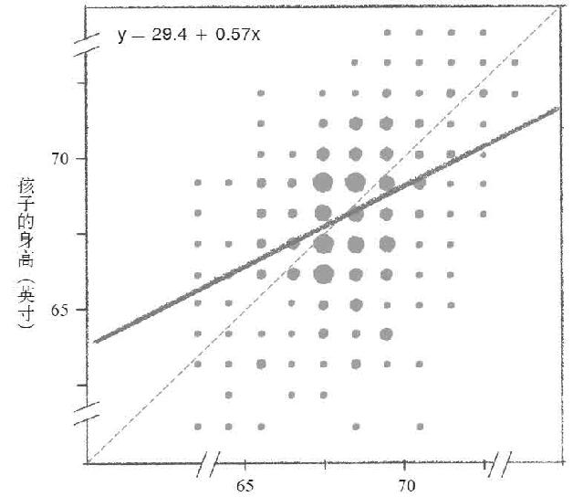
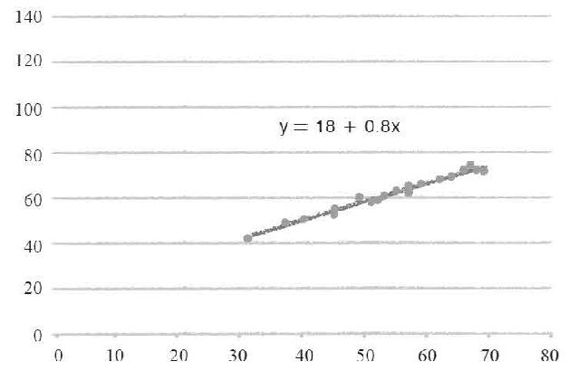
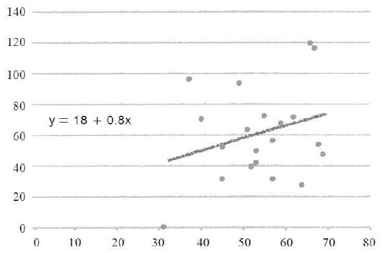
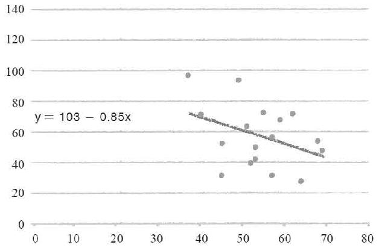
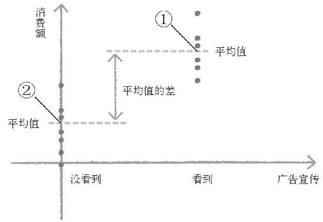
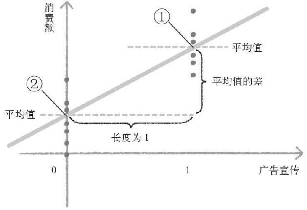
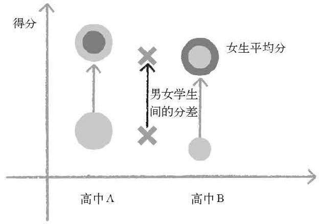
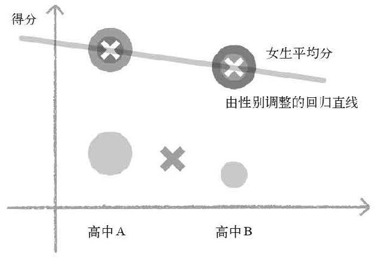
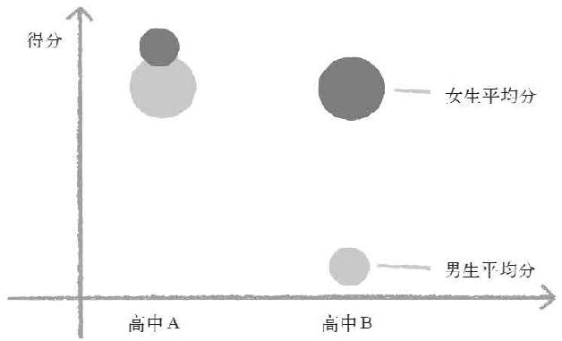
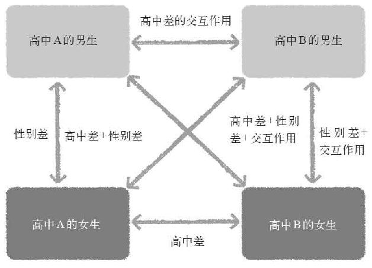

> 第五章  
>  无法进行随机对照试验时该怎么办？

> 18 低成本、快速搜集数据的流行病学方法

读到这里，相信诸位已经了解到随机对照试验的强大力量，以及在怎样的情况下无法运用这种巨大的力量。

只要能够进行适当的随机对照试验，我们就能够对这个世界上所有的因果关系进行科学验证，并且对验证结果加以利用。但是，在我们无法对随机对照试验的条件进行控制时，或者虽然能够控制但是在伦理上不被允许时，甚至在伦理上没有问题，却有可能导致相关人员出现反感情绪时，都无法进行基于随机化的统计学分析。

当然，即便无法进行随机化，并不意味着统计学就完全无法发挥作用。正如我在上文中提到的“科学是由观察和试验组成的”，除了基于随机化对条件进行控制的试验之外，单纯地进行观察也可以发挥统计学的巨大力量。

看一看烟盒上的标语吧

之前，我以吸烟与癌症的因果关系为例，介绍了因为伦理关系无法进行随机对照试验的状况。因为已经有非常多的实例证明了吸烟有引发癌症的风险，仅仅是为了“确实证明这一点”而人为地让研究参与者感染癌症，在伦理上是不被允许的。

当然，吸烟导致癌症这个结论并非一开始就得到了证实。

早在18世纪，人们就已经发现浑身沾满煤灰的烟囱清扫工很容易罹患皮肤癌（当时并不叫这个名字）。1915年，日本人山极胜三郎和市川厚一通过试验证明，在兔子耳朵上涂抹煤焦油会使兔子产生癌症。那么，同样含有焦油的香烟是否也会导致癌症呢？每一位对癌症持关注态度的医学研究者都产生了这样的疑问。

英国人理查德·多尔与奥斯汀·布拉德福德·希尔最早对这一问题进行了证实并且提交了试验数据。如果你身边有烟盒的话，一定能够在上面看到这样的警示标语：“吸烟有害健康，根据流行病学研究，吸烟者的肺癌发病率比不吸烟者高2~4倍”。像这种最早的“流行病学推断”，就是由他们提出的。

前文中介绍过的斯诺的流行病学，在他死后于英国得到了切实的普及和发展。多尔与希尔依据斯诺死后得到发展进步的流行病学方法论，对吸烟与肺癌之间的关系进行了统计学分析。

多尔与希尔在1948~1952年这5年时间内，从英国医院中找到了1 465名因肺癌住院的病人，调查他们的性别、年龄层、社会阶级、居住地以及是否吸烟等条件。同时，还找到了相同数量因肺癌以外疾病住院的病人，这些病人除了吸烟之外的性别、年龄层、社会阶级以及居住地等条件都和之前的病人一样。

除此之外，他们还对患者是否有过肺炎病史、家中住宅的暖气设备种类等当时被认为是导致肺癌的主要原因都进行了调查，结果显示与肺癌最具关联性的原因还是吸烟。多尔与希尔的研究成果如表5–1所示。

表5–1 肺癌与吸烟的关系

| | | | | |
| --- | --- | --- | --- | --- |
| | | 总人数 | 吸烟者 | 不吸烟者 |
| 男性（人） | 肺癌患者 | 1 357 | 1350 | 7 |
| 99.5% | 0.5% | | | |
| 非肺癌患者 | 1 357 | 1296 | 61 | |
| 95.5% | 4.5% | | | |
| 女性（人） | 肺癌患者 | 108 | 68 | 40 |
| 63.0% | 37.0% | | | |
| 非肺癌患者 | 108 | 49 | 59 | |
| 45.4% | 54.6% | | | |

当时社会的吸烟率比现在要高得多，在1 357名男性肺癌患者中，不吸烟的人只有7名（0.5%），而非肺癌患者中不吸烟的人则有61名（4.5%），大约是前者的9倍。108名女性肺癌患者中，不吸烟的人有40名（37%），非肺癌患者中有59名（54.6%）。

对这一结果进行卡方检验，男性组的p值在0.1%以下，女性组的p值在1%以下。也就是说这一结果并非误差，而是证实了肺癌患者的吸烟率很高。在两人撰写的论文中，不只对吸烟/不吸烟进行了对比，他们还对患者每天的吸烟量进行了比较，并且得到了更低的p值。

当然，因性别与年龄层的不同，吸烟导致肺癌的发病率也不同。而且，当时的贵族等富裕阶级与普通劳动者之间的生活和健康状况也有很大的差别。

所以，像多尔和希尔所采用的这种被称为“病例对照研究”的数据采集方法是非常重要的。

在进行对照时，选择的是“除了要研究的致病因素之外，其他条件基本相同的患者”。其中“基本相同”的定义比较模糊，但最好能够使除了致病因素之外的其他条件都处于同等状态。所以，多尔和希尔在除了吸烟这个致病因素之外，还选择了性别、年龄层、社会阶级、居住地等与肺癌相关的条件，并且选择了与作为调查对象的肺癌患者同等数量的其他疾病患者，以性别和年龄层分组进行比较，这样就算没有随机化也一样能够实现“公平比较”。

但是，费希尔却在晚年时（费希尔在多尔与希尔发表研究结果时已经62岁，并且在10年后死于癌症），特意撰写了论文针对上述流行病学的思考方法进行了猛烈的抨击和反驳。因为他本人就是一名烟鬼，所以有些流行病学家和统计学家都开玩笑地说“就连费希尔那样的天才，都对影响自己嗜好的研究表示反对”。但实际上，这并不见得就是一位老人偏执的牢骚。

费希尔反驳的关键点之一，就是“没有进行随机对照试验的分析，就算再怎么以为是在同样条件下进行的分析，准确地说也并非公平的比较”。

如果能够实现随机化，不管设定什么样的条件，都可以使想要进行比较的两组处于相对平等的状态。也就是说，无论是否对该条件进行测定都不会发生改变。

即便有某种超出我们认识范围的条件对结果造成影响，只要进行随机化分析，也可以在无形中实现“相对平等”。

但是，病例对照研究在这方面表现如何呢？在病例对照研究中，所谓的“同样”实际上只不过是人为挑选出来的“同样”条件。多尔与希尔的研究结果，虽然在年龄层、性别、社会阶级与居住地等条件能够保持“同样”，但是如果有其他影响结果的因素存在的话，就无法保证两组患者之间的比较是平等的。

比如在社会阶级这一条件中，他们选择了同样的“劳动者”，碰巧肺癌患者中有很多烟囱清扫工，而烟囱清扫工又是全英国吸烟率最高的人群，如果这样的话，还是会得出肺癌患者吸烟率很高的结果，可实际上，这种比较结果是不准确的。

尽管通过这样的试验得到的p值很低，但是却无法避免由于某种原因导致结果出现偏差的情况。

当然，除此之外还有其他的反驳意见。比如说多尔与希尔所收集的数据全是以英国人为基础的，所以有人认为这一结果不能作为全人类的统一标准。另外还有人认为，由于调查过程都是直接向本人进行询问，所以肺癌患者或许会“夸大吸烟的行为”。

终于，最早参与弗明汉研究并且在其中担任主要职位的统计学家杰罗姆·康菲尔德等人于1959年发表的论文，终结了上述那些反驳的声音。康菲尔德等人引用了之前发表的所有关于吸烟与癌症关系的研究，并且进行了综合性判断，最终得出了吸烟确实会带来罹患癌症风险的结论。

所有关于吸烟与癌症关系的研究，指的是除了英国之外，美国、加拿大、法国以及日本等国都进行过与多尔和希尔同样的病例对照研究。而且，每个国家的研究结果都惊人的一致。

在日本进行这一研究的人，是最早在日本东北大学进行公众卫生学讲座的教授，同时也是“母子健康手册”的发明者濑木三雄，他于1957年发表的论文提到了这一研究的结论。在给这个时代的世界带来巨大冲击的流行病学研究中，也有日本人贡献的一份力量，实在是非常值得日本人民骄傲的事实。

在拥有不同文化、不同国民、不同社会构造的集团中，全都表现出吸烟与肺癌的密切关系。至少在当时的日本，烟囱清扫工这一职业并不像英国那样普遍存在。

确实，像病例对照研究这种自从出现了肺癌这一“结果”之后，才对患者的过去进行调查的方法，有可能由于不同组别之间记忆与回答的不同而导致结果产生误差。但是，像弗明汉研究那样在结果出现前就一直进行持续调查的流行病学研究（这种方法也被称为队列研究）所得出的实例，也被康菲尔德引用在论文之中。

多尔与希尔在随后进行的其他研究中，对5万名内科医生的生活习惯和癌症发病率进行了持续5年的调查，结果表明吸烟者的肺癌发病率要明显高于不吸烟者。美国对20万名老年人进行的队列研究结果同样显示，吸烟者的肺癌发病率高于不吸烟者。

至少在“结果”出现之前先收集吸烟率的数据，就不会出现越是肺癌患者吸烟率越高的“因果关系逆转”的情况。

面对“无法保持一致的条件”应该如何选择？

因为流行病学研究无法完全实现随机化，所以不管选取的条件多么完善，都会出现“无法保持一致”的可能性。那么反过来说，究竟是什么条件无法保持一致呢？

从科学的角度来说，如果有“无法保持一致的条件”存在，就无法确定是否真正有危险。但是，仅仅因为这一点就对“或许有巨大危险”的情况视而不见，那实在是非常愚蠢的做法。

在动物身上涂抹焦油会导致动物感染癌症，所有的流行病学研究都表明吸烟者与癌症之间有非常明显的关联性，这些结论已经基本可以使我们做出吸烟有害健康的现实判断。

如果你是一名吸烟者，在了解肺癌带来的剧烈痛苦和抗癌药物的副作用的基础上，仍然坚持吸烟的话，那完全是你的自由，但希望你能够考虑一下“二手烟”给你的家人和朋友带来的危害。当然，你也可以像费希尔那样，坚持认为“没有通过随机对照试验证明的结论都是不够严谨的，所以无法证明吸烟和肺癌之间有确切的因果关系”。

但是，如果政府因为同样的理由而对吸烟问题视而不见，那么在讨论科学性之前应该考虑的是政府的无能。比如在日本，医疗经济研究机构根据最新的流行病学研究报告计算得出，因吸烟而导致的医疗经费的消耗和劳动力流失等情况，每年都会给日本的经济带来7兆日元以上的损失。而香烟带来的税收则连损失的一半都抵不上。

仅仅因为“在科学上没有确切的结论，或许结果并非如此”，就对占GDP比例为1%——7兆日元——的损失视而不见，实在是愚蠢至极。那些只是为了自己的痛快就批判政府禁烟政策的人，不如考虑一下如果自己生活在上述那种愚蠢的国家中会是怎样的一种情形吧。

对流行病学持否定态度的人，尽管找出一些极端的例子来作为反驳。这反倒会使流行病学大幅降低由于掉入意想不到的陷阱从而得出错误结论的可能性。但是，如果统计学家们对这些反驳也找到了数据进行证实，那么相信这一结论才是对你最有利的选择。在这种情况下仍然继续坚持“没有进行随机化就不够严谨……”的反驳是毫无意义的。不只是流行病学，在政策、教育以及经营等诸多领域之中的统计学观察研究都是如此。

世界上最具影响力的医学杂志《新英格兰医学期刊》在2000年曾经刊载了一篇以“在对同样的因果关系进行分析的医学研究中，流行病学研究真的不如随机对照试验吗？”为主题的文章。这篇文章对20世纪90年代前期刊登在主要医学杂志上的论文进行了比较分析，结果发现流行病学研究所证明的巨大风险，“与随机对照试验的结果几乎没有区别”。因此，他们认为“通过高超的统计方法，能够对条件进行适当的调整”。

在随机对照试验难以实现的情况下，能够以较低的预算和较快的速度收集数据的流行病学方法显然更加实用。而实际上，这种情况在我们生活的社会中已经屡见不鲜了。

> 19 “回归平凡”的回归分析

什么是回归分析

即便不像病例对照研究那样专门在数据采集上大费周章，仍然可以通过高超的方法找到最全面的条件进行“公平比较”。为了实现这一目标，最重要的方法之一就是回归分析。

在大学的统计学教科书中，T检验、卡方检验、方差分析与回归分析是必定会出现的内容。但上述这些统计方法，都可以统一理解为“广义线性模型”的回归分析思考方法，这一点已经在1972年被聂耳达和维达潘两名统计学家证实过了。展现数据之间的关联性，检测是否属于误差范围的所有方法，大体上都可以看作回归分析的一种方法。

但是，回归分析的方法为什么如此重要呢？就算没有任何数据，我们也能够从亲身体验中掌握某些经验和规律。有人说这是“迷信”，有人说这是“理论”，还有人说这是“成功的秘籍”。

实际上要回答回归分析的方法为什么如此重要，首先要搞清楚这个所谓的“回归”究竟是什么意思。在本节中，我们将对“回归”这一现象被发现的历史过程加以说明。

当我听说世界上第一个回归分析的事例时，首先想到的是我高中时代的一位好友野村。

野村当时只与比自己矮的女孩子谈恋爱。因为他本身个子很矮，所以能找的女孩子也自然受到了极大的限制。当时和我们一起玩的好朋友中有一位叫作小林的女孩子，这个女孩身高170厘米，像小林这样高挑的女性是完全被排除在野村的恋爱对象之外的。

我当时刚好学到查尔斯·达尔文的进化论，不由得害怕像野村那样的男人太多会使世界上的人类被分成两个种类。

为了便于解释说明，我首先简单地总结一下达尔文进化论的内容。

> 即便是相同种类的生物个体之间，仍然存在微妙的差别。

> 个体特征会由父母遗传给子女，其中包括对生存和繁殖有利的特征。

> 拥有对生存和繁殖有利特征的个体，会在不断的繁殖中逐渐增加（相反拥有不利特征的个体则会被淘汰）。

> 什么样的特征对生存和繁殖有利是由环境决定的。

也就是说，生物会通过世代繁衍发展出适应环境的特征。达尔文在乘船环游世界的时候，发现即便是同一种小鸟，嘴巴的形状仍然有微妙的差别，于是他专门为此创作了一部关于进化论的著作《物种起源》。

如果所有人都像野村那样思考，身材高挑的女性只找比自己更高的男性结婚，身材矮小的男性只能找比自己更矮的女人结婚。那么，身材高大的父母生出的孩子会更加高大，而身材矮小的父母生出来的孩子只会更加矮小。

如果世世代代就这样遗传下去，那么人类的身高早晚会出现两极分化的局面。也许在马和驴这两个大小完全不同的近缘种之间，就曾经发生过这样的情况。

这并非脑子有问题的高中生的胡思乱想，包括费希尔在内的那个时代的很多统计学家们全都对这一假设进行过认真研究。甚至可以说，当时之所以有那么多的统计学方法，就是为了对进化论的思考方法进行验证而诞生的。费希尔之所以会指出孟德尔研究报告的错误，就是因为他在身为统计学家的同时也对遗传学和生物学的研究抱有浓厚的兴趣。

达尔文的表弟与优生学

达尔文的表弟弗朗西斯·高尔顿，创造了专门用来进行生物分析的统计学。或许这样说有点奇怪，但他也和我们一样在高中时期接触到达尔文进化论。

不过，高尔顿打算将进化论应用在人类身上。高尔顿在1883年发表的《人类的才能及其发展研究》一书中，提出了“应该对更适应环境的人种和血统优先给予更多的机会”这一优生学的观点。

优生学认为，人类的才能是由遗传因素决定的，所以主动淘汰没有才能的人，让有才能的人尽可能多地繁衍后代，就能够不断地提高人类的才能，这才是人类所应该坚持的正道。

高尔顿的这一观点在之后的一段时间曾经在欧美国家非常流行。究其原因，大概是因为19世纪欧洲依然存在着贵族和劳动阶级之间巨大的阶级差距。对于那些渴望守护自己既得利益的贵族们来说，高尔顿的优生学是再合适不过的论据。根据优生学的观点，贵族拥有“更适应环境的、有才能的血统”，所以让他们和他们的子子孙孙都享受这样的生活对人类的整体发展十分有利。更进一步地说，按照高尔顿的观点来看，富裕阶级缴纳高额税金救济贫困阶级的行为，反倒是阻碍人类进步的万恶之源，这也成了贵族抨击政府税收制度和社会保障政策的理论依据。

现代社会普遍认为优生学之所以被禁止，是因为纳粹对这一理念深信不疑，并且加以利用，对他们所谓的“劣等人种”进行虐杀所导致的。但实际上，在大约50年前的美国，还有法律允许对弱智人群以及性犯罪者进行灭绝的“断种”行为。因此，在这方面犯下种族灭绝罪行的不只是纳粹。世界上竟然还曾经有这样的法律存在，其背后多多少少也有优生学的观点在作祟。

“回归平凡”的现象

不过，抛开伦理上的因素不谈，高尔顿和他的学生们通过自己的研究证实了，优生学的理论实际上并不是那么可靠的。

高尔顿和他的学生们的研究结果如图5–1所示。

虽然高尔顿希望找到人类才能与遗传之间的关系，但当时距离法国心理学家比奈发明智商检测还有好几年的时间。

智商（IQ）这个词在现代可谓家喻户晓，不过，对“才能”这个看不见摸不着的抽象概念进行检测，是近代以来心理学和统计学发展进步之后才得以实现的。也就是说，即便高尔顿想要对才能进行统计分析，他却无法得到与之相关的任何数据。所以，高尔顿退而求其次，对大约1 000组家庭的身高进行了检测，试图用实际情况证明“优秀的父母能够生出优秀的孩子”这一理论。结果如图5–1所示。

横轴是父母双亲身高的平均值，纵轴是他们孩子的身高，单位都是英寸，圆点的大小代表符合该数值的人数的多少。

从左下到右上的虚线，表示的是“父母身高平均值=孩子身高”的理论关系。而另外一条实线则是实际测量所得的数据，也就是“父母身高与孩子身高最小误差的预测值”。这条直线用左上方的公式表示为y=29.4+0.57x。英国的1英寸大约等于2.54cm，换算成现代的标准长度单位就是29.4×2.54=74.7cm，得出的结果如下。

像这样对数据间的关系进行记录，或者根据一方数据推测另一方数据的方法就是回归分析的思考方法，上述公式所表示的那条直线被称为回归直线。这其中最重要的部分在于实线所表示的实际关系，与虚线所表示的理论关系之间的区别。

父母双亲身高的平均值（英寸）

孩子的身高（cm）=74.7（cm）+0.57×父母双亲身高的平均值（cm）

图5–1　1 000组家庭的身高调查

图表左侧，也就是双亲平均身高较矮的一组中，表示理论关系的虚线比表示实际关系的实线更低。

这究竟是为什么呢？自古以来大家都认为孩子的身高会和父母双亲的身高基本相同，可是高尔顿的数据分析却显示身材高大的双亲，其子女不一定高，身材矮小的双亲，其子女也不一定矮。这一结果就连高尔顿都始料不及。

高尔顿将这一现象称为“回归平凡”，后来他的学生和受他影响的统计学家们将其称为“均值回归”。意思就是说，实际的数据比理论上的推测更加接近平均值。

换成之前提到的我的那两个朋友，就是“身材矮小的野村的儿子可能比野村更高”，而“身材高挑的小林的女儿则可能比小林更矮”。

像身高这种测量误差极小，遗传因素很强的条件都尚且如此，才能就更是这样了吧。有才能的双亲生出来的孩子或许会拥有比平均值更高的才能，但却不能对此做出万无一失的保证。所以，人类不可能出现两极分化的进化过程，也无法按照遗传和人种来使人类区别开来。

“奥林匹克魔咒”的真相

之所以会出现这种“均值回归”的现象，是因为不管是身高还是才能，或者生物的特征等，这个世界上的所有现象都拥有其独特的“随机性”。

让我们用奥运选手的事例来作具体的分析。

只有在预选赛上创造出优异成绩的选手才能够代表国家出战奥运会，但在奥运赛场上，运动员却往往发挥失常以致最终抱憾收场。这样的状况想必在每届的奥运会上都会出现。这就是均值回归的典型事例，是体育结果的随机性所导致的现象。

体育结果往往不完全由实力决定。就连100米赛跑这样单纯的竞技项目，每届大赛的最佳成绩都不一样。如果将这个被随机性所决定的因素称为竞技状态的话，那么那些碰巧在预选赛上取得佳绩的人之中，有很大一部分是发挥出了他本人的最佳竞技状态。

但是，仅凭最佳竞技状态下取得的成绩去预测正式比赛的结果，无异于期待“奇迹连续发生2次”。像这样的选手在正式比赛中，有可能发挥平庸甚至发挥失常。与再次超常发挥取得奇迹一般的好成绩相比，出现“均值回归”的可能性更大。当然与之相反的情况是，即便在正式比赛之前发挥失常的选手，也有可能出现“正式比赛时发挥更好”的均值回归现象。

被称为“奥林匹克魔咒”的现象背后，也许有很多情况只用“均值回归”就可以解释。所以运动员们所追求的是调整身心状态，“尽可能地减少随机性”，以及“不会被随机性所左右的压倒性的实力”。

从高尔顿与他的学生们身上我们所能够学到的是，无法针对拥有随机性的现象进行理论上的预测。因此，必须仔细地收集数据进行回归分析，并且对其关联性进行分析。

但是，通过回归分析得出“最接近的预测结果”后仍然不能就此满足。因为这个最接近的预测结果虽然是与数据之间误差最小的结果，却仍然存在误差。而我早在上文中就已经说过不考虑“误差”的计算都不准确。

那么，究竟应该怎么做才是对的呢？

实际上我们并非束手无策，在下面的内容中我就将为大家介绍费希尔在随机对照试验之外，为统计学带来的另外一种方法。

> 20 所有领域都可以应用的回归分析法

高尔顿的回归分析的局限性

我还记得在大学的实验实习课上，必须用“在方格纸上标出的圆点中心画一条直线，然后计算这条直线的斜率”这样一个大概在100年前频繁使用的方法作报告。高尔顿就是将这个模拟方法加入了一些数学的模型。

也就是说，高尔顿的回归分析，只不过是导出了“穿过数据中心的直线以及表示这一直线的公式”。所以，比如说像图5–2、图5–3所示的状况，仅仅依靠高尔顿的回归分析是无法进行区别的。

图5–2和图5–3通过回归分析所得到的表示，通过中心直线的公式（回归式）全都是y=18+0.8x。也就是说，每当x轴的值增加1，y轴的值就会增加0.8，这是一个成正比的关系。其中18和0.8等用来表现回归式的数值都被称为回归系数。正如我们在中学教科书中学到过的，18被称为截距，0.8被称为斜率。

图5–2 随机性较小的回归分析

但是，即便拥有相同的回归式甚至回归系数，图5–2中横轴与纵轴的值很明显是从左下向右上的直线关系，而图5–3中所显示的走向关系则没有图5–2那么清晰。

毕竟，从杂乱无章的圆点中找到一条通过的直线，并不是一件容易的事。

那么，这两个图表之间究竟有什么区别呢？

图5–3 随机性较大的回归分析

我们假设在这两个图表中随机去掉3个圆点。图5–2中不管去掉哪3个圆点，最后得到的直线仍然不会有变化。而图5–3中如果碰巧去掉最右上的2个圆点以及左下的一个圆点的话，那么穿过中心的直线一定会变得完全不同。

图5–3变化后的回归式就成了y=103–0.85x。也就是说，仅仅去掉了3个圆点之后，整个图表的函数关系都发生了逆转，x的值每增加1，y的值就会减少0.85（图5–4）。

这样一来，根据这个回归分析的结果，就不知道要想使y增加时，到底应该增加x还是减少x。比如在商业领域，希望了解销售额（y）的增长和广告量（x）之间有什么关系，可是根据上述的结果，根本不知道究竟应该增加广告还是减少广告，所以这种分析可以说是毫无意义的。

回归系数本身就有随机性

上述例子是从20个数据中去掉3个，而实际上这20个数据也是“从自然界无限的数据中偶然得到的数据”。假设最初“偶然”得到的数据只有17个，那么就不一定会得到之前提到过的那种成正比的关系，甚至可能出现像图5–4那样的反比关系。

图5–4 数据数量发生微弱改变后，关系发生了逆转

因此在现代统计学中，不仅实际得到的数据本身具有“可能出现较大值，也可能出现较小值”的随机性，就连得到的回归系数的本身也是随机存在的。也就是说，假设从现在开始进行100次从“偶然得到的数据”中求得回归系数的计算，那么一定会“既有可能得出较大的值，也有可能得出较小的值”。

不只回归系数，就连数据的平均值这么单纯的数值，如果进行多次数据采集并对统计量加以计算的话，每次得出的统计量也是不同的。

在这里还有一点必须注意，例如从某小学4年级一个班全部40名学生的学习数据中算出回归系数和平均值，即便在这种情况下，也必须考虑统计量的随机性。

与罗斯福新政的失业率调查不同，采集了全体数据的回归系数必定是单一数值。所以，如果这个回归系数只应用在这个班级的40名学生上，是没有任何误差的。可是这样一来，好不容易收集数据进行分析得出的结果，就只对这个班级的学生有意义了。

对没见过这40名学生的人来说，根本不在乎他们的成绩如何。但是，如果这个数据能够代表与这40名学生同年龄的孩子的成绩情况，那么对此感兴趣的人的人数一定不少。也就是说，真正有意义的数据是“同年龄全体孩子”这一群体的回归系数，某小学4年级一个班全部40名学生的数据，只是庞大群体中的“一小部分”罢了。

由此可见，人类真正想知道的基本上都是那些难以轻易得知的事情。

或许在这个世界上，有人只失恋两三回，就得出了“女人全都在说谎”的结论。要想验证这个结论是否准确，那就必须对全世界大约30亿名女性进行非常仔细的观察，确认她们是不是在说谎。更进一步地说，就算确认了“2012年世界上所有女性都在说谎”，也无法擅自断言从今往后“她们还会继续说谎”。毕竟，人类的性格和思维方式是不断发生改变的，或许2013年会有不说谎的女性出现呢。

统计学家也无法理解的“真值”

费希尔将“如果拥有无限的数据就能够得到的真正想要知道的值”称为“真值”，并且通过对偶然得到的数据进行计算的统计量能够在多少范围的误差内推测真值进行了数学上的运算，最终发现在数据有限的情况下做出适当判断的方法。

通过现实数据得到的回归系数之类的统计量，相对于真值来说只不过是一个适当的估计值，如果在估计之外更进一步地检测这个数值与真值相比有多少误差，那么至少能够降低我们做出错误判断的风险。

这也是费希尔在随机对照试验之外，为统计学做出的另一项伟大贡献。

当时的统计学家都被实际得到的数据所束缚，这些统计学家都将从有限的数据中得出回归系数计算出的平均值看作绝对且唯一的数值。所以，他们对于费希尔所提出的抽象真值以及预测值的误差等概念，完全无法理解。但是，如果这样，他们就无法解释为何之前那两个图表中的回归分析会有如此明显的区别。

运用求平均值的计算方法，就连小学生也能够做到。将所有数据全部相加，然后除以数据的个数即可。可是，如果我们发现“算出的平均值在理论上竟然具有随机性”，或许也会像过去的那些统计学家们一样对此完全无法理解。

即便如此，正如我在上文中对误差范围进行的说明，如果基于偶然得到的回归系数做出判断，会使我们做出无益甚至有害的决定，那么这种愚蠢的行为最好能够避免。也就是说，当斜率的真值为0时，我们却由于数据的随机性算出成正比的回归系数，那么根据这一结果做出的战略决策毫无疑问是完全错误的。

比如，在增加广告投放量也没有任何意义的情况下，做出“回归分析的结果显示，越是增加广告投放量就越能够增加销售额”这样的判断必将带来巨大的损失。

为了掌握回归分析所必须了解的基础术语

幸运的是，就算不擅长抽象思考的人，现在也可以利用统计学这个强有力的工具。现在，有很多软件可以帮助那些数学不好的人非常简单地计算出估计值、误差以及p值。有了这些工具算出的结果，只要掌握一些基本的统计学知识就可以将其应用在实际的工作和生活当中。

比如说，要想表示之前图5–2和5–3回归分析的结果与误差之间的关系，如表5–2和表5–3所示，y=18+0.8x。

表5–2 图5–2的回归分析结果

| | | | | |
| --- | --- | --- | --- | --- |
| 变量 | 回归系数的估计值 | 标准误差 | 置信水平为95%的置信区间 | p值 |
| 截距 | 18 | 1.5 | 14.9~21.2 | ＜0.001 |
| x | 0.8 | 0.03 | 0.7~0.9 | ＜0.001 |

表5–3 图5–3的回归分析结果

| | | | | |
| --- | --- | --- | --- | --- |
| 变量 | 回归系数的估计值 | 标准误差 | 置信水平为95%的置信区间 | p值 |
| 截距 | 1.8 | 35 | –55.5~91.5 | 0.61 |
| x | 0.8 | 0.6 | –0.5~2.1 | 0.23 |

如果我们能够对表5–2和表5–3的各个项目进行如下的解释，那么就可以在很大的程度上避免做出错误的判断。

> 回归系数的估计值：这里需要注意的是，截距和斜率（x）都是通过数据计算出来的数值，都是基于数据对“真值”进行的估计。

> 标准误差：估计值的误差。与回归系数的估计值相比，标准误差越大，估计值越不准确，不过同时还要考虑接下来要提到的置信区间。

> 置信水平为95%的置信区间：假设包括0在内的许多回归系数，算出“p值在5%以下时真值”的范围。基本可以认为“真值就在这个范围之内”。

> p值：假设回归系数为0的情况下，只能通过数据的随机性推测回归系数的概率。一般来说当这个值在5%以上时，可以认为“就算回归系数为0也不可能出现”。

根据上述的理解，结合图表上实际的数据来看，比如表5–2中截距的标准误差为1.5，斜率（x）的标准误差是0.03，与回归系数的估计值相比这个误差要小很多。再看置信区间，分别是14.9~21.2和0.7~0.9，也就是说真值就在这个范围之内。

再假设回归系数的真值为0，也就是说x与y之间没有任何关系，那么由于数据的随机性产生这种回归系数的概率，即p值小于0.001，也就是不足1%的概率。那么，我们基本可以认为x与y之间成正比。

让我们再来看一看表5–3的回归系数的标准误差，截距的标准误差为35，斜率（x）的标准误差为0.6。这两个数据与回归系数的估计值相比要么几乎相等，要么比估计值还要大。而此时，斜率（x）的置信区间还是–0.5~2.1，也就是“既有可能是正值，也有可能是0，还有可能是负值”，完全不得要领。再看p值，全都在5%以上，也就是说即使回归系数为0，截距出现这种数据的概率也有61%，斜率（x）出现这种数据的概率有23%。由此可见，上述结果很有可能是由于数据的随机性产生的。

只要你能够看懂回归系数的误差与置信区间的数值之间的联系，那么你的统计能力就会得到大幅提升。为什么这样说，因为我们之前所提到过的那些内容，包括对数据间的关联性进行分析，或者根据某种数据推测出何种结果等，为了实现统计学的根本目的而采用的方法，全都属于广义的回归分析。

政策、教育、经营、公共卫生等所有领域的研究结果，都可以用像刚才举例的图表一样的，按照回归系数、置信区间与p值（或者其中的一部分）的形式进行记述。

> 21 快速加深对统计学的理解的一张图表

统计学教科书将广义线性模型分为两种

回归分析本身就是一个非常有用的工具，但是如果将更多的统计学方法全都统一理解为“广义的回归分析”的话，那么其应用范围还会变得更加广阔。

像这种“广义的回归分析”的思考方式，被统计学家们称为广义线性模型。所谓线性，指的就是回归分析中用直线表示的关系性，“将许许多多的方法都统一成回归分析进行整理”就是广义线性模型的意义所在。

极端地说，我认为基础统计学的教科书大体可以分为两类。一类是因为没有活用广义线性模型，而对费希尔时代创造的各种统计方法逐一进行介绍的教科书，另一类是对基本相同的方法进行概括介绍的教科书。

前一种教科书经常会导致以下这样的教学悲剧。

虽然记住了T检验和回归分析等名称，但是却搞不清楚它们之间的关系和规则，只能当作不同的方法单独记忆，结果就是不知道什么时候该用什么方法。就算当时能够顺利地解答练习题并且通过考试，但是等毕业以后回过头来再想起统计学的时候仍然是一头雾水。

那么，如果我们以“基本相同的方法”为出发点，仅仅通过一张图表来对所有的概念进行解释说明，那会怎样呢？我认为，这不但能够大幅减少我们理解统计学的时间，并且能够加深对统计学的理解。

这张图表如表5–7所示。

本书中曾经多次提到，统计学的目的在于从基于公平条件的比较中寻找出现区别的要素，那么只要能够找到在解释变量中，希望进行比较的结果变量，就能够非常简单地找出应该使用的统计学方法。再重复一次，这个表中介绍的所有方法都属于“广义线性模型”的回归分析。

表5–4 涵盖广义线性模型的一张图表

| | | | | | |
| --- | --- | --- | --- | --- | --- |
| | 分析轴（解释变量） | | | | |
| 两组间的比较 | 多组间的 比较 | 连续值多寡的比较 | 对多个解释变量同时进行比较 | | |
| 希望进行比较的内容（结果变量） | 连续值 | 对平均值的区别进行T检验 | 对平均值的区别进行方差分析 | 回归分析 | 多元回归分析 |
| 是/否等二值 | 统计表的记录与卡方检验 | 逻辑回归 | | | |

“一张图表”的使用方法

比如，我们将每位顾客的消费额作为变量，从0开始以1日元为单位增加的数值作为连续值。以此作为结果变量，在两组变量之间（比如以性别区分）进行比较并且记录平均值，然后分析通过T检验得到的p值和置信区间即可。

另外，来店次数的值也属于连续值，如果想要对“来店次数多的人消费额越高”这一假设进行比较，可以将来店次数作为解释变量，消费额作为结果变量进行回归分析，然后分析回归系数的估计值和置信区间以及p值即可。

而像“是否消费”以及“是否来店”等数据，只需要两个数值“是”或“否”就能够表示清楚。要想将此作为结果变量在两组或者更多组之间（比如，以10岁为一个年龄层的分组）进行比较的话，只需要通过统计表将各组的购买率和来店次数等记录下来，然后分析通过卡方检验求得的p值即可。

比较麻烦的是既不属于连续值也不属于二值，而是以“按照某种规则进行分类”作为结果变量的情况，不过，这在实际应用中也可以当作二值或者连续值来进行计算。

比如说，拥有“完全没有”、“几乎没有”、“偶尔”、“经常”这4个选项的调查表中，存在着递进的顺序。所以，可以将这里的前两项与后两项分成两类，当作二值变量进行计算。就算选项无法平均分成两份，那么将“经常”作为单独一类，其他所有选项作为另外一类进行二值计算。此外，将全部数值当作连续值进行分析的方法，在实际应用中也经常出现。

不过，像日本民众支持的政党这样的分类，恐怕就不像上述调查表的结果那么明确地富有方向性和递进关系了。

虽然可以用“自由主义”的尺度通过直觉进行排列，但是对于政策领域来说，这种顺序是可以颠倒的，而且日本民众对政党的支持也不只由“自由主义”这唯一的条件决定。因此，这里必须将“有本质区别的分类”作为变量，比如“是否支持民主党”以及“是否支持自民党”，将数值换算成对不同政党的支持这样一个二值，就可以以此作为进行分析的突破口。

对3个分类以上的变量进行分析确实比较麻烦，可即便如此，“仅仅通过这一张图表就可以对几乎所有数据之间的关联性进行分析，并且对将来的结果进行预测”，也不得不说，这是一个非常简单且有效的方法。

任何方法都应该得到相同的p值

更进一步来说，比如图表最右边“对多个解释变量同时进行比较”的时候所使用的方法，也可以应用在只有1个解释变量的情况，在这种情况下解释变量不管是各个分组间进行比较，还是通过连续值的多少进行比较都可以。也就是说，在应该使用T检验的时候使用了多元回归分析（如果在分析轴只有1个的情况下就不能称为多元回归分析，而应该称为回归分析），或者应该使用卡方检验的时候使用了逻辑回归分析，最后都会得到相同的p值。所以，对关联性进行分析的方法大体上都可以称为广义的回归分析。

本来应该用数学公式来证明上述结果的一致性，但T检验和回归分析结果的一致性就算不用数学公式也同样可以证明。

图5–5表示的是通过T检验计算两组数据间平均值的差，是否属于误差范围的统计方法。将两组分为“看到广告的组”和“没看到广告的组”，对两组数据间消费额平均值的差进行分析。

图5–5 T检验的思考方法

黑点表示的是各组顾客的消费额，①②表示的是各组消费额的平均值。T检验所要分析的平均值就是①②之间“高度”的区别，如果这一结果超出数据随机性所导致的误差范围，就说明广告宣传是有效的。

那么，对同样数据进行回归分析，又会怎样呢？图5–6就属于这种情况。为了进行回归分析，必须将两者都以数字表示。为了便于理解，我们将“没看到广告”的设为0，“看到广告”的设为1。

图5–6 回归分析的思考方法

正如之前说过的那样，回归直线是“穿过数据中心的直线”。所以，这条直线要穿过两组数据的平均值所在的点。那么，由此得到的斜率就应该是“坐标的纵长除以坐标的横长”。

其中，“坐标的纵长”就是两组数据间“平均值①②的差”。而“坐标的横长”则很明显就是1。“平均值的差”除以1得到的值还是“平均值的差”，也就是说当两组数据间的区别用0和1来表示的话，“平均值的差”与“回归系数”是完全相同的。

像这样将原本并非数值的“两组”或者“二值变量”用0和1表现的方法称为虚拟变量，在很多论文中十分常见。在回归分析的文章中，如果出现“男性虚拟”或者“高龄者虚拟”的字样，意思就是“男性为1、女性为0”或者“高龄者为1、其他为0”。比如男性虚拟的回归系数为5.2，意思就是“与女性相比，男性只有5.2的可能结果变量较大”，如果男性虚拟的回归系数为–4.1，那么意思就是“与女性相比，男性只有4.1的可能结果变量较小”。

也许有聪明的读者会发现，除了要考虑“平均值标准差”和“回归系数”是否一致之外，还要考虑误差与随机性。不过，考虑这些都是没有问题的。

因为通过数据计算得出的各组之间的平均值、回归系数，全都拥有相同T分布的随机性，早已被费希尔所证明了。如果根据同样的数据推测出本质相同的数值（平均值的差和回归系数），而且理论上的随机性也相同的话，那么最终的结果当然也会完全相同。

容易混淆的术语：广义线性模型

我之所以能够仅仅用这一节的篇幅就讲完一整本基础统计学教科书的内容，完全是因为广义线性模型太过完美。

虽然从聂耳达与维达潘最早提出这个对学习者来说简单易懂、一目了然的概念已经过去了40余年，可是这个概念却没有出现在日本的任何一本教科书中，实在让我感到非常遗憾。

曾经在一次哈佛大学的统计学研讨会上，就有人提出“为什么到目前为止从没有人这样教过统计学呢”。由此可见，这不仅是日本统计学教育所面临的问题。

聂耳达之所以会提出广义线性模型这个概念，就是因为他发现当时发明的各种各样回归分析的方法实际上采用的都是相同的计算方法。因此，只要我们了解了多重回归和逻辑回归之间的区别，那么今后不管看到什么样的回归分析方法都能够轻而易举地找到其中的规律。

另外说句题外话，在聂耳达与维达潘提出广义线性模型之前，有一位叫做科恩的统计学家在1968年提出了一般线性模型的概念。

对于这两个容易混淆的名字，聂耳达本人也承认“应该再想一个更好的名字才对”。

不过，对于并非统计学专家的读者朋友们来说，没必要对这两个概念的区别过于敏感，只要在见到“一般线性模型”的时候知道也有这个概念，并不是“广义线性模型”的笔误就足够了。

> 22 现代统计学的主角：多元回归分析

专家常用的统计方法

通过广义线性模型的方法，对数据间的关联性进行分析推测的方法基本上都可以整理为广义回归分析的一部分。

这里提到的多元回归分析，就是拥有多个解释变量的回归分析，同时也是在“公平比较”的基础上最重要的统计分析方法。

也正因为如此，在政府报告和学者的研究论文中，每当对数据进行分析的时候，最常使用的方法就是多元回归分析以及逻辑回归。可以说，多元回归分析是现代统计学的主角。只要掌握了这种方法，你也可以与统计学专家进行对等的讨论。

那么，为什么通过多元回归分析和逻辑回归，就能够实现“公平的比较”呢？

有一种由于无法进行“公平的比较”导致对数据做出错误判断的情况，被称为辛普森悖论。之所以叫这个名字，是因为这个问题最初就是辛普森提出来的。

假设面对以下这几个问题，你会做出怎样的回答呢？

> 对高中A与高中B的同年级学生进行相同的模拟测验。

> 对男生进行比较，高中A的平均分比高中B的平均分多5分。

> 对女生进行比较，高中A的平均分比高中B的平均分多5分。

> 那么对全部学生进行比较，高中A和高中B哪一个平均分更高？

如果按照普通的理论思考，当然高中A的平均分要比高中B的平均分多5分。但是，从统计学的角度来看并非如此。关于具体数值的例子如表5–5所示。

表5–5 “辛普森悖论”的事例

| | | | |
| --- | --- | --- | --- |
| | | 高中A | 高中B |
| 男生（人） | 总得分 | 9 600 | 2 200 |
| 人数 | 160 | 40 | |
| 平均分 | 60 | 55 | |
| 女生（人） | 总得分 | 3 000 | 11 200 |
| 人数 | 40 | 160 | |
| 平均分 | 75 | 70 | |
| 男女生合计（人） | 总得分 | 12 600 | 13 400 |
| 人数 | 200 | 200 | |
| 平均分 | 63 | 67 | |

在表5–5所示的情况下，高中A男生的总得分为9 600分，除以男生人数160得到的平均分为60分。女生的总得分为3 000分，除以女生人数40得到的平均分为75分。因此，高中A的男女合计平均分为（9 600+3 000）÷（160+40）=63分。而通过同样的计算，得出高中B男女合计的平均分为67分。

从表上的数据可以看出，高中A的男生平均分和女生平均分确实都要高于高中B，与之前提出的问题条件相一致。可是，因为男生与女生的平均分不同，而且高中A与高中B的男女学生比例不同，所以全校平均分反倒是高中B比高中A多出4分。

像这样全体进行的单纯比较与内部小群体进行的比较结果相矛盾的情况，就是辛普森提出的问题所在。在没有进行随机化的流行病学观察研究中，即便通过单纯的比较发现了巨大的差异，也很有可能是和高中A与高中B的男女平均分差距一样的“细节”差异。相反的，即便在单纯的比较中没有发现什么差异，却有可能在“细节”上隐藏着真正的区别。

比如在前文中提到过的“玩暴力游戏与少年犯罪率”之间的因果关系。将家庭环境这一“细节”算在内进行比较并没有明显的区别，但是如果玩暴力游戏的分组中家庭环境不好的孩子占多数，那么在数据上就会出现玩暴力游戏的孩子的犯罪率更高的结果。

分组分析能够防止辛普森悖论产生吗

要想防止辛普森悖论，就需要像流行病学的观察研究那样保证条件的一致性。将高中A和高中B的学生的成绩按照男女性别分组，或者将玩暴力游戏的孩子按照家庭环境分组，只要将对结果可能产生影响的条件保持一致进行比较，就能够避免辛普森悖论的产生。这种将具有同样条件的群体进行比较分析的方法，被称为分组分析。

这种思考方法基本上是正确的。但是当“影响结果的条件”越来越多时，这种方法就会逐渐变得不那么可靠。

为了解释为什么会出现上述的这种情况，让我们来分析一下在对高中A和高中B的成绩进行对比时，除了学生性别之外还应该考虑什么条件。

比如说，①参加什么社团活动（运动部、文化部、不参加），②是否参加补习班（是、否），③家庭环境（按照家长的年收入分成3个层次），那么为了满足上述所有条件，我们需要将全体学生分为几组呢？

答案如下：

> 2（性别）×3（社团活动）×2（是否参加补习班）×3（家长年收入）=36

也就是说，要想保证上述条件完全一致的话，我们需要将学生分成36组。

那么，这两所学校中符合分组条件的学生又有多少呢？假设符合每个条件的学生数量大致相同，那么每一组就应该有200÷36=5.556，也就相当于每组只有五六个人。同时，由于两所学校的男女比例差都很大，比如高中A需要将40名女生分成18组，那么平均每组就只有两三个人。如此少的人数，不管进行怎样的分析得出怎样的结果，都逃不出误差的范围。

不需要分组的多元回归分析

面对这样的问题，多元回归分析就会发挥出威力。在“保证条件相同”的基础上更进一步，只要确定“不同性别学生的平均分相差多少”，就可以不必进行任何的分组。接下来让我们对这种思考方法进行详细的解说。

假设不考虑性别，对高中A与高中B的平均分进行比较的话，就像图5–7那样进行回归分析即可。相信掌握了上一节内容的读者对这部分是一目了然的。浅色的圆点是男生的平均分，深色的圆点是女生的平均分，圆点的大小代表各自学生的人数，×表示的是两个高中各自的平均分（两所学校的平均分都比较靠近人数较多的性别），穿过×的直线的斜率就是“两所学校平均分的差”。在这种情况下，斜率越向右上攀升，高中B的平均分比高中A的平均分越高。

如果考虑性别的话，情况又会怎样呢？比如说，高中A和高中B都是女生的平均分要高出15分，应该如何利用这个条件呢？

图5–7 单纯的回归分析

如果想要根据这个条件对两所高中进行“公平的比较”，可以采用“假设这两所高中的男生全都是女生”这个方法（图5–8）。

图5–8 假设男生全都是女生

这样一来，两所高中男生的分数都提高了15分，那么高中A的总体平均分就是75分，高中B的总体平均分是70分。也就是说，成功地避开了辛普森悖论，直接得到了“高中A的平均分比高中B平均分高5分”的结论（图5–9）。

图5–9 假设男生全都是女生情况下的回归分析

像这样对不同性别导致的平均分差与所在高中不同导致的平均分差等多个回归系数同时进行推测的方法，被称为“多元回归分析”。如果能够推测出性别的不同会“造成平均分出现多少分差”，那么就算不对男生和女生进行分组仍然可以通过“假设男生全都是女生”的方法来实现“公平的比较”。

这就是利用多元回归实现公平的比较的例子。通过这种方法，不管增加多少条件，都没有进行庞大分组的必要了。

多个回归系数在假设“没有相乘效果”的前提下，表明了解释变量对结果变量会产生多大程度的影响。如果理解了这一点，那么诸位就可以在不借助任何帮助的前提下读懂学者的论文或者国家的政策报告了。

比如牛津大学的教授苅谷刚彦就在自己的著作《学力与阶层》一书中，介绍了他从1989~2001年间以大阪府下属的中小学校学生为对象，调查学生们的生活、学习习惯以及成绩，并且对这些数据进行多元回归分析之后所得出的结果。

在《学力与阶层》一书中，他详细叙述了调查的内容，比如说2001年中学生的数学正确率（即满分100分的得分）得出了如表5–6那样的多元回归分析结果，对于其中的意义想必大家也是一目了然。

虽然表5–6中没有置信区间，p值也并非实际的数值，而是按照不足0.001、不足0.01、不足0.05、0.05以上进行的分类，都和我们之前接触过的内容有些不同，但即便如此我们仍然能够通过表5–6了解到一些信息：“男生比女生低1.62分”，“朗读的学生普遍高出3.32分”，“参加补习班的学生高16.62分”，“认真完成作的人高6.92分”，“在家和补习班学习时间的长短对成绩的影响基本处于误差范围之内”，“但是不参加补习班而且在家也不学习对成绩的影响则是–5.97”。

表5–6　对中学生数学正确率进行的回归分析

| | | | |
| --- | --- | --- | --- |
| | 回归系数的估计值 | 标准误差 | p值 |
| 截距 | 42.33 | | |
| 男生（虚拟） | –1.62 | 1.31 | 0.05以上 |
| 朗读（虚拟） | 3.32 | 1.41 | 不足0.05 |
| 补习班（虚拟） | 16.62 | 1.64 | 不足0.001 |
| 作业（虚拟） | 6.29 | 0.92 | 不足0.001 |
| 学习时间（分） | 0.01 | 0.02 | 0.05以上 |
| 不在家学习也不参加补习班（虚拟） | –5.79 | 2.08 | 不足0.01 |

在这里影响最大的因素就是补习班。与认真完成作业和长时间在家学习的学生相比，基本不写学校作业而参加补习班的学生竟然在理论上取得了更好的成绩，这不但证明了学校教育还不够完善，同时也证明了能够供孩子参加补习班的家庭环境对成绩会有很大的影响，这或许从另一个侧面反映了社会的不公平。只要熟练掌握多元回归分析的方法，就能够根据得到的数据进行多方面的讨论和研究。

利用比值比进行逻辑回归分析

因为多元回归分析只能够应用在结果变量为连续值的情况下，于是在弗明汉研究中，研究者们进一步发明了逻辑回归。

针对是否会得心脏病这个二值的结果变量，许多解释变量（血压、年龄、是否吸烟等）都会对其产生影响。为了进行公平分析，研究者们发明了逻辑回归的方法。

数学部分的内容请大家参考相关专业书籍，我在此就不作赘述，逻辑回归大体上的思考方法就是将原本为0或1的二值结果变量，变换为连续的变量进行多元回归分析。

在逻辑回归之中，回归系数是以“比值比”来表示的，意思是“大概有几倍的机会”，只要看懂了这个，就能够掌握结果。与多元回归分析一样，回归系数的估计值、标准误差、置信区间以及p值都是需要我们看懂的内容，与多元回归分析相比，逻辑回归只是对回归系数的理解方法稍微有些不同。

在之前提到过的《学力与阶层》一书中，还针对“不在家学习，也不参加补习班”的学生特征进行逻辑回归分析，让我们来看一看分析结果的比值比和p值。

在这里，是否是男生、是否朗读、家庭文化阶层高不高都属于“误差范围”，而是否认真完成作业对“学习时间为0”的影响比率是0.55倍（这部分的因果关系很难确定），另外，家庭文化阶层较低的“学习时间为0”的比率是1.78倍，父亲从大学毕业的话比率则是0.6倍，由此可见除了是否参加补习班之外，家庭环境也对学生的学习习惯有着很大的影响（表5–7）。

表5–7 “不在家学习也不参加补习班”的学生的特征

| | | |
| --- | --- | --- |
| | 比值比的估计值 | p值 |
| 男生（虚拟） | 0.77 | 0.05~0.10 |
| 朗读（虚拟） | 1.11 | 0.05以上 |
| 作业（虚拟） | 0.55 | 不足0.001 |
| 文化阶层低（虚拟） | 1.78 | 不足0.01 |
| 文化阶层高（虚拟） | 0.69 | 0.05–0.10 |
| 父亲大学毕业（虚拟） | 0.60 | 不足0.01 |

掌握了回归分析就能够驳斥那些“胡说八道”

不管是关于社会问题的分析，还是对改善经营状况的建议，只要你掌握了到目前为止所说的这些统计学知识，就不会被那些没有任何数据的胡乱分析所欺骗。

我这个人特别较真儿，每当在电视和网络上看到那些学者和文化人毫无根据的分析的时候，就会去查询数据看看他们说的到底是不是真的，但遗憾的是很多人说的话都是没有依据的。

当你对某些“毫无根据的胡说”心存疑虑的时候，可以将怀疑的内容后面加上回归分析这个关键词一起输入谷歌检索，一定能够找到“是否有关联”的结果。希望大家都能够活用到目前为止掌握的统计学知识，去驳斥那些所谓专家们的“胡说八道”。

> 23 统计学家最拿手的统计法

像多元回归分析和逻辑回归这样的回归模型，是在寻找数据关联性时最常用的方法。

这里所说的“模型”，与按现实世界中实际存在的汽车和飞机，用塑料制作成塑料模型是同样的概念。也就是说，将现实中看不见、摸不着的因果关系，通过回归分析制作成回归模型。

但是，回归模型并不一定能够准确地推测出因果关系。当然，这并不意味着回归模型就毫无价值，只要我们知道应该注意什么地方，就可以对数据进行准确分析。

接下来，我将为大家介绍回归模型的极限，以及为解决这个问题而诞生的现代统计方法。

使用回归模型时要注意交互作用

多元回归分析中，对回归系数的估计是非常重要的问题。

也就是说，在估计回归系数的时候，要考虑“变量间在没有相乘效果的状态下会出现怎样的区别”。为了方便说明，我们假设高中A和高中B男女生之间平均分的差“都是15分”，男生和女生相比则是高中A的学生比高中B的学生分别“高出5分”（表5–8）。

表5–8 两所高中模拟测试的结果（与表5–5相同）

| | | | |
| --- | --- | --- | --- |
| | | 高中A | 高中B |
| 男生（人） | 总得分 | 9 600 | 2 200 |
| 人数 | 160 | 40 | |
| 平均分 | 60 | 55 | |
| 女生（人） | 总得分 | 3 000 | 11 200 |
| 人数 | 40 | 160 | |
| 平均分 | 75 | 70 | |
| 男女生合计（人） | 总得分 | 12 600 | 13 400 |
| 人数 | 200 | 200 | |
| 平均分 | 63 | 67 | |

但实际上，结果可能并没有那么简单。比如，出现像图5–10那样的情况会怎样呢？

如果将高中A的5分差距和高中B的25分差距平均一下，那么全体相比还是女生比男生高出15分。

但实际上，高中B只有男生成绩非常差，如果排除这一因素，实际上男女生之间的差距和高中之间的差距都不那么明显。这就是“没有相乘效果的状态”假设不成立的情况。如果是没有相乘效果的状态，那么高中A和高中B都会有同样的男女分差，而且还能够体现出两所高中男女生各自的分差。

| | | | |
| --- | --- | --- | --- |
| | | 高中A | 高中B |
| 男生（人） | 总得分 | 11 200 | 1 800 |
| 人数 | 160 | 40 | |
| 平均分 | 70 | 45 | |
| 女生（人） | 总得分 | 3 000 | 11 200 |
| 人数 | 40 | 160 | |
| 平均分 | 75 | 70 | |

图5–10 稍微改变测试结果的话

英语中将这种相乘效果称为interaction，统计学中有一个术语叫作“交互作用”。

使用回归模型时最需要注意的一点，就是这种“交互作用”是否真实存在。不过，就算实际的交互作用并不可靠，仍然可以对包含在回归模型中的回归系数进行推测。

也就是说，不管是连续值还是虚拟变量，只要创造两个解释变量各自的回归系数，以及与这两个变量相关的解释变量（被称为交互作用项），就可以对回归系数同时进行推测，也能够推测这个交互作用的影响。

将上述内容整理后如表5–9所示。

表5–9 交互作用的影响

| | | | |
| --- | --- | --- | --- |
| | 性别男生虚拟 | 高中B虚拟 | 男生×高中B交互作用 |
| 高中A的男生 | 1 | 0 | 0 |
| 高中A的女生 | 0 | 0 | 0 |
| 高中B的男生 | 1 | 1 | 1 |
| 高中B的女生 | 0 | 1 | 0 |

这个交互作用的1和0可以分别看成是“高中B且为男生”与“除此之外”。这表示仅仅通过男女间的平均差异无法对高中间的平均差异进行说明的情况。而根据虚拟变量的假设方法，就算设定“高中A且为女生”的交互作用项也对估计没有任何影响，最重要的一点在于，通过导入这个交互作用项，两所高中×两个性别组合所产生的全部4个分组间的平均值的差，就全部可以通过回归系数表示出来（图5–11）。

图5–11　两所高中×两个性别的关系性

只要像这样建立包括交互作用项的回归模型，就可以降低因为表面上的回归系数而导致做出错误判断的概率。

不知如何是好时的变量选择

但是，如果为了追求准确性而对所有的交互作用项进行分析，则会陷入不知如何是好的状态。

如果有两个解释变量，在它们之间增加1个交互作用项的话没有什么问题；如果有20个解释变量，那么它们之间的交互作用项就是20×19÷2=190个。

在样本数有限的情况下，像这样进行大量的回归系数估计会出现极大的误差，可是就算通过“大数据”实现无数样本，在面对超过100个的回归系数时，仅凭人类的智慧很难对其进行解释。

每个人都是独一无二的，这可以说是人类最大的优点。但当我们想对数据进行分析时，如果发现每个数据都是独一无二的，那就完全无从下手了。尽可能简单地找到使结果变量出现区别的数据，才是统计学应该发挥的作用。

因此，人们研究出一种包括交互作用项在内自动选出解释变量构筑回归模型的变量选择法。另外人们还开发出几个指标，用于判断什么样的解释变量或者包含交互作用项的回归模型最合适。其中最具代表性的一个，就是原统计数理研究所所长赤池弘次在1973年发表的赤池信息量准则。

但是，什么样的回归模型在实际情况中是最为合适的，并不单纯由数理性质所决定。

只要选择适当的变量，正确考虑所有需要调整的条件，就一定可以通过回归模型进行“公平的比较”。但是，对于如何获得适当的回归模型这一点，除了统计学家之外，还需要与最终结果有紧密联系的利益相关者们经过谨慎研究讨论后再作决定。

无限接近随机化的“倾向指数”

1983年，罗森堡和鲁宾这两位统计学家提出了倾向指数的统计方法。这一方法在随机化无法或者难以确定因果关系时能够发挥非常巨大的作用。

所谓倾向指数，就是判断拥有二值的解释变量“究竟应该是哪一个”的概率。通过前面介绍过的逻辑回归方法，就可以非常简单地得出倾向指数。

比如我们在前文中提到过，想要证明吸烟与肺癌是否有确实的因果关系非常困难。虽然通过随机对照试验能够实现公平的比较，但这种研究在伦理上却是无法实现的。

于是，我们只能选择“拥有同样条件的人群”作为比较对象，但是需要考虑的条件越多，数据量就越大。最终就会出现前面提到过的，不知如何是好的变量选择。

鲁宾和罗森堡发现，倾向指数在对同类群体进行比较的时候，“其他条件”与“是否吸烟”的关联性会使“是否吸烟”与“肺癌”的关联性出现偏差。

假设女性比男性的吸烟率高，居住在城市的居民比居住在农村的居民吸烟率高，而且女性比男性、城市居民比农村居民罹患肺癌的可能性高，那么在这种情况下，就算吸烟本身与肺癌没有任何关系，数据也会显示吸烟是导致肺癌的原因。

不过，这是因为诸多条件的不同对吸烟率造成影响所导致的结果。相反，只要能够确定吸烟率相同的人群，那么诸多条件就不会对吸烟率造成任何影响。也就是说，只要推测出影响吸烟率的条件，就能够实现和随机对照试验相同的公平比较。

根据同样的倾向指数进行分层比较，也就意味着对“其他条件都表明不吸烟实际上却吸烟的人”与“其他条件都表明吸烟实际上却不吸烟的人”进行比较，这样想或许会更容易理解。

因为倾向指数可以非常简单地进行无限接近于随机化的因果关系推测，所以除了流行病学领域之外，现在还经常出现在政策与教育领域。倾向指数的统计方法在20世纪八九十年代取得了长足的进步和发展。虽然倾向指数还不能像随机化那样完全排除“导致结果出现巨大误差的因素”，但这也在提醒我们时刻保持谨慎和严密的思考与判断。

人类已经拥有把握和控制因果关系的技术，只要稍微学习一些统计学的知识，就可以通过对数据的分析做出最佳的判断。接下来的问题，就是如何利用这些知识来创造财富了。