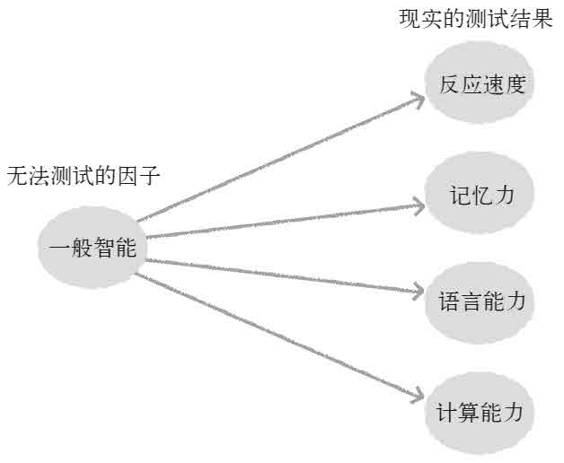
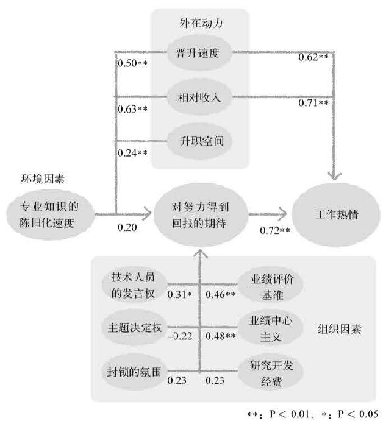
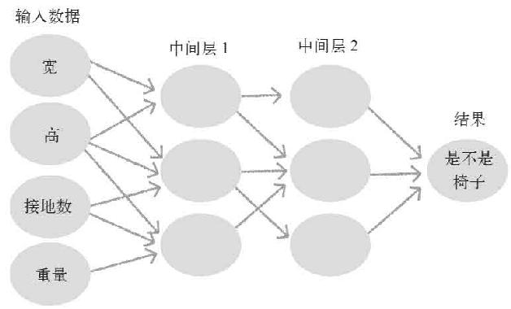
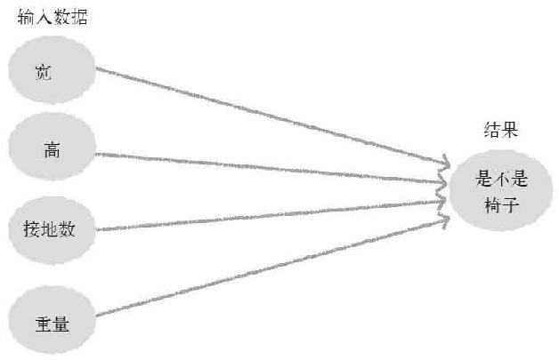
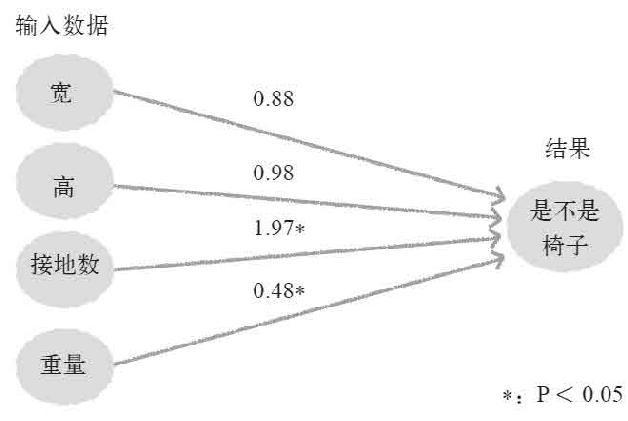
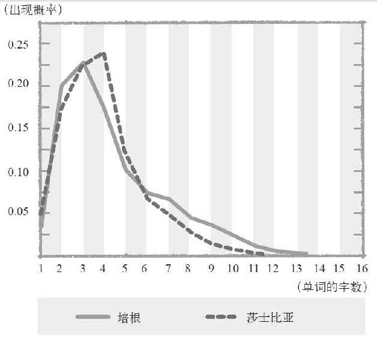
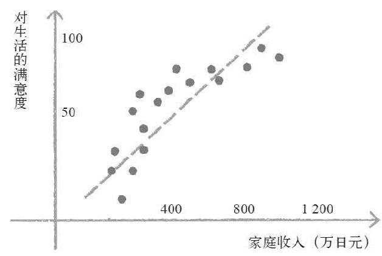
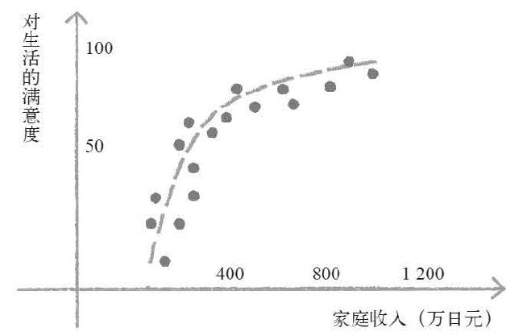

> 第六章  
>  应对一切问题的统计学思考方法

> 24 统计学家们的残酷战争

统计学思考方法的6大特征

如果你已经掌握了p值、置信区间、回归模型等之前所讲的内容，那么你就已经得到了统计学这个强大学问的“主干”。

不过，统计学的有趣之处不只在于“主干”。为了使统计学在更加广阔的学问领域之中都能够得到应用而展开的那些“枝杈”，同样十分重要，如果能够同时掌握这些“细节”方面的知识，那么可以说你对现代统计学已经有了非常深刻的理解。就算面对拥有不同知识背景的统计学家之间的辩论，你也可以从整体上对辩论的内容进行把握。

虽然统计学是基于数学理论建立起来的，但是要想将这些数理应用到现实之中，就必须通过假设和与假设相关的现实判断。而所谓的现实判断，则根据应用领域的不同分别被哲学、目的、传统以及数据的性质所影响。比如，我们在使用回归模型的时候，假设多个解释变量间没有相乘效果，这就是数学上的事实。另外，如何应用这一假设，则不属于数学理论，而是要看领域的不同具体问题进行具体分析。

实际上，将统计学应用在自己的研究和业务领域的专家，或者说专门研究统计学方法的统计学家们，很少有人意识到这种不同领域间思考方法的区别。虽然统计学本身可以应用在诸多领域中，但由于现代知识的专业性和细分化逐渐加强，某个领域的专家往往很难理解其他领域的看法。

这一章中所要讲述的内容，就是为了让大家在今后应用统计学的时候，不会陷入这种混乱之中。只要你掌握具有以下6个特征的统计学思考方法，那么今后不管面对什么样的统计学理论，你都能够理解“应该站在哪种立场进行分析”。

> 把握实际动态的社会调查法。

> 为了找出原因的流行病学——生物统计学。

> 检测抽象概念的心理统计学。

> 进行机械化分类的数据挖掘。

> 对自然语言进行处理的文本挖掘。

> 关心演绎的计量经济学。

首先，让我们从之前提到过很多次的前两个思考方式入手吧。

追求正确性的社会调查专家们

一般情况下，人们所说的“作统计”指的就是单纯的收集数据。在费希尔和戈赛特的时代之前，大约17~18世纪的欧洲诸国就已经对国家的人口和死亡人数进行过相关统计，甚至还诞生了计算平均值与百分率的统计方法。以国情调查和选举前的舆论调查为代表的社会调查，就是诞生于这一时期的传统统计学“最古老的使用方法”。

在上文中我曾经说过“单纯记录平均值和百分率的统计没有任何意义”，但是进行社会调查的统计学家们对“平均值和百分率”的执着，却远远超出了“单纯记录”的级别。这些统计学家将在新政中得到实际应用的抽样调查进一步发展，不断地研究应该怎样做才能尽可能准确且高效地计算估计值。

一般来说，只要从分析对象（比如说全体国民）之中完全随机抽样，获得足够数量的样本数据即可。但是，在现实世界中即便是法律要求必须回答的调查，也存在配合的国民与不配合的国民之间的回答率的不同（日本有被称为统计法的法律，对于国家的基础统计调查不予配合，或者做出虚假回答的话，将被处以50万日元以下的罚款）。

比如说已婚的老人，调查员可以直接登门拜访请他尽快做出回答；生活不规律且单独生活的年轻人，就算调查员登门也很难见到人。结果就是单独生活的年轻人的回答率大大低于已婚老人的回答率，那么最后得到的数据就会高出实际要求的平均年龄和结婚率。

无法对应该获取的数据进行测定的情况被称为“数据缺失”，社会调查的专家们想尽一切办法训练调查员，其目的就是为了减少“数据缺失”的情况。他们或者通过改良调查方法，或者对估计值的偏差进行修正，进行了各种各样的尝试。

统计学家们关心的是数值的准确性，因为只有准确的数据才能够作为讨论的基础。如果政府想解决失业问题，就必须掌握失业者的准确人数，要想对抗癌症，也必须知道癌症患者的准确数量。如果没有这些数据作为支撑，政府就不知道究竟需要多少预算，也无法有针对性地寻找对策。

在商业领域的市场调查中，经常会聘请社会调查专家进行协助。当然，那种只会用随意制作的调查表和Excel进行统计的所谓市场调查专家，完全不在我们的讨论范围之内。

希望进行调查的公司会首先计算出预计的误差，然后委托调查公司提交一个调查方法，使其能够在预算范围内得到最准确的必要信息。最后，他们就会得出“什么样的顾客有多少人”或者“这些顾客在我的商场平均消费额是多少”之类的估计值和误差范围。根据统计的结果来指定经营战略，相信是很多热衷于市场调查的企业经常采用的方法。

追求“适当判断”的流行病学家和生物统计学家

虽然我们无法否定这种调查的重要性，但是从另一个角度来说，即使我们已经清楚地掌握了顾客人数和市场规模，最后还是要靠企业领导们的感觉来决定“最后采取何种经营战略”就太浪费了。

在这种时候最好能够进行随机对照试验，或者利用回归模型和倾向指数也能够推测出因果关系。只要搞清楚改变什么因素，能够对追求的结果（在商业领域一般都是和利益有直接联系的指标）产生影响，那么能够控制这个因素的战略就是最正确的。

费希尔在英国的洛桑实验室发明了随机对照试验，戈赛特受进化论的影响发明了回归模型。虽然他们的专业领域被定义为生物统计学，但实际上他们的发明并不只局限于生物领域，而几乎能够在所有领域中作为统计学方法的基础。顺便说一下，因为我的统计学专业是流行病学和生物统计学，所以本书中所讲述的内容也稍微偏重于这两个方面。

之前我曾经说过，实际上几乎所有的科学家都引用过费希尔的《试验设计》这本书。书中提到的随机对照试验，不仅可以应用在包括农业在内的生物学之中，其他像工学与化学等以物体为对象的领域，甚至心理学、教育学以及最近的政策科学和经营学等以人类为对象的领域，它都能够在其中发挥巨大作用。而且，以除了人类之外的生物和物体为对象，更加容易进行随机对照试验。

在由于伦理或感情无法进行随机化的以人类为对象的领域，可以使用流行病学的方法论。这种方法同样可以应用在教育、政策以及经营等许多领域。

这两者共同的思考方法，都是为了寻找对最终结果产生影响最大的“原因”。反过来说，只要找到了基于p值的“原因”，甚至连估计值的“国民适应性”这一社会调查领域的统计学家们最重视的要素，都显得不那么重要了。

比如说，吸烟是否影响身体健康，流行病学家和生物统计学家最关心的是准确无误的结论，至于吸烟会缩短寿命8年或10年，对他们来说并不是那么重要。另外，如果老人吸烟会缩短寿命10年，年轻人吸烟会缩短寿命15年的话，还要考虑交互作用的问题，因为如果“只限定在年轻人的范围内”就有可能出现“吸烟延长寿命”这一完全颠覆结论的交互作用结果。但不管怎样，既然吸烟对健康有非常不好的影响，那么首先降低吸烟率才是正确的选择。只要能够做出这样的判断，在某种程度上也算是令人满意的结果了。

因此，生物统计学家和流行病学家，并不十分拘泥于“全国的随机样本”。如果出现极端的数据偏差，比如想要对全体国民的因果关系进行讨论时，结果却只收集到了医生的数据，或者只收集到了高中生的数据，即便在这种情况下，也只是加上“此结果是以偏向于医生群体的数据计算得来”这样的注释后正常发表。

另外，在一篇内容严谨的论文中一定还会有类似这样的说明，“是否适用于其他群体尚不明确，应用时需要注意”，或者“今后还将继续研究其他群体是否具有相同的关联性”。

在流行病学和生物统计学中，要想从全体数据中获得充分的随机样本，必须花费大量的成本和时间。由于这一现实条件的制约，所以才诞生了上述思考方法。

假设现在日本出现了死亡率为50%的可怕传染病，并且已经造成3万人死亡。此时，必须立即通过流行病学的方法找出死亡的原因。但是，感染人数和死亡人数尚且不足日本人口总数的0.1%。也就是说，从日本全体国民中随机选出1万人，只能从中找出几个感染者，而且其中的一半人还因为死亡而无法进行调查。这样的话完全无法进行任何分析。

那么，我们可以只以感染者作为对象进行抽样调查。可是，这需要我们拥有全部感染者的名单，否则也无法进行抽样调查。在这种情况下最好的选择是，首先对眼前的感染者数据进行全面分析，也就是前面提到过的思考方法。

统计学家们永无休止的争论

所以，流行病学家和生物统计学家们，相比“通过抽样调查得到的正确估计值”更加重视“通过随机化做出的适当判断”。而那些接受以社会调查为中心的统计学教育的人（或者说对统计学一知半解的人），常常会提出“没有随机抽样调查的结果都不准确”，结果双方就会陷入永无休止的争论中。场面大概会像下面这样。

> “没有对全体国民进行随机抽样调查，所以你的结论不准确。”

> “虽然分析的只是年轻人的数据，但是只要年龄与吸烟的危害之间没有太强的交互作用，吸烟对身体有害的这个结论是不会改变的。”

> “可是，交互作用究竟是否存在，我们并不能够确定啊。”

> “那么，你说老人吸烟对身体有益的说法有什么证据吗？”

> “没有，可这并不能证明吸烟一定对身体有害。”

> “所以，我说了这次的研究主要偏向年轻人群体的数据，今后还将对其他年龄段进行研究。”

> “那你为什么凭借这个片面的结果就确定了吸烟有害呢？”

> “所以，我不是说过，只要年龄与吸烟的危害之间没有太强的交互作用，吸烟对身体有害的这个结论就不会改变的吗？”

虽然针对社会调查领域的“数据缺失”，可以使用流行病学的方法来进行补充，但这种补充方法对于社会调查领域的统计学家来说，只不过是“竭尽全力进行随机抽样调查后的最终手段”，因为他们对没有进行过随机抽样调查的数据本身毫无好感。

所以，当这两者进行讨论的时候，流行病学家和生物统计学家心中常常会想“这群家伙不管推测出多么正确的数据，只要没有进行关联性分析就没有任何意义，真是太可怜了”。而社会调查领域的专家则很生气地认为，“这群家伙明明只有一些片面的数据，还摆出一副了不起的样子”。

要说他们两者之间究竟谁是正确的，实际上只是研究学问的角度不同而已，谁都没有对错。而对我们来说，最重要的还是根据不同状况选择最适合的思考方法。

> 25 发明“IQ”的心理统计学

IQ（智商）测试这一衡量智商的标准就连小学生阅读的漫画中也能看到，但实际上，很多人却并不知道这一指标的具体含义。

当我们在虚拟世界中描述一个“IQ很高的角色”时，经常会说他“脑子反应很快”，或者“脑子很聪明但性格有缺陷”，大概这就是现实中人们对IQ的印象吧。爱因斯坦的IQ数值是人们津津乐道的话题，也有人认为人类的价值可以用IQ来进行衡量，或者IQ测试是导致歧视的根源等。而在此之前认为强调EQ（情商）比IQ更重要的书籍十分畅销。

但是，与身高、体重和血压这样能够进行物理检测的指标不同，智商是看不见也摸不着的东西。究竟什么是IQ，又应该怎样对其进行测定？现在，我们使用的IQ测试为什么能够对IQ进行检测？如果不了解这些问题，单纯为自己的高IQ而沾沾自喜，或者对IQ这个指标进行攻击，都是非常愚蠢和滑稽的行为。

要想理解IQ究竟是什么，我们首先需要了解心理学家在最近100年来所积累下来的统计学方法。这也是我们接下来要讲的主题。

“一般智能”的发明

要想理解革命性发明的了不起之处，最好的办法就是设身处地地亲自体验一下发明的过程。假如你是一家公司的人事部经理，负责毕业生的录用工作，那么在不利用现有智商测试的情况下，你应该用什么方法来检验前来应聘的毕业生的智商呢？

或许有的人会测试对简单指令的反应速度，或许有的人会测试对无序排列的文字在一定时间内的记忆个数。甚至还有人会单纯地进行数学和语文的突击测试。而实际上，很少有企业会将上述这些没有任何统计学技巧的测试作为录用标准。

实际上早在19世纪，就已经有人对此进行了所有的尝试，创造了现在智能研究基础的心理统计学家斯丕曼在1904年发表的论文中将其作为“马马虎虎的先行研究”公之于众。

之所以说是“马马虎虎”，是因为最后他只是提出了几种可能对智能进行测试的方法。而对于“究竟什么是智能”这个问题，只能凭借研究者的直觉来进行回答。

斯丕曼从先行研究提示的测试方法中选出了几种，对研究参加者进行了测试。并且对各个“表示智能的指标”之间的相关性进行了分析。

所谓相关性，是指“一方面的值较大时，另一方面的值也较大/一方面的值较小时，另一方面的值也较小”这一关联性的强弱程度。高尔顿在进行回归分析的时候，发现了“回归平均值的直线很清晰的状态”和“回归平均值的直线非常不清晰的状态”。他将这种区别称为相关，他的学生皮尔森提出了相关系数这一指标的计算方法。在绝对的直线上“一方面的值较大时，另一方面的值也较大”的情况为1，相反的在绝对的直线上“一方面的值较大时，另一方面的值较小”的情况为–1，基本看不见关联性的情况为0。

另外，相关性只表示“一方面的值较大时，另一方面的值也较大”这种倾向，与“因为一方面的值较大所以另一方面的值也较大”的因果关系完全是不同的概念，请诸位读者注意。

根据研究的结果，斯丕曼发现不同智能的表现有某种程度的相关性。

然后只要对这些指标加入一定的关联性，就可以得出一个与所有指标都相关的合成变量。

如果能够将所有表示其他智能的相关指标都综合在一起得出一个合成变量的话，就可以表示潜在的智能指数。而且，只要掌握了这个变量，就可以大致预测出所有智能相关测试的成绩。这样的话，与分别进行各个项目的测试相比，掌握这个潜在的智能指标更加简便。斯丕曼将这个指标称为“一般智能”（图6–1）。

图6–1 从“能够测试的东西”之中得出合成变量

将智能分为7类的多因子智能说

斯丕曼的分析方法，现在被称为因子分析法。就是从各自相关的多个数值中，计算出与所有数值都关系紧密的合成变量。这个合成变量被称为因子，因子分析法也由此得名。

因子是用来表示“智能”等抽象概念的数值，因子本身无法进行直接测试。但是，现实存在许多与因子具有紧密联系的“能够测试的东西”。比如说，智能，反应速度和记忆力以及计算能力都能够进行测试，而这些能力和我们所拥有的抽象的智能因子具有非常紧密的联系。

通过“能够测试的东西”计算出“拥有紧密联系的合成变量”，就可以推测出因子的数值。这就是斯丕曼与受他影响的心理学家们所考虑的方法。

此外，因子也不一定就像斯丕曼的一般智能是“与所有测试项目都有联系的唯一因子”，还有可能会得出多个因子。

事实上，受斯丕曼研究影响的心理学家们实施了各种各样的组合试验进行因子分析，除了一般智能之外，他们有时还得出了多个因子。

在这些研究中最著名的一个，就是赛斯顿于1938年发表的多因子智能说。赛斯顿对许多与智能相关的测验结果进行了因子分析，最终整理出7种表示智能的因子。

> 感知空间与立体认识的空间智能。

> 与计算能力相关的数学智能。

> 善于理解语言和文章内容的语言智能。

> 与判断和反应速度相关的感觉智能。

> 能够进行理论判断的推理智能。

> 快速灵活使用语言的流畅性智能。

> 擅长记忆的记忆智能。

也就是说，比如空间智能，即便在算数的图形问题和拼图，以及计算立方体个数等测试中与几乎所有的项目都有紧密联系，但是在文章问题和与记忆相关的问题中，却属于几乎没有任何联系的因子。

在近年来的智能研究中，也经常出现关于一般智能还是多因子智能的讨论，在对诸多的智能检测方法进行分析后，发现“与不分领域的检查项目全体都有联系的因子”，也就是一般智能大概对全部得分有30%~60%的影响。但是，关于一般智能究竟是什么这一问题，目前还没有明确的答案。

心理统计学家的思考方法

除了智能之外，心理统计学家还希望对“心灵”和“精神”等看不见、摸不着的抽象事物进行测试。通过对上述对象进行测试，他们就可以对行动和成果与精神疾病的关联性进行分析，否则的话，他们就连“工作的意义比金钱更加能够影响员工的工作热情”这样单纯的假设都无法进行实际证明。

因此，他们必须对自己希望进行测试的“抽象的概念”作一个定义。比如，将“工作的意义”定义为“工作对社会的贡献与得到正面社会评价的切身感觉”，这样一来就可以找到许多与之相关联的问题。

心理统计学家们的问卷并不是他们一拍脑袋想出来的。他们会事先找到“认为自己的工作有意义的人”和“认为自己的工作没有意义的人”进行调查，确认什么样的回答与“意义”有关联，调查别人针对于此提出过什么样的理论，以及国内外是否进行过同类的心理调查，在上述一切都准备完毕之后，他们才会根据得到的数据制作问卷。

制作好的问卷一般在进行正式的测试前，还需要进行检验。方法是找几十个人来做这张问卷。如果这里面有几乎所有人都回答“是”，或者几乎所有人都没有回答的问题，那么这些没有什么作用的问题就会被删除。

接下来，就是与因子分析的结果进行对比，根据事先预测的因子结构，删除与多个因子相关的项目以及与任何因子都毫无关联的项目。然后过一段时间等回答者忘记相关内容后再进行一次同样的测试，删除那些每次回答时结果不同的问题。

经过这些过程最终制作出来的问卷，可以说是在科学测试中最重要的标尺。基于因子结构计算出来的最后得分，应该就是对希望测试的抽象概念最直观的表示。接下来，就可以用这个分数进行回归分析或者其他分析，甚至可以和你感兴趣的其他变量一起进行分析。

除了回归分析之外，心理统计学家们还有一个比较常用的分析方法被称为通径分析，就是将包含心理因子的变量间的关联性通过椭圆（或者长方形也可以）和箭头来进行表示。

在开本浩矢所著的《研究开发的组织行动》（中央经济社）一书中对此进行了实际的研究论证，让我们来看一看其研究的结果。开本浩矢等人对企业研究对象的工作热情轨迹进行了分析，结果显示业绩较高的研究对象们的工作热情轨迹如图6–2所示。

摘自：开本浩失，《研究开发的组织行动》，（中央经济社）。

图6–2高业绩群体的研究对象们的工作热情轨迹

其中箭头上的–1~+1的数字就是相关系数，可以看作与相关性一致的指标。另外带星号（*）的数值，表示这个数值具有的关联性的p值小于0.05。

开本浩矢等人针对“工作意义”这个心理学的概念，进行了关于“内在动力”的讨论。但是，像“对社会的贡献”和“学习与成长的机会”等与“工作意义”相关的因子，对高业绩的研究对象们却几乎没有影响（不过，对低业绩的研究对象们还是有影响的）。

似乎对高业绩的研究对象们来说，已经从上述两个方面感受到了足够的工作意义，因此要想继续提高他们的工作热情，最好的办法是给予薪水和晋升空间等物质方面的激励。

如此耗费心血制作的问卷，如果被其他的统计学家们当成毫无技术含量的“调查问卷”，那么心理统计学家们一定会感到十分伤心。

调查问卷是将想要得到答案的问题直接写在问卷上，其中没有任何抽象的概念和科学的测试方法。所以对心理统计学家们来说，绝对不希望将自己的心血和那种东西相提并论。

曾经我看过一家企业为了录用毕业生而自己设计的“测试问卷”，那就是一个完完全全的“调查问卷”。虽然我也能理解他们希望录用抗压能力强且能够坚持不懈的人，可是如果直接问对方有没有耐心，想必没有人会诚实地说出“我没有耐心，不能够坚持下去”这样的话。实际上，这样的“测试问卷”对于录用员工几乎帮不上任何忙。作为一名统计学家，我非常希望能够对入职后的员工业绩与这个“测试问卷”的成绩进行相关分析。这家企业最好能够录用一个学过心理统计学的毕业生，哪怕这个学生抗压能力不强且没有耐心，也可以让他去人事部工作来弥补“测试问卷”的不足。

一般来说，搞市场调查、社会调查和流行病学研究的统计学家们都喜欢对自己想要得到答案的问题进行直接提问。他们乐观地认为直接得到的答案能够客观地反映事实，即便并非如此也可以将其看作单纯的误差。

社会调查和流行病学研究的问卷上提出“你的亲人或朋友中有人吸烟吗？”这样的问题时，就是想知道“被动吸烟的人数占多少比例”，或者“被动吸烟对健康是否有影响”。但是，对于心理统计学家们来说，问题却并不是这么简单。

对问题的回答有可能被回答者的主观判断所左右，心理统计学家们在这100年来一直对人类的主观情绪进行着反复讨论。

比如说，“在同样都有朋友吸烟的情况下，有的人会意识不到吸烟者的存在”，还有的人可能对吸烟的行为感到非常厌恶，所以并不将吸烟者看作自己的“亲友”，所以对于心理统计学家们来说，他们会准备很多同种类的问题进行因子分析，然后找出其中的答案究竟对何种因子具有意义。

在市场调查方面，也有被称为“消费者行为”的领域，这一领域的学者们往往具有心理统计学的知识基础，而且与社会调查学派的市场调查之间还有许多共同的调查方法。

但是另一方面，在因子分析中假设有多个因子的情况，或者是否允许因子相互之间有关联性等，诸多细节都有可能导致结果产生巨大的区别。为了得到自己考虑的因子结构，而不断重复进行试验的心理统计学家的做法，在流行病学家和生物统计学家们看来，完全是一种自欺欺人的行为。

就连通径分析也无法判断模型是否合适。假设在7个因子之间进行通径分析，从中取出两个进行组合的话有21（=7×6÷2）个通径，如果每个都有“A→B”、“A←B”、“A↔B”、“A与B之间没有箭头”等4个种类的关系性，那就要对84个通径的模型进行是否准确的验证。但是，心理统计学家却几乎从来不会进行全种类的测试。对他们来说就算数据合适，但是无法在心理学上解释的模型也是毫无意义的。

基于上述原因，对于问卷调查的项目和分析方法，心理统计学家与其他统计学家之间的意见往往无法达成一致。

没有针对性的智能测试毫无意义

不过，在日本广泛应用的智能测试，却并没有经过上述介绍过的那些谨慎的心理统计学的分析。

比如，在日本比较流行的智能测试方法之一“田中比奈式测验”，原本是阿尔弗莱德·比奈在1905年为了研究与同年龄孩子共同学习时跟不上进度的孩子，而对自己女儿的成长过程进行观察后所得出的测试方法。所以，就算在这个测验中得到较高的分数，也不能说明就是“天才儿童”。

不管是心理测验还是物理测验，只要原本的定义和测验标准不相符的话都是毫无意义的。就好像如果要找一个“身体好的孩子”，需要根据是究竟准备打篮球还是准备练相扑来选择身材高大的还是身材魁梧的区别一样。

由此可见，没有针对性的智能测试毫无意义，之所以会出现智能测试被滥用的问题，都是因为大家对智能测试不甚了解或者对其进行了过分解读。只要了解前提和极限，并且能够结合自己的目的进行应用，那么不管是智能测验还是其他的任何测验，都可以找到你真正想要知道的东西。这就是心理统计学赋予你的力量。

> 26 诞生于市场调查现场的数据挖掘

在前文中我曾经提到过，统计学由于计算机的出现，其影响力得到了爆炸性的扩大，由此诞生了被称为数据挖掘的研究领域。

正如对计算机的利用取代了统计学家的手工计算一样，数据挖掘的技术也是伴随着计算机的进步所诞生的。或许就是因为这个缘故，在计算机领域对“数据挖掘”的认知率要远远高于“统计学”。经常会有人向我咨询“我已经导入了最新分析用的数据库，为什么还是无法进行数据挖掘”。不过，没有人向我咨询“我为什么无法进行统计分析”。

但实际上，当我仔细询问究竟为了什么课题或者出于什么目的进行分析的时候，却发现与“数据挖掘”相比，真正应该使用的却是统计学方法。

确实，与“回归分析”这样写在统计学教科书上的汉字相比，“Neural Network”这样的英文单词确实显得更加时髦。而且像“根据在人工智能领域的研究，对人类的神经元进行模拟实验”之类的说明，听起来好像是非常了不起的技术。

不过，如果能够掌握数据挖掘和统计学的思考方法之间的区别和共同点，就可以找到最适合自己的方法。接下来，就让我们对此进行详细的说明。

数据挖掘的历史

要说数据挖掘的起源，谁也没有一个准确的答案。“数据挖掘”这个单词本身，在1995年知识发现（KDD，Knowledge Discovery in Database）国际会议上被确定为“在众多数据中找出有用且未知数据的过程”之前，人们对它的解释一直是众说纷纭。

因此，目前还没有人能够像费希尔被称为“生物统计学之父”那样被人们称为“数据挖掘之父”。

之所以会出现这种情况，是因为数据挖掘并不是由学者研究出来的方法，而是在市场调查和数据处理的“现场”所诞生的方法。曾经进行数据挖掘的人甚至对统计学一无所知。

但是从统计学家在纸上计算公式，对自己从学生们那里收集到的调查问卷结果和实验动物的检查值进行手动计算的时代开始，这些对统计学一无所知的人就已经拥有大量实际存在的数据，并且需要从中找出有用的信息了。1970年代，条码格式才开始逐渐规范，销售点（POS机）也在超市中得到普及。数据库领域的王者甲骨文公司也是在20世纪70年代末期成立的。

但是在那个年代，就算身为统计学家，也不见得就接触过计算机。根据比我年长20~30岁的教师亲口所说，在他们的学生时代“只要写作一篇相当简单的统计分析论文，就可以毕业”。

“尿片与啤酒”的购买分析

在数据挖掘的黎明期，经常接触数据的计算机技术人员和身处一线的市场调查员们发明了各种各样的方法。

其中最著名的当属IBM公司的拉凯什·阿格拉瓦在1993年为英国玛莎百货所作的购物车分析。关心数据挖掘的人，应该都听说过“尿片与啤酒”的故事吧？

表6–1 尿片与啤酒的购买分析①

| | | | |
| --- | --- | --- | --- |
| | 购买啤酒 | 没购买啤酒 | 共计 |
| 购买尿片 | 20 | 30 | 50 |
| 没购买尿片 | 280 | 670 | 950 |
| 共计 | 300 | 700 | 1 000 |

比如，我们对1 000位顾客的“购物车”，也就是超市的购物小票进行统计，分析“是否购买啤酒”和“是否购买尿片”的数据，得到的结果如表6–1所示。其中同时购买尿片和啤酒的顾客有20人，只买啤酒的顾客有280人，只买尿片的顾客有30人，两者都没买的顾客有670人。

这个数据能够说明什么呢？阿格拉瓦认为最值得关注的地方在于“购买的尿片的人中有40%（50人中有20人）的人都购买了啤酒”。与其他商品进行比较之后就会发现，“买尿片的人”最有可能同时购买的商品就是啤酒。所以，我们可以得出一个推论，即向买尿片的人推销啤酒应该可以提高啤酒的销量。在购物车分析中，像这样“购买某种商品的人同时购买其他商品的概率”被称为信赖度。

不过，现在就给出上述结论为时尚早。本来购买啤酒的人的数量就远远多于购买尿片的人。人类使用尿片的时间最多也就2~3年，而成年男性绝大多数都会喝啤酒。假设本来应该有1/2以上的购物车中装有啤酒，但是因为前来购买尿片的年轻父亲为了孩子而控制饮酒，导致啤酒的购买率停留在40%的话，那么向这些顾客推荐啤酒就是失去意义了。

所以，在购物车分析中还需要一个被称为改善度的指标。也就是说，在所有的顾客中啤酒的购买率（1 000人中有300人购买，购买率为30%）与购买尿片的顾客中啤酒的购买率（50人中有20人购买，购买率为40%）相比，究竟是何种关系，这个对比的数值就是改善度。上述例子中尿片对啤酒的购买率改善度就是1.33（=40÷30）。从购物车分析的思考方法来看，如果改善度在1以上，就可以认为是具有改善效果的。

但即便如此，这个结果仍然是不准确的，如表6–2所示。

表6–2 尿片与啤酒的购买分析②

| | | | |
| --- | --- | --- | --- |
| | 购买啤酒 | 没购买啤酒 | 共计 |
| 购买尿片 | 2 | 3 | 5 |
| 没购买尿片 | 298 | 697 | 995 |
| 共计 | 300 | 700 | 1 000 |

在这种情况下，虽然购买尿片的顾客中有40%（5人中有2人）的人都购买了啤酒，信赖度仍然为0.40。所有顾客中啤酒的购买率仍然保持不变，所以改善度同样为1.33。

但是，如果同时购买尿片和啤酒的这两个人中有一个人是偶尔心血来潮进行购买的话，那么信赖度就会瞬间下降到0.20，改善度也同样下降为0.67，就会出现相反的结果。而且，如果购买尿片的人数本来就很少的话，就算他们“真的会同时购买啤酒”，对增加啤酒的销量也起不到什么作用。

所以，在购物车分析中需要注意的是，“不必考虑那些数量极少的消费组合”以及“同时购买尿片和啤酒的顾客”在全体顾客中占多少比率。这个值被称为支持度。表6–1中的支持度为0.02（1 000人中有20人），而表6–2中的支持度为0.002（1 000人中有2人）。

比购物车分析更加方便的卡方检验

通过上述那样简单的计算就可以找出具有关联性的商品，这是购物车分析的优点。但是，学过统计学的人很快就会发现“本来就有更加简单的方法”。谷歌的创始人之一谢尔盖·布林在学生时代特意针对此事发表过一篇论文，提出“与购物车分析相比，统计学的相关分析更加方便”。

在对这样的统计表进行分析时，统计学最常用的是卡方检验计算的卡方值。在广义线性模型中，我已经对卡方检验进行过说明，所以大家应该对这个概念并不陌生。卡方检验之中已经包含了费希尔所说过的“估计值的误差”，所以不必考虑支持度之类的指标，卡方值越大就能够证明改善度越大。另外，在商品是否有销售的二值变量间，选择卡方值大的组合与选择相关系数绝对值大的组合，其意义也是相同的。

在进行购物车分析时，必须在考虑改善度与支持度的前提下进行各种各样的计算和检验，而使用卡方值的话则不会被误差所欺骗，能够自动找出关联性较强的商品组合。因此，在亚马逊的商品推荐中，就常常进行这样的相关分析。

诞生于人工智能领域的高级数据挖掘法

当然，除了购物车分析那样的简单计算方法之外，数据挖掘领域也有具有高级运算逻辑的方法，比如神经元网络、支持向量机，以及聚集性分析，想必大家都或多或少地听过这些名字吧。

这些方法绝大多数都被应用于人工智能领域。人工智能是计算机科学中一直备受瞩目的领域，从事计算机相关工作的技术人员或许从学生时代开始就经常接触到上述那些方法了。

在人工智能领域中，根据思考方法的不同分为几大类，而数据挖掘最常用的方法则是从归属于人类认知功能的分类之中诞生出来的。

比如，我们人类面对拥有一定高度的家具时，能够非常清楚地分辨出哪些形状的是“椅子”，而计算机就无法分辨什么样的家具属于“椅子”。这样的认知就属于“椅子”和“椅子之外其他家具”的分类。

图6–3 形状各异的椅子

对人工智能来说，“分类”大致上有两种方法：一种是“有教师的分类”，另一种是“无教师的分类”。

如果将家具的高度、重量以及有几个接地点等数据输入进去，那么接下来需要做的就是“将相似性较高的分为同一组”。如果利用椅子之间数据的相似性要高于椅子与衣柜之间数据相似性的特点对许许多多的家具进行分类的话，其中一定会出现“椅子或者数据上类似椅子的家具”这一分类。这种方法属于无教师的分类，其中最具代表性的就是聚集性分析。

实际应用中，聚集性分析最常出现的领域是市场调查中的市场分类。所谓市场分类，是指将市场或者顾客分为相似性较高的几组。没有进行市场分类的市场调查就像是没有准星的大炮，只能盲目地生产商品，毫无针对性地进行宣传和销售。但是，顾客的价值观与接触的媒体各不相同，毫无章法地胡乱“开炮”只会浪费广告费与销售经费。

如果你能够将公司的顾客群体限定在“有钱的专职主妇”和“高端的职场女性”这两个分类之中，那么就可以有针对性地生产商品和进行广告宣传。只要对顾客数据进行聚集性分析，就能够实现上述那样完美的分类。

但是，聚集性分析“只能够进行分析”，至于分类后的结果各自属于什么类别，还需要对其进行人工识别和判断。聚集性分析是某种市场调查员们最常用的方法，在这些人中甚至还有大家耳熟能详的名人。

不过，要是想从家具的数据中找出“椅子”，与其单纯地依靠类似性进行分类，不如直接告诉对方“这是椅子”。这样的话，可以得到更加准确的数字。这种直接告诉对方“这是椅子”的方法，就是“有教师的分类”。

为什么数据采集专家认为回归模型是“老古董”？

如果在统计学中想要进行“有教师的分类”，就要对“椅子为1”、“其他为0”这个二值的结果变量进行逻辑回归分析，但是有些高级的数据挖掘专家却认为这种方法过于陈旧，属于“老古董”。

他们之所以这么说，是因为回归模型只能进行“解释变量独立对结果变量产生影响（没有相乘效果）”和“解释变量与结果变量的关系性呈直线”的分析。

将椅子的重量作为解释变量，对椅子作为结果变量进行分析的时候，1千克的椅子和2千克的椅子之差与10千克的椅子和11千克的椅子之差是“重量每增加1千克，属于椅子的概率同比下降”的直线关系。相反，如果1千克增加到2千克的情况和10千克增加到11千克的情况对结果变量的影响不同的话，那么就会出现“曲线关系”。

当然在逻辑回归之中，追加相互作用可以对曲线的关系进行假设分析。但是，在数据挖掘专家们看来，统计学家们“必须要经过不断的错误尝试才行”。

如果使用神经元网络和支持向量机的方法，就可以对包括曲线关系和交互作用在内的情况，都进行最具识别力的分类。

比如图6–4，神经元网络会在输入数据中产生出“中间层”的值。中间层的数量和中间层包含的变量的数量可以任意设定，不过一般都是通过输入数据中的有用项目，按照实际情况自动计算出中间层的数量。其中的椭圆和箭头表示的是神经细胞与神经元之间的联系。

图6–4 神经元网络分析

而逻辑回归（没有交互作用）则是单纯地通过输入的数据来对结果进行直接预测（图6–5），所以数据挖掘专家们才会认为回归分析是过于陈旧的“老古董”。

图6–5 逻辑回归分析

如果使用支持向量机的话，甚至可以用曲线的方法进行分类。

图6–6是假设只能通过“高度”与“重量”这两个数据对椅子和桌子进行区分的情况，椅子由于靠背的有无而被分为两种“高度”。因此，桌子比没有靠背的椅子高，却比有靠背的椅子低。

在这种情况下使用逻辑回归进行分类的话，根据虚线所示的两边进行究竟是椅子还是桌子的判断，结果发现两边各出现一个分类错误的例子。这时可以使用支持向量机的方法进行如图6–7那样的更加准确的曲线分类。

图6–6 逻辑回归的分类

不管是神经元网络还是支持向量机，只要是针对曲线或者有多个变量存在的复杂关联性数据时，都比回归模型更加准确和高效。

在“预测”中发挥重大作用的数据挖掘

不过，能够享受上述优点的只有以分类和预测为目的的情况。

图6–7 支持向量机的分类

单纯的逻辑回归本来就能够掌握简单的解释变量和结果变量之间的关联性。图6–5的逻辑回归用比值比来表示的话，如图6–8所示。

某个家具是椅子的概率在宽度和高度发生变化时产生改变的概率并不大，但是，接地数每增加一个比值比就会增加2倍，重量每增加1千克比值比则减少1/2。只要掌握了这些条件，谁都能够判断出“重量轻且接地数多的家具”是椅子的概率比较高吧。而宽度和高度之所以无法作为参考条件，大概是因为有很宽的椅子存在以及椅子分为有靠背和无靠背的缘故。

图6–8 通过逻辑回归得到的比值比

与之相比，神经元网络的复杂箭头表示了何种程度的关联性，支持向量机的曲线表示怎样的公式，对人类来说就没有那么一目了然。这样的话，不管预测精度有多高，都会使人感到困惑。

比如，在市场调查中得到了“来店频率高、对品牌拥有好感的顾客消费额也高”这样的结果，那么就可以进行刺激顾客频繁来店的促销活动，或者进行提高品牌好感度的宣传广告。但是，如果你拿出了一个“虽然不知道计算的过程，但能够准确预测顾客消费额的方法”，那么对实际行动没有任何指导意义。

当然，像预测顾客可能购买的商品，或者事先发现可能退会的顾客等，这种以预测本身为目的的情况下，数据挖掘是非常有效的。虽然数据挖掘的方法与逻辑回归的预测精度相比，经常只有百分之几的误差，但如果这百分之几的误差与非常巨大的利益有着紧密联系，还是应该选择数据挖掘的方法。

在并非以预测为目的，而是希望知道预测模型今后应该怎么做，回归模型就会发挥巨大的作用。在理解上述这些不同点的基础上，根据不同的情况选择最合适的方法，是21世纪的统计学家们所必须具备的素质。

> 27 分析语言的文本挖掘：莎士比亚真的存在吗？

莎士比亚就是培根？

文本挖掘，简单地说就是对用自然语言书写的文章进行统计学分析。所谓自然语言，就是像汉语、英语、日语那样自然地随文化演化出来的语言。

古往今来，对文章的分析从来都用不到数学，而是完全依靠对历史资料的研究、哲学的思考以及文学的想象力来支撑的。在我周围也不乏仅仅因为“对数字很头疼”的理由就选择进入文学系的人，就算他们对数字很头疼，也一样可以对莎士比亚的戏曲表现和本·琼森的诗歌进行比较与讨论。

但实际上，早在19世纪人们就已经将数学概念引入文章分析当中。也就是说，通过对文章中出现的单词种类和长度，以及一篇文章中包含的平均单词数等数据进行统计，可以尝试掌握文献的特征。这种研究被称为文献计量学。

初期的文献计量学研究者们对莎士比亚的文本进行了分析。不过，这并不是为了探寻莎士比亚戏曲魅力的秘密，而是为了搞清楚“莎士比亚究竟是不是弗朗西斯·培根”这个在当时被传得沸沸扬扬的话题。

“莎士比亚这个人物真的存在吗”、“是不是谁的笔名”之类的议论，从18世纪开始就沸沸扬扬。因为莎士比亚出身于平民，所以关于他的历史资料少之又少，而他对贵族的文化和教养却描写得十分细致，因此人们怀疑他的作品也许是另外一位受过良好教育的人创作的。

而弗朗西斯·培根是与莎士比亚同时代出生的伟大哲学家，他摒弃了偏见和先入为主的观点，证明了通过观察与试验寻找真理的归纳推理的重要性，毫无疑问是统计学家们最尊敬的人物。他的文学素养和教育程度都很高，完全是一个有能力写出莎士比亚戏曲的人。

但是，对两者的文章进行比较之后，却发现平均单词长度和一篇文章中单词的数目都不一样（图6–9）。虽然戏曲和哲学书籍的文体确实不一样，但是能够得出“没有人们议论的那种特别的相似性”这一结论，也是一个很大的进步了。

图6–9 莎士比亚与培根所用单词的字数区别

文本挖掘的王道：“语素分析”

19世纪，要对整本书的单词数和文字数进行计算，恐怕是一项非常痛苦的工作。但是，在计算机技术十分发达的今天要进行同样的工作却十分轻松。现在有很多开源的语素分析工具，只要使用这些工具，就可以非常简单地对文章中单词的使用频率进行分析，还可以对动词和名词进行统计，从而分辨两篇文章之间使用单词的类似性。

一般情况下，语素分析指的是将文章分解为单词，然后统计各个单词分别出现过多少次的计算过程。在语言学中，“语素”指的是比单词更加短小，“在语言中拥有意义的最小单位”。比如说，“不稳定的”这个形容动词，其中“不”是否定助词，“稳定”和“的”属于形容动词，但是如果真的将这个单词如此细致地分为3个语素，那么反倒会让人完全无法理解其中的意思，所以绝大多数的语素分析工具都只是将文章分解为单词。

为了进行语素分析，收集了单词信息的词典数据是必不可少的。基本的计算逻辑就是从文章内找出与词典数据内的单词相一致的内容，找到后进行标记。

让我们通过谷歌日语输入法的开发者之一工藤拓发明的MeCab语素分析工具，来对“あえて断言しよう。あらゆる学問のなかで統計学が最强の学問であると。（我敢断言。在所有的学问之中统计学是最强的学问）”这句话的语素进行分析，得到的结果如图6–10所示。

图6–10 用MaCab进行语素分析后的结果

| | | | | |
| --- | --- | --- | --- | --- |
| 副词 | “あえて” | | 名词 | “統計” |
| 名词 | “断言” | | 名词 | “学” |
| 动词 | “しよ” | | 助词 | “が” |
| 助动词 | “う” | | 名词 | “最強” |
| 标点符号 | “。” | | 助词 | “の” |
| 连体词 | “あらゆる” | | 名词 | “学問” |
| 名词 | “学問” | | 助动词 | “で” |
| 助词 | “の” | | 助动词 | “ある” |
| 名词 | “なか” | | 助词 | “と” |
| 助词 | “で” | | 标点符号 | “。” |

虽然“统计学”应该被算作一个单词，但总体来说这个结果还算令人满意。将这个分析结果进行词性统计后的结果如图所示。

除了语素分析之外，还有一种不利用词典数据的方法，叫作N元语法模型（N–Gram）。这种方法的原理是选出具有机械性重复的N个字的文字列，然后从中找出想要的单词。比如N等于5的话，那么“统计学是最强的学问”这句话就能够生成“统计学是最”（第1~5个字）、“计学是最强”（第2~6个字）、“学是最强的”（第3~7个字）、“最强的学问”（最后5个字）这些以5个字为单位的Gram。

表6–3 图6–10的词性统计

| | | |
| --- | --- | --- |
| 词性 | 频率 | % |
| 名词 | 7 | 35.0% |
| 助词 | 5 | 25.0% |
| 助动词 | 3 | 15.0% |
| 标点符号 | 2 | 10.0% |
| 动词 | 1 | 5.0% |
| 副词 | 1 | 5.0% |
| 连体词 | 1 | 5.0% |
| 总计 | 20 | 100.0% |

在之前的语素分析当中，因为词典中没有“统计学”这个单词存在，所以才将其分别认识为“统计”和“学”。但是根据语素分析后的结果搜索“统计学”这个单词的时候，会发现“不存在这个单词”。而N–Gram则不会出现这种情况，只要是低于5个字这一Gram限制的“统计学”这个单词确实在文中存在，就一定能够被找出来。谷歌之所以能够搜索出非常冷门的词语，就是因为在其背后有非常庞大的N–Gram数据作为支撑。

在商业中活用文本挖掘的方法

文本挖掘方面的专家大体上可以分为两类。

第一类是接受过文学、历史、社会学等人文学科教育的人，或者接受过拥有相关背景的教员指导的人。他们经常为了自己的研究而使用文本挖掘工具对史（资）料进行调查，用来旁证自己的论点。

第二类是在计算机领域对自然语言处理这一题目感兴趣的人。准确地说，他们应该更接近于数据挖掘专家，为了找出通过机械的计算方法，快速且准确地对语素进行分析和研究。

比如说，他们所关心的研究课题是如何不单纯地依靠词典数据，而是根据前后文的单词来提升推测精度。另外，他们还经常将语素分析的结果应用在数据挖掘的研究之中。

文本挖掘技术在很久以前就已经被应用在商业领域，对客服中心的对话内容进行分析。在客服通话结束后，对客服人员提交的报告书和询问的电子邮件中频繁出现的单词进行分析，就能够找出“被询问最多的是什么问题”。掌握了这个信息之后就可以有针对性地制作说明书或者常见问题解答（FAQ），从而达到减少客服人工费的目的。这种方法最早由IBM使用，后来被许许多多的公司所效仿。

此外，还有对得到的询问邮件自动进行语素分析，将与出现的关键词有关的FAQ发送到客服人员终端上的系统。针对绝大多数的提问，客服人员只需要将推荐的FAQ直接复制、粘贴即可，节省了大量的对答时间。

另外，还有对调查问卷上的自由回答中出现的单词进行统计的应用。

如果顾客数量过于庞大，要想将每个人的意见逐一看完是非常困难的，但是通过语素分析对单词的出现频率进行统计的话，就可以轻松地掌握顾客意见的整体情况。

近年来，文本挖掘已经不只应用在对自己公司的询问邮件和调查问卷内容进行统计，更进一步发展到对通过社会性网络服务（SNS）产生的庞大文本进行统计。包含自己公司名称和商品名称的博客与微博都是非常重要的“顾客之声”，就算无法一一进行了解，通过文本挖掘对其整体情况进行掌握也是非常重要的，或许会由此诞生出令人意想不到的新商品或者促销活动的好点子。

通过活用文本挖掘来获得利益

但是，如果从统计学家的角度来看文本挖掘领域共通的这些课题的话，他们一定会提出这些课题都过于限制在自然语言范围。

通过语素分析，确实可以将文章这种非结构化数据转换为是否出现单词的虚拟变量。由此实现的对文章进行统计学处理也确实是一大进步，但是仅仅将这一进步应用在通过单纯的统计和分类对整体情况进行把握方面，实在是一种浪费。像文章中的何种单词以何种组合出现之类的信息，在绝大多数情况下如果离开了庞大的解释变量，就不是我们所追求的结果。

不过实际上，在日本的商业领域之中，已经出现将文本挖掘与利益连接起来的事例。

比如对营业日志进行文本挖掘，分析成功事例与失败事例之间有怎样的单词频率区别，从而达到增加机会的目的。有人对有价证券报告书中出现的单词进行分析，找出后来破产的企业和成功的企业之间单词的出现频率有怎样的区别。还有人将顾客对店铺的忠诚度和对店铺发表的感想进行了综合分析，找出对店铺忠诚度高的人在感想中都会出现什么样的单词。在上述例子中，都没有仅仅针对文章中出现的单词频率，而是对文章之外还有什么与结果变量之间具有关联性进行了分析，所以才找到了能够产生利益的战略。

虽然文本挖掘背后凝聚了非常高的技术含量，但只要利用工具的话谁都可以轻而易举地做到。而如何通过文本挖掘获得利益，则需要文本挖掘之外的统计能力了。

> 28 “演绎”的计量经济学与“归纳”的统计学

统计学与计量经济学表面上的区别

计量经济学家是对在经济学领域应用统计学的人的一种统称，但计量经济学与统计学之间的界限却有些模糊。

如果是在几十年前，或许还可以清楚地分成“将统计学应用在社会与经济领域就是计量经济学家”、“将统计学应用在农业和医疗领域就是生物统计学家”，但是从生物统计学之中诞生出来的方法现在却被广泛应用于许多领域，就连计量经济学家们也不例外。而且现在人们对于费希尔和皮尔森所发明的种种方法，并不特意将其归类为“生物统计学”。一般情况下说起统计学，如果没有像心理学和社会调查学那么明确地进行区别的话，指的都是由费希尔等生物统计学家在背后支撑着的统计学。

比如将现在是否有工作作为结果变量，将受教育程度和过去的家庭收入、人种、居住地等社会属性作为解释变量进行回归分析，计量经济学家与社会学领域的统计学家都会作这样的统计。但是，计量经济学家属于统计学家中立场比较特殊的一类人。

表面上的区别在于，计量经济学家比统计学家更加重视包含交互作用的解释变量，在其选择上会进行更加慎重的讨论。而且，他们不只考虑解释变量与结果变量间的直线关系，还会考虑两者之间的曲线关系。比如将单纯的家庭收入作为解释变量，对生活的满意度作为结果变量进行回归分析时的回归系数，可以看作“年收入增加100万日元的效果对所有人来说基本相同”（图6–11）。

图6–11直线的关系性

另外，通过这张图表我们还可以看出，“年收入从300万日元增加到400万日元所产生的变化，和从900万日元增加到1 000万日元所产生的变化对生活满意度的影响是不同的”。也就是说，家庭收入与生活满意度之间的关系似乎更符合曲线的变化轨迹（图6–12）。在这种推测中，就需要利用“家庭收入的平方”与“log（家庭收入）”作为回归分析的解释变量。

图6–12 曲线的关系性

另外，许多统计学家对于二值的结果变量习惯使用逻辑回归，而计量经济学家们却习惯使用多元概率比回归。虽然多元概率比回归比逻辑回归在数理表示上更加清晰，但是多元概率比回归推测出来的回归系数并不像逻辑回归推测出的比值比那样以“大约×倍”的形式表示得一目了然，这也是多元概率比回归的缺点。

在前面的文章中，我还介绍过统计学家们在因果推论中会使用倾向指数，而计量经济学家们则习惯使用疗效模型和赫克曼选择模型等方法，这是诺贝尔经济学奖获得者詹姆斯·赫克曼在他1974~1979年的一系列论文中所提出的方法。我还没见过任何一个没有经济学知识背景的统计学家使用过上述两种方法。

统计学与计量经济学本质上的区别

不过，上述那些内容只不过是表面上的区别，最重要的还是作为其背景的哲学。

虽然经济学和统计学乍看上去都是“对社会上存在的数字进行分析的学问”，但在某种意义上两者却拥有完全不同的哲学。计量经济学虽然属于经济学中最贴近统计学思考方法的领域，却仍然和统计学之间有着无法填补的鸿沟。

存在于两者之间的完全相反的哲学，主要围绕着“归纳”和“演绎”为中心组成。

一般情况下，科学的推论形式大体上可以分为归纳与演绎两类。总体上来说，归纳就是将个别事例集中起来推测出统一规则的方法；演绎则是基于某种事实和假设，通过推理导出结论的方法。

费希尔的学生C·R·拉奥就这样说过，“随着统计学的发展，可以将归纳推论中的不确定性量化，从而使归纳的推论更加准确，并为我们的思考方式带来巨大的飞跃性的进步”。所谓数据，实际上就是将个别的事例为了更加容易理解而集中起来的结果，因此统计学的目的就是进行归纳的推论。在这种情况下，推测出来的回归模型之类应该就属于“将事例集中起来推测出来的一般规则”。

另外，演绎的代表则是牛顿的力学理论。牛顿力学有三大定律，可以用来解释小到棒球大到太阳系行星等世界上一切物体的运动规律。

牛顿力学的三大定律如下所示。

> 一切物体在没有受到外力作用的时候，总保持匀速直线运动或静止。

> 物体的加速度与物体所受的合外力成正比，与物体的质量成反比，加速度的方向跟合外力的方向相同。

> 两个物体之间的作用力和反作用力，在同一直线上，大小相等、方向相反。

不过，我们无法判断上述定律本身的真伪，这一点需要大家注意。

比如第一个定律，换句话说可以理解为“力使物体的速度发生变化”。当然，或许有人对“力”这个词有着不同的理解，但是对于“牛顿今后这样定义力这个词”，我们却无法判断其是否正确。

总之，牛顿最初提出的运动定律是“无法提出反驳”这一讨论的前提。即便如此，通过对这个简单的假设所得出的数学公式展开演绎，可以对我们眼见的所有运动状况进行解释和说明。而且以此建立起来的理论，支撑了基于观察和试验的理论实证，确立了进行归纳推论的方向性目标。

从牛顿的简单假设到解释说明世间万物的理论体系这一美妙的过程，随后对物理学之外的其他所有领域的学者们都产生了非常深远的影响。

比如提出共产主义理论体系的卡尔·马克思，他就认为人类社会也和自然一样存在着客观的规律，由此提出了人类历史只用生产力的发展就可以进行解释说明的唯物主义历史观。在费希尔之前有一位叫作阿道夫·凯特莱的统计学家就曾经尝试找出人类的行动规律，他认为人类的行为也和天体运行一样是有规律可循的，并且对人类的相关数据进行收集，开创了被称为社会物理学的学科。另外，高尔顿也将达尔文的进化论进行了数学化的描述，或许他是打算成为生物学领域的牛顿。

追求更好模型的计量经济学家

虽然上述那些人的尝试很多都以失败告终，但牛顿的研究方法在物理学领域之外仍然有少数成功的事例，经济学领域就是其中之一。

经济学家们根据牛顿的假设“一切物体在没有受到外力作用的时候，总保持匀速直线运动或静止”，推测出“所有的经济活动都是以物易物”以及“消费者会选择最大化期待效果的行动”等假设，并且根据这些假设对价格、支出、储蓄等条件之间的关联性通过联立方程式重复进行演绎，尝试对个人与社会的均衡状态进行解释和说明。

或许是出于这个原因，计量经济学家会经常利用回归分析的结果进行推论。对于流行病学家们来说，只要证明吸烟会提高罹患癌症的风险这个结果就可以了，但是计量经济学家们却要针对此进行“如果这个推测是正确的，那么全日本因此出现了多少损失”的演绎。在前文中我曾经提到过吸烟每年会给日本带来7兆亿日元以上的经济损失，这就是计量经济学家推论出来的结果。

比如我们得到了一个通过性别、年龄、是否吸烟等数据推测出癌症发病概率的模型，那么根据现在性别、年龄与吸烟率的数据，就能够演绎出由于现在吸烟导致将来癌症发病的人数。进一步根据癌症患者的医疗费等新数据，就可以演绎出“由于吸烟而产生的额外医疗费”这一经济上的损失。

不过，针对最终的经济损失数据，还必须满足“回归系数在考虑性别与年龄的基础上对其他群体也适用”和“癌症患者的医疗费今后不发生变化”这样的假设条件。

流行病学家和生物统计学家在利用归纳的方法导出一般规律的时候，会认为“因为没有进行随机对照试验，所以肯定会包含误差，换作其他群体的话或许无法与这个回归系数保持一致”，对涉及普遍性的部分保持比较谦虚的态度。甚至被某些计量经济学家们说成是“胆小鬼”。因此，他们“只在这次的调查对象”范围进行准确无误的因果推论，并且在加上“应用于其他对象群体时请注意”这样的说明后才提交结果。只要他们能够准确地推论出自己感兴趣的原因与结果的关系性，那么对于包括性别和年龄等其他变量的模型是否适用于日本民众就不那么关心了。

但是，对于计量经济学家们来说，无法作为演绎对象的模型对于经济学的进步来说没有任何意义，因此他们比其他统计学家们更加热衷于利用一切手段去寻找最合适的、最准确的模型。利用抽样调查对社会调查数据进行分析就是他们的方法之一。如果能够获得更好的模型，就能够降低在今后的演绎中出现错误结论的可能性。但是，不管模型有多么完美，他们仍然对类似神经元网络那样的联立方程式一样的表现形式没有任何兴趣。

另外，我在赫克曼的疗效模型和倾向指数之间也发现了“为了进行演绎的模型”与“为了对导致因果关系出现误差的原因进行调整的模型”这种思想上的区别。

使用倾向指数进行的分析与随机对照试验一样，属于“除了感兴趣的因素之外其他条件基本相同”的情况。将这样的倾向指数应用在回归模型之中，就能够准确分析多个解释变量对结果变量所造成的影响。哈佛大学的教授鲁宾等人在1994年发表的论文对此有巨大的影响。但是，赫克曼在20世纪70年代就已经提出了回归分析的方法，后人也不断对其进行细节方法上的改善。

但实际上，并不像有些刻薄的计量经济学家们所说的“统计学家与经济学家相比研究的级别要落后20年”。在流行病学家和生物统计学家看来，在倾向指数实现的分组分析中，能够像随机对照试验那样“平均情况下其他条件基本相同”的话，就足以用来进行因果推论了。但是，对于计量经济学家来说，“公平比较”本身并不是目的，只不过是为了得到更加准确的演绎模型的一种手段罢了。

影响力不断增强的计量经济学

几乎所有的统计学家都希望能够尽可能地减少假设。因为一旦假设错误，因果推论的结果出现错误的可能性就会非常大。

但是另一方面，如果假设在某种程度上是正确的，那么通过演绎就能够得到比数据更多的信息。况且，统计学本身也不是在没有任何假设的前提下就一定准确的东西。

不管是计量经济学还是统计学，最关键的都不是推论出来的结果，而是其背后隐藏着怎样的假设，以及假设有多少准确性。只要能够理解这两点，那么在推论过程中使用哪种方法，不过就是琐碎的小事。

这个在演绎与归纳或者说在理论与实证之间扮演着重要角色的计量经济学，实际上是在最近一段时间才在经济学中占有一席之地的。经济学领域最有影响力的约翰·梅纳德·凯恩斯将利用统计学手法的计量经济学称为“黑魔法一样奇怪的东西”，经济学中也将计量经济学褒贬不一地称为“没有理论的测量”。因为对经济学来说理论是非常重要的，由此可见计量经济学的特立独行。

正如统计学是“最强的学问”一样，计量经济学在数据整理和计算机的发展方面也发挥着举足轻重的作用。恐怕在今后的日子里，经济学的诸多理论都会被计量经济学证明，我们的社会也将会变得更加富强。

> 29 贝叶斯派与频率派之间的对立

在这一章中，我已经对统计学在社会调查、心理统计学、数据挖掘与计量经济学等各种各样的领域中的思考方法进行了介绍，最后让我们对“围绕概率本身的思考方法”出现的对立进行一下介绍。

这就是频率派与贝叶斯派之间的对立。如果将两者之间的区别用一句话来概括的话，那就是“是否在事前预测某种概率”。

为了理解两者之间的区别，让我们假设有两种硬币。一种是出现正面和出现背面的概率都是50%的“真正的硬币”，另一种是出现正面的概率是80%、出现背面的概率是20%的“老千硬币”。我们假设这两种硬币的外形和重量完全相同，然后各投掷一定的次数，对出现的结果进行统计和分析，判断究竟是哪一种硬币。

频率派的思考方式很简单

频率派就是基于费希尔那种思考方式的统计学家。如果投掷10次全都出现正面的话，那么这枚硬币究竟是真正的硬币还是“老千硬币”呢？频率派首先会假设“这枚硬币是真的”，然后根据这个假设计算投掷10次全部正面朝上的概率。“在正面朝上的概率达50%的条件下，偶然10次全部出现正面朝上的概率是2的10次方分之一，也就是只有0.10%。”这和前文中出现的那个妇人“猜对全部10杯奶茶的概率”是一样的，这个0.10%的概率也被称为p值。那么相比这个堪称奇迹的概率，否定“这枚硬币是真的”的假设才是比较理智的判断吧。

接下来，假设“这枚硬币是老千硬币”，进行与之前同样的计算。“正面朝上的概率达80%的条件下，偶然10次全部出现正面的概率是10.74%”。p值为10.74%的话，就算不上是奇迹了。所以，这个假设是可以成立的。

既然“这枚硬币是真的”的假设不成立，而“这枚硬币是老千硬币”的假设成立，那么就可以认为这枚硬币是“老千硬币”了吧。更简单地说，只要将这枚硬币投掷1 0000次，然后计算其出现了多少次正面朝上的情况即可。大概真正的硬币出现正面朝上的次数约为5 000次，而“老千硬币”出现正面的次数约为8 000次。所谓频率派，就是指在“无数次的试验”中出现结果的“频率”。而且，在这种情况下真正的硬币出现正面朝上次数为8 000次的p值和“老千硬币”出现正面朝上次数为5 000次的p值都非常低。

贝叶斯派的“事前概率”与“事后概率”

贝叶斯派在对这枚硬币进行判断的时候，首先会在没有任何信息的时候考虑这枚硬币有多大的概率是真硬币或“老千硬币”。这种概率被称为事前概率。事前概率的数值是多少都无所谓，暂时假设概率为50%。然后根据和之前相同的“10次投掷全部出现正面朝上”这一结果进行推测。

前半部分的计算过程和结果与频率派完全一样，最后都是0.10%和10.47%，但接下来的结算方法就有所不同了。

贝叶斯派会将附加结果计算出来的概率分别乘以事前概率。在这种情况下的计算结果如下：

> ①真正的硬币的事前概率×真正的硬币10次全部出现正面的附加结果概率

> =50%×0.10%

> =0.05%

> ②“老千硬币”的事前概率ד老千硬币”10次全部出现正面的附加结果概率

> =50%×10.74%

> =5.37%

另外，因为我们只有真正的硬币和“老千硬币”这两个选项，那么不管在什么情况下，选中真正硬币和“老千硬币”的概率之和必定是1。这一点，即便在“10次全部出现正面朝上”的情况下也不例外，也就是说①与②的合计值应该是“1”。

再详细一点说的话，就是①“真正的硬币连续投掷10次都出现正面朝上”的0.05%概率和②“‘老千硬币’连续投掷10次都出现正面朝上”的5.37%概率的合计值是5.42%。这就是在投掷硬币之前，“真正的硬币与‘老千硬币’的概率都为50%的情况下连续出现10次正面朝上的概率”这一假设的回答。

但是，“在硬币连续10次都出现正面朝上的情况下，硬币连续10次出现正面朝上的概率”必然为100%。这就好比提出“人类是人类的概率是多少”的问题一样，如果没有进行有哲学深度的思考直接做出回答的话，那结果一定是100%。

所以，“在硬币连续10次出现正面朝上的情况下，是真正硬币的概率”，在作为100%的5.42%之中只占0.05%，而“在硬币连续10次出现正面朝上的情况下，是‘老千硬币’的概率”则在5.43%之中占5.37%。

我们用①和②各自的值分别除以①与②的合计值5.42%。计算出“在硬币连续10次出现正面朝上的情况下，是真正硬币的概率”为

> ①÷（①＋②）=0.05÷5.42=0.90%

另一方面，“在硬币连续10次出现正面朝上的情况下，是‘老千硬币’的概率”为

> ②÷（①＋②）=5.37÷5.42=99.10%

由此可见，根据10次全部出现正面朝上的数据来进行计算的话，有99.1%的概率是“老千硬币”。这个根据事前概率和数据计算出来的概率被称为事后概率。

上述计算结果的统计图如表6–4所示。

表6–4 贝叶斯派的概率计算①

| | | | |
| --- | --- | --- | --- |
| | 真正的硬币 | 老千硬币 | 合计 |
| 事前概率 | 50.00% | 50.00% | 100.00% |
| 附加条件的概率 | 0.10% | 10.74% | |
| 事前概率×附加条件的概率 | 0.05% | 5.37% | 5.42% |
| 事后概率 | 0.90% | 99.10% | 100.00% |

顺便说一句，之所以叫作贝叶斯派，是因为这种概率的计算方法最早出现于一个名叫贝叶斯的牧师所写的论文。在他死后，数学家们将他的这种思考方法发扬光大，并且以他的名字命名。

与计量经济学相得益彰的贝叶斯统计

根据到目前为止介绍过的领域，社会调查、流行病学、生物统计学、心理统计学等领域中频率派比较多，计量经济学家则大多数属于贝叶斯派，数据挖掘专家虽然没有特别的分类，但是比较倾向于贝叶斯派。

虽然同为统计学家，但频率派与贝叶斯派之间的对立却是根深蒂固的。在频率派看来，“设定事前概率”这种思考方法本身就非常愚蠢，因为如果假设了不同的事前概率，那么最后得到的事后概率也会不同。这种可以随时改变的概率，究竟有何意义呢？

但是，贝叶斯派却认为，就算最开始假设这枚硬币有90%的概率是真的，那么从“10次全部都是正面朝上”的数据所计算出的事后概率还有“92.43%的可能为‘老千硬币’”由此可见事前概率的数值对结果的影响很小（表6–5）。

表6–5 贝叶斯派的概率计算②

| | | | |
| --- | --- | --- | --- |
| | 真正的硬币 | “老千硬币” | 合计 |
| 事前概率 | 90.00% | 10.00% | 100.00% |
| 附加条件的概率 | 0.10% | 10.74% | |
| 事前概率×附加条件的概率 | 0.09% | 1.07% | 1.16% |
| 事后概率 | 7.57% | 92.43% | 100.00% |

另外，如果只能对硬币进行3次投掷，那么频率派的方法就无法对硬币进行判断，而贝叶斯派则至少能够判断出硬币究竟属于哪一种的可能性更大。

因此，在进行“不允许出现错误”的保守判断时，基本上都会选择频率派的方法。比如说在医疗领域，“是否应该认可新药品的使用”就是绝对不允许出现错误的判断之一。没有任何效果的药品会导致医疗保险的浪费，而浪费医疗保险在某些情况下就等于扼杀病人的生命。

在这种情况下，回归模型和倾向指数都是不允许使用的，只有随机对照试验的结果能够得到承认，这也是国际上的一贯做法。在这种不允许出现错误的判断之中，假设“有50%的概率有效”的事前概率是非常不明智的，因为所有可能导致因果推论出现错误的假设，都应该极力避免。

对于长年致力于国家范围内的数据挖掘的社会调查统计学家们来说，“假设失业率为3%”这样的条件容易导致最后计算出错误的结果，而且在拥有大量抽样调查数据的社会调查领域之中，贝叶斯派的思考方法所带来的优点也是非常有限的。只有在人口十分稀少的地区或者以少数民族为对象的调查中，才可能用到一部分贝叶斯派的方法。

另外，要说频率派和贝叶斯派究竟哪一个更加适合演绎的推论，近年来的计量经济学家们或许会更加支持贝叶斯派。因为根据贝叶斯派的思考方法，在“事前概率”这个假设的前提下，就可以根据数据进行演绎。

经济学在100余年的演绎历史中诞生出许许多多的理论模型。对于经济学家们来说，虽然现实存在的数据本身非常重要，但拥有100余年历史的理论也同样值得信赖。所以，通过贝叶斯派的方法假设“确定回归系数在某种范围的值有多少概率”，可以更加有效地利用那些理论。

更进一步地说，经济学理论本身考虑的就是曲线模型，并且能够得到“理论上图表只能够得到这些数值”这样一个演绎的结论。在推测出这些模型的基础上，即便是在单纯的数理性质上，贝叶斯派的推测也能够发挥足够的威力。

在判断垃圾邮件时发挥威力的贝叶斯派统计方法

在数据挖掘领域中，也存在着贝叶斯派的方法，最著名的当属判断垃圾邮件的计算方法。

比如说，一般人收到的电子邮件中约有1成都是垃圾邮件。而对普通邮件和垃圾邮件的文件名进行对比后发现，垃圾邮件中约有1成都是以“Britney”也就是布兰妮的色情信息为主的内容。当然，普通邮件中可能也包括有布兰妮的信息，但日本人特意用英语发送邮件的数量还不及所有邮件数量的0.01%。

在这种情况下，针对“文件名中包含Britney这一单词的邮件”进行判断，如表6–6所示，得到结果是有99.991%的事后概率表明这封邮件是垃圾邮件。

表6–6 对垃圾邮件进行贝叶斯派的分析

| | | | |
| --- | --- | --- | --- |
| | 真正的硬币 | “老千硬币” | 合计 |
| ①事前概率 | 90% | 10% | 100% |
| ②文件名中包含Britney | 0.01% | 10% | |
| ①×② | 0.009% | 1% | 1.009% |
| 事后概率 | 0.009% | 99.991% | 100% |

与医疗领域的例子不同，这种情况属于“就算稍微有差错也无所谓，只要能够迅速地进行判断就好”，因此使用贝叶斯派的方法更加合适。

如果用频率派的方法，需要将邮件积攒到一定程度之后，才能够判断出“文件名中带有Britney这一单词的邮件属于普通邮件的概率很低”，而贝叶斯派的方法则可以在接到邮件的1秒钟就完成了判断。随着在不断的应用中对事后概率逐渐进行修正，分类错误的情况也能够逐渐减少。

与之前所提到的那些不同领域间的思考方法一样，贝叶斯派与频率派之间也没有对错之分。通过对有限的信息与假设进行组合，追求“效率”的时候使用贝叶斯派的思考方法，追求“准确性”或者“拥有足够数据”的时候使用频率派的方法求p值更好。

要想将统计学应用在许许多多的领域之中，需要理解与自己不同领域的不同的思考方法和统计方法，这个过程是非常辛苦的。但是，仅仅因为与自己学过的统计学方法和思考方法不同就拒绝接受，甚至对其进行批判的话，则是非常错误的行为。能够理解本章内容中介绍的统计学家们不同的思考方式，站在不同的立场上增加自己的知识积累，才是正确的选择。

虽然统计学本身是最强的学问，但是要想使其变得更加无懈可击，就要尽可能地掌握所有统计学的思考方法，并且根据实际情况进行最适合的应用。