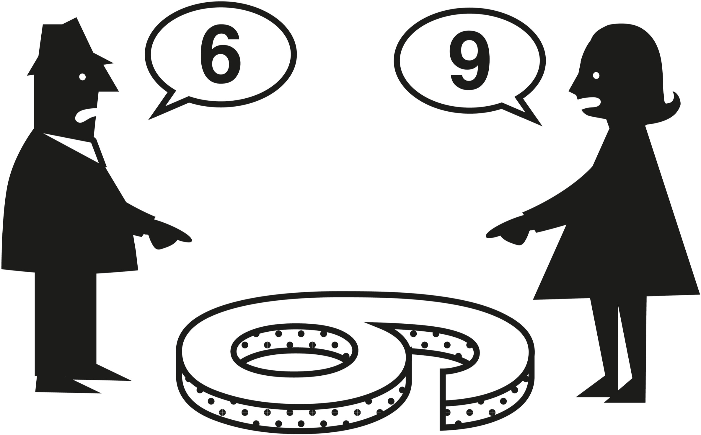
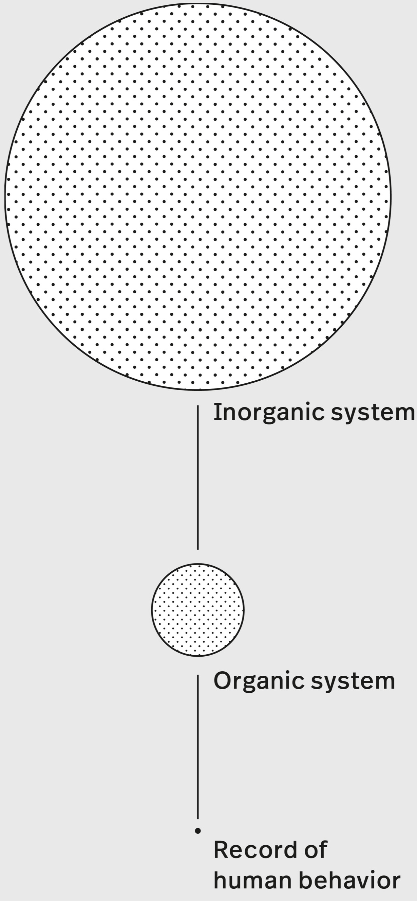
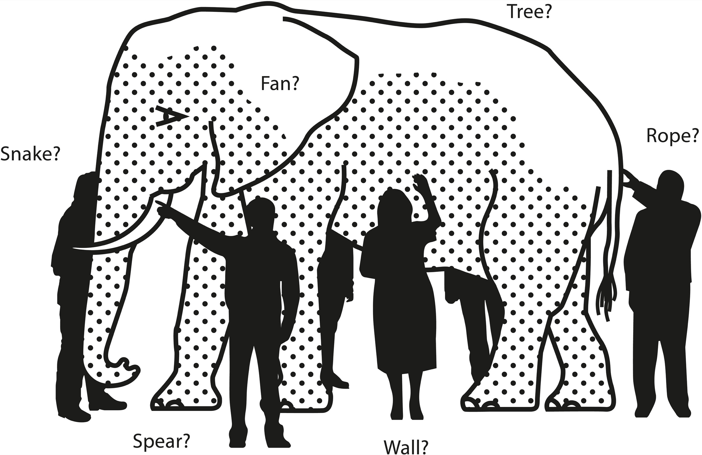
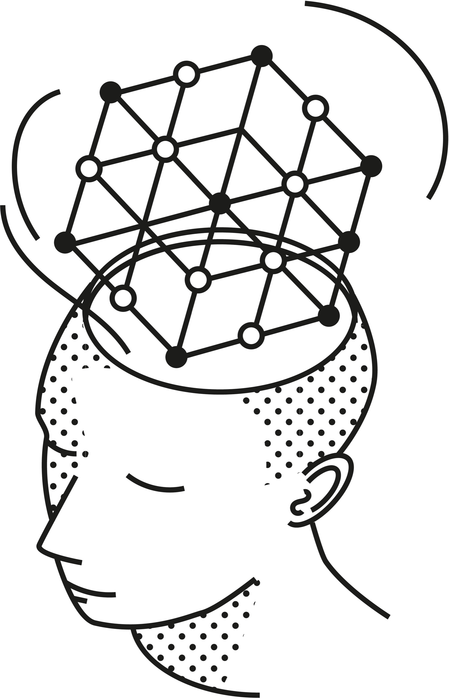

> It is remarkable how much long-term advantage people like us have gotten by trying to be consistently not stupid, instead of trying to be very intelligent.
>
> —Charlie Munger

In life and business, the person with the fewest blind spots wins. Blind spots are the source of all poor decisions. Think about it: If you had perfect information, you would always make the best decision. In a poker game where you could see everyone’s cards, you’d play your hand perfectly. You wouldn’t make any mistakes.

Unfortunately, we have a lot of blind spots. And while we can’t eliminate them, we can reduce them. Reducing blind spots means we see, interact with, and move closer to understanding reality. We think better. And thinking better is about finding simple processes that help us work through problems from multiple dimensions and perspectives, allowing us to better choose solutions that fit the objective. The skill behind finding the right solutions for the right problems is one form of wisdom.

This book is about the pursuit of that type of wisdom—the pursuit of uncovering how things work, the pursuit of going to bed smarter than when we woke up. It is a book about getting out of our own way so we can better understand how the world really is. Decisions based on improved understanding will be better than ones based on ignorance. While, inevitably, we can’t predict which problems will crop up in life, we can learn time-tested ideas that help position us for whatever the world throws at us.

Perhaps more importantly, this book is about *avoiding* problems. This often comes down to understanding a problem accurately and seeing the secondary and subsequent consequences of any proposed action. The author and explorer of mental models Peter Bevelin put it best: “I don’t want to be a great problem solver. I want to avoid problems—prevent them from happening and do it right from the beginning.”[[1]](#s0032-33-Notes-EndnoteNumber0 "note")

How can we do things right from the beginning?

We must understand how the world works and adjust our behavior accordingly. Contrary to what we’re led to believe, thinking better isn’t about being a genius. It is about the processes we use to uncover reality and the choices we make once we do.

## How This Book Can Help You

This is the first of four volumes aimed at defining and exploring the Great Mental Models—those with the broadest utility across our lives.

Mental models describe the way the world works. They shape how we think, how we understand, and how we form beliefs. Largely subconscious, mental models operate below the surface. We’re not generally aware of them, and yet when we look at a problem, they’re the reason we consider some factors relevant and others irrelevant. They are how we infer causality, match patterns, and draw analogies. They are how we think and reason.

A mental model is a compression of how something works. Any idea, belief, or concept can be distilled down. Like maps, mental models reveal key information while ignoring the nonessential. For example, you likely have a useful idea about how inertia works, even though you don’t know all the technical details.

Mental models help us better understand the world. While this might sound a bit academic, it’s not. For example, velocity helps us understand that both speed and direction matter. Reciprocity helps us understand how going positive and going first gets the world to do most of the work for us. The idea of a margin of safety helps us understand that things don’t always go as planned. Relativity shows us how a different perspective changes everything. The list goes on.

It doesn’t matter what the model is or where it comes from—the question to ask yourself is whether it is useful. The world is not divided into distinct disciplines. For example, business professors won’t discuss physics in their lectures, but they should. Velocity teaches us that going in the right direction matters more than how fast you go. Kinetic energy teaches us that your company’s velocity matters more than its size when creating an impact in the market. Understanding and applying these insights helps you outperform your competition.

While it helps to think of each model as a map, collectively they act as lenses through which you can see the world. Each lens (model) offers a different perspective, revealing new information. Looking through one lens lets you see one thing, and looking through another reveals something different. Looking through them both reveals more than looking through each one individually.

Whether we realize it or not, mental models help us think at the subconscious level. They shape what we see, what we choose to ignore, and what we miss entirely. While there are millions of mental models, these volumes focus on the ones with the greatest utility—the all-star team of mental models.

Volume 1 presents the first nine models, which are general thinking concepts. Although these models are hiding in plain sight, they are useful tools that you likely were never directly taught. Put to proper use, they will improve your understanding of the world we live in and your ability to look at a situation through different lenses, each of which reveals a different layer. They can be used in a wide variety of situations and are essential to making rational decisions, even when there is no clear path. Collectively, they will allow you to walk around any problem in a three-dimensional way.

Our approach to the Great Mental Models rests on the idea that the fundamentals of knowledge are available to everyone. There is no discipline that is off-limits—the core ideas from all fields of study contain principles that reveal how the universe works and are therefore essential to navigating it. Our models come from fundamental disciplines that most of us have never studied, but no prior knowledge is required, only a sharp mind with a desire to learn.

## Why Mental Models?

There is no system that can prepare us for all risks. Factors of chance introduce a level of complexity to any situation that is not entirely predictable. But being able to draw on a repertoire of timeless mental models can help us minimize risk by better understanding the forces that are at play. *Likely* consequences don’t have to be a mystery.

Not having the ability to shift perspective by applying knowledge from multiple disciplines makes us vulnerable. Mistakes can become catastrophes whose effects keep compounding, creating stress and limiting our choices. Multidisciplinary thinking—learning these mental models and applying them across our lives—creates less stress and more freedom. The more we can draw on the diverse knowledge contained in these models, the more solutions will present themselves.

## Understanding Reality

“Understanding reality” is a vague phrase, one you’ve already encountered a few times as you’ve read this book. Of course, we want to understand reality, but how do we do that? And why is it important?

In order to see a problem for what it is, we must first break it down into its substantive parts, so the interconnections can reveal themselves. This bottom-up perspective allows us to expose what we believe to be the causal relationships within the problem and determine how they will govern the situation both now and in the future. Being able to accurately describe the full scope of a situation is the first step to understanding it.

Using the lenses of our mental models helps us illuminate these interconnections. The more lenses used on a given problem, the more reality reveals itself. The more of reality we see, the fewer blind spots we have. The fewer blind spots we have, the better the options at our disposal.

Simple and well-defined problems won’t need many lenses, as the variables that matter are known; so too are the interactions between them. In such cases, we generally know what to do to get the intended result with the fewest side effects possible. When problems are more complicated, however, the value of having a brain full of lenses becomes readily apparent.

That’s not to say all lenses (or models) apply to all problems. They don’t. And it’s not to say that having more lenses (or models) will be an advantage in thinking through all problems; it won’t. This is why learning and applying the Great Mental Models is a process that takes some work. But the truth is, most problems are multidimensional, and thus having more lenses often offers significant help with the problems we are facing.

## Keeping Your Feet on the Ground

In Greek mythology, Antaeus was the human-giant son of Poseidon, god of the sea, and Gaia, Mother Earth. Antaeus had a strange habit: he would challenge all those who passed through his country to a wrestling match. As in wrestling today, the goal was to force the opponent to the ground. Antaeus always won, and his defeated opponents’ skulls were used to build a temple to his father. While Antaeus was undefeated and nearly undefeatable, there was a catch to his invulnerability. His epic strength depended on constant contact with the earth; when he lost touch with the earth, he lost all his strength. The great hero lost to Heracles, who simply lifted him off the ground.

On the way to the Garden of the Hesperides, Heracles was to fight Antaeus as one of his twelve labors. After a few rounds in which Heracles flung the giant to the ground, only to watch him revive, he realized he could not win by using traditional wrestling techniques. Instead, Heracles fought to lift Antaeus off the ground. With the earthly connection broken, Antaeus was separated from the source of his power, causing him to lose his strength. From that point on, it was easy for Heracles to crush him.[[2]](#s0032-33-Notes-EndnoteNumber1 "note"),[[3]](#s0032-33-Notes-EndnoteNumber2 "note")

When understanding is separated from reality, we lose our powers to make better decisions. Understanding must constantly be tested against reality and updated accordingly. This isn’t a box we can tick, a task with a definite beginning and end, but rather a continuous process.

We all know the person who seems to have all the answers. They know how to fix all the problems at work, solve world hunger, and get in shape (if only they wanted to). If you don’t test your ideas against the real world—if you don’t keep contact with the earth—how can you be sure you understand it? While pontificating with friends over a bottle of wine at dinner can be fun, the only way you’ll know the extent to which you understand reality is to put your ideas into action.

## Getting in Our Own Way

The biggest barrier to learning from the world is ourselves. It’s hard to understand a system that we are part of because we have blind spots, where we can’t see what we aren’t looking for and don’t notice what we don’t notice.

> There are these two young fish swimming along, and they happen to meet an older fish, swimming the other way, who nods at them and says, “Morning, boys. How’s the water?” And the two young fish swim on for a bit, and then eventually one of them looks over at the other and goes, “What the hell is water?”
>
> —David Foster Wallace[[4]](#s0032-33-Notes-EndnoteNumber3 "note")

Our failures to update our mental models as we interact with the world spring primarily from three factors: not having the right perspective or vantage point, ego-induced denial, and distance from the consequences of our decisions. As we will learn in greater detail throughout these volumes on mental models, all of these can get in the way. They make it easier to keep our existing and flawed beliefs than to update them accordingly. Let’s briefly flesh out these flaws:

**The first flaw** is failure of perspective. We have a hard time seeing any system that we are a part of. We think our angle of perception is the right one and the only one.

Galileo had a great analogy to describe the limits of our default perspective: Imagine you are on a ship that has reached constant velocity (meaning there is no change in speed or direction). You are belowdecks, and there are no portholes. You drop a ball from your raised hand to the floor. To you, it looks as if the ball is dropping straight down, thereby confirming gravity is at work.

Now imagine you are a fish (with special X-ray vision) and you are watching this ship go past. You see the scientist inside, dropping a ball. You register the vertical change in the position of the ball. But you are also able to see a horizontal change. As the ball was pulled down by gravity, it also shifted its position eastward by about twenty feet. The ship moved through the water, and therefore so did the ball. The scientist onboard, with no external point of reference, was not able to perceive this horizontal shift.

This analogy shows us the limits of our perception. If we truly want to understand the results of our actions, we must be open to other perspectives. Allowing for other perspectives is also key to having productive relationships with others.

**The second flaw** is ego—the part of us that’s afraid and always in competition. The ego is easily triggered and never feels satiated. Many of us tend to have too much invested in our opinion of ourselves to see the world’s feedback—the feedback we need to update our beliefs about reality. This creates a profound ignorance that keeps us repeatedly banging our heads against the wall. Our inability to learn from the world because of our ego arises for many reasons, but two are worth mentioning here. First, we’re often so afraid of what others will say about us that we fail to put our ideas out there and subject them to criticism; this way, we can always be right. Second, if we do put our ideas out there, and they’re criticized, our ego steps in to protect us—we become invested in defending, instead of upgrading, our ideas. This is antithetical to growth.

**The third flaw** is distance. The further we are from the results of our decisions, the easier it is to maintain our current views rather than update them. When you put your hand on a hot stove, you quickly learn the natural consequence of doing so. You pay the price for your mistake. Since you are a pain-avoiding creature, you instantly update your knowledge. Before you touch another stove, you check to see if it’s hot. But you don’t just learn a micro lesson that applies in one situation. Instead, you draw a generalization, one that tells you to check before touching anything that could potentially be hot.

Large organizations often remove us from the direct consequences of our decisions. When we make decisions that other people carry out, we are one or more levels removed from their consequences and may not immediately be able to update our understanding—we come a little off the ground, if you will. The further we are from the feedback on our decisions, the easier it is to convince ourselves that we are right and avoid the challenge, the pain, of updating our views.

Admitting we’re wrong is tough. At a high level, it’s easier to fool ourselves that we’re right than it is at the micro level, because at the micro level we see and feel the immediate consequences. At a high or macro level, we are removed from the immediacy of the situation, and our ego steps in to create a narrative that suits what we want to believe, instead of what has really happened.

These flaws are the main reasons we keep repeating the same mistakes, and why we need to keep our feet on the ground as much as we can. As Confucius reportedly said, “A man who has committed a mistake and doesn’t correct it, is committing another mistake.”

Most of the time, we don’t even perceive whatever conflicts with our beliefs. It’s much easier to go on thinking what we’ve already been thinking than go through the pain of updating our existing false beliefs. When it comes to seeing what is—that is, understanding reality—we can follow Charles Darwin’s advice to notice things “which easily escape attention” and ask why things happened.[[5]](#s0032-33-Notes-EndnoteNumber4 "note")

We also tend to undervalue elementary ideas and overvalue complicated ones. This makes sense: Most of us get jobs based on some form of specialized knowledge. We don’t think we have much value if we know the things everyone else does, so we focus our effort on developing unique expertise to set ourselves apart. In an effort to ensure that our contributions are unique, we often end up rejecting simple solutions and focusing instead on complexity. But simple ideas are of great value because they can help us prevent complex problems.

In identifying the Great Mental Models, we have looked for elementary principles, the ideas from multiple disciplines that form a timeless foundation for thought. It may seem bold to suggest that the same principles can improve everyone’s life, but the universe works in the same way no matter where you are in it. This is part of what makes the Great Mental Models so valuable—by understanding the principles, you can easily change tactics and apply the ones you need for your particular circumstances.

> Most geniuses—especially those who lead others—prosper not by deconstructing intricate complexities but by exploiting unrecognized simplicities.
>
> —Andy Benoit[[6]](#s0032-33-Notes-EndnoteNumber5 "note")

These elementary ideas, so often overlooked, come from multiple disciplines including biology, physics, chemistry, and more. They help us understand the interconnections of the world and see it for how it really is. This understanding in turn allows us to develop causal relationships, which allow us to match patterns, which allow us to draw analogies—all of this so we can navigate reality with clarity on the real dynamics involved.

## Understanding Is Not Enough

Understanding reality is not everything. The pursuit of understanding fuels meaning and adaptation, but this understanding by itself is not enough.

Understanding becomes useful only when we *adjust our behavior and actions accordingly*. The Great Mental Models are not just theory; they are actionable insights that can be used to create positive change in your life. What good is it to know that you constantly interrupt people, if you fail to adjust your behavior in light of this understanding? Granted, recognizing a mistake is easier than changing our behavior, since behavior patterns tend to be ingrained. It takes effort to change behavior, but your effort will be well spent. Don’t give up; change requires consistency. If you stick with it, you’ll see the fruits of your new understanding and its many downstream effects in real life.

## Understand and Adapt or Fail

Now you can see how we make suboptimal decisions and repeat mistakes: We are afraid to learn and to admit when we don’t know enough. This is the mindset that leads to poor initial decisions. These poor decisions are a source of stress and anxiety and consume massive amounts of time. Not when we’re making them—no, when we’re making them, they seem natural, because they align with how we *want* things to work.

We get tripped up when the world doesn’t work the way we want it to or when we fail to see what is. We end up negotiating with reality, in a fight we are sure to lose; we think the world should work the way we want it to rather than the way it does. Instead of updating our views, we double down on our effort, accelerating our frustration and anxiety. It’s only weeks or months later, when we’re spending massive amounts of time fixing our mistakes, that we truly feel their weight. Then we wonder why we have no time for family and friends and why we’re so consumed by things outside of our control.

It’s easy to convince ourselves that these results stem from circumstances outside of our control. Even if that is partially true, it is not helpful. Passivity means that we rarely reflect on our previous decisions and attitudes and their outcomes. Without reflection, we cannot learn.[[7]](#s0032-33-Notes-EndnoteNumber6 "note") Without learning, we are doomed to repeat mistakes, become frustrated when the world doesn’t work the way we want it to, and wonder why we are falling further behind. The cycle goes on.

Like it or not, we are not passive participants in our decision making. The world does not act on us as much as it reveals itself to us and we respond to it. We need to pay close attention to what’s happening. Ego gets in the way of this attention, locking reality behind a door that it controls with a gating mechanism. Only through persistence in the face of having the door slammed on us over and over can we begin to see the light on the other side.

Ego usually works against us. It’s that part of the mind that’s always comparing and finding lack, fear, and unfairness. Things are never good enough for the ego. It always wants more—more money, more attention, more recognition. And sometimes it leads us to do reckless things to prove we are more. But whether ego is good or bad for you depends on the dose. In small amounts, ego is our friend.

If we had a perfect view of the world and made decisions rationally, we would never attempt to do the amazing things that make us human. Ego propels us. Why, without ego, would we even attempt to travel to Mars? After all, it’s never been done before. We’d never start a business, because most of them fail. We need to learn to understand when ego serves us and when it hinders us. When we strive more toward outcomes rather than personal status—especially if those outcomes benefit more people than ourselves—that’s a good use of ego.

Ego can be blinding when we optimize for short-term status protection over long-term happiness. This is the difference between being right and being effective. As we mature, our understanding of things turns from black-and-white to shades of gray. The world is smarter than we are and it will teach us all we need to know if we’re open to its feedback—if we keep our feet on the ground.

## Mental Models and How to Use Them

Perhaps an example will help illustrate the mental models approach. Think of gravity, something we learned about as kids and perhaps studied more formally in college as adults. We each have a mental model about gravity, whether we know it or not. That model helps us understand how gravity works. We don’t know all the details, but we know the basics.

Our model of gravity plays a fundamental role in our lives. It explains the movement of Earth around the sun. It informs the design of bridges and airplanes. It’s one of the models we use to evaluate the safety of leaning on a guardrail or repairing a roof. But we also apply our understanding of gravity in other, less obvious ways. We use the model as a metaphor to explain the influence of strong personalities, as when we say, “He was pulled into her orbit.” This is a reference to our basic understanding of the role of mass in gravity—the more there is, the stronger its pull. It also informs some classic sales techniques: Gravity diminishes with distance, and so too does your propensity to make an impulse purchase. Good salespeople know that the more distance you get, in time or geography, between yourself and the object of your desire, the less likely you are to buy it. Salespeople try to keep the pressure on, to get you to buy right away, before you can change your mind.

Gravity has been around since before humans, so we can consider it to be time-tested, reliable, and representative of reality. Our understanding of gravity—in other words, our mental model—lets us anticipate what will happen and helps us explain what has happened. We don’t need to be able to describe the physics in detail for the model to be useful.

However, not every model is as reliable as gravity, and all models are flawed in some way. Some are reliable in some situations but useless in others. Some are too limited in their scope to be of much use. Others are unreliable because they haven’t been tested and challenged; yet others are just plain wrong. In every situation, we need to figure out which models are reliable and useful. We must also discard or update the unreliable ones, because unreliable or flawed models come with a cost.

For a long time, people believed that bloodletting cured many different illnesses. This mistaken belief led doctors to contribute to the deaths of many of their patients. When we use flawed models, we are more likely to misunderstand the situation, the variables that matter, and the cause-and-effect relationships between those variables. Because of such misunderstandings, we often take suboptimal actions, like draining so much blood out of patients that they die of it.

Better models mean better thinking. The more accurately our models explain reality, the more they improve our thinking. Understanding reality is the name of the game. Understanding not only helps us decide which actions to take but helps us avoid actions that have a big downside that we otherwise would not be aware of. When we understand, not only do we see the immediate problem with more accuracy, we can also begin to see the second-, third-, and higher-order consequences of various choices. This understanding helps us eliminate avoidable errors. Sometimes, making good decisions boils down to avoiding bad ones.

Flawed beliefs, regardless of the intentions behind them, cause harm when they are put into action. When it comes to applying mental models, we tend to run into trouble either when our model of reality is wrong—that is, it doesn’t survive real-world experience—or when our model is right, but we apply it to a situation where it doesn’t belong.

Models that don’t hold up to reality cause mistakes. The model of bloodletting caused unnecessary deaths because it weakened patients when they needed all their strength to fight their illnesses. It hung around for such a long time because it was part of a package of flawed models, such as ones explaining the causes of sickness and how the human body worked, that made it difficult to determine exactly where the bloodletting model didn’t fit with reality.

We compound the problem of flawed models when we fail to update our models after evidence indicates they are wrong. Only by repeatedly testing our models against reality *and* being open to feedback can we update our understanding of the world and change our thinking. We need to look at the results of applying a model over the largest sample size of problems possible to be able to refine it so that it aligns with how the world actually works.

## What Can the Three Buckets of Knowledge Teach Us About History?

“Every statistician knows that a large, relevant sample size is their best friend. What are the three largest, most relevant sample sizes for identifying universal principles? Bucket number one is inorganic systems, which are 13.7 billion years in size. It’s all the laws of math and physics, the entire physical universe. Bucket number two is organic systems, 3.5 billion years of biology on Earth. And bucket number three is human history, you can pick your own number, I picked 20,000 years of recorded human behavior. Those are the three largest sample sizes we can access and the most relevant.”[[8]](#s0032-33-Notes-EndnoteNumber7 "note")

The larger and more relevant the sample size of data, the more reliable the model that’s based on it. But the key to sample sizes is to look for them not just over space but over time. You need to reach back into the past as far as you can to contribute to your sample. We have a tendency to think that how the world is now is how it always was, and so we get caught up in validating our assumptions from what we find in the here and now. But the continents used to be pushed up against each other, dinosaurs walked the planet for millions of years, and we are not the only hominid to evolve. Looking to the past can provide essential context for understanding where we are now.

## The Power of Acquiring New Models

The quality of our thinking depends to a large extent on the mental models in our head. While we want useful models, we also want a wide variety of models to help us uncover what’s really happening. Most of us study something specific and don’t get exposure to the big ideas of other disciplines; we don’t develop the multidisciplinary mindset that we need to accurately see a problem. And because we don’t have the right models to understand the situation, we overuse the models we *do* have, applying them even where they don’t belong.

You’ve likely experienced this firsthand: An engineer will often think in terms of systems by default. A psychologist will think in terms of incentives. A businessperson might think in terms of opportunity cost and risk-reward calculation. Through their respective lenses, each person sees part of the situation, the part of the world that makes sense to them. None of them, however, sees the entire situation unless they are thinking in a multidisciplinary way. In short, they have blind spots—big ones. And they’re not aware of their blind spots. There is an adage that encapsulates this idea: “To the man with only a hammer, everything starts looking like a nail.” Not every problem is a nail. The world is full of complications and interconnections that can only be explained through understanding multiple models.

Removing blind spots means thinking through the problem using different lenses or models. When we do this, our blind spots slowly go away, and we gain a more complete understanding of the problem.

Consider the parable of the blind men encountering an elephant for the first time, trying to understand it by touch. The first person, whose hand touches the trunk, says, “This creature is like a thick snake.” For the second person, whose hand finds an ear, the elephant seems like a type of fan. The third person, whose hand is on a leg, says the elephant is a pillar, like a tree trunk. The fourth blind man, who places his hand on the creature’s side, says, “An elephant is a wall.” The fifth, who feels its tail, describes it as a rope. The last blind man touches a tusk and states that the elephant is something that is hard and smooth, like a spear. They are all right—yet they are also all wrong.

We’re much like the blind men in the classic parable, going through life trying to explain everything through our one limited lens of perspective. Too often that lens is driven by our particular field of expertise, be it economics, engineering, physics, mathematics, biology, chemistry, or something else entirely. Each of these disciplines holds some truth, and yet none of them contains the whole truth.

Here’s another way to look at it: Think of a forest. When a botanist looks at a forest, they focus on the ecosystem. An environmentalist sees the impact of climate change, a forest engineer the state of the trees’ growth, a businessperson the commercial value of the land. None is wrong, but neither is any of them able to describe the full scope of the forest. Sharing knowledge, or learning the basics of other disciplines, would lead them to a more well-rounded understanding that would allow for better decisions about managing the forest.

> A lot of people start out with 400-horsepower motors but only get a hundred horsepower of output. It’s way better to have a 200-horsepower motor and get it all into output.
>
> —Warren Buffett[[9]](#s0032-33-Notes-EndnoteNumber8 "note")

Relying on only a few models is like having a four-hundred-horsepower brain that’s generating only fifty horsepower of output. To increase your mental efficiency and reach your four-hundred-horsepower potential, you need to use Charlie Munger’s latticework of mental models. Exactly the same sort of pattern that graces backyards everywhere, a lattice is a series of points that connect to and reinforce each other. The Great Mental Models can be understood in the same way—models influence and interact with each other to create a structure that can be used to evaluate and understand ideas.

In a famous speech he gave in the 1990s, Munger summed up his approach to practical wisdom: “Well, the first rule is that you can’t really know anything if you just remember isolated facts and try and bang ’em back. If the facts don’t hang together on a latticework of theory, you don’t have them in a usable form. You’ve got to have models in your head. And you’ve got to array your experience—both vicarious and direct—on this latticework of models. You may have noticed students who just try to remember and pound back what is remembered. Well, they fail in school and in life. You’ve got to hang experience on a latticework of models in your head.”[[10]](#s0032-33-Notes-EndnoteNumber9 "note")

> The chief enemy of good decisions is a lack of sufficient perspectives on a problem.
>
> —Alain de Botton[[11]](#s0032-33-Notes-EndnoteNumber10 "note")

## Expanding Your Latticework of Mental Models

A latticework is an excellent way to conceptualize mental models because it demonstrates the reality and value of interconnecting knowledge. The world does not isolate itself into discrete disciplines. We break it down that way only because it makes it easier to study it. Once we learn something, we need to put it back into the complex system in which it occurs. We need to see where it connects to other bits of knowledge, to build our understanding of the whole. This is the value of putting the knowledge contained in mental models into a latticework.

Our latticework reduces the blind spots that limit our view of not only the immediate problem but also the second- and subsequent-order effects of our potential solutions. Without a latticework of the Great Mental Models, our decisions become harder, slower, and less creative. By using a mental models approach, by being curious about how the rest of the world works, we can complement our specializations. A quick glance at the lists of Nobel Prize winners shows that many of them, obviously extreme specialists in something, had multidisciplinary interests that supported their achievements.

To help you build your own latticework of mental models, this book, and the volumes that follow, will attempt to arm you with the big models from multiple disciplines. We’ll look at biology, physics, chemistry, economics, and even psychology. We don’t need to master all the details from these disciplines, just the fundamentals.

To quote Charlie Munger, “Eighty or ninety important models will carry about 90 percent of the freight in making you a worldly-wise person. And, of those, only a mere handful really carry very heavy freight.”[[12]](#s0032-33-Notes-EndnoteNumber11 "note")

The four volumes of *The Great Mental Models* attempt to collect and make accessible organized common sense—the eighty to ninety mental models you need from the major disciplines to get started. To help you understand the models, we will relate them to stories and historical examples. My blog, *Farnam Street*, will have even more practical examples (see <https://fs.blog/mental-models/>).

The more high-quality mental models you have in your mental toolbox, the more likely you will have the ones needed to understand a given problem. The better you understand, the better the potential actions you can take. The better the potential actions, the fewer problems you’ll encounter down the road. Better models make better decisions.

> I think it is undeniably true that the human brain must work in models. The trick is to have your brain work better than the other person’s brain because it understands the most fundamental models: ones that will do the most work per unit. If you get into the mental habit of relating what you’re reading to the basic structure of the underlying ideas being demonstrated, you gradually accumulate some wisdom.
>
> —Charlie Munger[[13]](#s0032-33-Notes-EndnoteNumber12 "note")

## Time Invested Yields Enormous Benefits

Successful people file away a collection of fundamental, established, essentially unchanging knowledge that can be used in evaluating the infinite number of unique scenarios that show up in the real world. Each decision presents an opportunity to comb through your repertoire of models and try one out, so you can learn how to use them. This will slow you down at first—for one thing, you won’t always choose the right models—but you will get better and more efficient at using mental models as time progresses.

> Disciplines, like nations, are a necessary evil that enable human beings of bounded rationality to simplify their goals and reduce their choices to calculable limits. But parochialism is everywhere, and the world badly needs international and interdisciplinary travelers to carry new knowledge from one enclave to another.
>
> —Herbert A. Simon[[14]](#s0032-33-Notes-EndnoteNumber13 "note")

With time and consistent effort, we begin to synthesize the ideas we learn with *reality itself*. No model contains the entire truth, whatever that may be. What good are math and biology and psychology unless we know how they fit together in reality, and how to use them to make our lives better? It would be like dying of hunger because we don’t know how to combine and cook any of the foods in our pantry.

Making mistakes is part of the process of using mental models. Failing, if you acknowledge, reflect on, and learn from it, is also how you build mastery. As you use mental models, a great practice is to record and reflect on your process and results. That way, you can get better at both choosing models and applying them. Take the time to notice how you applied the models, what the process was like, and what the results were.

Over time, you will develop your knowledge of which situations are best tackled through which models. Don’t give up on a model if it doesn’t help you right away. Learn more about it and try to figure out exactly why it didn’t work. It may be that you have to improve your understanding of it, or that there were aspects to the situation that you did not consider, or that your focus was on the wrong variable. So keep a journal. Write down your experiences. When you identify a model at work in the world, write that down too. Then you can explore the applications you’ve observed and start to be more in control of the models you use every day. For instance, instead of falling victim to confirmation bias, you will become able to step back and see it at work in yourself and others. Once you get practice with them, you will start to naturally apply models as you go through your daily life, from reading the news to contemplating a career move.

As we have seen, we can run into problems when we apply models to situations in which they don’t fit. If a model is useful—and we can define “useful,” here, as offering a different perspective that uncovers a blind spot in our understanding of a problem—it is wise to invest time and energy into understanding why it worked, so we know when to use it again.

At the beginning, the process is more important than the outcome. As you use the models, stay open to feedback loops. Reflect and learn. You will get better. It will become easier. Results will become more profoundly useful, more broadly applicable, and more memorable. While this book isn’t intended to be a book specifically about making better decisions, it will help you make better decisions.

Mental models are not an excuse to create a lengthy decision process. Rather, their aim is to help you move away from seeing things the way you think they should be and toward seeing them the way they are. Right now, you are touching only one part of the elephant, so you are making all decisions based on your understanding that it’s a wall, or a rope, not an animal. As soon as you begin to take in the knowledge that other people have of the world, like learning the perspectives others have on the elephant, you will start having more success, because your decisions will be aligned with how the world really is.

When you start to understand the world better, when the whys become less mysterious, you will gain confidence in how you navigate. Successes will accrue. More success means more time, less stress, and, ultimately, a more meaningful life.

Time to dive in.
