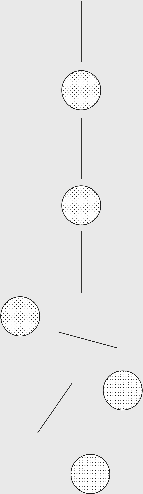

> Remember that all models are wrong; the practical question is how wrong do they have to be to not be useful.
>
> —George E. P. Box[[1]](#s0032-33-Notes-EndnoteNumber14 "note")

The map of reality is not reality. Even the best maps are imperfect. That’s because maps are reductions of what they represent. If a map were to represent the territory with perfect fidelity, it would no longer be a reduction and thus would no longer be useful to us. A map can also be a snapshot from a point in time, representing something that no longer exists. This is important to keep in mind as we think through problems and seek to make better decisions.

We use maps every day to simplify complexity. A great example is the financial statements of a company, which are meant to distill the complexity of thousands of transactions into something manageable. Yet they tell us nothing about whether the product is good for the customer or what’s really going on in the company. A policy document on office procedure, a manual on parenting a two-year-old, or your performance review—all are models, or maps, that simplify some complex territory to guide you through it.

Relying solely on maps can lead you to the wrong conclusion. You need to touch the territory.

Very early in the history of Amazon, Jeff Bezos was going over a set of documents with his team at the weekly business review. He’d heard that a bunch of customers were complaining (the territory) about call wait times, and yet looking at the data (the map), he couldn’t figure out why. “When the data and the anecdotes disagree,” he said in an interview, “the anecdotes are usually right.”[[2]](#s0032-33-Notes-EndnoteNumber15 "note") At the meeting, the head of customer service reported the wait-time metric as under sixty seconds, which was in line with expectations. Bezos paused the meeting, picked up the phone, and dialed the 1-800 number for customer service. He waited on hold for over ten minutes, which made the point: something was wrong with the data collection.

Mental models are maps. While they might not be perfectly accurate, they are useful. Mental models and maps are both useful to the extent they are explanatory and predictive.

## Key Elements of a Map

In 1931, the mathematician Alfred Korzybski presented a paper on mathematical semantics in New Orleans. Most of the paper reads like a complex, technical argument on the relationship of mathematics to human language, and of both of these to physical reality. However, with this paper, Korzybski introduced and popularized the concept that *the map is not the territory—*in other words, the description of the thing is not the thing itself. The model is not reality. The abstraction is not the abstracted.

Specifically, in Korzybski’s own words:[[3]](#s0032-33-Notes-EndnoteNumber16 "note")

1. **A map may have a structure similar or dissimilar to the structure of the territory.** The London Underground map is super useful to travelers. The train drivers don’t use it at all! Maps describe a territory in a useful way, but with a specific purpose in mind. They cannot be everything to everyone.
2. **Two similar structures have similar logical characteristics.** If a correct map shows Dresden as located between Paris and Warsaw, a similar relation is found in the actual territory. If you have a map showing where Dresden is, you should be able to use it to get there.
3. **A map is not the actual territory.** The London Underground map does not convey what it’s like to be standing in Covent Garden Station, nor would you use it to navigate out of the station.
4. **An ideal map would contain the map of the map, the map of the map of the map, etc., endlessly.** We may call this characteristic self-reflexiveness. Imagine using an overly complicated “Guide to Paris” on a trip to France, and then having to purchase another book, the “Guide to the Guide to Paris,” and so on. Ideally, you’d never have any issues—but eventually, the level of detail would be overwhelming.

The only way we can navigate the complexity of the world is through some sort of abstraction. When we read the news, we’re consuming abstractions of events created by other people. The authors consumed vast amounts of information, reflected upon it, and drew some conclusions that they share with us. But something is also lost in the process: the specific and relevant details that were compressed into the abstraction. And, because we often consume these abstractions as gospel, without having done the hard mental work of creating them ourselves, it’s tricky for us to see when the map no longer agrees with the territory. We inadvertently forget that the map is not reality. It’s the illusion of knowledge.

## But My GPS Didn’t Show That Cliff

We need maps and models as guides. But frequently, we don’t remember that our maps and models are abstractions, and thus we fail to understand their limits. We forget there is a territory that exists separately from the map. This territory contains details the map doesn’t describe. We run into problems when our knowledge becomes knowledge of the *map* rather than of the actual underlying territory it describes.

Reality is messy and complicated, so our tendency to simplify it is understandable. However, if the aim becomes simplification rather than understanding, we start to make bad decisions. When we mistake the map for the territory, we start to think we have all the answers. We create static rules or policies that deal with the map but forget that we exist in a constantly changing world. When we close off or ignore feedback loops, we don’t see that the terrain has changed and we dramatically reduce our ability to adapt to a changing environment.

We can’t use maps as dogma. Maps and models are not meant to live forever as static references. The world is dynamic. As territories change, our tools to navigate them must be flexible, to handle a wide variety of situations or adapt to the changing times. If the value of a map or model is related to its ability to predict or explain, then it needs to represent reality. If reality has changed, the map must change.

Take Newtonian physics. For hundreds of years, it served as an extremely useful model for understanding the workings of our world. From gravity to celestial motion, Newtonian physics was a wide-ranging map.

Then, in 1905, Albert Einstein, with his theory of special relativity, changed our understanding of the universe in a huge way. He replaced the understanding handed down by Isaac Newton hundreds of years earlier. He created a new map.

Newtonian physics is still a *very* useful model. One can use it reliably to predict the movement of objects large and small (with some limitations, as pointed out by Einstein). And, on the flip side, Einstein’s physics is still not totally complete: with every year that goes by, physicists become increasingly frustrated with their inability to tie it into small-scale quantum physics. Another map may yet come. But what physicists do so well, and most of us do so poorly, is carefully delimit what Newtonian and Einsteinian physics are able to explain. They know, down to many decimal places, where those maps are useful guides to reality and where they aren’t. And when they hit uncharted territory, like quantum mechanics, they explore it carefully, instead of assuming the maps they have can explain it all.

## Maps Can’t Show Everything

Some of the biggest map/territory problems are the risks of the territory that are not shown on the map. When we’re following the map without looking around, we trip right over these risks. Any user of a map or model must realize that we do not understand a model, map, or reduction unless we understand and respect its limitations. If we don’t understand what the map does and doesn’t tell us, it can be useless or even dangerous.

## The Tragedy of the Commons

What is common to many is taken least care of, for all men have greater regard for what is their own than for what they possess in common with others.

—Aristotle[[4]](#s0032-33-Notes-EndnoteNumber17 "note")

The Tragedy of the Commons is a parable that illustrates why common resources get used more than is desirable from the standpoint of society as a whole. Garrett Hardin wrote extensively about this concept.

Picture a pasture open to all. It is to be expected that each herdsman will try to keep as many cattle as possible on the commons. Such an arrangement may work reasonably satisfactorily for centuries because tribal wars, poaching, and disease keep the numbers of both man and beast well below the carrying capacity of the land. Finally, however, comes the day of reckoning, that is, the day when the long-desired goal of social stability becomes a reality. At this point, the inherent logic of the commons remorselessly generates tragedy.

As a rational being, each herdsman seeks to maximize his gain. Explicitly or implicitly, more or less consciously, he asks, “What is the utility to me of adding one more animal to my herd?” This utility has one negative and one positive component.

1. The positive component is a function of the increment of one animal. Since the herdsman receives all the proceeds from the sale of the additional animal, the positive utility is nearly +1.
2. The negative component is a function of the additional overgrazing created by one more animal. Since, however, the effects of overgrazing are shared by all the herdsmen, the negative utility for any particular decision-making herdsman is only a fraction of 1.

Adding together the component partial utilities, the rational herdsman concludes that the only sensible course for him to pursue is to add another animal to his herd. And another; and another…. But this is the conclusion reached by each and every rational herdsman sharing a commons. Therein is the tragedy. Each man is locked into a system that compels him to increase his herd without limit–in a world that is limited. Ruin is the destination toward which all men rush, each pursuing his own best interest in a society that believes in the freedom of the commons. Freedom in a commons brings ruin to all.[[5]](#s0032-33-Notes-EndnoteNumber18 "note")

Economist Elinor Ostrom wrote about being cautious with maps and models when looking at different governance structures for common resources. She was worried that the Tragedy of the Commons model (see sidebar), which shows how a shared resource can be destroyed through bad incentives, was too general and did not account for how people, in reality, solved the problem. She explained the limitations of using models to guide public policy, namely, that they often become metaphors: “What makes these models so dangerous…is that the constraints that are assumed to be fixed for the purpose of analysis are taken on faith as being fixed in empirical settings.” [[6]](#s0032-33-Notes-EndnoteNumber19 "note")

This is a double problem. First, having a general map, we may assume that if a territory matches the map in a couple of respects, it matches the map in all respects. Second, we may cling to what we know rather than update our information; we may think adherence to the map is more important than taking in new information about a territory. Ostrom asserts that one of the main values of using models as maps in public policy discussions is in the thinking that is generated. Models are tools for exploration, not doctrines to force conformity. They are guidebooks, not laws.

In order to use a map or model as accurately as possible, we should take into account three important principles:

1. Reality is the ultimate update.
2. Consider the cartographer.
3. Maps can influence territories.

**Reality is the ultimate update:** When we enter new and unfamiliar territory, it’s nice to have a map on hand. In everything from traveling to a new city to becoming a parent for the first time, we benefit from maps that we can use to improve our ability to navigate the terrain. But territories change, sometimes faster than the maps and models that describe them. We can and should update our maps based on our own experiences in the territory. That’s how good maps are built: through feedback loops created by explorers.

We can think of stereotypes as maps. Sometimes they are useful—we have to process large amounts of information every day, and simplified chunks such as stereotypes can help us sort through this information with efficiency. The danger, as with all maps, comes when we forget that the territory is more complex than the map. People constitute far more territory than a stereotype can possibly represent.

In the early 1900s, Europeans were snapping pictures all over Palestine, leaving a record that may have reflected their ethnographic perspective but did not cover Karimeh Abbud’s perception of her culture. She began to take photos of those around her, becoming the first Arab woman to set up her own photo studio in Palestine. Her pictures reflected a different take on the territory—she rejected the European style and aimed to capture the middle class of Palestine as they were. She tried to let her camera record the territory as she saw it, rather than manipulating the images to follow a narrative.

Abbud’s informal style and desire to photograph the variety around her, from landscapes to intimate portraits, have left a legacy far beyond the photos themselves.[[7]](#s0032-33-Notes-EndnoteNumber20 "note"),[[8]](#s0032-33-Notes-EndnoteNumber21 "note") She contributed a different perspective, a new map, with which to explore the history of the territory of Palestine.

We do have to remember, though, that a map captures a territory at a moment in time. Just because it might have done a good job at depicting what was at the time it was made, there is no guarantee that it depicts what is there now or what will be there in the future. The faster the rate of change in the territory, the harder it will be for a map to keep up-to-date.

> Viewed in its development through time, the map details the changing thought of the human race, and few works seem to be such an excellent indicator of culture and civilization.
>
> —Norman J. W. Thrower[[9]](#s0032-33-Notes-EndnoteNumber22 "note")

**Consider the cartographer:** Maps are not purely objective creations. They reflect the values, standards, and limitations of their creators.

One way to see how maps lack objectivity is in the changing national boundaries that make up our world maps. Countries come and go depending on shifting political and cultural sensibilities. When we look at the world map we have today, we tend to associate societies with nations, assuming that the borders reflect a common identity shared by everyone contained within them. However, as historian Margaret MacMillan pointed out, nationalism is a very modern construct, and in some sense has developed with, not in advance of, the maps that set out the shapes of countries.[[10]](#s0032-33-Notes-EndnoteNumber23 "note") We should not, then, assume that our maps depict an objective view of the geographical territory. For example, historians have shown that the modern borders of Syria, Jordan, and Iraq reflect British and French determination to maintain influence in the Middle East after World War I.[[11]](#s0032-33-Notes-EndnoteNumber24 "note") Thus, they are a better map of Western interest than of local custom and organization.

Models are most useful when we consider them in the context in which they were created. What was the cartographer trying to achieve? How does this influence what is depicted in the map?

**Maps can influence territories:** This problem was part of the central argument put forth by Jane Jacobs in her groundbreaking work *The Death and Life of Great American Cities*. Jacobs chronicled the efforts of city planners who came up with elaborate models for the design and organization of cities, without paying any attention to how cities actually work. They then tried to fit the cities into the model. She describes how cities were changed to correspond to these models, and the often negative consequences of these efforts. “It became possible also to map out master plans for the statistical city, and people take these more seriously, for we are all accustomed to believe that maps and reality are not necessarily related, or that if they are not, we can make them so by altering reality.”[[12]](#s0032-33-Notes-EndnoteNumber25 "note")

Jacob’s book is, in part, a cautionary tale about what can happen when faith in the model influences the decisions we make in the territory—when we try to fit complexity into the simplification.

> In general, when building statistical models, we must not forget that the aim is to understand something about the real world. Or predict, choose an action, make a decision, summarize evidence, and so on, but always about the real world, not an abstract mathematical world: our models are not the reality.
>
> —David Hand[[13]](#s0032-33-Notes-EndnoteNumber26 "note")

## Conclusion

*The map is not the territory* is a reminder that our mental models of the world are not the same as the world itself. It’s a caution against confusing our abstractions and representations with the complex, ever-shifting reality they aim to describe.

Mistaking the maps for the territory is dangerous. Consider the person who has a great résumé and checks all the boxes on paper but can’t do the actual job. Updating our maps is a difficult process of reconciling what we want to be true with what is true.

In many areas of life, we are offered maps by other people. We are reliant on the maps provided by experts, pundits, and teachers. In these cases, the best we can do is to choose our mapmakers wisely, to seek out those who are rigorous, transparent, and open to revision.

Ultimately, the map/territory distinction is an invitation to engage with the world as it is, not just as we imagine it to be. And remember, when you don’t make the map yourself, choose your cartographer wisely.

## Models of Management

Let’s take a model of management. There are hundreds of them, dating back at least to *The Principles of Scientific Management*, by Frederick Taylor, which had factory managers breaking down tasks into small pieces, forcing their workers to specialize, and financially incentivizing them to complete those specialized tasks efficiently. It was a brute-force method, but it worked pretty well.

As time went on and the economy increasingly moved away from manufacturing, other theories gained popularity, and Taylor’s model is no longer used by anyone of note. That does not mean it wasn’t useful; for a time, it was. It’s just that reality is more complicated than Taylor’s model. Eventually, it had to contend with at least the following factors:

1. As more and more people learn what model you’re using to manipulate them, they may decide not to respond to your incentives.
2. As your competitors gain knowledge of the model, they respond in kind by adopting the model themselves, thus flattening the playing field.
3. The model may have been useful mostly in a factory setting, and not in an office setting or a technology-development setting.
4. Human beings are not simple automatons: a more complete model would hone in on other motivations they might have besides financial ones.

And the list goes on. Clearly, though Taylor’s model was effective for a time, it was effective with limitations. As with Einstein eclipsing Newton in physics, better models in management came along in time.

