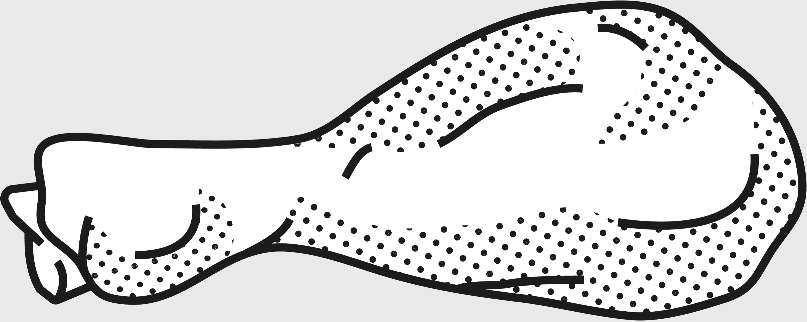

## Supporting Idea: Falsifiability

Karl Popper wrote, “A theory is part of empirical science if and only if it conflicts with possible experiences and is therefore in principle falsifiable by experience.”[[15]](#s0032-33-Notes-EndnoteNumber41 "note") The idea here is that if you can’t prove something wrong, you can’t really prove it right either.

Thus, in Popper’s words, science requires testability: “If observation shows that the predicted effect is definitely absent, then the theory is simply refuted.”[[16]](#s0032-33-Notes-EndnoteNumber42 "note") A good theory must have an element of risk to it—namely, it has to risk being wrong. It must be able to be proven wrong under stated conditions.

In a true science, as opposed to a pseudoscience, the following statement can be easily made: “If *x* happened, it would show demonstrably that theory *y* is not true.” We can then design an experiment—a physical one, or sometimes a thought experiment—to figure out if *x* actually does happen*.* Falsification is the opposite of verification: you must try to show that the theory is *incorrect* and, if you fail to do so, you actually strengthen it. To understand how this works in practice, think of evolution. As mutations appear, natural selection eliminates those that don’t work, thereby strengthening the fitness of the rest of the population.

Consider Popper’s discussion of the concept of falsifiability in the context of Freud’s psychoanalytic theory, which is broadly about repressed childhood memories influencing our unconscious, which in turn affects our behavior. Popper was careful to say that it is not possible to prove that Freudianism is either true or not true, at least in part. We can simply say that we don’t know whether it’s true, because it does not make specific, testable predictions. It may have many kernels of truth in it, but we can’t tell. The theory would have to be restated in a way that would allow for experience to refute it.

Another interesting piece of Popper’s work was an attack on what he called “historicism”—the idea that history has fixed laws or trends that inevitably lead to certain outcomes. Historicism includes the tendency to use examples from the past to make definitive conclusions about what is going to happen in the future.

Popper considered this kind of thinking pseudoscience—or, worse, a dangerous ideology that tempts wannabe state planners and utopians to control society. He did not consider historicist doctrines falsifiable. There is no way, for example, to test whether there is a “Law of Increasing Technological Complexity” in human society, as many are tempted to claim these days, because it is not actually a testable hypothesis. Instead of calling these ideas interpretations, historicists call them “laws,” or some similarly connotative word that implies an unchanging and universal state that is not open to debate, thereby giving them an authority that they haven’t earned. Too frequently, these postulated “laws” become immune to falsifying evidence—any new evidence is interpreted through the lens of the theory.

For example, we can certainly find confirmation for the idea that humans have progressed, in a specifically defined way, toward increasing technological complexity. But is that a “law” of history, in the sense of being inviolable? Was it always going to be this way? No matter what the starting conditions or developments along the way, were humans always going to increase our technological prowess? We really can’t say.

Here, we hit on the problem of trying to assert any fundamental law by which human history must inevitably progress. Trend is not destiny. Even if we can derive and understand certain laws of human biological nature, the trends of history itself are dependent on conditions, and conditions change.

Bertrand Russell’s classic example of the chicken that gets fed every day is a great illustration of this concept.[[17]](#s0032-33-Notes-EndnoteNumber43 "note") Daily feedings have been going on for as long as the chicken has observed, and thus it supposes that these feedings are a guaranteed part of its life and will continue in perpetuity. The feedings appear as a law—until the day the chicken gets its head chopped off. They are then revealed to be a trend, not a predictor of the future state of affairs.

Another way to look at it is to examine how we tend to view the worst events in history. We tend to assume that the worst that has happened is the worst that *can* happen, and then prepare for that. We forget that “the worst” once smashed a previous understanding of what was the worst. Therefore, we need to prepare more for the extremes allowable by physics rather than for what has happened until now.

Applying the filter of falsifiability helps us sort through which theories are more robust. If a theory can’t ever be proven false, because we have no way of testing it, then the best we can do is try to determine its probability of being true.

