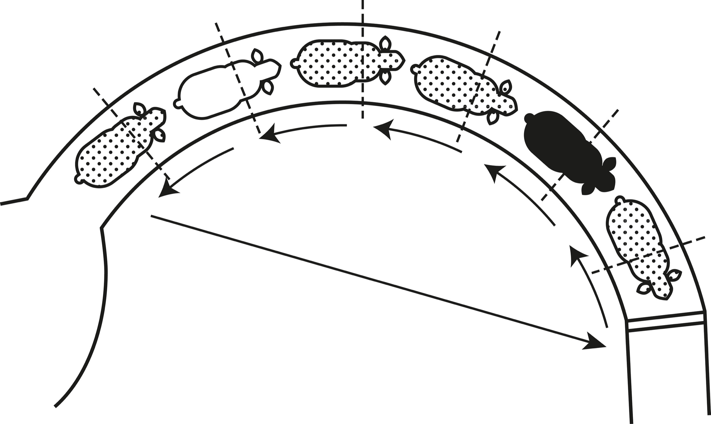

> I don’t know what’s the matter with people: they don’t learn by understanding; they learn by some other way—by rote or something. Their knowledge is so fragile!
>
> —Richard Feynman[[1]](#s0032-33-Notes-EndnoteNumber44 "note")

First principles thinking is one of the best ways to discover new solutions. Sometimes called “reasoning from first principles,” it’s a tool to help break down complicated problems by separating what we know is absolutely true from anything that is an assumption. What remain are the essentials. If you know the first principles of something, you can build the rest of your knowledge around them to produce something new.

While you could take this way of thinking down to an atomic level, a lot of value is gained by simply going a level or two deeper than most people.[[2]](#s0032-33-Notes-EndnoteNumber45 "note") Solutions are based on what you see. Different answers reveal themselves at different levels.

If I hand you a house made from Lego blocks, you know it’s possible to make a house. Thinking at the first layer, you might move a few blocks around and, in the process, slightly improve the house. Most people stop here. They are presented with something that already exists and they endeavor to make it slightly better. Going a layer deeper and breaking the Lego house into individual pieces opens the door to possibility: not only can you build a better house, you can build something entirely different.

Everything that exists is effectively a set of Lego blocks, assembled in a certain way, that can be taken apart and reassembled. A bike is just a seat, chain, body, handlebars, etc. Breaking the bike down into its parts allows you to reassume the parts into something new. However, you can also go deeper, melting the parts into their core metals and making a shield, sword, or anything else, limited only by material and imagination.

The idea of building knowledge from first principles has a long tradition in philosophy. In the Western canon it goes back to Plato, with significant contributions from Aristotle and Descartes. Essentially, these thinkers were looking for foundational knowledge that would not change and on which we could build everything else, from our ethical systems to our social structures.

First principles thinking doesn’t have to be quite so grand. When we do it, we aren’t necessarily looking for absolute truths—millennia of epistemological inquiry have shown us that these are hard to come by, and the scientific method has demonstrated that knowledge can be built only when we are actively trying to falsify it (see “Supporting Idea: Falsifiability”). Rather, first principles thinking identifies the elements that are, in the context of any given situation, irreducible.

First principles do not provide a checklist of things that will always be true; our knowledge of first principles changes as we understand more. They are the foundation on which we must build, and thus will be different in every situation—but the more we know, the more we can challenge. For example, if we are considering how to improve the energy efficiency of a refrigerator, the laws of thermodynamics can be taken as first principles. However, a theoretical chemist or physicist might want to explore entropy, and thus further break the second law of thermodynamics into its underlying principles and the assumptions that were made because of them. First principles are the boundaries that we must work within in any given situation, so when it comes to thermodynamics, an appliance maker might have different first principles than a physicist.

## Techniques for Establishing First Principles

If we never learn to take something apart, test our assumptions about it, and reconstruct it, we end up bound by what other people tell us is possible. We end up trapped in the way things have always been done. When the environment changes, we just continue as if things were the same, making costly mistakes along the way.

Some of us are naturally skeptical of what we’re told: Maybe it doesn’t match up to our experiences. Maybe it’s something that used to be true but isn’t true anymore. Or maybe we just think differently about something. When it comes down to it, everything that is not a law of nature is just a shared belief. Money is a shared belief. So is a border. So is Bitcoin. So is love. The list goes on.

There are two techniques we can use to change the level where we are looking at a situation, identify the first principles, and cut through the dogma and shared belief: Socratic questioning and the Five Whys.

**Socratic questioning:** Socratic questioning can be used to establish first principles through stringent analysis. This is a disciplined questioning process used to establish truths, reveal underlying assumptions, and separate knowledge from ignorance. The key distinction between Socratic questioning and ordinary discussion is that the former seeks to draw out first principles in a systematic manner. Socratic questioning generally follows this process:

1. Clarifying your thinking and explaining the origins of your ideas. (Why do I think this? What exactly do I think?)
2. Challenging assumptions. (How do I know this is true? What if I thought the opposite?)
3. Looking for evidence. (How can I back this up? What are my sources?)
4. Considering alternative perspectives. (What might others think? How do I know I am correct?)
5. Examining consequences and implications. (What if I am wrong? What are the consequences if I am?)
6. Questioning the original questions. (Why did I think that? Was I correct? What conclusions can I draw from the reasoning process?)

Socratic questioning stops you from relying on your gut and limits strong emotional responses. This process helps you build something that lasts.

**The Five Whys:** The Five Whys is a method rooted in the behavior of children. Children instinctively think in first principles; just like us, they want to understand what’s happening in the world. To do so, they intuitively break through the fog with a game some parents have come to dread but that is exceptionally useful for identifying first principles: repeatedly asking “why.”

The goal of the Five Whys is to traverse different levels until we land on a “what” or “how.” It is not about introspection, such as asking, “Why do I feel like this?” Rather, it is about systematically delving further into a statement or concept so that you can separate reliable knowledge from assumption. If your “whys” result in a statement of falsifiable fact, you have hit a first principle. If they end up with a “because I said so” or “it just *is*,” you know you have landed on an assumption that may be based on popular opinion, cultural myth, or dogma. These are not first principles.

There is no doubt that both of these methods slow us down in the short term. They seem to get in the way of what we want to accomplish. We must pause, think, and research. And after we employ them a couple of times, we realize that often, after one or two questions, we are lost. We actually don’t know how to answer most of the questions. But when we are confronted with our own ignorance, we can’t just give up or resort to self-defense. If we do, we will never identify the first principles we have to work with and will instead make mistakes that will slow us down in the long term.

> Science is much more than a body of knowledge. It is a way of thinking.
>
> —Carl Sagan[[3]](#s0032-33-Notes-EndnoteNumber46 "note")

## Using First Principles Thinking to Blow Past Inaccurate Assumptions

The discovery that a bacterium, not stress, causes the majority of stomach ulcers is a great example of what can be accomplished when we push past assumptions to get at first principles. For centuries following the discovery of bacteria, scientists thought that bacteria could not grow in the stomach, on account of its acidity. If you had surveyed doctors and medical research scientists in the 1960s or ’70s, they likely would have postulated this as a first principle. When a patient came in complaining of stomach pain, no one ever looked for a bacterial cause.

It turned out, however, that a sterile stomach was not a first principle—it was an assumption. As Kevin Ashton writes in his book on creativity, discovery, and invention, “the dogma of the sterile stomach said that bacteria could not live in the gut.”[[4]](#s0032-33-Notes-EndnoteNumber47 "note") Because this dogma was taken as truth, for a long time, no one ever looked for evidence that it could be false.

That changed for good with the discovery of *Helicobacter pylori* bacterium and its role in stomach ulcers. When pathologist Robin Warren saw bacteria in samples from patients’ stomachs, he realized that stomachs were not, in fact, sterile. He started collaborating with Barry Marshall, a gastroenterologist, and together they found bacteria in loads of stomachs. If the sterile stomach wasn’t a first principle, then, when it came to stomachs, what was?

Marshall, in an interview with *Discover*, recounts that Warren gave him a list of twenty patients identified as possibly having cancer—but when Warren looked, he had found, instead, the same bacteria in all of them. He said, “Why don’t you look at their case records and see if they’ve got anything wrong with them?” Since they now knew stomachs weren’t sterile, they could question all the associated dogma about stomach disease and use some Socratic-type questioning to identify the first principles at play. They spent years challenging their related assumptions, clarifying their thinking, and looking for evidence.[[5]](#s0032-33-Notes-EndnoteNumber48 "note")

Their story ultimately had a happy ending: in 2005, Marshall and Warren were awarded the Nobel Prize, and now stomach ulcers are regularly treated effectively with antibiotics, improving and saving the lives of millions of people. But many practitioners and scientists rejected their findings for decades. The dogma of the sterile stomach was so entrenched as a first principle that it was hard for many to admit that it rested on some incorrect assumptions that ultimately ended with the explanation, “because that’s just the way it is.” Even though, as Ashton notes, “*H. pylori* has now been found in medical literature dating back to 1875,”[[6]](#s0032-33-Notes-EndnoteNumber49 "note") it was Warren and Marshall who were able to show that “because I said so” wasn’t enough to count the sterile stomach as a first principle.

## Incremental Innovation and Paradigm Shifts

Understanding how and why something works is a key step to improving it. First principles thinking helps us avoid the problem of relying on someone else’s tactics without understanding the rationale behind them.

Temple Grandin is famous for a couple of reasons. First, she is autistic, and was one of the first people to publicly disclose this fact and give insight into the inner workings of one type of autistic mind. Second, she is a scientist who has developed many techniques to improve the welfare of livestock in the agricultural industry.

One of the approaches Grandin pioneered was the curved cattle chute. Before her experiments, cattle were herded through a straight chute. Curved chutes, Grandin found, “are more efficient for handling cattle because they take advantage of the natural behavior of cattle. Cattle move through curved races more easily because they have a natural tendency to go back to where they came from.”[[7]](#s0032-33-Notes-EndnoteNumber50 "note") Of course, science doesn’t stop with one innovation, and animal scientists continue to study the best way to treat livestock animals.

*Stockmanship Journal* presented research that questioned the efficiency of Grandin’s curved chute. It demonstrated that sometimes, the much simpler straight chute would achieve the same effect in terms of cattle movement. The journal then sought out Grandin’s response, which is invaluable for teaching us the necessity of first principles thinking.

Grandin explained that curved chutes are not a first principle. She designed them as a tactic to address the first principle of animal handling that she identified in her research—essentially, that reducing stress to the animals is the single most important aspect of handling them and affects everything from their conception rates to their weight to their immune systems. When designing a livestock environment, she noted, a straight chute could work if it is part of a system that reduces stress to the animals. If you know the principles, you can change the tactics.[[8]](#s0032-33-Notes-EndnoteNumber51 "note")

Sometimes, we don’t want to fine-tune what is already there—we are skeptical, or curious, and are not interested in accepting what already exists as our starting point. When we start with the idea that the way things are might not be the way they have to be, we put ourselves in the right frame of mind to identify first principles. The real power of first principles thinking is moving away from random change and into choices that have a real possibility of success.

> As to methods, there may be a million and then some, but principles are few. The man who grasps principles can successfully select his own methods. The man who tries methods, ignoring principles, is sure to have trouble.
>
> —Harrington Emerson[[9]](#s0032-33-Notes-EndnoteNumber52 "note")

## Conclusion

First principles thinking is the art of breaking down complex problems into their most fundamental truths. It’s a way of thinking that goes beyond the surface and allows us to see things from a new perspective.

Thinking in terms of first principles allows us to identify the root causes and strip away the layers of complexity and focus on the most effective solutions. Reasoning from first principles allows us to step outside the way things have always been done and instead see what is possible.

First principles thinking is not easy. It requires a willingness to challenge the status quo. This is why it’s often the domain of rebels and disrupters who believe there must be a better way. It’s the thinking of those who are willing to start from scratch and build from the ground up.

In a world focused on incremental improvement, first principles thinking offers a competitive advantage because almost no one does it.
