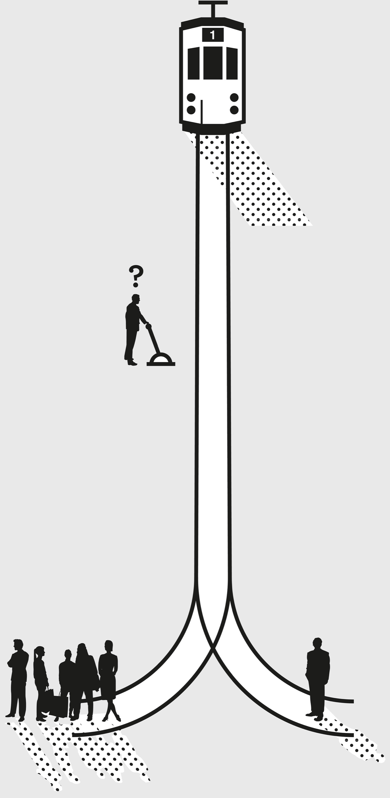

> Creativity is intelligence having fun.
>
> —Anonymous[[1]](#s0032-33-Notes-EndnoteNumber53 "note")

Thought experiments can be defined as “devices of the imagination used to investigate the nature of things.”[[2]](#s0032-33-Notes-EndnoteNumber54 "note") Many disciplines, such as philosophy and physics, make use of thought experiments to examine what can be known. In doing so, they open new avenues for inquiry and exploration.

Thought experiments are powerful because they help us learn from our mistakes and avoid future ones. They let us evaluate the potential consequences of our actions, take on the impossible, and reexamine history to make better decisions. They can help us figure out both what we really want and the best way to get there.

## The Ovarian Lottery

We can use thought experiments to reveal blind spots.

Warren Buffett, one of the most famous investors in the history of the world, often uses thought experiments to educate. In pointing out the role of luck, he says, *Imagine that it is twenty-four hours before you are going to be born, and a genie comes to you*.[[3]](#s0032-33-Notes-EndnoteNumber55 "note")

To further paraphrase this thought experiment: “The genie says you can determine the rules of the society you are about to enter and you can design anything you want. You get to design the social rules, the economic rules, the governmental rules. And those rules are going to prevail for your lifetime and your children’s lifetime and your grandchildren’s lifetime.”

“But,” he adds, “there is a catch.”

“You don’t know whether you’re going to be born rich or poor, male or female, infirm or able-bodied, in the United States or Afghanistan. All you know is that you get to take one ball out of a barrel.”

He goes on to tell you that through dumb luck, he and his business partner were born in the United States and, as a result, had a staggering advantage. He won the ovarian lottery.

While how hard you work might improve your relative success, the ovarian lottery determines much of your absolute success.

## Betting on Basketball

Suppose I asked you to tell me who would win in a game of basketball: NBA champion LeBron James or filmmaker Woody Allen? How much would you bet that your answer was correct?

I think you’d get me an answer quickly, and I hope you’d bet all you had.

Next, suppose I asked you to tell me who’d win in a game of basketball: NBA champion LeBron James or NBA champion Kevin Durant? How much would you bet that your answer was correct?

A little harder, isn’t it? Would you bet anywhere near all you had on being right?

Let’s think this through. You attempted to answer both questions in the same way—you imagined the contests. Perhaps more importantly, you *didn’t* attempt to answer either of them by calling up Messrs. James, Allen, and Durant and inviting them over for an afternoon of basketball. You simply simulated the games in your mind.

In the first case, your knowledge of James (young, tall, athletic, and skilled), Allen (old, small, frail, and funny), and the game of basketball gave you a clear mental image. The disparity between the players’ abilities makes the question (and the bet) a total no-brainer.

In the second case, your knowledge of James and Durant may well be extensive, but that doesn’t make it an easy bet. They’re both professional basketball players who are quite similar in size and ability, and both of them are likely to go down as among the best ever to play the game. It’s doubtful that one is *much* better than the other in a one-on-one match. The only way to answer the question for sure would be to see them play. And even then, a one-off contest is not going to be definitive.

A better way to answer the “who would win” question is through a remarkable ability of the human brain—the ability to conduct a detailed thought experiment. Its chief value is that it lets us do things in our heads we cannot do in real life, and so explore situations from more angles than we can physically examine and test for.

Thought experiments are more than daydreaming. To be useful, they require the same rigor as a traditional experiment. Much like the scientific method, a thought experiment generally has the following steps:

1. Ask a question.
2. Conduct background research.
3. Construct a hypothesis.
4. Test with (thought) experiments.
5. Analyze outcomes and draw conclusions.
6. Compare to hypothesis and adjust accordingly (new question, etc.).

In the James/Allen experiment above, we started with a question: Who would win in a game of basketball? If you didn’t already know who those people were, finding out would have been a necessary piece of background research. Then you would come out with your hypothesis (James all the way!) and think it through.

One of the real powers of the thought experiment is that there is no limit to the number of times you can change a variable to see if it influences the outcome. In order to place your bet, you would want to estimate: In how many possible basketball games does Woody Allen beat LeBron James? Out of a hundred thousand game scenarios, Allen probably wins only in the few where LeBron starts the game by breaking an ankle. Experimenting to discover the full spectrum of possible outcomes gives you a better appreciation for what you can influence and what you can reasonably expect to happen.

Let’s now explore a few areas in which thought experiments are tremendously useful.

1. Imagining physical impossibilities
2. Reimagining history
3. Intuiting the nonintuitive

**Imagining physical impossibilities:** Albert Einstein was a great user of the thought experiment because it is a way to logically carry out a test in one’s own head that would be very difficult or impossible to perform in real life. With this tool, we can solve problems with intuition and logic whose conditions cannot be demonstrated physically.

One of Einstein’s notable thought experiments involved an elevator.[[4]](#s0032-33-Notes-EndnoteNumber56 "note") Imagine you were in a closed elevator, feet glued to the floor. Absent any other information, would you be able to know whether the elevator was in outer space, with a string pulling the elevator upward at an accelerating rate, or sitting on Earth, being pulled down by gravity? By running the thought experiment, Einstein concluded that you would not.

This led to the formulation of Einstein’s second major theory, the general theory of relativity—his universal theory of gravity. Einstein’s hypothesis was that the force you feel from acceleration and the force you feel from gravity don’t just *feel* the same—they are the same! Gravity, he decided, must work similarly to the accelerating elevator. We can’t build elevators in space, but we can still define some of the properties they would have if we could. This gives us enough information to test the hypothesis. Eventually, Einstein worked it all out—mathematically and in great detail—but he started with a simple thought experiment, impossible to actually perform.

This type of thought experiment need not apply only to physics and is reflected in some of our common expressions. When we say, “if money were no object” or “if you had all the time in the world,” we are asking someone to conduct a thought experiment, because removing that variable (money or time) is physically impossible. In reality, money is always an object, and we never have all the time in the world. But the act of detailing the choices we would make in these alternate realities that have properties otherwise similar to our current one—doing the thought experiment—is what leads to insights regarding what we value in life and where to focus our energies.

## The Trolley Experiment

Thought experiments are often used to explore ethical and moral issues. When you are dealing with questions of life and death, obviously it is not recommended to kill a bunch of people in order to determine the most ethical course of action. This, then, is where a thought experiment is extremely valuable.

One of the most famous of this type is the trolley experiment. It goes like this: Say you are the driver of a trolley that is out of control. You apply the brakes, and nothing happens. Ahead of you are five people who will die should your trolley continue on the track. At the last moment, you notice a spur that has only one person on it. What do you do? Do you continue on and kill the five, or do you divert and kill the one?

This experiment was first proposed in modern form by Philippa Foot in her paper “The Problem of Abortion and the Doctrine of the Double Effect,” and further considered extensively by Judith Jarvis Thomson in “The Trolley Problem.” In both cases, the value of the thought experiment is clear. The authors were able to explore situations that would be physically impossible to reproduce without causing serious harm and, in so doing, significantly advanced certain questions of morality. Moreover, the trolley problem remains relevant to this day, as technological advances often ask us to define when it is acceptable, and even desirable, to sacrifice one to save many (and, lest you think this is always the case, Thomson conducts another great thought experiment, considering a doctor killing one patient to save five through organ donation).[[5]](#s0032-33-Notes-EndnoteNumber57 "note")

**Reimagining history:** A familiar use of the thought experiment is to reimagine history. This one we all perform, all the time. What if I hadn’t been stuck at the airport bar where I met my future business partner? Would World War I have started if Serbian nationalist Gavrilo Princip hadn’t shot the archduke of Austria in Sarajevo? If Cleopatra hadn’t found a way to meet Caesar, would she still have been able to take the throne of Egypt?

These approaches are called the *historical counterfactual and semifactual*. If Y happened instead of X, what would the outcome have been? Would the outcome have been the same?

As popular—and generally useful—as counter- and semifactuals are, they are also the areas of thought experiment with which we need to use the most caution. Why? Because history is what we call a chaotic system, wherein a small change in the beginning conditions can cause a *very* different outcome down the line. This is where the rigor of the scientific method is indispensable if we want to draw conclusions that are useful.

To understand it, let’s think about another chaotic system we’re all familiar with: the weather. Why is it that we can predict the movement of the stars but we can’t predict the weather more than a few weeks out, and even then, not altogether reliably? The reason is because weather is *highly* chaotic. Any infinitesimally small error in our calculations today will change the result down the line, as rapid feedback loops occur throughout time. Since our measurement tools are not infinitely accurate, and never will be, we are stuck with the unpredictability of chaotic systems.

Compared to human systems, one could say weather is pretty reliable stuff. As anyone who’s seen *Back to the Future* knows, a small change in the past could have a massive, unpredictable effect on the future. Thus, running historical counterfactuals is an easy way to accidentally mislead yourself. We simply don’t know what else would have occurred had Cleopatra not met Caesar, or had you not been stuck at that airport. The potential outcomes are too chaotic.

But we can use thought experiments to *explore* unrealized outcomes—to rerun a process as many times as we like in order to see what else could have occurred and learn more about the limits we have to work with.

The events that happened in history are but one realization of the historical process—*one* possible outcome among a large variety of possible outcomes. They’re like a deck of cards that has been dealt only one time. All the things that didn’t happen, but could have if some little thing went another way, are invisible to us—that is, until we use our brains to generate these theoretical worlds via thought experiments.

If we can also factor in the approximate probability of these occurrences, relative to the scope of all possible ones, we can learn what the most likely outcomes are. Sometimes, it is easy to imagine ten different ways a situation could have played out differently, but more of a stretch to change the variables and still end up with the same thing.

So, let’s try it. Start with a question: What if Gavrilo Princip hadn’t shot Archduke Franz Ferdinand? That single act has often been credited with launching World War I, so it is a question worth asking. If we conclude the assassination started a chain reaction of which war was the inevitable result, it would certainly tell us a lot about certain causal relationships in politics, diplomacy, and possibly human psychology.

Then we need to do our background research. What do we need to know to be able to answer this question? So we look into it—treaties, conflicts, alliances, interests, personalities—enough to be able to formulate a hypothesis.

An immediate response to the assassination came two days later, on June 30, 1914. Austria changed its policy toward Serbia. Shortly after that, Germany offered full military support to Austria, and less than two months later, all of Europe was at war. Thus, a next step in our thought experiment might be to refine the question. Perhaps we’d ask something like, how did Princip’s assassination of the archduke influence Austrian policy toward Serbia?

Our hypothesis could be one of the following:

1. The assassination had no effect on policy.
2. The assassination had partial effect on policy.
3. The assassination had total effect on policy.

To test any one of these, we run the experiment in our heads. We sit back and think about what the world looked like in Sarajevo on June 28, 1914: the archduke and his wife being chauffeured in their car, Gavrilo Princip cleaning his gun somewhere. Now we imagine Princip gets stomach cramps from some bad food the night before. The archduke’s car makes it to its destination while Princip is curled up in bed. The archduke gives a speech, emphasizing peace. One of Princip’s gang tries to assassinate the archduke but fails. How does Austria react? Is the outcome demonstrably different from what they actually did?

Princip wasn’t a lone wolf, and there was a lot of resentment in Serbia toward Austria. How could the situation be changed to lead to a different Austrian policy? Given the climate at the time, is our hypothetical situation realistic? Meaning, can you construct a historically accurate scenario in which no events come to pass that prompt Austria’s policy change? How many Serbians would have to get the stomach flu?

One of the goals of a thought experiment like this is to understand the situation enough to identify the decisions and actions that had impact. This process doesn’t provide definitive answers, such as whether the assassination did, or did not, cause World War I. What you are trying to get to is a rough idea of how much it may have contributed to starting the war. The more scenarios you can imagine where war comes to pass without the assassination, the weaker the case for it being the critical cause. Thus, by exploring the realistic relationships between events, you can better understand the most likely effects of any one decision.

## Reducing the Role of Chance

Let’s try a real-world example. Suppose you were to buy a hundred thousand dollars of stock in Google, with 50 percent paid for in cash and 50 percent borrowed from the brokerage firm. (They call this a “margin loan.”)

A few years later, the stock price has doubled: That means your $100,000 is worth $200,000. Since you still owe the brokerage $50,000, your own $50,000 is now worth $150,000—you’ve *tripled* your money! You consider yourself a financial genius.

Before we land on that conclusion, though, let’s run our Theoretical World Generator a bunch of times in our head. What else *could* have happened but didn’t?

Google *could* have gone down 50 percent before it went up 100 percent—nearly all stocks on the exchange have had this happen to them at some time or another. In fact, Google *could* have gone down 90 percent! The whole New York Stock Exchange did just that between 1929 and 1932.

What if something like that *had* happened? The brokerage would have called in your margin loan: Game over, thanks for playing. You would have been worth zero.

Now, return to the beginning of the chapter. If you’re going to buy Google on margin, is your bet that Google won’t go down 50 percent more similar to the LeBron/Allen thought experiment, or the LeBron/Durant thought experiment? Running through the scenario a hundred thousand times, how many times do you go broke, and how many times do you triple your dough?

This exercise gives you some real decision-making power. It tells you about the limits of what you know and what you should attempt. It tells you, in an imprecise but useful way, a lot about how smart or stupid your decisions were, regardless of the actual outcome. It makes you aware of your process, so that even if the results are good, you can recognize when this was all down to luck and maybe you should work on your decision-making process to reduce the role of chance.

**Intuiting the nonintuitive:** One of the uses of thought experiments is to improve our ability to intuit the nonintuitive. In other words, a thought experiment allows us to verify whether our natural intuition is correct by running experiments in our deliberate, conscious minds that make a point clear.

An example of this is the famous “veil of ignorance” proposed by philosopher John Rawls in his influential book *A Theory of Justice*. To figure out the most fair and equitable way to structure society, he proposed that the designers of said society operate behind a veil of ignorance. This meant that they could not know who they would be in the society they were creating. If they designed the society without knowing their economic status, their ethnic background, their talents and interests, or even their gender, they would have to put in place a structure that was as fair as possible in order to guarantee the best possible outcome for themselves.[[6]](#s0032-33-Notes-EndnoteNumber58 "note")

Our initial intuition regarding what is fair in a society is likely to be challenged during the “veil of ignorance” thought experiment. When confronted with the question of how best to organize society, we have a general feeling that it should be “fair.” But what exactly does this mean? We can use this thought experiment to test the likely outcomes of different rules and structures to come up with an aggregate of what is most fair.

We need not be constructing the legislation of entire nations for this type of thinking to be useful. Think, for example, of a company’s human resources policies on hiring, office etiquette, or parental leave. What kind of policies would you design or support if you didn’t know what your role in the company was, or even anything about who you were?

## Conclusion

Thought experiments are the sandbox of the mind, the place where we can play with ideas without constraints. They’re a way of exploring the implications of our theories, of testing the boundaries of our understanding. They offer a powerful tool for clarifying our thinking, revealing hidden assumptions, and showing us unintended consequences.

The power of thought experiments lies in their ability to create a simplified model of reality where we can test our ideas. In the real world, there are always confounding factors, messy details that obscure the core principles at work. But in a thought experiment, we can strip away the noise and focus on the essence of the problem.

Thought experiments offer a reminder that some of the most profound insights and innovations start with a simple question: What if?
