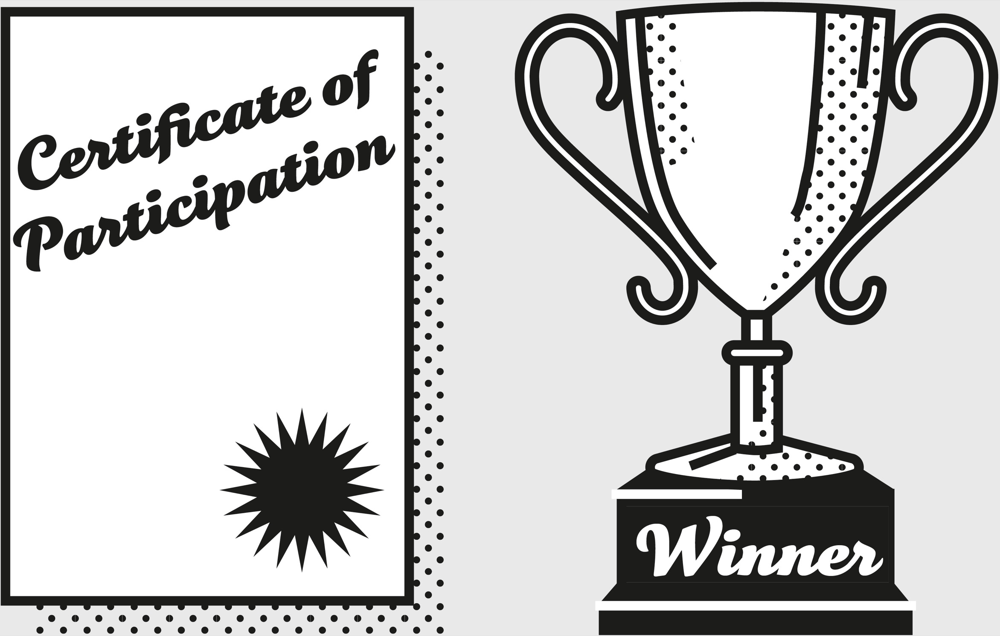

## Supporting Idea: Necessity and Sufficiency

We often make the mistake of assuming that having some necessary conditions in place means that we have the sufficient conditions in place for our desired event or effect to occur. The gap between the two is the difference between becoming a published author and becoming J. K. Rowling. Certainly, you have to know how to write well to become either, but knowing how to write well isn’t sufficient to guarantee you’ll become a Rowling. This is somewhat obvious to most. What’s not obvious is that the gap between what is necessary to succeed and what is sufficient is often luck, chance, or some other factor beyond your direct control.

Assume you wanted to make it into the *Fortune* 500. Capital is necessary but not sufficient. Hard work is necessary but not sufficient. Intelligence is necessary but not sufficient. Billionaire success takes all of those things and more, *plus* a lot of luck. That’s a big reason that there’s no recipe for achieving it.

Winning a military battle is a great example of necessity and sufficiency. It is necessary to prepare for the battle by evaluating the strength and tactics of your enemy, and by developing your own plan. You need to address logistics, such as supply chains, and have a comprehensive strategy that allows flexibility to respond to the unexpected. These things, however, are not enough to win the battle. Without them, you definitely won’t be successful, but on their own they are not sufficient to guarantee success.

This concept is easily demonstrated in sports as well. To be successful at a professional level in any sport depends on some necessary conditions: you must be physically capable of meeting the demands of that sport, and have the time and means to train. Meeting these conditions, however, is not sufficient to guarantee a successful outcome. Many hardworking, talented athletes are unable to break into the professional ranks.

In mathematics, they call these groupings *sets*. The set of conditions necessary to become successful is a part of the set that is sufficient to become successful. But the sufficient set itself is far larger than the necessary set. Without that distinction, it’s too easy for us to be misled by the wrong stories.

