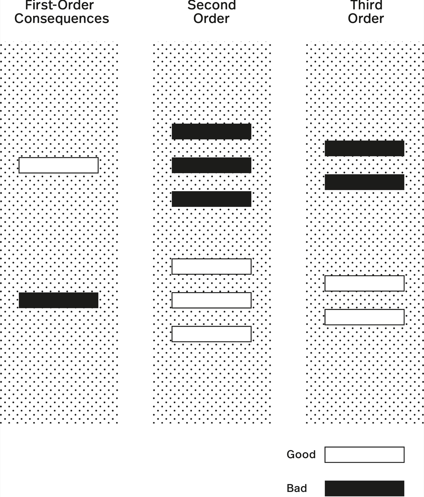
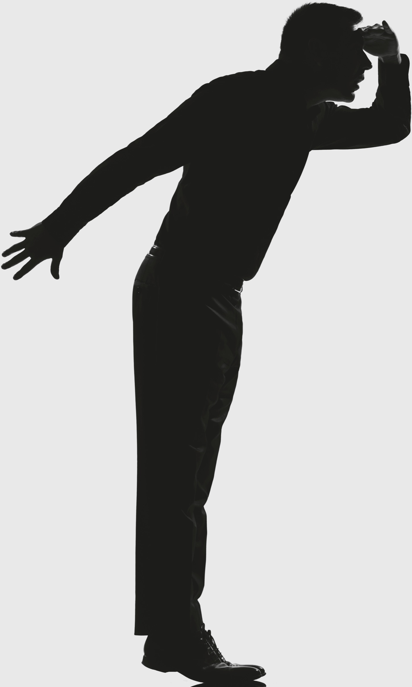
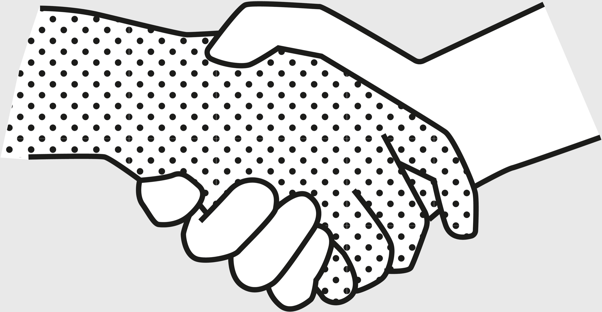

> Technology is fine, but the scientists and engineers only partially think through their problems. They solve certain aspects, but not the total, and as a consequence it is slapping us back in the face very hard.
>
> —Barbara McClintock[[1]](#s0032-33-Notes-EndnoteNumber59 "note")

Almost everyone can anticipate the immediate results of their actions. However, few people think about what happens next.

First-order thinking is easy and common. Second-order thinking is harder and requires thinking further ahead and thinking holistically. It requires us to consider not only our actions and their immediate consequences, but the subsequent effects of those actions as well. Failing to consider the second- and third-order effects of our decisions can unleash disaster.

First-order thinking is almost always about satisfying the immediate problem. Second-order thinking, on the other hand, avoids problems before they happen by asking, “And then what?”

Without second-order thinking, it can be hard to appreciate just how often what appears to solve the immediate problem takes you further away from your objective. First-order thinking tells you the chocolate bar tastes good and will satisfy your cravings. Second-order thinking tells you that when the sugar high wears off, you’ll crash.

It is often easier to find examples of when second-order thinking *didn’t* happen—when people did not consider the effects of the effects. When someone tried to do something good, or even just benign, and instead brought calamity, we can safely assume the negative outcomes weren’t factored into their original thinking. Very often, the second level of effect is not considered until it’s too late. This concept is often referred to as the “Law of Unintended Consequences” for this very reason.

We see examples of this oversight throughout history. The British are a well-intentioned nation with an ample supply of smart politicians. However, during its colonial rule of India, the British government began to worry about the number of venomous cobras in Delhi. To reduce the population, they instituted a reward for every dead snake brought to officials. In response, Indian citizens dutifully began breeding the snakes to slaughter and bring to officials. The snake problem became worse than when the government first intervened, because the British officials didn’t think at the second level.

Second-order effects occur even with something as simple as adding traction on tires: it seems like such a great idea, because the more traction you have, the less likely you are to slide, the faster you can stop, and, thus, the safer you are. However, the second-order effects are that your engine must work harder to propel the car, you get worse gas mileage (releasing more detrimental carbon dioxide into the atmosphere), and you leave more rubber particles on the road.

This is why any comprehensive thought process considers the effects of the effects of a decision seriously. You’re going to have to deal with them anyway. The genie never goes back in the bottle; you can never delete consequences to arrive back at the original starting conditions.

> Stupidity is the same as evil if you judge by the results.
>
> —Margaret Atwood[[2]](#s0032-33-Notes-EndnoteNumber60 "note")

In an example of second-order-thinking deficiency, we have been feeding antibiotics to livestock for decades, to make the resulting meat safer and cheaper. Only in recent years have we begun to realize that in doing so, we have helped create bacteria that we cannot defend against.

In 1963, UC Santa Barbara ecologist Garrett Hardin proposed his First Law of Ecology: “You can never merely do one thing.”[[3]](#s0032-33-Notes-EndnoteNumber61 "note") We operate in a world of multiple, overlapping connections, like a web, with many significant, yet obscure and unpredictable, relationships. Hardin developed second-order thinking into a tool, showing that if you don’t consider “the effects of the effects,” you can’t really claim to be doing any thinking at all.

When it comes to the overuse of antibiotics in meat, the first-order consequence is that the animals gain more weight per pound of food consumed, and thus, there is profit for the farmer. Animals are sold by weight, so the less food you need to use to bulk them up, the more profit you make when you go to sell them. The second-order effects, however, include many serious, negative consequences. The bacteria that survive this continued antibiotic exposure are antibiotic resistant. That means that the agricultural industry, when using these antibiotics as bulking agents, is allowing massive numbers of drug-resistant bacteria to become part of our food chain.

High degrees of connection make second-order thinking all the more critical, because denser webs of relationships make it easier for actions to have far-reaching consequences. You may be focused in one direction, not recognizing that the consequences of your decisions are rippling out all around you. Things are not produced and consumed in a vacuum.

> When we try to pick out anything by itself, we find it hitched to everything else in the Universe.
>
> —John Muir[[4]](#s0032-33-Notes-EndnoteNumber62 "note")

Second-order thinking is not a way to predict the future. You are only able to think of the likely consequences of your decisions’ consequences based on the information available to you. However, this is not an excuse to power ahead and wait for post facto scientific analysis.

Could the consequences of putting antibiotics in livestock feed have been anticipated? Likely, yes, by anyone with even a limited understanding of biology. We know that organisms evolve. They adapt based on environmental pressures, and those with shorter life cycles, like bacteria, can do it quite quickly, because they have more opportunities to do so. Antibiotics, by definition, kill bacteria. Bacteria, just like all other living things, want to survive. The pressures put on them by continued exposure to antibiotics increase their pace of evolution. Over the course of many generations, eventually, mutations will occur that allow certain bacteria to resist the effects of the antibiotics. These are the bacteria that will then reproduce more rapidly, creating the situation we are now in.

## Second-Order Problem

Warren Buffett used a very apt metaphor once to describe the second-order problem, likening it to a crowd at a parade: Once a few people decide to stand on their tiptoes to see better, *everyone has to stand on their tiptoes*. No one can see any better, but they’re all worse off.[[5]](#s0032-33-Notes-EndnoteNumber63 "note")

Second-order thinking teaches us two important concepts that underline the utility of this model. If we’re interested in understanding how the world works, we must think about second- and subsequent-level effects. We must understand that just because there is no immediate and visible impact from our decisions doesn’t mean that we are not moving closer to or further from our objectives. How often is short-term gain worth protracted, long-term pain?

Let’s look at two areas where second-order thinking can be used to great benefit:

1. Prioritizing long-term interests over immediate gains
2. Constructing effective arguments

## Prioritizing Long-Term Interests

Thinking long-term eliminates a lot of poor behavior. Most people prefer to give in to instant gratification. If we want to avoid problems, however, we need to see past the immediate moment and into the future. If we forgo the immediate pleasure of candy, we improve our long-term health. The first-order effect of candy is the amazing feeling triggered by an influx of pure sugar in our system. But what are the second-order effects of regular candy consumption? Is that what I want my body or life to look like in ten years? Second-order thinking involves asking ourselves if what we are doing now is moving us closer to or further away from our objectives.

The most dangerous form of short-term thinking is one that doesn’t understand that just because results are not visible doesn’t mean they are not accumulating. Thinking long-term helps us see how the accumulation of tiny gains or losses moves us toward or away from our intended future.

Finding historical examples of second-order thinking can be tricky, because we don’t want to evaluate based solely on the outcome: “It all turned out well, so he must have thought through the consequences of his actions.” Even if you can glimpse the long-term gain from your short-term pain, there is no guarantee you’ll get there.

In 48 BC, Cleopatra of Egypt was in a terrible position.[[6]](#s0032-33-Notes-EndnoteNumber64 "note") Technically co-regent with her brother, in a family famous for murdering siblings, she was encamped in a swampy desert, ousted from the palace, with no solid plan for how to get back. She was queen, but she had made a series of unpopular decisions that left her with little political support and that gave her brother ample justification for trying to have her assassinated. What to do?

At the same time, the great Roman general Caesar arrived in Egypt, chasing down his enemy Pompey and making sure the Egyptians knew who really was in charge on the Mediterranean. Egypt was an incredibly fertile, wealthy country, and as such was of great importance to the Romans. The way they inserted themselves in Egypt, however, made them extremely unpopular there.

To survive, Cleopatra had to make some tough decisions. Should she try to work things out with her brother? Should she try to marshal some support from another country? Or should she try to align herself with Caesar?

In *Cleopatra: A Life*, Stacy Schiff explains that even in 48 BC, at the age of twenty-one, Cleopatra would have had a superb political education, based on both historical knowledge and firsthand exposure to the tumultuous events of life on the Mediterranean. She would have observed actions taken by her father, Auletes, as well as various family members, that resulted in exile, bribery, and murder from either a family member, the Romans, or the populace. She would have known that there were no easy answers. As Schiff explains, “What Auletes passed down to his daughter was a precarious balancing act. To please one constituency was to displease another. Failure to comply with Rome would lead to intervention. Failure to stand up to Rome would lead to riots.”[[7]](#s0032-33-Notes-EndnoteNumber65 "note")

In this situation, it was thus imperative that Cleopatra consider the second-order effects of her actions. Short-term gain might easily lead to execution (as indeed it already had for many of her relatives). If she wanted to be around for a while, she needed to balance her immediate goals of survival and possession of the throne with the future need for support to stay on it.

In 48 BC, Cleopatra chose to align herself with Caesar. The first-order effects of this decision, it seems likely she would have known: namely, that it would anger her brother, who would increase his plotting to have her killed, and that it would anger the Egyptian people, who didn’t want a Roman involved in their affairs. She probably anticipated that there would be short-term pain, and there was. Cleopatra effectively started a civil war, including a siege on the palace that left her and Caesar trapped there for months. In addition, she had to be constantly vigilant against the assassination schemes of her brother. So why did she do it?

We will never know for sure. We can only make an educated guess. But given that Cleopatra ruled Egypt quite successfully for many years after these events, her decision was probably based on seeing the effects of the effects: if she could somehow make it through the short-term pain, her leadership had a much greater chance of being successful with the support of Caesar and Rome than without it. As Schiff notes, “The Alexandrian War gave Cleopatra everything she wanted. It cost her little.”[[8]](#s0032-33-Notes-EndnoteNumber66 "note") In winning the civil war, Caesar got rid of all major opposition to Cleopatra and firmly aligned himself with her reign.

Being aware of second-order consequences and using them to guide your decision making may mean the short term is less spectacular, but the payoffs for the long term can be enormous. By delaying gratification now, you will save time in the future. You won’t have to clean up the mess you made on account of not thinking through the effects of indulging your short-term desires.

## Developing Trust for Future Success

Trust and a sense of trustworthiness are the results of multiple interactions. This is why second-order thinking is so useful and valuable. Going for the immediate payoff in our interactions with people, unless the result is a win-win, almost always guarantees that interaction will be a one-off. Maximizing benefits is something that becomes possible only over time. Thus, considering the effects of the effects of our actions on others, or on our reputations, is critical to getting people to trust us and to enjoying the benefits of cooperation that come with that trust.[[9]](#s0032-33-Notes-EndnoteNumber67 "note")

**Constructing effective arguments:** Second-order thinking can help you avert problems and anticipate challenges that you can then address in advance.

For example, you construct arguments every day: convincing your boss to take a chance on a new product, convincing your spouse to try a new parenting technique. Life is filled with the need to be persuasive. Arguments are more effective when we demonstrate that we have considered the second-order effects of a decision and put effort into verifying that these are desirable as well.

In late-eighteenth-century England, women had very few rights. Philosopher Mary Wollstonecraft was frustrated that this lack of rights limited a woman’s ability to be independent and make choices on how to live her life. Instead of arguing, however, for why women should have rights, she recognized that she had to demonstrate the value that these rights would confer. She explained the benefits to society that would be realized because of the granting of those rights. She argued for the education of women because it would, in turn, make them better wives and mothers, more able to both support themselves and raise smart, conscientious children.

Her thoughts, from her book *A Vindication of the Rights of Woman*, are a demonstration of second-order thinking:

> Asserting the rights which women in common with men ought to contend for, I have not attempted to extenuate their faults; but to prove them to be the natural consequence of their education and station in society. If so, it is reasonable to suppose that they will change their character, and correct their vices and follies, when they are allowed to be free in a physical, moral, and civil sense.[[10]](#s0032-33-Notes-EndnoteNumber68 "note")

Empowering women was a first-order effect of recognizing that women should have rights. But by discussing the logical consequences this empowerment would have on society—the second-order effects—Wollstonecraft started a conversation that eventually resulted in what we now call feminism. Not only would women eventually get freedoms they deserved, they would become better women and better members of society.

## A Word of Caution

Second-order thinking must be tempered in one important way: you can’t let it lead to the paralysis of the “slippery slope effect,” the idea that if we start with action A, everything after is a slippery slope down to hell, with an inevitable chain of consequences including B, C, D, E, and F.

Garrett Hardin smartly addresses this danger in *Filters Against Folly*:

> Those who take the wedge (Slippery Slope) argument with the utmost seriousness act as though they think human beings are completely devoid of practical judgment. Countless examples from everyday life show the pessimists are wrong…. If we took the wedge argument seriously, we would pass a law forbidding all vehicles to travel at any speed greater than zero. That would be an easy way out of the moral problem. But we pass no such law.[[11]](#s0032-33-Notes-EndnoteNumber69 "note")

In practical life, everything has limits. Even if we consider secondary and subsequent effects, we can only go so far. During waves of prohibition fever in the United States and elsewhere, conservative abstainers have frequently made the case that taking even a *first* drink would be the first step toward a life of sin. They’re right: it’s true that drinking a beer *might* lead you to become an alcoholic. But not most of the time.

Thus, we need to avoid the slippery slope and the analysis paralysis it can lead to. Second-order thinking needs to evaluate the most likely effects and their most likely consequences, checking our understanding of what the *typical* results of our actions will be. If we worried about all possible effects of the effects of our actions, we would likely never do anything, and we’d be wrong. How you balance the need for higher-order thinking with practical, limiting judgment must be taken on a case-by-case basis.

## Conclusion

Second-order thinking is a method of thinking that goes beyond the surface level, beyond the knee-jerk reactions and short-term gains. It asks us to play the long game, to anticipate the ripple effects of our actions and to make choices that will benefit us not just today, but in the months and years to come.

Second-order thinking demands we ask: And then what?

Think of a chess master contemplating her next move. She doesn’t just consider how the move will affect the next turn, but how it will shape the entire game. She’s thinking many steps ahead. She’s considering not just her own strategy, but her opponent’s likely response. This is second-order thinking in action.

In our daily lives, we’re often driven by first-order thinking. We make decisions based on what makes us happy now, what eases our current discomfort or satisfies our immediate desires.

Second-order thinking asks us to consider the long-term implications of our choices, to make decisions based not just on what feels good now, but on what will lead to the best outcomes over time.

In the end, second-order thinking is about playing the long game. It’s about making choices not just for the next move, but for the entire journey.
