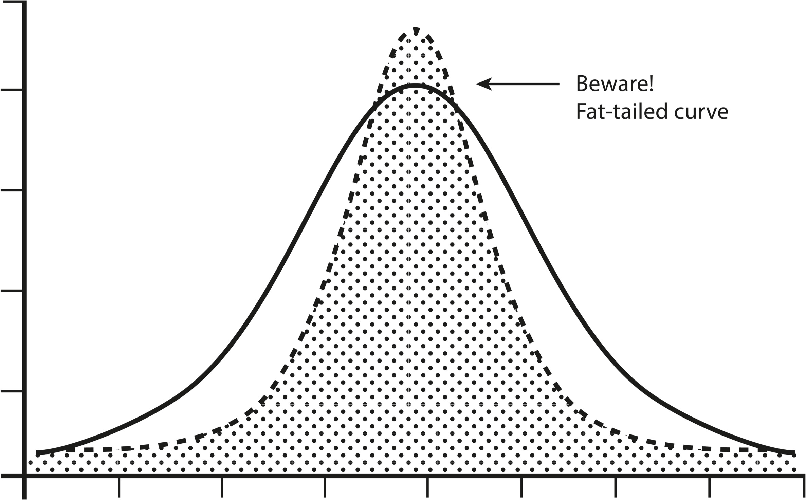

> The theory of probability is the only mathematical tool available to help map the unknown and the uncontrollable. It is fortunate that this tool, while tricky, is extraordinarily powerful and convenient.
>
> —Benoit Mandelbrot[[1]](#s0032-33-Notes-EndnoteNumber70 "note")

Probabilistic thinking is essentially trying to estimate, using some math and logic, the likelihood of any specific outcome occurring. It is one of the best tools we have to improve the accuracy of our decisions. In a world where each moment is determined by an infinitely complex set of factors, probabilistic thinking helps us deal with uncertainty. When we know these, our decisions can be more precise and effective.

## Are You Going to Get Hit by Lightning or Not?

It’s worth asking why we need to think in probabilities at all. Things either are or are not, right? Either we *will* get hit by lightning today or we *won’t*. The problem is, we just don’t know until we live out the day—which doesn’t help us at all when we make our decisions in the morning about what to do. The future is far from predetermined, and we can better navigate it by understanding the likelihood of events that could impact us.

Very few things are 100 percent certain. Nearly everything is a probability. Our lack of perfect information about the world gives rise to all of probability theory, and to its usefulness. We know now that the future is inherently unpredictable, because not all variables can be known, and even the smallest error in our data very quickly throws off our predictions. The best we can do is estimate the future by generating realistic, useful probabilities. So how do we do that?

Probability is everywhere, down to the very bones of the world. The probabilistic machinery in our minds—the cut-to-the-quick “heuristics” made so famous by the psychologists Daniel Kahneman and Amos Tversky—was evolved by the human species in a time before computers, factories, traffic, middle managers, and the stock market. It served us in a time when human life was about *survival* and still serves us well in that capacity.

## Conditional Probability

Conditional probability is like Bayesian thinking (see below) in practice but comes at it from a different angle. When you use historical events to predict the future, you must be mindful of the conditions that surrounded that event.

Events can be independent, like tossing a coin, or dependent. A dependent event is one whose outcome is conditional on what preceded it. Let’s say that the last three times I’ve hung out with you, we’ve gone for ice cream. I’ve picked vanilla each time. Do you conclude that vanilla is my favorite, and thus I will always choose it? You’d want to check first whether my choosing vanilla is independent or dependent. Am I the first to choose from among a hundred flavors? Or am I further down the line, when chocolate is no longer available?

My ice cream choice is independent if all the flavors are available each time someone in my group makes a choice. It is dependent if the preceding choices of my friends reduce what choices are available to me. In this case, the probability of my choosing vanilla is conditional on what is left after my friends make their choices.

Thus, using conditional probability means being very careful to observe the conditions preceding an event you’d like to understand.

But what about today—a time when, for most of us, survival is not so much the issue? Today, we want to *thrive*. We want to compete, and win. Mostly, we want to make good decisions in complex social systems that were not part of the world in which our brains evolved their (quite rational) heuristics.

To achieve these aims, we need to consciously add in a layer of probability awareness to our thinking.

What is probability awareness, and how can you use it to your advantage? There are three important aspects of probability that we need to explain so you can integrate them into your thinking, to get you into the ballpark and improve your chances of catching the ball:

1. Bayesian thinking
2. Fat-tailed curves
3. Asymmetries

**Bayesian thinking:** Thomas Bayes was an English minister in the first half of the eighteenth century, whose most famous work, “An Essay Toward Solving a Problem in the Doctrine of Chances,” was brought to the attention of the Royal Society by his friend Richard Price in 1763—two years after his death. The essay, the key to what we now know as Bayes’s Theorem, concerned how we should adjust probabilities when we encounter new data.

The core of Bayesian thinking (or Bayesian updating, as it can be called) is this: given that we have limited but useful information about the world, and are constantly encountering new information, we should consider what we already know—as much of it as possible—when we learn something new. Bayesian thinking allows us to use *all* relevant prior information in making decisions. Statisticians might call it a “base rate”—taking in outside information about past situations like the one you’re in.

Consider the headline “Violent Stabbings on the Rise.” Without Bayesian thinking, you might become genuinely afraid, because your chance of being a victim of assault or murder is higher than it was a few months ago. But a Bayesian approach will have you putting this information into the context of what you already know about violent crime: You know that violent crime has declined to its lowest rates in decades. Your city is safer now than it has been since this measurement was started. Let’s say your chance of being a victim of a stabbing last year was 1 in 10,000, or 0.01 percent. The article states, with accuracy, that violent crime has doubled. Your chance of being stabbed is now 2 in 10,000, or 0.02 percent. Is that worth being terribly worried about? The prior information here is key. When we factor it in, we realize that our safety has not really been compromised.

If we look at diabetes statistics in the United States, our application of prior knowledge would lead us to a different conclusion. Here, a Bayesian analysis indicates you should be concerned. In 1958, 0.93 percent of the population was diagnosed with diabetes. In 2015, it was 7.4 percent. When you look at the intervening years, the climb in diabetes diagnoses is steady, not a spike. So the prior relevant data, or “priors,” indicate a trend that is worrisome.

It is important to remember that priors themselves represent probability estimates. For each bit of prior knowledge, you are not putting it in a binary structure, saying it is true or not. You’re assigning it a *probability* of being true. Therefore, you can’t let your priors get in the way of processing new knowledge. In Bayesian terms, this is called the “likelihood ratio” or the “Bayes factor.” Any new information you encounter that challenges a prior simply means that the probability of that prior being true may be reduced. Eventually, some priors are replaced completely. Bayesian thinking is an ongoing cycle of challenging and validating what you believe you know. When making uncertain decisions, it’s nearly always a mistake not to ask: What are the relevant priors? What might I already know that I can use to better understand the reality of the situation?

**Fat-tailed curves:** Many of us are familiar with the bell curve, that nice, symmetrical wave that captures the relative frequency of so many things from heights to exam scores. The bell curve is great because it’s easy to understand and easy to use. Its technical name is “normal distribution.” If we know we are in a bell curve situation, we can quickly identify our parameters and plan for the most likely outcomes.

Fat-tailed curves are different. Let’s take a look.

Always be extra mindful of the tails: They might mean everything.

At first glance, the two figures seem similar enough. Common outcomes cluster together, creating a wave. The difference is in the tails. In a bell curve, the extremes are predictable. There can only be so much deviation from the mean. In a fat-tailed curve, there is no real cap on extreme events.

The more extreme events that are possible, the longer the tails of the curve get. Any one extreme event is still unlikely, but the sheer number of options means that we can’t rely on the most common outcomes as representing the average. The more extreme events that are possible, the higher the probability that one of them will occur. Crazy things are going to happen, and we have no way of identifying when.

## Orders of Magnitude

Nassim Nicholas Taleb puts his finger in the right place when he points out our *naive* use of probabilities. In *The Black Swan*, he argues that any small error in measuring the risk of an extreme event can mean we’re not just slightly off but *way* off—off by orders of magnitude, in fact. In other words, we’re not just 10 percent wrong but ten times wrong, or a hundred times wrong, or a thousand times wrong. Something we thought could happen only once every thousand years might be likely to happen in any given year! Using false prior information results in us underestimating the probability of the future distribution being different.[[2]](#s0032-33-Notes-EndnoteNumber71 "note")

Think of it this way: In a bell curve situation, such as displaying the distribution of heights or weights in a human population, there are outliers on the spectrum of possibility, but the outliers have a fairly well-defined scope. You’ll never meet a man who is ten times the size of an average man. But in a curve with fat tails, like wealth, the central tendency does not work the same way. You may regularly meet people who are ten, a hundred, or ten thousand times wealthier than the average person. That is a very different type of world.

Let’s reapproach the example of the risk of violence we discussed in relation to Bayesian thinking. Suppose you heard that you had a greater risk of slipping on the stairs and cracking your head open than being killed by a terrorist. The statistics, the priors, seem to back it up: a thousand people slipped on the stairs and died last year in your country, and only five hundred died in terrorist attacks. Should you be more worried about stairs or terror events? Some people use examples like these to prove that terror risk is low—since the recent past shows very few deaths, why worry?[[3]](#s0032-33-Notes-EndnoteNumber72 "note") The problem is in the fat tails: The risk of terror violence is more like wealth, while stair-slipping deaths are more like height and weight. In the next ten years, how many events are possible? How fat is the tail?

The important thing is not to sit down and imagine every possible scenario in the tail (which, by definition, is impossible) but to deal with fat-tailed domains in the correct way: by positioning ourselves to survive or even benefit from the wildly unpredictable future, by being the only ones thinking correctly and planning for a world we don’t fully understand.

## Antifragility

How do we benefit from the uncertainty of a world we don’t understand, one dominated by “fat tails”? Here, Nassim Nicholas Taleb’s work is again instructive. In his book *Antifragile*, he explains it thus: We can think about three categories of objects—ones that are *harmed* by volatility and unpredictability, ones that are *neutral* to volatility and unpredictability, and ones that *benefit* from it.[[4]](#s0032-33-Notes-EndnoteNumber73 "note") The last category is antifragile—like a package that *wants* to be mishandled. Up to a point, certain things benefit from volatility, and that’s how we want to be ourselves. Why? Because the world is fundamentally unpredictable and volatile, and large events—panics, crashes, wars, bubbles, and so on—tend to have a disproportionate impact on outcomes.

There are two ways to handle such a world: try to predict, or try to prepare. Prediction is tempting. For all of human history, seers and soothsayers have turned a comfortable trade. The problem is that nearly all studies of “expert” predictions in such complex real-world realms as the stock market, geopolitics, and global finance have shown again and again that, for the rare and impactful events in our world, predicting is impossible! It’s more efficient to prepare.

What are some ways we can prepare—arm ourselves with antifragility—so we can benefit from the volatility of the world?

The first one is what Wall Street traders would call “upside optionality”—that is, seeking out situations that we expect to have good odds of offering us opportunities. Take the example of attending a cocktail party where a lot of people you might like to know are in attendance. While nothing is *guaranteed* to happen—you may not meet those people, and if you do, it may not go well—you give yourself the benefit of serendipity and randomness. The worst thing that can happen is…nothing. One thing you know for sure is that you’ll never meet these people sitting at home. By going to the party, you improve your odds of encountering opportunity—your upside optionality.

The second thing we can do is to learn how to fail properly. Failing properly has two major components: First, never take a risk that will do you in—never get taken out of the game completely. Second, develop the personal resilience to *learn* from your failures and start again. If you follow these two rules, you can only fail temporarily.

No one likes to fail. It hurts. But failure carries with it one huge antifragile gift: learning. Those who are not afraid to fail (properly) have a huge advantage over the rest. What they learn makes them less vulnerable to the volatility of the world. They benefit from it, in true antifragile fashion.

Let’s say you’d like to start a successful business, but you have no business experience. Do you attend business school, or start a business that might fail? Business school has its benefits, but business itself—the rough, jagged real-world experience of it—teaches through rapid feedback loops of success and failure. In other words, trial and error carries the precious commodity of information.

The *Antifragile* mindset is a unique one. Whenever possible, try to create scenarios where randomness and uncertainty are your friends, not your enemies.

**Asymmetries:** Finally, you need to think about something we might call “metaprobability”—the probability that your probability estimates themselves are any good.

This massively misunderstood concept has to do with asymmetries. If you look at nicely polished stock pitches made by professional investors, nearly every time an idea is presented, the investor looks their audience in the eye and states that they think they’re going to achieve a rate of return of 20 to 40 percent per annum, if not higher. Yet *exceedingly* few of them ever attain that mark. It’s not because they don’t pick any winners—it’s because they get so many so wrong. They are consistently overconfident in their probabilistic estimates. (For reference, the general stock market in the United States, over a long period, has returned no more than 7 percent to 8 percent per annum, before fees.)

Another common asymmetry is people’s ability to estimate the effect of traffic on travel time. How often do you leave “on time” and arrive 20 percent early? Almost never? How often do you leave “on time” and arrive 20 percent late? All the time? Exactly. Your estimation errors are asymmetric, skewing in a single direction. This is often the case with probabilistic decision making.[[5]](#s0032-33-Notes-EndnoteNumber74 "note")

Far more probability estimates are wrong on the “over-optimistic” side than the “under-optimistic” side. You’ll rarely read about an investor who aimed for 25 percent annual return rates and who subsequently earned 40 percent over a long period of time, whereas you can throw a dart at *The Wall Street Journal* and hit the names of lots of investors who aim for 25 percent per annum with each investment and end up closer to 10 percent.

## The Spy World

Successful spies are very good at probabilistic thinking. High-stakes survival situations tend to make us evaluate our environment with as little bias as possible.

When Vera Atkins was second in command of the French unit of the Special Operations Executive (SOE), a British intelligence organization during World War II that reported directly to Winston Churchill,[[6]](#s0032-33-Notes-EndnoteNumber75 "note") she had to make hundreds of decisions by figuring out the probable accuracy of inherently unreliable information.

Atkins was responsible for the recruitment of British agents and their deployment into occupied France. She had to decide who could do the job and where the best sources of intelligence were. These were literal life-and-death decisions, and all were based in probabilistic thinking.

First, how do you choose a spy? Not everyone can go undercover in high-stress situations and make the contacts necessary to gather intelligence. The result of failure in France during the war was not getting fired; it was death. What factors of personality and experience show that a person is right for that job? Even today, with advancements in psychology, interrogation, and polygraph tests, it’s still a judgment call.

For Vera Atkins, in the 1940s, it was very much a process of assigning weight to the various factors and coming up with a probabilistic assessment of who had a decent chance of success. Who spoke French? Who had the necessary confidence? Who was too tied to family? Who had the problem-solving capabilities? From recruitment to deployment, her development of each spy was a series of continually updated educated estimates.

Getting an intelligence officer ready to go is only half the battle. Where do you send them? If your information was so great that you knew exactly where to go, you probably wouldn’t need an intelligence mission. Choosing a target is another exercise in probabilistic thinking. You need to evaluate the reliability of the information you have and the networks you have set up. Intelligence is not evidence. There is no chain of command or guarantee of authenticity.

The stuff coming out of German-occupied France was at the level of grainy photographs, handwritten notes that passed through many hands on the way back to headquarters, and unverifiable wireless messages sent quickly, sometimes sporadically, and with the operator under incredible stress. When deciding what to use, Atkins had to consider the relevance, quality, and timeliness of the information she had.

She also had to make decisions based not only on what had happened but on what possibly could. Trying to prepare for every eventuality would mean that spies would never leave home, but they had to somehow prepare for a good deal of the unexpected. After all, a spy’s job is often executed in highly volatile, dynamic environments. The women and men Atkins sent over to France worked in three primary occupations: organizers were responsible for recruiting locals, developing the network, and identifying sabotage targets; couriers moved information all around the country, connecting people and networks to coordinate activities; and wireless operators had to set up heavy communications equipment, disguise it, get information out of the country, and be ready to move at a moment’s notice. All these jobs were dangerous. The full scope of the threats was never completely identifiable. There were so many things that could go wrong, so many possibilities for discovery or betrayal, that it was impossible to plan for them all. The average life expectancy in France for one of Atkins’s wireless operators was six weeks.

Finally, the numbers suggest an asymmetry in the estimation of the probability of success of each individual agent. Of the four hundred agents that Atkins sent over to France, a hundred were captured and killed. This is not meant to pass judgment on her skills or smarts. Probabilistic thinking can only get you in the ballpark. It doesn’t guarantee 100 percent success.

There is no doubt that Atkins relied heavily on probabilistic thinking to guide her decisions in the challenging quest to disrupt German operations in France during World War II. It is hard to evaluate the success of an espionage career, because it is a job that comes with a lot of loss. Atkins was extremely successful in that her network conducted valuable sabotage to support the Allied cause during the war, but the loss of life this work entailed was significant.

## Conclusion

Probabilistic thinking is the art of navigating uncertainty. Successfully thinking in shades of probability means roughly identifying what matters, coming up with a sense of the odds, doing a check on our assumptions, and then deciding.

The challenge of probabilistic thinking is that it requires constant updating. As new information emerges, the probabilities change. What seemed likely yesterday may seem unlikely today. This both explains why probabilistic thinkers are always revising their beliefs with new data and why it’s so uncomfortable for many people.

It’s much easier to believe something false is true than deal with the fact that it might not be true. Being a probabilistic thinker means being willing to say, “I don’t know for sure, but based on the evidence, I think there’s a 63 percent chance of X.”

The rewards of probabilistic thinking are immense. By embracing uncertainty, we can make better decisions, avoid the pitfalls of overconfidence, and navigate complex situations with greater skill and flexibility. We can be more open-minded, more receptive to new ideas, and more resilient in the face of change.

## Insurance Companies

The most probability-acute businesses in the world are insurance companies—because they must be. When we think of insurance, we might think of life insurance (the probability of a policyholder dying at a certain age), or auto insurance (the probability of being in a car accident), or maybe home insurance (the probability of a tree falling on the house). With the statistics available to us, the probabilities of these things are easy to price and predict across a large enough population.

But insurance is deeply wide-ranging, and insurers will insure almost any event, for a price. Insurance policies have been taken out on Victoria’s Secret models’ legs, on baseball players’ arms, on the Pepsi Challenge and the NCAA tournament, and even on a famous country singer’s breasts!

How is this possible? Only with close attention to probability. What the great insurance companies in the world know how to do is pay attention to the important factors in a situation, even if they’re not totally predictable, and price accordingly.

What is the probability of a Victoria’s Secret model injuring her legs badly enough to end her career? One in 10,000? One in 100,000? Getting this calculation right would mean evaluating her lifestyle, her habits, her health, her family history—and coming up with a price and a set of conditions that are good enough, on average, to provide a profit. It’s not unlike handicapping a race at the horse track. You can always say yes to insuring, but the trick is to come up with the right price. For that, we need probability.
