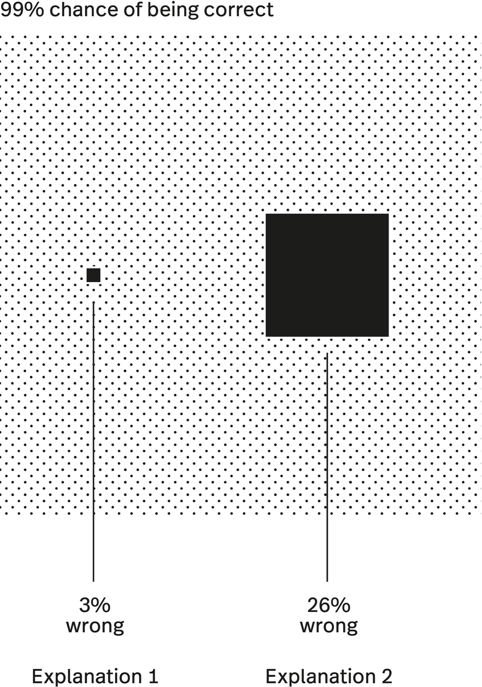
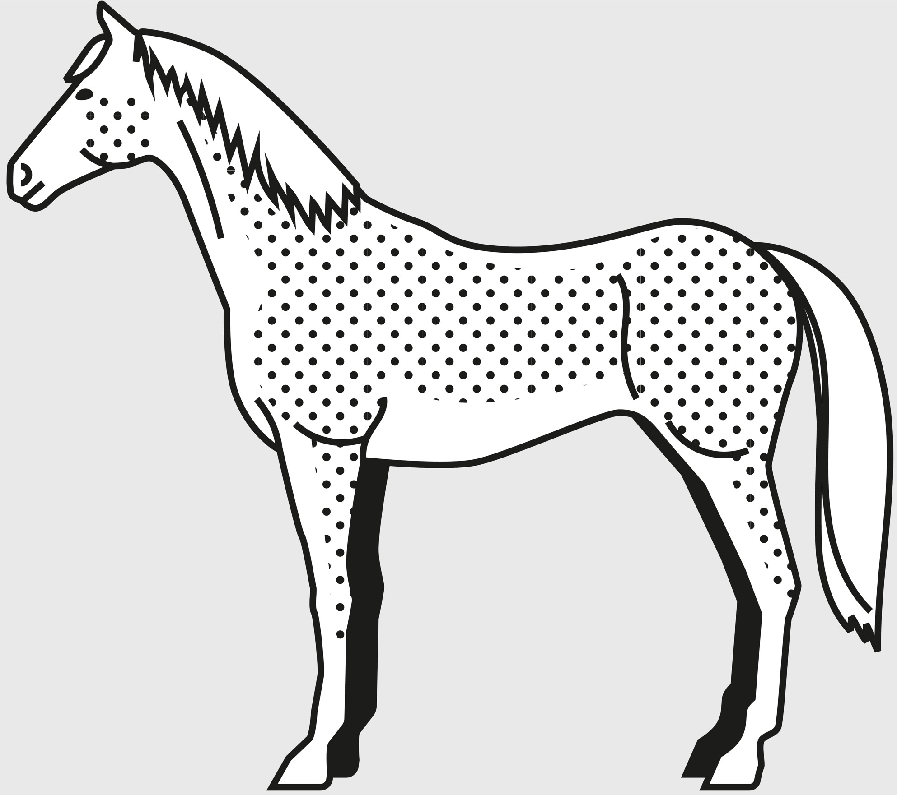

> Anybody can make the simple complicated. Creativity is making the complicated simple.
>
> —Charles Mingus[[1]](#s0032-33-Notes-EndnoteNumber93 "note")

Simpler explanations are more likely to be true than complicated ones. This is the essence of Occam’s razor, a classic principle of logic and problem solving. Instead of wasting your time trying to disprove complex scenarios, you can make decisions more confidently by basing them on the explanation that has the fewest moving parts.

The more complicated the explanation for something, the more skeptical you should be.

We all jump to overly complex explanations about something. Husband late getting home? What if he’s been in a car accident? Son grew a centimeter less than he did last year? What if there’s something wrong with him? Your toe hurts? What if you have bone cancer? Although it is possible that any of these worst-case scenarios could be true, without any other correlating factors, it is significantly more likely that your husband got caught up at work, you mismeasured your son, and your shoe is too tight.

We often spend lots of time coming up with very complicated narratives to explain what we see around us. From the behavior of people on the street to physical phenomena, we get caught up in assuming vast icebergs of meaning beyond the tips that we observe. This is a common human tendency, and it serves us well in some situations, such as creating art. However, complexity takes work to unravel, manage, and understand.

Occam’s razor is a great tool for avoiding unnecessary complexity by helping you identify and commit to the simplest explanation possible.

Named after the medieval logician William of Ockham, Occam’s razor is a general rule by which we select among competing explanations. Ockham wrote that “a plurality is not to be posited without necessity”—essentially, that we should prefer the simplest explanation with the fewest moving parts.[[2]](#s0032-33-Notes-EndnoteNumber94 "note"),[[3]](#s0032-33-Notes-EndnoteNumber95 "note") Simple explanations are easier to falsify, easier to understand, and generally more likely to be correct. Occam’s razor is not an iron law but a tendency and a mindset you can choose to use: if all else is equal—that is, if two competing models both have equal explanatory power—it’s more likely that the simple solution suffices.

Ockham himself did not derive this idea, which had been in use since antiquity. Nor was Ockham the last to note the value of simplicity. The principle was stated in another useful way by the eighteenth-century Scottish philosopher David Hume, in his famous *Enquiry Concerning Human Understanding.* Writing about the truth or untruth of miracles, Hume stated that we should default to skepticism about them.[[4]](#s0032-33-Notes-EndnoteNumber96 "note")

Why? It wasn’t simply that Hume was a buzzkill. He had a specific, Occam-like reason for being cautious about miracles. By definition, a miracle is something that has happened outside of our normal understanding of the way nature works. If the miracle was not outside of our common experience, we wouldn’t consider its occurrence miraculous. If there was a simple explanation for the occurrence based on mostly common knowledge, we likely wouldn’t pay much attention to it at all.

Therefore, the simplest explanation for a miracle is that the miracle witnesser is not describing the event correctly, or the miracle represents a more common phenomenon that we currently don’t properly understand. As scientist and writer Carl Sagan explains in *The Demon-Haunted World*:

> A multitude of aspects of the natural world that were considered miraculous only a few generations ago are now thoroughly understood in terms of physics and chemistry. At least some of the mysteries of today will be comprehensively solved by our descendants. The fact that we cannot now produce a detailed understanding of, say, altered states of consciousness in terms of brain chemistry no more implies the existence of a “spirit world” than a sunflower following the Sun in its course across the sky was evidence of a literal miracle before we knew about phototropism and plant hormones.[[5]](#s0032-33-Notes-EndnoteNumber97 "note")

The simpler explanation for a miracle is that there are principles of nature being exploited that we do not understand. This is Hume’s and Sagan’s point.

## Dark What?

In the mid-1970s, astronomer Vera Rubin had a very interesting problem. She had a bunch of data piling up about the behavior of galaxies that wasn’t explained by contemporary theories.[[6]](#s0032-33-Notes-EndnoteNumber98 "note"),[[7]](#s0032-33-Notes-EndnoteNumber99 "note"),[[8]](#s0032-33-Notes-EndnoteNumber100 "note")

Rubin had been observing the behavior of the Andromeda Galaxy and had noticed something very strange. As explained in an article on Astronomy.com, “The vast spiral seemed to be rotating all wrong. The stuff at the edges was moving just as fast as the stuff near the center, apparently violating Newton’s laws of motion (which also govern how the planets move around our Sun).”[[9]](#s0032-33-Notes-EndnoteNumber101 "note") This didn’t make any sense. Gravity should exert less pull on distant objects, which should move slower. But Rubin was observing something entirely different.

One possible explanation was something that had been theorized as far back as 1933, by Swiss astrophysicist Fritz Zwicky, who coined the phrase “dark matter” to describe a mass we couldn’t see but that was influencing the behavior of orbits in the galaxies. Dark matter became the simplest explanation for the observed phenomenon, and Vera Rubin has been credited with providing the first evidence of its existence. What is particularly interesting is that, to this day, no one has ever actually discovered dark matter.

Why are more complicated explanations less likely to be true? Let’s work it out mathematically. Take two competing explanations, each of which seems equally to explain a given phenomenon. If one of them requires the interaction of three variables, and the other the interaction of thirty variables—all of which *must* have occurred to arrive at the stated conclusion—which of these is more likely to be in error? If each variable has a 99 percent chance of being correct, the first explanation is only 3 percent likely to be wrong. The second, more complex explanation, is about nine times as likely to be wrong, or 26 percent. The simpler explanation is more robust in the face of uncertainty.

Dark matter is an excellent theory with a lot of explanatory power. As Lisa Randall explains in *Dark Matter and the Dinosaurs*, measurements of dark matter so far fit in exactly with what we understand about the universe. Although we can’t see it, we can make predictions based on our understanding of it and test those predictions. Randall writes, “It would be even more mysterious to me if the matter we can see with our eyes is all the matter that exists.”[[10]](#s0032-33-Notes-EndnoteNumber102 "note") Dark matter is currently the simplest explanation for certain phenomena we observe in the universe. The great thing about science, however, is that it continually seeks to validate its assumptions.

Carl Sagan wrote that “extraordinary claims require extraordinary proof.”[[11]](#s0032-33-Notes-EndnoteNumber103 "note") He dedicated much ink to rational investigation of extraordinary claims. He felt most, or nearly all, were susceptible to simpler and more parsimonious explanations. UFOs, paranormal activity, telepathy, and a hundred other seemingly mystifying occurrences could be better explained by the confluence of a few simple real-world variables—and, as Hume suggested, if they couldn’t, it was a lot more likely that we needed to update our understanding of the world than that a miracle had occurred.

And so, dark matter remains, right now, the simplest explanation for the peculiar behavior of galaxies. Scientists, however, continue to try to conclusively discover dark matter and thus to determine if our understanding of the world is correct. If dark matter eventually becomes too complicated an explanation, it could be that the data describes something we don’t yet understand about the universe. We can then apply Occam’s razor to update what is the simplest, and thus most likely, explanation.

Vera Rubin herself, after noting that scientists always felt as though they were ten years away from discovering dark matter, without ever closing the gap, was described by an interviewer as thinking, “The longer that dark matter went undetected…the more likely she thought the solution to the mystery would be a modification to our understanding of gravity.”[[12]](#s0032-33-Notes-EndnoteNumber104 "note") This claim, demanding a total overhaul of our established theories of gravity, would correspondingly require extraordinary proof!

## Simplicity Can Increase Efficiency

With limited time and resources, it is not possible to track down every theory with a plausible explanation of a complex, uncertain event. Without the filter of Occam’s razor, we are stuck chasing down dead ends. We waste time, resources, and energy.

The great thing about simplicity is that it can be so powerful. Sometimes unnecessary complexity just papers over the systemic flaws that will eventually choke us. Opting for the simple helps us make decisions based on how things really are. Here are two short examples of those who got waylaid chasing down complicated solutions when simple ones were most effective.

The ten-acre Ivanhoe Reservoir in Los Angeles provides drinking water for more than six hundred thousand people. Its nearly sixty million gallons of water are disinfected with chlorine, as is common practice.[[13]](#s0032-33-Notes-EndnoteNumber105 "note") Groundwater often contains elevated levels of a chemical called bromide. When chlorine and bromide mix, then are exposed to sunlight, they create a dangerous carcinogen called bromate.

To avoid poisoning the water supply, the LA Department of Water and Power (DWP) needed a way to shade the water’s surface. Brainstorming sessions had yielded only two infeasible solutions: building either a ten-acre tarp or a huge retractable dome over the reservoir. Then a DWP biologist suggested using “bird balls,” the floating balls that airports use to keep birds from congregating near runways. They required no construction, no parts, no labor, no maintenance, and cost forty cents each. Three million UV-deflecting black balls were eventually deployed in Ivanhoe and other LA reservoirs, a simple solution to a potentially serious problem.

In another life-and-death situation, in 1989, Bengal tigers killed about sixty villagers in India’s Ganges Delta.[[14]](#s0032-33-Notes-EndnoteNumber106 "note") No weapon seemed to work against them, including lacing dummies with live wires to shock the tigers away from attacking human populations.

Then a student at the Science Club of Calcutta noticed that tigers attacked only when they thought they were unseen and recalled that the patterns decorating some species of butterflies, beetles, and caterpillars look like big eyes, ostensibly to trick predators into thinking their prey is also watching them. The result: a human face mask, worn on the back of the head. Remarkably, no one wearing a mask was attacked by a tiger for the next three years; anyone killed by a tiger during that time either had refused to wear the mask or had taken it off while working.

## Occam’s Razor in the Medical Field

Occam’s razor can be quite powerful in the medical field, for both doctors and patients. Let’s suppose that a patient shows up at a doctor’s office with horrible, flulike symptoms. Are they more likely to have the flu or to have contracted Ebola?

This is a problem best solved by a concept we explored in the chapter on probabilistic thinking, called Bayesian updating. It’s a way of using general background knowledge in solving specific problems with new information. We know that, generally, the flu is far more common than Ebola, so when a good doctor encounters a patient with what looks like the flu, the simplest explanation is almost certainly the correct one. A diagnosis of Ebola means a call to the Centers for Disease Control and a quarantine—an expensive and panic-inducing mistake if the patient just has the flu. Thus, medical students are taught to heed the saying, “When you hear hoofbeats, think horses, not zebras.”

For patients, Occam’s razor is a good counter to hypochondria. Based on the same principles, you factor in the current state of your health to an evaluation of your current symptoms. Knowing that the simplest explanation is most likely to be true can help us avoid unnecessary panic and stress.

## A Few Caveats

One important counter to Occam’s razor is the difficult truth that some things are simply not that simple. The regular recurrence of fraudulent human enterprises like pyramid schemes and Ponzi schemes is not a miracle, but neither is it obvious. No simple explanation suffices, exactly. Such cons are a result of a complex set of behaviors, some happening almost by accident or luck, and some carefully designed with the intent to deceive. It isn’t a bit easy to spot the development of a fraud; if it was, they’d be stamped out early. Yet, to this day, frauds frequently grow to epic proportions before they are discovered.

Alternatively, consider the achievement of human flight. It too might seem like a miracle to our fourteenth-century friar, but it isn’t—it’s a natural consequence of applied physics. Still, it took a long time for humans to figure out because it’s not simple at all. In fact, the invention of powered human flight is highly counterintuitive, requiring an understanding of airflow, lift, drag, and combustion, among other difficult concepts. Only a precise combination of the right factors will do. You can’t know just enough to get the aircraft off the ground, you need to keep it in the air!

Simple as we wish things were, irreducible complexity, like simplicity, is a part of our reality. Therefore, we can’t use Occam’s razor to create artificial simplicity. If something cannot be broken down any further, we must deal with it as it is.

How do you know something is as simple as it can be? Think of computer code. Code can sometimes be excessively complex. In trying to simplify it, we would have to make sure it can still perform the functions we need it to. This is one way to understand simplicity: an explanation can be simplified only to the extent that it can still provide an accurate understanding.

## Occam’s Razor in Leadership

When Louis Gerstner took over IBM in the early 1990s, during one of the worst periods of struggle in its history, many business pundits called for a statement of his vision. What rabbit would Gerstner pull out of his hat to save Big Blue?

It seemed a logical enough demand—wouldn’t a technology company that had fallen behind need a grand vision of brilliant technological leadership to regain its place among the leaders in American innovation? As Gerstner put it, “The IBM organization, so full of brilliant, insightful people, would have loved to receive a bold recipe for success—the more sophisticated, the more complicated the recipe, the better everyone would have liked it.”

Smartly, Gerstner realized that the simple approach was most likely to be the effective one. His famous reply was that “the last thing IBM needs right now is a vision.” What IBM actually needed to do was to serve its customers, compete for business in the here and now, and focus on businesses that were already profitable. It needed simple, tough-minded business execution. By the end of the 1990s, Gerstner had provided exactly that, bringing IBM back from the brink without any brilliant visions or massive technological overhauls.[[15]](#s0032-33-Notes-EndnoteNumber107 "note")

## Conclusion

Occam’s razor is the intellectual equivalent of “keep it simple.”

When faced with competing explanations or solutions, Occam’s razor suggests that the correct explanation is most likely the simplest one, the one that makes the fewest assumptions.

This doesn’t mean the simplest theory is always true, only that it should be preferred until proven otherwise. Sometimes, the truth is complex, and the simplest explanation doesn’t account for all the facts.

The key to wielding this powerful model is understanding when it works for you and when it works against you. A theory that is too simple will fail to capture reality, and one that is too complex will collapse under its own weight.
