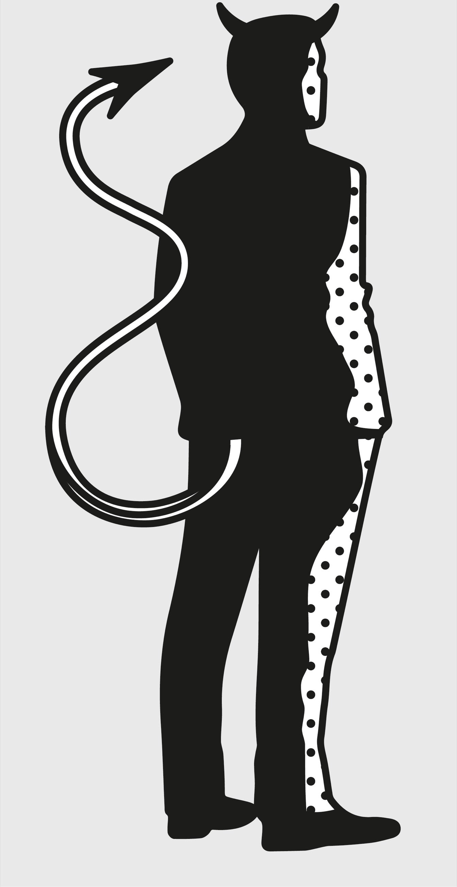

> I need to listen well so that I hear what is not said.
>
> —Thuli Madonsela[[1]](#s0032-33-Notes-EndnoteNumber108 "note")

Hard to trace in its origin, Hanlon’s razor states that we should not attribute to malice that which is more easily explained by stupidity. In a complex world, using this model helps us avoid paranoia and ideology. By not generally assuming that bad results are the fault of a bad actor, we look for options instead of missing opportunities. This model reminds us that people do make mistakes and demands that we ask if there is another reasonable explanation for the events that have occurred. The explanation most likely to be right is the one that contains the least amount of intent.

Assuming the worst intent is a habit that crops up all over our lives. Consider road rage, a growing problem in a world that is becoming short on patience and time. When someone cuts you off, to assume malice is to assume the other person has done a lot of risky work. In order for someone to deliberately get in your way, they have to notice you, gauge the speed of your car, consider where you are headed, and swerve in at exactly the right time to cause you to slam on the brakes, yet not cause an accident. That is some effort. The simpler, and thus more likely, explanation is that they didn’t see you. It was a mistake. There was no intent. So why would you assume the former? Why do our minds make these kinds of connections when logic says otherwise?

The famous Linda problem, demonstrated by the psychologists Daniel Kahneman and Amos Tversky in a 1982 paper, is an illuminating example of how our minds work and why we need Hanlon’s razor.[[2]](#s0032-33-Notes-EndnoteNumber109 "note") It went like this:

> Linda is 31 years old, single, outspoken, and very bright. She majored in philosophy. As a student, she was deeply concerned with issues of discrimination and social justice, and also participated in anti-nuclear demonstrations.
>
> Which is more probable?
>
> 1. Linda is a bank teller.
> 2. Linda is a bank teller and is active in the feminist movement.

The majority of respondents chose option 2. Why? The wording used to describe her suggests Linda is a feminist. But Linda could only be a bank teller, or a feminist *and* a bank teller. So naturally, the majority of students concluded she was both. They didn’t know anything about what she did, but because they were led to believe she had to be a feminist, they couldn’t reject that option, even though the math of statistics makes it more likely that a single condition is true instead of multiple conditions. In other words, every feminist bank teller is a bank teller, but not every bank teller is a feminist.

Thus, Kahneman and Tversky showed that students would, with vivid enough wording, assume it more likely that a liberal-leaning woman was both a feminist *and* a bank teller rather than simply a bank teller. They called it the “conjunction fallacy.”

With this experiment, and a host of others, Kahneman and Tversky exposed a sort of tic in our mental machinery: We’re deeply affected by vivid, available evidence, to such a degree that we’re willing to make judgments that violate simple logic. We overconclude based on the available information; we have no trouble packaging in unrelated factors if they happen to occur in proximity to what we already believe.

The Linda problem was later criticized as the psychologists setting up their test subjects for failure—if the problem was stated in a different way, subjects did not always make the error. But this, of course, was Kahneman and Tversky’s point: If we present the evidence in a certain light, the brain malfunctions. It doesn’t weigh out the variables in a rational way.

What does this have to do with Hanlon’s razor? When we see something happen that we don’t like and that seems wrong, we assume it’s intentional. But it’s more likely that it’s completely unintentional. Assuming someone is doing wrong and doing it purposefully is like assuming Linda is more likely to be a bank teller *and* a feminist. Most people doing wrong are not bad people trying to be malicious.

With such vividness of information, and the associated emotional response, comes a sort of malfunctioning in our minds when we’re trying to diagnose the causes of a bad situation. That’s why we need Hanlon’s razor as an important remedy. Failing to prioritize stupidity over malice causes things like paranoia. Always assuming malice puts you at the center of everyone else’s world. This is an incredibly self-centered and impractical approach to life. In reality, for every act of malice, there is almost certainly far more ignorance, stupidity, and laziness at work.

> One is tempted to define man as a rational animal who always loses his temper when he is called upon to act in accordance with the dictates of reason.
>
> —Oscar Wilde[[3]](#s0032-33-Notes-EndnoteNumber110 "note")

## The End of an Empire

In 408 AD, Honorius was the emperor of the Western Roman Empire. He assumed malicious intentions on the part of his best general, Stilicho, and had him executed. According to some historians, this execution may have been a key factor in the collapse of the empire.[[4]](#s0032-33-Notes-EndnoteNumber111 "note"),[[5]](#s0032-33-Notes-EndnoteNumber112 "note")

Why? Stilicho was an exceptional military general who won many campaigns for Rome. He was also very loyal to the empire. He was not, however, perfect. Like all people, he made some decisions with negative outcomes. One of these was persuading the Roman Senate to accede to the demands of Alaric, leader of the Visigoths. Alaric had attacked the empire multiple times and was no favorite in Rome. The Senate didn’t want to give in to his threats and wanted to fight him.

Stilicho counseled against this. Perhaps he had a relationship with Alaric and thought he could convince him to join forces and push back against the other invaders Rome was dealing with. Regardless of his reasoning, this action of Stilicho’s compromised his reputation.

Honorius was thus persuaded of the undesirability of having Stilicho around. Instead of defending him, or giving him the benefit of the doubt on the issue, Honorius assumed malicious intent behind Stilicho’s actions—that he wanted the throne for himself and so was making decisions to shore up his power. Honorius ordered the general’s arrest and likely supported his execution.

Without Stilicho to influence the relationship with the Visigoths, the empire became a military disaster. Alaric sacked Rome two years later, the first barbarian to capture the city in nearly eight centuries. Rome was thus compromised, a huge contributing factor to the collapse of the Western Roman Empire.

Hanlon’s razor, when practiced diligently as a counter to confirmation bias, empowers us, giving us far more realistic and effective options for remedying bad situations. When we assume someone is out to get us, our very natural instinct is to take action to defend ourselves. It’s harder to take advantage of, or even see, opportunities while in this defensive mode, because our priority is saving ourselves—which tends to reduce our vision to dealing with the perceived threat instead of examining the bigger picture.

## The Man Who Saved the World

On October 27, 1962, Vasili Arkhipov stayed calm, didn’t assume malice, and saved the world. Seriously.

This was the height of the Cuban missile crisis. Tensions were high between the United States and the Soviet Union. The world felt on the verge of nuclear war—a catastrophic outcome for all.

American destroyers and Soviet subs were in a standoff in the waters off Cuba. Although they were technically in international waters, the Americans had informed the Soviets that they would be dropping blank depth charges to force the Soviet submarines to surface. The problem was, Soviet HQ had failed to pass this information along, so the subs in the area were ignorant of the planned American action.[[6]](#s0032-33-Notes-EndnoteNumber113 "note")

Arkhipov was an officer aboard Soviet sub B-59—a sub that, unbeknownst to the Americans, was carrying a nuclear weapon. When the depth charges began to detonate above them, the Soviets onboard B-59 assumed the worst. Convinced that war had broken out, the captain of the sub wanted to arm and deploy the nuclear-tipped torpedo.

This would have been an unprecedented disaster. It would have significantly changed the world as we know it, with both the geopolitical and nuclear fallout affecting us for decades. Luckily for us, the launch of the torpedo required all three senior officers onboard to agree, and Arkhipov didn’t. Instead of assuming malice, he stayed calm and insisted on surfacing to contact Moscow.

Although the explosions around the submarine could have been malicious, Arkhipov realized that to assume so would put the lives of billions in peril. Far better to suppose mistakes and ignorance and on that basis make the decision not to launch. In doing so, Arkhipov saved the entire world.

The sub surfaced and returned to Moscow. Arkhipov wasn’t hailed as a hero until the record was declassified, forty years later, and documents revealed just how close the world had come to nuclear war.

As useful as Hanlon’s razor can be, however, it is important not to overthink this model. Hanlon’s razor is meant to help us perceive stupidity, or error, and their inadvertent consequences. It says that of all possible motives behind an action, the ones that require the least amount of energy to execute (such as ignorance or laziness) are more likely to be at work than ones that require active malice.

## Conclusion

Hanlon’s razor is a mental safeguard against the temptation to label behavior as malicious when incompetence is the most common response. It’s a reminder that people are not out to get you and it’s best to assume good faith and resist the urge to assign sinister motives without overwhelming evidence.

This isn’t to say that genuine malice doesn’t exist. Of course it does. But in most interactions, stupidity is a far more common explanation than malevolence. People make mistakes. They forget things. They speak without thinking. They prioritize short-term wins over long-term wins. They act on incomplete information. They fall prey to bias and prejudice. From the outside, these actions might appear like deliberate attacks, but the reality is far more mundane.

The real power of Hanlon’s razor lies in the way it shifts our perspective. When we assume stupidity rather than malice, we respond differently. Instead of getting defensive or lashing out, we approach the situation with empathy and clarity.

For most of the daily frustrations and confusions, Hanlon’s razor is a powerful reminder to approach problems with a spirit of generosity. It’s a way to reduce the drama and stress in our lives, and to find practical solutions instead of descending into blame and recrimination.

## The Devil Fallacy

In one of its best-known appearances, Robert Heinlein’s character Doc Graves describes the Devil Fallacy in the 1941 sci-fi story “Logic of Empire,” as he explains the theory to another character:

I would say you’ve fallen into the commonest fallacy of all in dealing with social and economic subjects—the “devil” theory. You have attributed conditions to villainy that simply result from stupidity…. You think bankers are scoundrels. They are not. Nor are company officials, nor patrons, nor the governing classes back on earth. Men are constrained by necessity and build up rationalizations to account for their acts.[[7]](#s0032-33-Notes-EndnoteNumber114 "note")

Hanlon’s razor is a great tool for overcoming this fallacy, one we all fall into at one time or another.

