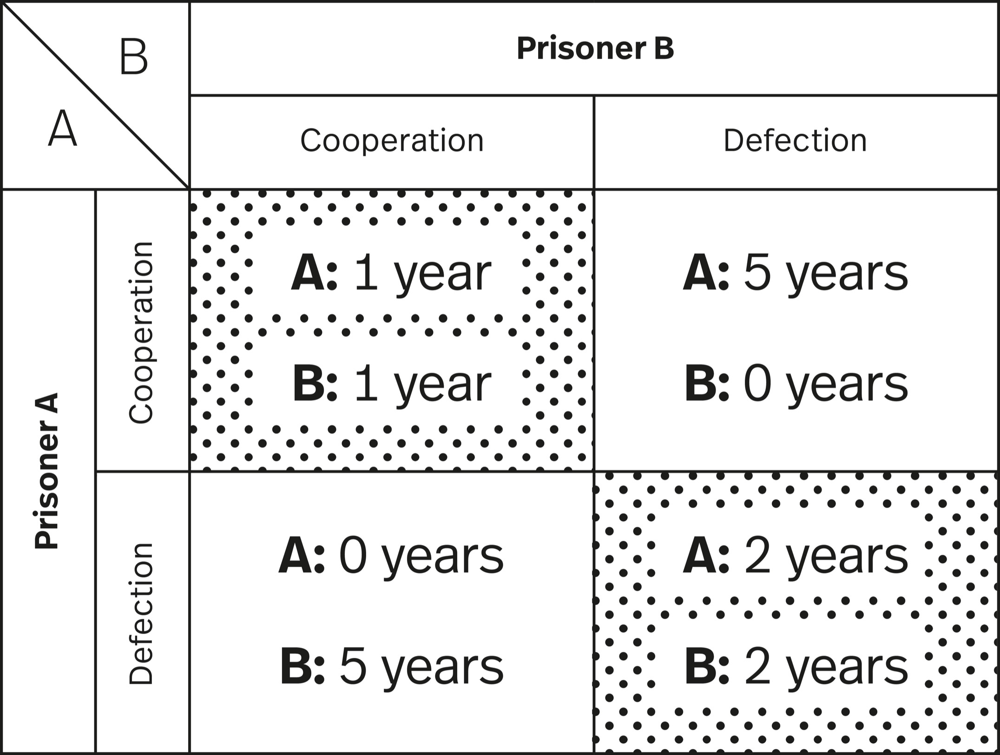

> The key to the feedback loop is the information it provides. You need to know whether you are moving toward your goal or away from it, and you need to know if your actions are having the intended effect.
>
> —James Clear[[1]](#s0054-55-Notes-EndnoteNumber5 "note")

Feedback loops are everywhere in systems, making them a useful mental model.

Think of feedback as the information communicated in response to an action. Whether we realize it or not, we give and receive different forms of feedback every day. Sometimes feedback is more formal, as is the case with performance reviews. Other times, it is less so. Our body language is a form of feedback for people interacting with us. The tone you use with your kids is feedback for them.

A feedback loop is a process in which the output of a system also acts as an input to the system, helping to refine and improve the system over time. It’s like a conversation in which each reply helps to shape the next question and answer, making the discussion better and more focused.

Once you start looking for feedback loops, you see them all over the place, giving you insight into why people and systems react the way they do. For example, much of human behavior is driven by incentives. We want to take actions that lead to us getting something good or avoiding something bad on a range of timescales. The incentives we create for ourselves and other people are a form of feedback, leading to loops that reinforce or discourage certain behaviors. If you get visibly upset whenever someone at work offers you constructive criticism, you’ll incentivize your colleagues to only tell you when you’re doing something well—thereby missing out on chances to improve.

The challenge in using this mental model is that the ubiquity of feedback loops can become overwhelming. How do you know which ones to pay attention to? Or which ones to adjust to improve your outcomes?

We are constantly offering feedback to others about our feelings, preferences, and values. Others, in turn, communicate feedback on the same things, but we don’t necessarily receive it or interpret it correctly. A critical requirement is learning how to filter feedback. Not all of it is useful. The quicker you learn to identify feedback that helps you progress, the faster you will move toward what you want to achieve.

Learning to communicate feedback in a way that makes it easy for others to receive is a valuable skill to develop. Feedback is crucial to relationships of all kinds. The skill is in giving feedback in a kind and clear way, in hearing it without getting defensive, and in partnering with people who can receive it on a regular basis. If you feel you can’t communicate important thoughts and feelings, you won’t be happy in that relationship or situation long-term. Much of relationship therapy consists of a therapist helping a couple tell each other things they have been afraid to say—when that feedback should have been free-flowing for years.

There is a larger implication here about working with the world. The world offers us feedback, but do we listen and incorporate, or do we just keep wanting it to work differently than it does?

The technical definition of a feedback loop comes from systems theory.

A *feedback loop* is a process in which the outputs (information) of a system affect that system’s behaviors. Depending on the complexity of a system, there may be a single source of feedback or multiple, possibly interconnected sources. It helps to first consider feedback in a simple system as we do in the following, but keep in mind, we are part of many large systems that contain many interconnected feedback loops.

Feedback loops are a critical model because they are a part of your life whether you are aware of them or not. Understanding how they work helps you be more flexible with the variety of feedback you receive and incorporate, and then you can offer better feedback to others.

There are two basic types of feedback loops: balancing and reinforcing, which are also called negative and positive. Balancing feedback loops tend toward equilibrium. Your thermostat and heating system run on a balancing feedback loop. Information about the temperature of the house is communicated to the thermostat, which then adjusts the output of the furnace to maintain your desired temperature.

Reinforcing feedback loops amplify a particular process. They don’t counter change, like your thermostat does. Instead, they keep the change going, as with the popularity of trends in fashion (in which styles become ubiquitous within months, only to disappear soon after) or the loops usually involved in poverty (in which different but related circumstances can compound the problem). Breaking out of reinforcing loops often requires outside intervention or a new change in conditions. Or, as with fashion, they simply burn themselves out after a while.

Within complex systems, feedback is rarely immediate. It can take a long time for changes in flows to have a measurable impact on how the system works. This delay complicates establishing cause and effect. In our lives, problems arise when the feedback for our actions is delayed or indirect, as is often the case.

A challenge to improving our decision making is getting accurate feedback on decisions. On one hand, consequences may take a long time to become apparent or may be hard to directly attribute to a particular decision. On the other, we may trap ourselves in maladaptive behaviors when something we do receives positive short-term feedback but has negative long-term consequences. Thus, it’s important to remember immediate feedback isn’t the only feedback. When you eat junk food, there is an instant hit of pleasure as your body responds to fat and sugar. After a little while, though, you receive other feedback from your body that indicates your choice of junk food has negative consequences. And over longer periods, conditions such as type 2 diabetes and high blood pressure provide more feedback from your body about the effects of your eating habits.

The faster you get useful feedback, the more quickly you can iterate to improve. Yet feedback can cause problems if it’s too fast and too strong, as the system can surge. It’s like when you press the gas or brake too heavily when first learning how to drive.

Feedback loops are a useful mental model because all systems have them, and we operate in a world of systems and subsystems.

### Adam Smith and the Feedback Loop of Reactions

You probably know Adam Smith as one of the most influential economists of all time, notable for his notion of the “invisible hand” of the market. But Smith’s first book, *The Theory of Moral Sentiments*, is a work of philosophy.[[2]](#s0054-55-Notes-EndnoteNumber6 "note") In it, he describes a different sort of invisible force that guides us: how the approval and disapproval of others, real or imagined, influences our behavior.

We are, by nature, selfish. We value ourselves above all other humans. Smith illustrates his point by suggesting that the news that your little finger must be amputated would likely be more stressing than the news of the deaths of a huge number of strangers overseas. Yet despite our inherent selfishness, the majority of people the majority of the time are cooperative and kind to one another. Smith believed our interactions with others are responsible for our well-established reciprocity. He saw others’ responses to our behavior as feedback guiding how we act in the future. To do something selfish usually warrants a disapproving reaction. To do something selfless usually merits an approving one.

The feedback loop of others’ reactions to our actions is the basis of civilization. Russ Roberts writes in *How Adam Smith Can Change Your Life,* “Smith’s vision of what sustains civilization is the stream of approval and disapproval we all provide when we respond to the conduct of those around us. That stream of approval and disapproval creates feedback loops to encourage good behavior and discourage bad behavior.”[[3]](#s0054-55-Notes-EndnoteNumber7 "note")

This type of feedback doesn’t just cover formal punishments and prohibitions according to the law where we live. It also covers the ways people respond to behavior that is just considered the norm. If a friend says hello to you on the street and you fail to acknowledge them, you haven’t broken any laws, but they’re likely to respond in a negative fashion. So you adhere to the norm. Smith writes: “When Nature formed man for society, she endowed him with a basic desire to please his brethren and a basic aversion to offending them. She taught him to feel pleasure in their favorable regard and pain in their unfavorable regard. She made their approval most flattering and most agreeable to him for its own sake, and their disapproval most humiliating and most offensive.”

Smith asked readers to imagine a person who grows to adulthood without any interactions with other people. He believed such a person would have no awareness of their character and no notion of the right or wrong way to act.[[4]](#s0054-55-Notes-EndnoteNumber8 "note") Our desire to be loved and accepted prompts moral behavior relative to the standards of our society. We in turn respond with approval of the same behavior on the part of others.[[5]](#s0054-55-Notes-EndnoteNumber9 "note")

### Everyday Loops

We can address many of the challenges we face every day by adjusting feedback loops. Figuring out how to change behavior (ours and others’), dealing with inaccurate information, and building trust are ongoing challenges. How to get customers to buy your product and not the competitors’; how to sort through information to find what’s relevant to your decision; how to cooperate effectively with others: these are common situations many of us face.

All these dynamics play out on the larger social scale as well. How do societies incentivize the behavior they want and disincentivize the behavior they don’t want? How do they get people to trust one another enough to keep society functioning?

Any system with an unchecked reinforcing feedback loop is ultimately unsustainable and destructive. Balancing feedback loops are more common in systems because they are sustainable—they maintain a system long-term, whereas reinforcing loops can crash and burn. In many societies, a legal system has historically served to stop reinforcing feedback loops from crumbling the social infrastructure and to promote balancing feedback loops that support desired dynamics. How they do it suggests options for addressing similar issues with feedback loops in our own lives.

Let’s explore four aspects of social systems through the lens of feedback loops:

1. Creating the right future incentives
2. Influencing behavior at the margins
3. Dealing with information cascades
4. Building trust

#### Creating the Right Future Incentives

We want to minimize, as much as possible, making a choice today that creates a negative reinforcing feedback loop down the road. So, we consider the future incentives a decision will create.

A classic example of today’s solution inadvertently creating a reinforcing feedback loop of future problems is paying off kidnappers. The immediate problem is someone being kidnapped and a ransom being demanded. If you have the resources to meet the kidnappers’ demands, you might want to pay the money right away. You save a life and solve the problem.

However, your response communicates to the kidnappers that you will meet their demands. You thus create an incentive for them to kidnap again, as well as signal to other would-be kidnappers that there is money to be made. By paying a ransom, you create a powerful reinforcing feedback loop that causes more problems in the future.

In many legal systems, each decision by a court becomes a bit of information that moves via a feedback loop into the stock of legal options to influence both how the system responds to future cases and how judges form future decisions. Each decision becomes legal precedent. In *The Legal Analyst*, Ward Farnsworth explains that in making decisions courts will consider “what incentives people will have after the case is over.”[[6]](#s0054-55-Notes-EndnoteNumber10 "note") Courts need to be careful. If they compensate for a wrong now, they could create a climate that increases the chances of that wrong happening again.

One set of issues courts often face is questions of liability. If something bad happens to me, then does someone else need to pay to compensate? Sometimes the answer is yes, but not indiscriminately so. If we go back to the kidnapping example; let’s say an American citizen is kidnapped overseas and the kidnappers demand the government pay for release. Is the government liable to compensate the victim’s family for the loss of life if they choose not to pay the ransom? Most courts will answer no. If I am held liable, it incentivizes me to pay in the future, and we are back in the same reinforcing feedback loop. When considering certain instances of liability, Farnsworth explains, “Instead of looking back and deciding who should bear the suffering, [a court] can look ahead and decide what ruling will make the suffering less likely to occur later.”[[7]](#s0054-55-Notes-EndnoteNumber11 "note")

In some situations, choosing an immediate benefit creates reinforcing feedback loops that remove the possibility of future benefits. For cases like these, laws are designed to support balancing feedback loops, such as protecting attorney-client privilege, or copyright and patent laws. Although one could argue for the immediate benefit of, say, forcing a defense attorney to testify about what their client disclosed, the feedback loop created would make clients disinclined to disclose things to their attorney. As Farnsworth summarizes concerning copyright protection, “Once books and music exist…there’s a great case for free distribution of them. But then they are less likely to exist at all next time.”[[8]](#s0054-55-Notes-EndnoteNumber12 "note")

People look around and often see what they view as unfairness—but they don’t realize that unfairness sometimes has a greater purpose. Unfairness in specific cases creates fairness on the whole, as in the aforementioned cases. Often things happen that look like an injustice to the individual, and they may be so. But those things may create greater justice for the collective. Think of someone being “excessively” punished; that may seem unfair to them, but if it is successful in deterring others from committing the same infractions, it’s not always such a bad idea.

#### Influencing Behavior at the Margins

Not everyone is likely to change their behavior in response to pressures, such as social or economic changes, at the same intensity and rate. Some people need more convincing; others need more time.

A good customer retention strategy doesn’t lump all customers into one group. It might, for example, treat customers of ten years better than customers of six weeks. These are examples of margins. “Margins” can mean a lot of things in economics; in this case we mean “by increments,” or “small changes”—shades of gray instead of all or nothing. Farnsworth explains thinking at the margin as “looking at problems not in a total, all-or-nothing way…but in incremental terms: seeing behavior as a bunch of choices about when to do a little less along one dimension and a little more along another.”[[9]](#s0054-55-Notes-EndnoteNumber13 "note")

Let’s consider the consumption of sugary drinks. Influencing behavior at the margins means that you won’t see the problem as a binary of consumption or no consumption. Instead, you look at how you can influence people’s behavior to help nudge them toward a particular choice you consider better for them without preventing them from making the opposite choice. The idea is to make it easier to choose one option and harder to choose another.

Maybe you want people to consume fewer drinks. Maybe you want them to substitute sugar-free drinks as a healthier option. If we were thinking about putting in rules to reduce the consumption of sugary drinks, we could tax them, or limit where they could be consumed or sold, or limit the age of people who can buy them. Farnsworth writes, “The activities of individual people have margins…and then groups of people have marginal members,” and often a legal rule is created with “the hope, realistic or not…that it cuts down on the practice at the margin.”[[10]](#s0054-55-Notes-EndnoteNumber14 "note")

Using feedback loops as a lens, we can understand influencing behavior at the margins as instituting a series of incentives that create loops. Over time this feedback changes the system to produce the desired outcomes. We can tailor our feedback to adjust to nuances in behavior that, when combined across a large population, can have significant positive impacts on our system.

Another reason to pay attention to the margins is that they are often the place where reinforcing feedback loops start. A loyal customer of twenty years is not likely going to be the first to leave after a price hike. It’s probably going to be the person who just purchased recently. However, when they leave to go to a competitor or even just buy less, there is a danger of setting off a negative reaction that sees sales plummet, which makes reinvestment in the product harder, which leads to more customers leaving.

Criminal law has to work at the margins in terms of deterring unwanted behavior. This means any additional (incremental) crime must be met with appropriate punishment. For example, if a criminal “faces execution for the crime he already has committed, he pays no additional price for adding a murder to it.”[[11]](#s0054-55-Notes-EndnoteNumber15 "note") We don’t want thieves to get a death sentence, or there would be no incentive for them not to kill people in the course of their thievery. Farnsworth explains, “The designers of criminal penalties have to worry about preserving *marginal deterrence*—scaling penalties so that there is always something more to fear by doing a little worse.”[[12]](#s0054-55-Notes-EndnoteNumber16 "note") In essence, this creates a balancing feedback loop that responds with appropriate consequences depending on the severity of the crime.

One of the issues as systems get larger is that there are more margins on which to adjust behavior. Adjusting a feedback loop in an attempt to balance it may create an undesirable reinforcing feedback loop somewhere else. For example, if you make it more difficult for people to consume sugary drinks in public, do you then force them into consuming in private indoor spaces? If you do, there is the danger that consuming sugary drinks in the home could lead to increased consumption with fewer judgmental eyes around. It could also normalize the behavior for children in the household, leading to another generation of sugary drink consumers.

> The concept of feedback opens up the idea that a system can cause its own behavior.
>
> —Donella H. Meadows[[13]](#s0054-55-Notes-EndnoteNumber17 "note")

#### Dealing with Information Cascades

Information cascades happen when people make decisions based on the observations or actions of others, which often leads to a convergence of behavior. Many investors selling a particular stock might trigger a cascade in which others sell the same stock, not because of something being wrong with the company but rather because others are selling. Or consider social media virality. A small number of people rapidly liking a post makes the algorithm show the post to more people, who, seeing everyone else liking it, engage with it as well—often without evaluating the content.

Information cascades are a reinforcing feedback loop. They can be evaluated as either positive or negative, depending on the information they communicate. Information cascades occur because we rarely have perfect information, and in many situations, especially in situations of uncertainty, we look to others to determine what we ought to do.

In his book *Kitchen Confidential*, Anthony Bourdain offers a lot of advice to would-be restaurant-goers based on his years working in the industry—useful tips such as try the local food and never ask for your steak well done. Another insight: when choosing which restaurant to go to, pick the one that looks the busiest. If lots of people are eating there, the food must be fairly good.[[14]](#s0054-55-Notes-EndnoteNumber18 "note")

Restaurateurs are aware of the effects of signaling. They know that the more customers you seat, the more will come in the door. This is why they will seat the first patrons of the evening close to the window and why they don’t mind a line of people waiting to be seated. They understand that the more people there are signaling their interest in the restaurant, the greater the reinforcing feedback loop communicating how wonderful their restaurant is. Farnsworth explains, “People draw inferences from what they see others doing and do the same; now even more people are doing it, and they create a still stronger impression on the rest.”[[15]](#s0054-55-Notes-EndnoteNumber19 "note") People who were on the fence about the restaurant will be drawn in by the apparent interest. As they join the queue, the interest of the next threshold level (the next number of customers) gets piqued.

There are other information cascades, some of which can be damaging if left to grow unchecked. Many legal systems have rules designed to interrupt reinforcing feedback loops of illegal activity. Most of us think we are law-abiding citizens. But we break the law more often than we realize. Just think of speeding. When was the last time you drove under the speed limit for your entire car journey? When it comes to things like speeding—or consuming pirated media, insider trading, or paying someone under the table—we often draw inferences about acceptable behavior from the people around us. However, a legal system cannot prosecute everyone who speeds. So how does it interrupt the loop?

Farnsworth writes, “Ignorance and uncertainty are the best soil for a cascade; people rely on what others think when they have no strong knowledge of their own, and the fragility of the consensus that results makes it easily disrupted by shocks.”[[16]](#s0054-55-Notes-EndnoteNumber20 "note") Thus two common legal solutions for dealing with a negative information cascade are laws that require public disclosure of information and prosecuting in certain high-profile situations to make a visible example.

Sometimes having more easily available and accurate information can interrupt a cascade. Think of the disclosure of financial information for publicly traded companies. Not only does the prosecution of high-profile cases act as a deterrent, but the publicity involved often provides more information about the legal territory. The prosecution of Al Capone for tax evasion probably did a lot to educate people about their basic tax responsibilities.

Ultimately these types of actions by the courts are “meant to send signals stronger than the ones people get by watching each other.”[[17]](#s0054-55-Notes-EndnoteNumber21 "note") And it is those signals that interrupt the reinforcing feedback loop of an information cascade.

#### Building Trust

Complex societies require trust among members to function. Look at how much trust we place in the other drivers on the road every time we get into a car. We trust that they will stop at red lights and stay in their lane. We are vigilant for the occasional mistake, but we drive as if other drivers will obey the same rules and quickly notice when they don’t. We place trust everywhere—from the people of our children’s school system to those who work in our food and safety systems. For relationships without direct interaction, the law facilitates trust. Farnsworth writes, “Law often amounts to a substitute for trust in situations too complex or dispersed for trust to arise.”[[18]](#s0054-55-Notes-EndnoteNumber22 "note")

There is an experimental game that is widely performed and cited that explores the building of trust in social interactions: the Prisoner’s Dilemma. To understand some of the dynamics of the feedback loops involved in trust, it’s helpful to look at that game, as well as one of the strategies for playing it, tit for tat.

Numerous tournaments have been held in which participants use different strategies to compete to win the most points in the iterated Prisoner’s Dilemma. The results show how repeated interactions between self-interested agents can lead to cooperative behavior.

The thought experiment goes as such: Two criminals are in separate cells, unable to communicate. They’ve been accused of a crime they both participated in. The police do not have enough evidence to sentence both, though they are certain enough of their case to wish to ensure both suspects spend time in prison. So they offer the prisoners a deal. They can accuse each other of the crime, with the following conditions:

- If both prisoners say the other did it (both defect), each will serve two years in prison.
- If prisoner A says the other did it (defects) and prisoner B stays silent (cooperates), prisoner A will serve zero years and prisoner B will serve five years (and vice versa).
- If both prisoners stay silent (both cooperate), each will serve one year in prison.

In game theory, the altruistic behavior (staying silent) is called “cooperating,” while accusing the other is called “defecting.”

What should they do? If they were able to communicate and they trusted each other, the rational choice is to stay silent; that way, each serves less time in prison than they would if the other defects. But how can each know the other won’t accuse them? After all, people tend to act out of self-interest. The cost of being the one to stay silent is too high. The equilibrium outcome when the game is played is that both accuse the other and serve two years. In a one-off game of the Prisoner’s Dilemma, you are always better off defecting, which means not trusting the other player. Your outcomes are not usually great, but defecting prevents them from being horrible.[[19]](#s0054-55-Notes-EndnoteNumber23 "note")

We can imagine, however, in iterated versions of the game, that defecting might not always be the best choice. If you have to face the same situation over and over, figuring out ways to trust is worth the investment.

Feedback loops are one of the key mechanisms that provide the information we use to make trust-based decisions. What happened before in your interaction with a person provides feedback that may cause you to modify your behavior, as does someone’s reputation.

The loop of information is the basis for the classic strategy of the Prisoner’s Dilemma, tit for tat. In a repeated Prisoner’s Dilemma, the best solution, based on experiments conducted by Robert Axelrod, is to cooperate first, and then in subsequent rounds, to do what the other player did in the previous round. You start off trusting, and more important, you create a feedback loop that says you are capable of and willing to trust.

The law has a couple of mechanisms that help in encouraging a basic level of trust. The first mechanism is that legal systems often enforce contracts. Knowing that there are repercussions for defecting on our agreement might dissuade me from defecting the first time we work together. Consequences also increase the costs of defecting, even if we will never work together again. In addition to protecting individuals in the one-off, contract enforcement also helps to create feedback loops that promote and incentivize trust. Farnsworth explains, “Contracts…give everyone a convenient way to beat prisoner’s dilemmas and enjoy the gains that come from cooperation.”[[20]](#s0054-55-Notes-EndnoteNumber24 "note") The point here is that we can trust the feedback loops of the system to enforce micro-interactions so we can establish trust. We can imagine that after a few interactions, the gains that come from cooperation contribute to a feedback loop that encourages people to prioritize cooperation in those situations.

The law can also impose rules and associated penalties for noncompliance in situations where contracts are not possible. Paying your taxes is a way of participating in a sort of contract with your fellow citizens, and most countries have laws that penalize people for not paying. Rules can also govern the use of common or public stocks to incentivize people to cooperate for the common good.

This is often the intent with rules governing fishing quotas. To prevent all those who fish for a living from acting in their self-interest and depleting the stock beyond sustainable levels, laws regulate how much each company can fish. Enforcing quotas is a way of forcing a level of cooperation to maintain a common good.

As we can easily imagine, if no one cooperates, that quickly becomes a reinforcing feedback loop with negative consequences in many situations. The less people cooperate, the less incentive there is for future cooperation. To prevent that loop from beginning, the law can impose rules that discourage the initial defection.

### Kandinsky’s Iterations

We learn from our efforts. Our first try at anything is rarely any good, but the experience of trying gives us feedback. If we pay attention to it, this feedback can help us improve in our next effort. Through many iterations, by paying attention to and incorporating feedback, we end up becoming more capable. Too often we remove the learning process, including the inevitable failures and disappointments, in success stories. In particular, when it comes to artistic creation, we look at the final product of a painting or piece of music without seeing all the iterations that came before.

In *How to Fly a Horse*, Kevin Ashton tells the story of how Wassily Kandinsky created one of his most famous works, *Painting with White Border*. The piece was not the single output of a flash of inspiration, but from a series of small changes and adjustments based on the feedback he received from each iteration.

The artist started with what would be called *Sketch I for Painting with White Border*. Based on the feedback he received from looking at the effort, he continued to iterate. As Ashton describes it, “His second sketch, barely different, diffused the lines until they were more stain than stroke…More sketches followed…. He made twenty sketches, each no more than one or two steps different from the last. The process took five months.”[[21]](#s0054-55-Notes-EndnoteNumber25 "note")

Ashton describes Kandinsky as trying to solve certain problems in his painting (these can also be understood as artistic goals). Each iteration Kandinsky produced gave him feedback on whether he was closer to solving his problems. Eventually he had enough information from the feedback on multiple iterations to produce the painting he wanted. The finished work is Kandinsky’s twenty-first iteration.

### Conclusion

Feedback loops are the engines of growth and change. They’re the mechanisms by which the output of a system influences its own input.

Complex systems often have many feedback loops, and it can be hard to appreciate how adjusting to feedback in one part of the system will affect the rest.

Using feedback loops as a mental model begins with noticing the feedback you give and respond to every day. The model also gives insight into the value of iterations in adjusting based on the feedback you receive. With this lens, you gain insight into where to direct system changes based on feedback and the pace at which you need to go to monitor the impacts.

Feedback loops are what make systems dynamic. Without feedback, a system just does the same thing over and over. Understand them, respect them, and use them wisely.
