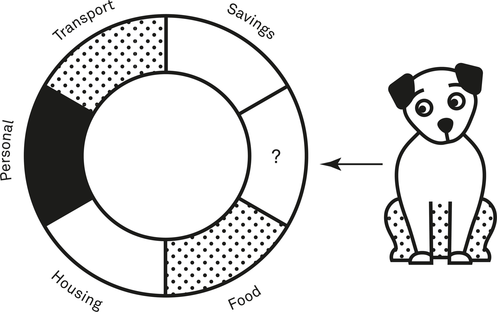
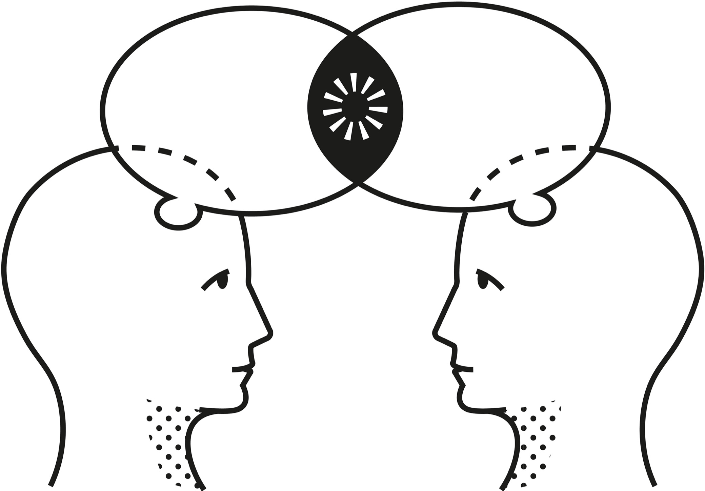

A system can be said to be at equilibrium when it is in a stable state. All the forces acting upon it and within it are in balance. Nothing changes until something disturbs the equilibrium.

Usually when systems stray too far from their equilibrium, they fall apart. When we consider just the pure functioning of a system, equilibrium is a good thing. Using this model as a lens helps us understand where we might intervene to promote equilibrium, but it also cautions us that in complex systems, anticipating what is needed for equilibrium is exceptionally difficult.

Think of equilibrium as a system’s comfort zone—in static equilibrium, everything is at a standstill, perfectly ordered and unchanging. But that’s rare. What’s common is dynamic equilibrium, in which things aren’t frozen but dance within a certain range, adjusting constantly. It’s the system’s way of self-correcting through feedback loops, nudging anything that drifts too far back into its rhythm.

One way to conceptualize the idea of equilibrium is to imagine a hypothetical family whose overall household forms a system. For the household to run in the way that’s best for everyone on average, many variables need to stay within the desired range. If they get out of that range, the family makes adjustments to restore balance. For instance, to cover their living costs, the family needs a certain amount of money to flow into the household each month as well as to keep their money for emergencies at a comfortable level. When they decide to start paying for piano lessons for one of the children, they may cut down on dining out to maintain equilibrium. The family also needs their home to remain within a certain cleanliness range for them to remain happy and healthy. When they decide to get a dog, remaining at equilibrium means they have to spend more time cleaning to compensate for the mess the dog makes. When one family member is away for the week, the others reduce how many groceries they buy. If you imagine your household—even if it’s just you—you can think of innumerable variables you’re always tweaking to keep things as you like them.

There are only so many hours in a day and so much money available to spend. Adding in new commitments means adjusting our current equilibrium.

Homeostasis is the process through which organisms make continual adjustments to bring them as close as possible to their ideal conditions. Changes in external conditions lead to changes in internal conditions, which may shift a system away from what it needs to work well.

Physician Walter Cannon coined the term “homeostasis” in his iconic 1932 book, *The Wisdom of the Body*. He marveled at the many variables our bodies manage to keep within narrow parameters, including blood glucose, body temperature, and sodium levels. Although systems theory did not exist as a field of study at the time, Cannon was espousing a view of the human body as a whole system that needed to maintain a stable internal state in response to its ever-changing environment.[[1]](#s0054-55-Notes-EndnoteNumber26 "note")

An important point is that systems can have multiple equilibriums. Just because a system is at equilibrium, that doesn’t mean it’s functioning as well as it can. It just means things are stable. Sometimes systems achieve equilibrium in inefficient ways. If you’re feeling ill one week and struggling to focus on work, you might work extra hours each day to get your usual work done. You’ve maintained equilibrium, but you would have probably been better off overall if you’d done less.

Short-term deviations from equilibrium are often what is needed to maintain it in the long term. An argument with a sibling that takes work to resolve might shift your relationship with that sibling away from its equilibrium for a few weeks, but in the long run, it could make things more stable between you by helping you resolve tension and agree on new ways to treat each other.

### A Different Look at Homeostasis

In his book *The Strange Order of Things*, Antonio Damasio explores the role of homeostasis in evolution. He explains that homeostasis “ensures that life is regulated within a range that is not just compatible with survival but also conducive to flourishing, to a projection of life into the future.” He further clarifies the concept by saying, “Homeostasis refers to the process by which the tendency of matter to drift into disorder is countered so as to maintain order but at a new level, the one allowed by the most efficient steady state.”[[2]](#s0054-55-Notes-EndnoteNumber27 "note")

Individuals, organizations, and countries—all are systems that must respond to environmental changes with modifications intended to bring them closer to a desired state. When we go through external challenges, whether it be a breakup, job challenges, or extreme weather, homeostasis kicks in to help us return to a point where the surrounding system functions at its best. Sometimes that can simply be a matter of what feels good rather than a precisely definable set of conditions. Unlike biological systems, we as humans can change the state we aim for, such as when we realize something else would work better—we can be quite happy alone, in a smaller house, or at a different job.

Damasio argues that feelings act as the key to understanding the biological role of homeostasis. Our feelings are a feedback loop that provides information to our body system about how we are doing. You have to be able to monitor the adjustments and responses to make changes that put you back on track. We do this through the value judgment of feelings. After a disaster, for instance, homeostasis does not need to (and frequently doesn’t) return the system to its previous state. Instead, it’s more useful to think of homeostasis returning a system to a place where it “feels good” under new conditions.

Therein lies the potential of homeostasis. How systems define themselves as “feeling good” will have a huge impact on their ability to adapt to stress and change. In biological systems, feelings are a critical component of how we assess problems. When your blood glucose drops, you feel terrible, which causes behavior that seeks to bring you back to where you feel OK. But that level of OK is a range, and Damasio’s idea is that homeostasis normally keeps us at the end of the range that allows us to develop. As variables under- and overshoot and external conditions change, systems can never stop making adjustments. Homeostasis is never a static state.

### When Information Can Help

When we look at biological systems, we can easily see that information is required to maintain homeostasis, or dynamic equilibrium. In our bodies, various components are constantly receiving and communicating an incredible amount of information about everything from the sensations on our skin from the external temperature to the potassium levels in our blood. Without accurate information, our bodies cannot work properly. Using this model as a lens, we can understand which situations might benefit from information to maintain equilibrium. One such situation is the modern approach to doctor-patient communication in many medical systems.

The doctor-patient relationship is universally unbalanced in terms of power and knowledge. Doctors have more knowledge about both medicine and the system used to treat patients. This dynamic has led to patients being passive participants in their health care, given neither the knowledge nor the opportunity to make decisions regarding their treatment. Now, in some places, the relationship has started to change, with patients becoming more active participants. There is growing recognition in some medical systems that the experience of treatment (and consequently sometimes health outcomes) improves when patients are more active participants in making treatment-related decisions. To facilitate this participation, in some medical systems patients are now given much more extensive information about their condition and the various treatment options, including associated risk.

Part of the reason for the change to more patient participation is the acknowledgment that diagnostics and treatments are rarely black-and-white. In a paper called “Tolerating Uncertainty,” the authors write, “Doctors have to make decisions on the basis of imperfect knowledge, which leads to diagnostic uncertainty, coupled with the uncertainty that arises from unpredictable patient response to treatment and from health care outcomes that are far from binary.”[[3]](#s0054-55-Notes-EndnoteNumber28 "note") It doesn’t make sense for a doctor to make treatment decisions for a patient in isolation, because any treatment is going to have consequences that the patient will disproportionately bear. Involving a patient in the discussion of their care options also serves to minimize blind spots and bias. Explaining options to a patient means that a doctor must at least acknowledge the options that exist, and coming to a solution through dialogue with a patient helps to make the solution situation-specific.

People who are actively supported in making decisions about their health care often experience more favorable health outcomes, including less anxiety and a quicker recovery.

One of the methods for increasing the information availability of treatment options in the doctor-patient relationship is a process called “shared decision making” (SDM). SDM does not put the responsibility for a decision on one party or the other but instead provides the resources necessary for the doctor and patient to come to an acceptable decision together. In a 1997 paper, the authors explain that SDM is “seen as a mechanism to decrease the informational and power asymmetry between doctors and patients by increasing patients’ information, sense of autonomy and/or control over treatment decisions that affect their well-being.”[[4]](#s0054-55-Notes-EndnoteNumber29 "note")

For patients to make an informed choice about their care, they need to understand the benefits and harms of the various treatment options. They might also require the support of a loved one, multiple opportunities to hear and assess the information, the ability to ask questions, and some time to process the information. In one definition of dynamic equilibrium, the condition exists “when the system components are in a state of change, but at least one variable stays within a specified range.”[[5]](#s0054-55-Notes-EndnoteNumber30 "note") A medical situation is just such a system because many parts are usually in a state of change, specifically the exact parameters of the health issue itself. Usually too, in more complicated health situations, there are many doctors and specialists involved. In addition, the needs and desires of the patients are not always static. SDM tries to keep the information variable within a range that allows for both the doctor and patient to navigate the situation in an informed way.

For information to be closer to equilibrium for both patient and doctor in medical treatment situations, it’s important to recognize the elements that might affect the flow of information. It’s not enough to share raw information. Doctors and patients also must build trust that will allow that information to be accepted and processed. In a 2014 analysis of parent experiences in neonatal intensive care units (NICU), the authors explain, “When families voice their dissatisfaction with the NICU, it is often not because they think their baby has not received good medical care. Instead, it is because the parents’ needs have not been acknowledged and addressed.”[[6]](#s0054-55-Notes-EndnoteNumber31 "note") Small things like using a baby’s name and acknowledging the parents’ caregiving role help create a communication environment where the information needed for good decision making can be heard and understood.

Medical situations are often complex. They can involve a lot of people and a lot of uncertainty. In addition, they almost always include very powerful emotions. Allowing information to come as close as possible to equilibrium in these types of situations can provide enough structure to support positive functioning in a changing environment.

### Exploiting Assumptions

If you become too dependent on a particular equilibrium to perform well, you make yourself vulnerable to being thrown off by changing circumstances. Being able to function in a wider range of conditions makes you more versatile and flexible. It’s also useful to have homeostatic processes in place to enable you to get back to what you find optimal after any sort of disruption. In competitive situations, those who flounder when they’re thrown off their equilibrium by something unexpected without having the mechanisms to reorient often suffer. Sometimes you can transcend your abilities by thinking about what an opponent expects or considers normal. You can also achieve more by rethinking what the equilibrium is in your field.

Take the case of card tricks. When an audience watches a magician perform a trick, they start with certain assumptions and expectations. The same is true for professional magicians watching other magicians perform a trick. Their equilibrium consists of a set of assumptions that enables them to identify how a trick works by watching it or to reverse-engineer it from the end point. Professional magic includes all sorts of conventions and assumptions. One unspoken assumption is that a magician performing a particular named trick does it the same way every time, using the same technique. To figure out how the trick works, you need to identify that technique.

One American magician, Ralph Hull, managed to invent a card trick no one—not even the smartest expert magicians—could fathom by rethinking the equilibrium of card magic. He called it “The Tuned Deck.”[[7]](#s0054-55-Notes-EndnoteNumber32 "note") Hull would show the audience a pack of cards, claiming he could sense the location of any card in the deck by detecting minute vibrations. He would then allow an audience member to pick a card, look at it, then put it back into the pack. Hull moved the cards around, shuffling them one way and another, then pulled out the correct card. Its unique vibrations revealed its location, or so he said.[[8]](#s0054-55-Notes-EndnoteNumber33 "note")

No one managed to figure out how he did the trick, despite expert magicians watching him perform it again and again. Only at the end of his life did Hull reveal the secret: The Tuned Deck didn’t have one, single secret. Hull would use a mixture of different techniques, moving between them depending on whether an audience seemed to be twigging what he was doing. If a professional magician were watching, he might use a few different consecutive methods until he threw them off the scent.[[9]](#s0054-55-Notes-EndnoteNumber34 "note") The real trick was that Hull shifted away from the equilibrium assumption that a trick with a name had to be done the same way every time.

### The Complexity of Equilibrium

Beginning in the 1960s, scientists began to ask questions such as: How could humans survive for a long time in space—or even form permanent settlements on other planets? What does it take to sustain life within a sealed environment, like a spaceship or underground bunker on Mars? How can we create an ecosystem in a closed environment, capable of reaching an equilibrium necessary to keep people alive?

In asking these questions, scientists recognized that our planet is itself a closed system. Innumerable complex processes come together to enable humans to survive. Beginning with experiments in which samples of microbial life were sealed permanently into flasks (some of which are still alive today),[[10]](#s0054-55-Notes-EndnoteNumber35 "note") researchers demonstrated ways in which closed systems could sustain themselves. Such experiments, on a modest scale, formed an important part of the Russian and US space programs. But the project known as “Biosphere 2” (with planet Earth being Biosphere 1) was on a scale unlike anything that had come before it, and few experiments since have matched its sheer scale, audacity, and ambition.

Biosphere 2 consists of a 180,000-square-meter structure located in the desert near Tucson, Arizona. Its aboveground structure is made of almost 204,000 cubic meters of glass supported by a steel framework with a maximum height of 27.7 meters.[[11]](#s0054-55-Notes-EndnoteNumber36 "note") Parts of the building are rectangular, parts are pyramid-shaped, parts are domed. Inside, Biosphere 2 contains the following five separate ecosystems mimicking key environments in the outside world:

1. Coastal fog desert
2. Tropical rainforest
3. Savanna grassland
4. Mangrove wetland
5. Ocean

Biosphere 2 also includes areas for agriculture, as well as underground areas for housing the equipment necessary to keep the whole thing functioning. It was the brainchild of John Allen and Ed Bass. Allen was a metallurgist and Harvard MBA who, following a psychedelic trip in the 1960s, founded a commune called Synergia Ranch in Santa Fe County, New Mexico.[[12]](#s0054-55-Notes-EndnoteNumber37 "note") Successful relative to similar projects at the time, Synergia attracted the attention of Ed Bass, a young billionaire heir to an oil fortune.[[13]](#s0054-55-Notes-EndnoteNumber38 "note") Together they launched several ambitious projects before deciding in 1984 to set out and discover what it would take to form a Mars colony that humans could live in. With Bass’s fortune and Allen’s ambition at hand, they assembled a team of experts and began the monumental task of creating Biosphere 2.

In 1991, the “Biospherians”—a team of eight individuals who’d spent years preparing—were sealed inside Biosphere 2 for two years. The aim was for them to maintain a functioning ecosystem with nothing (not even air) coming in from the outside. They would farm all of their food, grow plants and raise animals, and strive to maintain all conditions necessary for their survival. By the time they emerged, the Biospherians had endured a great deal. Oxygen levels had sunk drastically, to the point where it proved necessary to bring in outside oxygen to keep them alive. They struggled to meet their caloric requirements while engaging in so much physical work, though this lifestyle left them healthier than before and they suffered no major health problems during the experiment. The Biospherians frequently fell out with one another and with those controlling the experiment.

Much of the contemporary media coverage of Biosphere 2, as well as its representations in popular culture, depict the whole thing as a failed experiment replete with fraud and trickery. But this is the result of a gross misunderstanding of both the aims of the project and indeed the nature of science. Experiments aren’t meant to “succeed.” They’re meant to provide us with data about the world that we can use as the basis for future experiments. None of the people who worked on Biosphere 2 expected everything to run perfectly from the first day. They understood that for a system—in this case, the biosphere within the dome, consisting of plants, animals, and people as well as air, water, and more—to achieve an equilibrium, a lot of variables need to be right. Only by trying out the experiment could they discover what all those variables were. They couldn’t preempt everything, and it would have been hubris to think they knew everything an ecosystem needed to function well.

As a voyage of discovery, Biosphere 2 excelled. It showed us that maintaining life in a sealed environment is almost infinitely challenging because ecosystems are complex adaptive systems. Under natural conditions, they have countless feedback loops in place to maintain equilibrium. An artificially created ecosystem requires humans to maintain those feedback loops, in part by preempting what they’ll need to control but also in part by learning to sense when something is going wrong so they can create a new feedback loop.

When left alone in their typical conditions, systems are pretty good at reaching equilibrium. But when we try to control them or we disrupt their conditions, it takes a lot of effort to bring them to a desirable balance. Despite the early stage of the project, the achievements of the Biospherians were remarkable. They did manage to produce almost all their food, get enough clean water, and keep hundreds of plant and animal species alive. Anyone who has ever tried to grow vegetables at home or even keep a few houseplants alive can appreciate the scale of the experiment. Those who view the project as a comical failure have arguably neglected to think about the sheer complexity of getting a system like that to an equilibrium. Just maintaining the level of balance the Biospherians achieved was a monumental act deserving of acclaim.

Not only that, but Biosphere 2 is an important reminder of the effects of human activity on ecosystems. It highlights how small, misguided interventions can have catastrophic domino effects and just how much damage we can do anytime we interfere with nature. Everything that went into Biosphere 2 required careful examination of ways in which it might both be unable to maintain its equilibrium and also disrupt the overall balance of the ecosystem. Linda Leigh, who helped develop Biosphere 2 and was one of the participants sealed inside, described the complexity of choosing animal species to include.[[14]](#s0054-55-Notes-EndnoteNumber39 "note") Every animal needed to be evaluated for how it might interact with everything else. For example, they consulted a bat specialist to choose a species that could pollinate some of the plants. Yet when they looked at the consequences of including that species, they were huge:

> One of those bats would nightly have needed to eat twenty two-centimeter-long night-flying moths, and would have had to [have] encounters with over a hundred per night in order to catch the twenty. Where would all of the moths come from? What would their larvae eat, and could we have enough and the correct habitat for the moths’ eggs? In addition, the air handlers, as designed, would have sucked the moths in and killed them. Engineers suggested a fine screen over the opening to the fans in order to give the moths a chance to survive the pull. That screen would increase the electricity needed to pull the air through, a budget increase that was not supported.[[15]](#s0054-55-Notes-EndnoteNumber40 "note")

In another example, an expert tried to find a hummingbird species that could live inside Biosphere 2.[[16]](#s0054-55-Notes-EndnoteNumber41 "note") They had to ask lots of questions about each option, which a casual observer might not consider. What shape is this type of hummingbird’s bill? Will it be the right size to pollinate enough plants? What kind of mating display does this type of hummingbird exhibit? Will it be at risk of colliding with the glass during this display? And so on. The considerations were endless.

Even the most seemingly inconsequential things had the potential to compound and endanger the lives of everything in the ecosystem. As professor and filmmaker Shawn Rosenheim explained, “Part of the point in building a self-sustaining world was to make the unimaginably rich interconnections of the actual Earth newly vivid.”[[17]](#s0054-55-Notes-EndnoteNumber42 "note") The initial two-year closure experiment was meant to be the first of fifty such experiments, with the aim of improving incrementally each time. As a starting point, the first closure went better than expected. For instance, 30 percent of the species inside went “extinct,” but researchers had predicted up to 70 percent.

At the time of writing, Biosphere 2 still stands, having been donated to the University of Arizona in 2011. From the outside, it looks like a shadow of its former self. The windows are murky without sufficient funds to employ a full-time crew to keep them clean, and rust accumulates on the structure. But inside, Biosphere 2 remains full of life. Many of the microcosms within it are thriving, having found the equilibrium they need to function as they would in the outside world. Researchers still utilize it as a unique place for valuable controlled experiments they can’t easily do anywhere else.

### Conclusion

Equilibrium is the state of balance, the point where opposing forces cancel each other out. It’s the calm in the center of the storm, the stable point around which the chaos swirls. In a system at equilibrium, there’s no net change. Everything is in a steady state, humming along at a constant pace.

However, systems are rarely static. They are continuously adjusting toward equilibrium, but they rarely stay in balance for long.

Equilibrium is a double-edged sword, both stability and stagnation. In our lives we often act like we can reach an equilibrium: once we get into a relationship, we’ll be happy; once we move, we’ll be productive; once X thing happens, we’ll be in Y state. But things are always in flux. We don’t reach a certain steady state and then stay there forever. The endless adjustments are our lives. The trick is to find the right balance, to strive for equilibrium where it’s needed, but to also know when to break free, to embrace the disequilibrium that drives progress.
