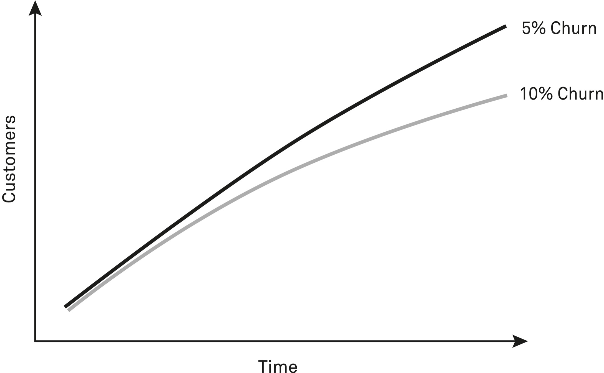

Within systems, components are constantly wearing out and getting used up. This includes both the material and information within a system and the parts of the system itself. Keeping a system functioning requires ongoing replenishing of both the stocks and the parts used to maintain them. We call this process of attrition “churn.”

There are examples of churn everywhere. For example, your favorite sneakers wearing out after lots of use. The skin cells on your body being constantly replaced. Trees in a forest die and new ones grow. The parts in a car deteriorate with time; some need replacing, and some render the car unfixable once they break. People move in and out of cities. System components are never static, and to run a successful system you need to understand how and why parts wear out. The churn model is a lens through which you can look at that kind of system change and learn how to work with it.

In business, churn refers to the loss of a customer, whether that’s because they canceled a subscription, stopped buying a product, moved away from a store, or something else. No business can retain every customer forever. However, the rate of churn varies depending on factors like the availability of alternatives, ease of switching, and overall satisfaction. Often given as a percentage, churn is an indicator of whether a product fits its market.

Growth may be good in business, but churn is also important to consider. It doesn’t matter how many new customers a company gets through the door if those customers don’t stick around long enough for the company to earn back the cost of acquisition. If churn is high, a company may run out of money acquiring new customers.

Churn can also refer to the turnover of employees, something that varies between industries because of the varying costs for both employees and employers. If hiring and training new employees is costly, a company has an incentive to keep churn low, and vice versa. Fast-food restaurants, for instance, have a higher employee churn rate than governments. A certain level of churn, even just from people retiring, helps bring in new perspectives and experiences. Too much churn prevents expertise from accumulating.

When we have a customer retention rate of 90 percent, we may think we’re doing great. But over time, the 5 percent difference between us and our competitor means we have less growth and have to work a lot harder to keep up.

When churn is too high in a system, replacing what is lost or used up becomes a process of running to stay in the same place. Once we get stuck in the trap of keeping up with churn, it’s time to step back and reassess if it’s worthwhile or if there’s another way.

Because churn is inevitable in all systems, it’s useful to ask how we can use it to our benefit. Is it worth going through contortions to keep every customer, or should we let a certain percentage go and focus on the core customers who keep our business going? Is it worth trying to retain employees who have lost interest in the job or who would experience more professional growth elsewhere? Understanding your situation through the lens of churn can help you figure out how to harness the dynamics that drive it.

### Cults

We can never eliminate churn in groups of people. When the purpose of an organization becomes preventing members from leaving, it turns into a cult. A cult is a group that does everything possible to control its members. Avoiding churn becomes the whole purpose, as opposed to whatever the initial aim was. Every detail is intended to entrap members further. Even if the initial purpose was positive, this process can only ever end up harming members.

“Today is the first day of the rest of your life.” These words might be a motivational quote, but their origins are somewhat more sinister. Charles Dederich, founder of the cult Synanon, is the originator of this quote. Synanon is one of the most notable cults in US history for several reasons. Its success in attracting members lent it a place in popular culture, earning mentions in well-known songs and books between the 1950s and 1990s. It gained support from political figures like Senator Thomas J. Dodd and First Lady Nancy Reagan. Synanon was also practically unrivaled in the intensity of its efforts to prevent members from leaving or the outside world from impeding its activities. It was an efficient churn-minimizing machine. Though the organization began with positive intentions, the goal of holding on to members became all-encompassing.

Synanon began in 1958 as a drug addiction rehabilitation program. Dederich, a former alcoholic, started the group in his small apartment, using a thirty-three-dollar (about three hundred dollars today) unemployment check.[[1]](#s0054-55-Notes-EndnoteNumber109 "note") By its demise in 1991, Synanon had progressed to an incomprehensible level considering its inauspicious origins; it had morphed into a full-blown cult with thousands of indoctrinated members.[[2]](#s0054-55-Notes-EndnoteNumber110 "note")

When Dederich founded Synanon, treatment options for people with addictions were limited in the United States. Having dropped out of college and failing to hold down a job or make relationships work due to his own out-of-control drinking, he knew the cost of uncontrolled addiction for individuals and their families. Although Alcoholics Anonymous existed at the time, rehabilitation facilities were not widespread, and the belief that addiction is a personal failure was prevalent. Based on his own experiences, Dederich believed addiction was curable, provided an individual changed their social context and helped others.[[3]](#s0054-55-Notes-EndnoteNumber111 "note") He saw it as the result of a combination of systemic issues. Although we now know that environment and relationships do play a significant role, his belief ended up being a means of control and not of treatment.

A decade after Synanon’s founding, Dederich changed his mind about the nature of drug addiction. He decided it was impossible for people with addictions to ever make a full recovery and go on to live regular lives. Synanon members were now expected to stay in the group. Forever.

Dederich began using brainwashing techniques to eliminate churn while using the threat of force to deter potential defectors. To grow Synanon further, he started accepting new types of members, including middle-class people in search of personal growth and young people sent to him by court order—showing that the organization had mainstream approval at the time.

Synanon’s control over members to prevent them from churning was total, using a combination of brainwashing, denial of autonomy, and threats of violence. Synanon members shaved their heads, wore overalls, and quit smoking and drugs cold turkey. As they went about their day in dedicated Synanon buildings, they listened to Dederich repeat his views over radio stations for hours on end. Married couples who joined together had to divorce. Members were not permitted to have children.

Perhaps the most extreme mind-control technique was “the Game.” [[4]](#s0054-55-Notes-EndnoteNumber112 "note") During lengthy sessions, members were encouraged to criticize one another and air grievances with anyone in the group. In theory the purpose was to ensure no secrets were held and no hierarchies emerged. In reality it served to break members down emotionally before rebuilding them with support from others. The Game is best viewed as a deliberate form of traumatic bonding in which cycles of abuse appear to strengthen relationships. Synanon also had a paramilitary group equipped with hundreds of guns and capable of attacking anyone who opposed Dederich or left. A lawyer who sued Synanon found a live rattlesnake in his mailbox, its rattle removed.

When Synanon came under legal scrutiny for operating without medical licensing, Dederich declared it was no longer an addiction treatment program and was now a religion. Once again this move allowed more control over members. A rehabilitation or personal development program has an end point. A religion does not. Dederich had a stronger justification for preventing the churn of members.

Synanon met its end when the IRS revoked its tax-exempt status and ordered it to pay millions in back taxes.[[5]](#s0054-55-Notes-EndnoteNumber113 "note") Its story teaches us that churn is inevitable within any system and seeking to eliminate it perverts the goals of a system. Regardless of initial intentions, a group that tries to stop *anyone* from leaving can only end up violent and coercive. People being able to leave when they wish places checks on abuses of power. The same is true for countries or companies. People need the freedom to vote with their feet if things get too bad. In this sense, lack of churn can be a powerful indicator that something is not right.

### Using Churn to Innovate

> Like a duck on the pond. On the surface everything looks calm, but beneath the water those little feet are churning a mile a minute.
>
> —Gene Hackman[[6]](#s0054-55-Notes-EndnoteNumber114 "note")

At the right level, churn is a healthy part of systems. Components need to change and be refreshed. In some cases, when churn isn’t naturally high enough, it can be necessary to build it into a system as a deliberate process. People leaving a business can be good. New people bring in fresh ideas. And if you mandate a degree of churn, you can make it less likely that people will stay for the wrong reasons or that you’ll do harmful things to prevent them from leaving.

The value of churn varies with the kind of group you are trying to create, but for organizations wanting to invent and innovate, having a fixed tenure with no bonuses or promotions can keep the focus where it needs to be. This is what a group called Bourbaki did with its members: it ensured a regular turnover to allow for the flow of ideas and inspiration.

In 1935 a group of eminent young French mathematicians met in a Paris café.[[7]](#s0054-55-Notes-EndnoteNumber115 "note") Among them were André Weil (a foundational figure in number theory and algebraic geometry), Henri Cartan (a major advancer of the theory of analytic functions), Claude Chevalley (a significant figure in many mathematical theories), Charles Ehresmann (best known for the concept of the Ehresmann connection), and Szolem Mandelbrojt (who received recognition for his mathematical analysis work). As a collective, they had an ambitious goal—though it was a realistic one, considering their credentials. They wanted to compile all existing mathematical knowledge into a single overarching theory, then produce comprehensive textbooks covering it.[[8]](#s0054-55-Notes-EndnoteNumber116 "note")

They decided that everything they produced should be a group effort and not the work of any particular individual. How else could it be a unified theory reflecting the best of mathematical knowledge at the time and not the opinions of one person? So the mathematicians created a fictional persona to whom they attributed their work: Nicolas Bourbaki of Poldevia. They took pains to make him seem like a real person.[[9]](#s0054-55-Notes-EndnoteNumber117 "note") Many of the students who used their textbook never had any idea that Bourbaki was a group.

Aside from a break during World War II, the members of Bourbaki met for a week two or three times each year to work on their textbook series. It was a truly collaborative effort. The mathematicians debated every single sentence until everyone was at least reasonably satisfied. Each textbook took years of criticism and rewriting to complete. To a casual observer, the approach looked chaotic. There was no discernible system to it. But it meant their work was rigorous. Sometimes, amid a heated disagreement, they would come up with a new way of doing things. The resulting textbooks did indeed have a significant impact on mathematics. By some accounts, the approach they took to conveying knowledge has become the standard.[[10]](#s0054-55-Notes-EndnoteNumber118 "note")

Bourbaki is relevant to the mental model of churn because of the context in which the group began. Unlike other countries, France did not exempt certain professions, including academics, from military service during World War I. This meant that distinguished mathematicians were as much at risk of dying on the front lines as anyone else.[[11]](#s0054-55-Notes-EndnoteNumber119 "note") Those who survived that war tended to have been over forty-five years of age at the time of Bourbaki’s founding—old enough to be excused from service in World War II. With the deaths of so many young mathematicians in the First World War, many of those teaching and writing textbooks in 1935 tended to be reasonably elderly. Though experienced, they were not always entirely up-to-date with the latest research. The field missed out on the usual regular influx of new figures with new ideas. Having lost a generation of mathematicians, no doubt with many potential geniuses among them, the field stopped progressing at its usual speed in France.[[12]](#s0054-55-Notes-EndnoteNumber120 "note")

Part of what made Bourbaki such a revolutionary collective was its insistence that members churn at regular intervals. This ensured an inflow of new perspectives and knowledge. Bourbaki members were asked to retire at the age of fifty and invite new, younger mathematicians to join in their place. While we may decry this as ageist today, it was not a critique of their expertise. The intention was to keep bringing people who had studied the latest theories into the fold. Anyone who wanted to leave the group at any point for any reason could without impediment. If a mathematician lost interest, they didn’t stay. Only those who wanted to remain part of Bourbaki stayed. Its membership was never static.

Bourbaki still exists in name and runs seminars, although the group no longer publishes anything. This vibrant, ever-shifting group played an important role in mathematical history in the twentieth century. There may be a time one day that calls for it to rise and once again revitalize the field.

Using the lens of churn on the story of Bourbaki demonstrates there can be value in constant change. Harnessed and directed appropriately, churn brings in new ideas and increases our adaptability. It’s what allows for evolution by selecting for beneficial traits. Within Bourbaki, the churn of members selected for those with up-to-date knowledge of mathematics and enthusiasm for the project. Within any system, parts need replacing from time to time in order to keep the whole functioning well and to remove anything that proves a hindrance. Churn helps systems improve over time, and it is both undesirable and unrealistic for all the parts to stay the same. However, no matter how often the parts are replaced, no system can function forever. Bourbaki no longer exists in its original form as a producer of textbooks. Its environment changed, and it ceased to be the thing best suited to that task. But while it pursued its original goal, churn helped Bourbaki stay relevant and useful.

### Conclusion

Churn is the silent killer of businesses. It’s the slow leak, the constant drip of customers slipping away, of users drifting off to find something new. It’s the attrition that eats away at your growth, that forces you to keep running just to stay in place. The thing about churn is that it’s often hidden. It’s not like a sudden crisis that grabs your attention. It’s a slow, quiet process that happens in the background.

Churn can present opportunity. Like a snake shedding its skin, replacing components of a system is a natural part to keeping it healthy. New parts can improve functionality.

When we use this model as a lens, we see that new people bring new ideas, and counterintuitively, some turnover allows us to maintain stability. Replacing what is worn out also gives us a chance to upgrade and expand our capabilities, creating new opportunities.

Some churn is inevitable. Too much can kill you.
