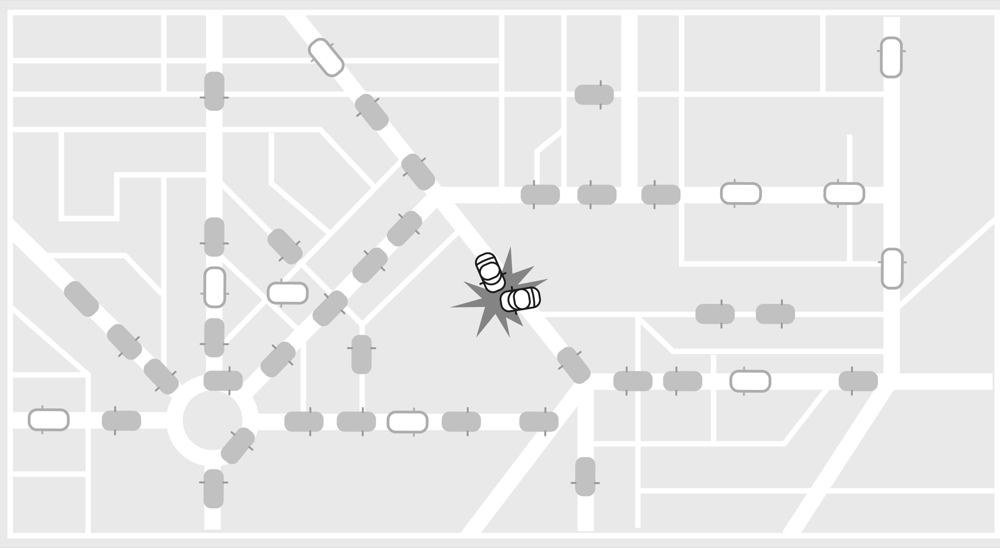

### Supporting Idea: Complex Adaptive Systems

> Often, scholars distinguish between *complex systems*—systems in which the entities follow fixed rules—and *complex adaptive systems*—systems in which the entities adapt. If the entities adapt, then the system has a greater capacity to respond to changes in the environment.
>
> —Scott E. Page[[32]](#s0054-55-Notes-EndnoteNumber152 "note")

Some systems are simple and nonadaptive. You can learn how they work by learning about their parts. They don’t change based on their environments. For instance, imagine a basic pocket watch. You can take it apart to figure out how it works, and it keeps working the same regardless of what goes on around it—within limits.

Complex adaptive systems have properties that are greater than the sum of their parts. You cannot understand them by studying their individual components, which may be simple but which interact in unpredictable, nonlinear ways. A few, often basic rules enable the parts to self-organize without centralized control. The way the various components interact and pass information between themselves creates complexity. The ability to change in response to its environment and in pursuit of a goal makes a system adaptive.[[33]](#s0054-55-Notes-EndnoteNumber153 "note") Complex adaptive systems have “memories”—they are impacted by what has happened to them before.

One example of a complex adaptive system is the traffic within a city. While cars are simple systems in the sense that the way they work is a logical outcome of all their parts working together, when we look at the combined interactions of cars, we see remarkable self-organization. Traffic changes its behavior based on information from its environment. Focusing on one car won’t teach you about the entire system because what matters is the interactions between them.

In *Complexity: A Guided Tour*, Melanie Mitchell defines a complex system as one “in which large networks of components with no central control and simple rules of operation give rise to complex collective behavior, sophisticated information processing, and adaptation via learning or evolution.”[[34]](#s0054-55-Notes-EndnoteNumber154 "note")

Within complex adaptive systems, components are all interdependent. They can directly or indirectly influence the behavior of the entire system. If one car breaks down on a main street, it can have a domino effect for the traffic in the rest of the city. Interactions between parts amplify the impact of tiny changes.

In a complex adaptive system, we can never do just one thing.[[35]](#s0054-55-Notes-EndnoteNumber155 "note") Anytime we intervene, unintended consequences are almost inevitable. Often when we try to improve a complex adaptive system, we end up making things worse because we overestimate our degree of control.

We cannot expect complex adaptive systems to be governed by predictable rules. Nor can we expect to understand the macro by examining the micro. To handle complex adaptive systems, we need to be comfortable with the nonlinear and the unexpected.

Another aspect of complex adaptive systems that can derail us is their ability to learn and change in response to new information. Consider a model that predicts the spread of the flu among a population. It will need to anticipate that people can change their behavior. If people hear warnings of an epidemic or see others getting sick, they may take measures to prevent catching the flu.[[36]](#s0054-55-Notes-EndnoteNumber156 "note")

> No gluing together of partial studies of a complex nonlinear system can give a good idea of the behavior of the whole.
>
> —Murray Gell-Mann[[37]](#s0054-55-Notes-EndnoteNumber157 "note")

We can still learn from complex systems; we just need to be humble and use the scientific method. We must not mistake correlation for causation, and we should always be open to learning more about the system and accepting that it will change. What we learned yesterday may guide us, but it can change tomorrow. We shouldn’t give up just because a system is complex.

From the outside, complex adaptive systems can look chaotic, but they tend to work best when slightly disorganized, as this allows for mutations and experimentation. In the long run, deviations tend to cancel out into more coherent patterns of functioning.

