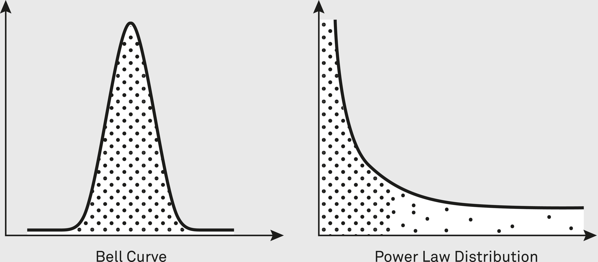

### Supporting Idea: Distributions

Distributions are different ways a group of something—like people’s heights, grades on a test, or flavors of ice cream sold—spreads out or bunches up. They tell you how often each item shows up.

Distributions help you contextualize what to expect given a certain data set. They help you make predictions about the probability, frequency, and possibility of future events. There are many different types of distributions. The four characteristics that will most determine the type of distribution you are dealing with for any given data set are:

1. Is the data made up of discrete values, or is it continuous?
2. Are the data points symmetric or asymmetric?
3. Are there upper and lower limits on the data?
4. What is the likelihood of observing extreme values?[[2]](#s0054-55-Notes-EndnoteNumber265 "note")

Distributions are often idealized (unrealistic) representations of a data set. According to NYU Stern School of Business, “Raw data is almost never as well behaved as we would like it to be. Consequently, fitting a statistical distribution to data is part art and part science, requiring compromises along the way. The key to good data analysis is maintaining a balance between getting a good distributional fit and preserving ease of estimation, keeping in mind that the ultimate objective is that the analysis should lead to better decisions.”[[3]](#s0054-55-Notes-EndnoteNumber266 "note")

The distribution we are all most familiar with is the normal distribution, and it is one of our most important lenses for looking at the world. Its influence is everywhere from education to medicine, even if it is often invisible. But it’s also an easy mental model to take too literally and end up trying to fit reality to the model, not vice versa. Reality rarely fits into a neat normal distribution, and we miss a lot of important nuance and variation when we try to make it do so.

A set of data points is normally distributed if the majority of values cluster around a midpoint, with a few falling on either side. The farther from the midpoint, the fewer values show up. The midpoint is simultaneously the mean, mode, and median value. When plotted on a graph, normally distributed data forms a characteristic symmetrical shape known as a bell curve. Leonard Mlodinow, writing in *The Drunkard’s Walk,* summarizes it as such: “The normal distribution describes the manner in which many phenomena vary around a central value that represents their most probable outcome.”[[4]](#s0054-55-Notes-EndnoteNumber267 "note")

Many common measurements, such as height, IQ, blood pressure, exam results, and measurement errors, are normally distributed. This tends to be the case for values that are subject to certain physical constraints, such as biological measurements. Normal distributions usually also characterize the price of common household goods. If you have an idea of the average price of toothpaste, you can use an estimation of the distribution to tell you if you are paying too much for the one in front of you or if you are getting a good deal.

In a normal distribution, the more extreme a value is, the less likely it is to occur. However, it’s important to note that the tails in most distributions, even normal ones, go on forever. The probabilities of these values get smaller but are not impossible.

We refer to values far from the mean as long-tail values. Seeing as they are highly unlikely, we tend to forget about them. But if we get too caught up in seeing the world as normally distributed, we can forget that long-tail values tend to have an outsize impact. If you commute to work, it probably takes roughly the same time each day with minor variations. Once in a while, though, there might be a major issue like a road closure or broken-down train, which means it takes significantly longer, with the corresponding ripple effects for your day.

Normal distributions can be contrasted with power law, or exponential, distributions. The values in a power law distribution cluster at low or high points. Even though the distribution might cover a large diversity of potential values, the vast majority of points on the curve will represent a comparably small subset.

Wealth follows a typical power law distribution. Although the range of the possible wealth of an individual is quite large, most people cluster around a small range of values at one end of the curve. There are exponentially more people with $1,000 in assets than $1 billion. In our wealth curve, excessive wealth may be rare relative to the entire population, but there is no real cap on the wealth any one person can accumulate. In *Algorithms to Live By*, Brian Christian and Tom Griffiths say that power law distributions are also called “ ‘scale-free distributions’ because they characterize quantities that can plausibly range over many scales: a town can have tens, hundreds, thousands, tens of thousands, hundreds of thousands, or millions of residents, so we can’t pin down a single value for how big a ‘normal’ town should be.”[[5]](#s0054-55-Notes-EndnoteNumber268 "note")

> Something normally distributed that’s gone on seemingly too long is bound to end shortly; but the longer something in a power law distribution has gone on, the longer you can expect it to keep going.
>
> —Brian Christian and Tom Griffiths[[6]](#s0054-55-Notes-EndnoteNumber269 "note")

Being able to identify when you are in a power law distribution situation can help you be realistic about the effort required to break out of the end cluster. It also forces you to consider the diverse range of potential values you have to contend with. When imagining future wealth, a diversity of possible data points can be motivational, but the opposite is true if your power law distribution is about potential calamities.

There are other distributions. Geometric distributions give you intuition as to when a particular success might happen, and binomial distributions can suggest how long it will take to get particular numbers of successes. The Poisson distribution can give you an idea of the distribution of rare events in a large population. And understanding memoryless distributions, where the probability of an event occurring in the future is independent of how long it has been since the last event occurred, can make you feel better when you have to wait awhile for the next bus.

You never really know if you have the right distribution for your data. You can test your distribution against the ideal and conclude that they are similar with a high degree of confidence, but future data points may change the distribution.

### The Good Life

One philosophy that has been misunderstood since it was first articulated is that of Epicurus. Writing around 300 BCE, he came to prominence after Plato and Aristotle and was a contemporary of the early Stoics. One of his core ideas centered around the value of pleasure. Epicurus argued that pleasure is the only realistic measure we have of evaluating our lives. When we experience pleasure, things are good, and thus the pursuit of pleasure ought to be the driving force behind our choices.

At first glance, his philosophy seems to advocate a life of selfish indulgence. Criticized for promoting a hedonism that would lead to the breakdown of society, Epicurean philosophy has endured much maligning over the millennia. However, a complete read of his philosophy reveals how pursuing the Epicurean ideal of pleasure actually leads to a very sedate, mindful life. Using the lens of a normal distribution curve helps us understand why and thus suggests modern uses for this ancient philosophy.

In his “Letter to Menoeceus”, Epicurus writes, “No pleasure is a bad thing in itself. But the things which produce certain pleasures bring troubles many times greater than the pleasures.”[[7]](#s0054-55-Notes-EndnoteNumber270 "note") These latter types of pleasures are the ones we should avoid, because what positive feeling we gain in the short term is outweighed by the ensuing negative experience.

An excellent way to thus capture Epicurus’s idea of pleasure is the bell curve. If we imagine those things that cause us great pain being the values on the far left and those things that cause us great pleasure being on the far right, where we want to be is in the middle. The ideal state is one of neither pleasure nor pain. As Daniel Klein writes, for Epicurus, “Happiness is tranquility.”[[8]](#s0054-55-Notes-EndnoteNumber271 "note") The state we should aim to be in is at the top of a normal distribution curve—a life free from pain and also free from the negative consequences of excess pleasure.

Far from promoting the pursuit of indulgence in all things pleasurable, Epicurus writes, “For we are in need of pleasure only when we are in pain because of the absence of pleasure, and when we are not in pain, then we no longer need pleasure.”[[9]](#s0054-55-Notes-EndnoteNumber272 "note") For Epicurus, “ ‘Pleasure’ is the logical opposite of ‘pain.’ In other words, for him pleasure meant non-pain.”[[10]](#s0054-55-Notes-EndnoteNumber273 "note") His conceptualizing of pleasure lends itself well to imagining life events plotted along a normal distribution curve. There are extremes at either end that are possible, but the most rewarding life is one that hovers around the middle, experiencing neither too much pain nor too much pleasure.

How does one achieve this midpoint, and what does life look like there? Epicurus said, “Therefore, becoming accustomed to simple, not extravagant, ways of life makes one completely healthy, makes man unhesitant in the face of life’s necessary duties, puts us in a better condition for the times of extravagance which occasionally come along, and makes us fearless in the face of chance.”[[11]](#s0054-55-Notes-EndnoteNumber274 "note") He believed that living a simple life was the best way to avoid pain, which is a pleasure in itself. Albeit a very sedate, mindful one.

It is the focus on pain reduction that gives us indicators of the value of aiming for the median of the normal distribution curve of life. As Catherine Wilson explains in *How to Be an Epicurean*, Epicurus “stated clearly that the best life is one free of deprivations, starting with freedom from hunger, thirst, and cold, and freedom from persistent fears and anxieties.”[[12]](#s0054-55-Notes-EndnoteNumber275 "note") Thus conceptualizing pleasure as a life free from pain demonstrates why the extreme pleasure end of the curve would be well worth avoiding. Excess pleasure of the indulgent kind results often in pain. From the more visceral experiences of pain, such as a stomachache from too much rich food, to the painful psychological consequences of always choosing what feels right now at the expense of future satisfaction, when we focus on immediate gratification, we often sacrifice the happiness and contentment of our future selves.

For Epicurus, paying attention to the knowledge we gain from our experiences is critical for achieving a pain-free life. We need to be in tune with ourselves, noticing how our actions impact our bodies and psychological states. We also need to actively perform second-order thinking, considering the effects of our actions.

Epicurean philosophy thus invites us to reconceptualize what we consider pleasure in order to attain that pain-free median at the top of the curve. Wilson explains, “Regardless of the trouble other people can cause for us, Epicurus believed close human relationships to be the greatest source of pleasure in life.”[[13]](#s0054-55-Notes-EndnoteNumber276 "note") Pleasure is not, then, about the attainment of things, status, and stuff, but about the interactions we have and the knowledge we gain from them. It is a philosophy of experience rather than consumption.
