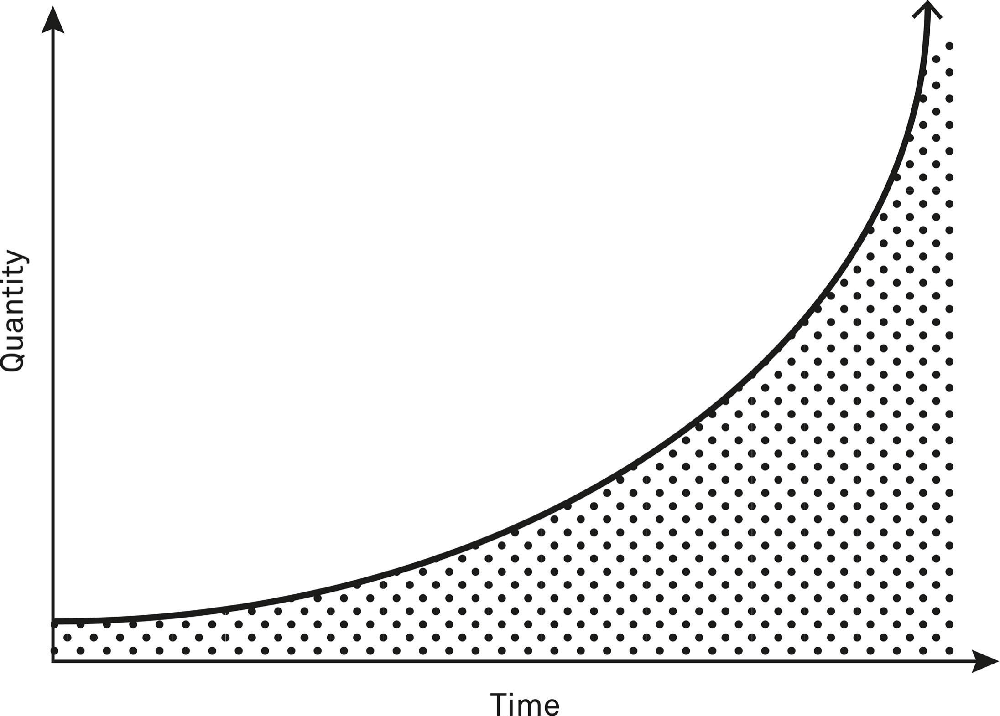

> Play iterated games. All the returns in life, whether in wealth, relationships, or knowledge, come from compound interest.
>
> —Naval Ravikant[[1]](#s0054-55-Notes-EndnoteNumber277 "note")

Compounding is like a snowball rolling downhill: the longer it rolls, the bigger it gets because it’s not just the original snow but also the fresh snow it picks up along the way.

Compounding follows a power law, and power laws are magical things. Knowledge, experience, and relationships compound. When it comes to our personal capabilities, there are few limits to the possibilities suggested by this model.

One of the key things to understand about compounding is that most of the gains come at the end, not at the beginning. You have to keep reinvesting your returns to experience the exponential growth that is compounding.

Albert Einstein supposedly described compounding as the eighth wonder of the world. While he probably didn’t, whoever did wasn’t far off the mark. Compounding is an immensely powerful and often misunderstood force.

The most visible form of compounding is compound interest, in which the interest on a sum of money, if reinvested and untouched, goes on to itself earn interest. This means the total sum of money grows faster and faster, like a snowball rolling down a hill. Even a small amount of money can compound into a fortune over a long enough time span.

Exponential gains increase more dramatically the longer we leave them to compound.

In the same way that money compounds and grows by earning interest, debt can compound too, even to the point where it becomes essentially impossible to pay off. This is called a debt spiral. Many people (and governments) who get into debt fail to realize just how powerful compounding can be over time. As Debt.org[[2]](#s0054-55-Notes-EndnoteNumber278 "note") puts it, “Compound interest is a powerful tool for building wealth. It’s also a devastating tool that can destroy wealth. It just depends on which side of the financial equation you use it.”

Compounding is a crucial, versatile mental model to understand because it shows us that we can realize enormous gains through incremental efforts over time. It forces us to start thinking long-term because the effects of compounding are remarkable only on a long timeline and most of the gains are realized near the end.

Money isn’t the only thing that compounds. Everything from knowledge to relationships can grow exponentially if we keep adding to it and reinvesting the returns. All that matters is making continuous progress, no matter how small.

Exponential functions are hard to envision, so it’s no wonder we tend to underestimate the power of compounding. We’re used to thinking in terms of linear dynamics, but compounding is nonlinear. Of course, other forms of compounding are not literal, and it’s not like we can use a formula to calculate how something like knowledge builds upon itself. But we can use the concept as a metaphorical lens for thinking about how things grow.

> An apparently trivial indulgence in lust or anger today is the loss of a ridge or railway line or bridgehead from which the enemy may launch an attack otherwise impossible.
>
> —C. S. Lewis[[3]](#s0054-55-Notes-EndnoteNumber279 "note")

In a process similar to compound interest, the impact of decisions we make early on in any endeavor grows over time. These early decisions can have a greater impact than decisions made later on because their consequences compound. For instance, imagine a new graduate who takes a job that is disconnected from their true interests. It might seem like a temporary, harmless choice, but it increases the chances the next job they get will be in the same area. The more experience they accrue, the better they’re likely to be, and before they know it, switching is a challenge. It’s important to consider how the consequences of our choices can multiply over time.

### You Don’t Always Know the Payoff

When we invest in things that compound, we don’t always know how we will be able to leverage our compounding interest. Think of investing your money. If you know how much you will put into an account and the interest rate under which it will accrue, you can estimate how much money will be in your account in twenty years. What you cannot predict is what you will be able to do with that money. At the outset, you may imagine you’ll buy yourself your dream home. But twenty years from now, you might leverage the money to make a different career choice. The security of having it in the bank might mean that you can take bigger risks to pursue your dreams.

Small investments over time in areas like relationships and learning have immediate benefit, which is usually what prompts us to undertake the initial commitment. But one of the most fascinating properties of using compounding as a lens is that it illuminates how investments now can give us opportunities later that we can’t even imagine now.

One example of how compounding knowledge creates options is the long-term effects of Jewish education norms. In *The Chosen Few*, Maristella Botticini and Zvi Eckstein trace the role of education in the Jewish religion and show how it was an investment that gave the Jewish people incredible opportunities.

In the first century of the Common Era, Jewish scholars and religious leaders “issued a religious ordinance requiring all Jewish fathers to send their sons from the age of six or seven to primary school to learn to read and study the Torah in Hebrew. Throughout the first millennium, no people other than the Jews had a norm requiring fathers to educate their sons.”[[4]](#s0054-55-Notes-EndnoteNumber280 "note")

Botticini and Eckstein make it clear that there was no plan in the early days of Jewish education that this practice would offer advantages down the road. As they explain, in the beginning “sending children to school to learn to read and study the Torah was a sacrifice with no economic returns in the agrarian economies in which the Jews lived.” Following the rule to educate was costly in terms of both maintaining the educational infrastructure and productive time lost. Initially the only tangible benefit of following the rule was probably something like spiritual satisfaction.[[5]](#s0054-55-Notes-EndnoteNumber281 "note")

When the norm of education was instituted, Jewish people were primarily farmers. Within a few centuries, they had given up farming for more lucrative professions as craftsmen, merchants, and moneylenders. Botticini and Eckstein demonstrate that “the direction of causality thus runs from investment in literacy and human capital to voluntarily giving up investing in land and being farmers to entering urban occupations to becoming mobile and migrating.”[[6]](#s0054-55-Notes-EndnoteNumber282 "note")

The authors argue, “Learning to read helps people learn to write. It also helps develop numeracy and the ability to compute prices, costs, interest rates, and exchange rates, and thus to keep account books.” Therefore, literacy creates opportunities. Jewish people did not have to be farmers, a profession with less earning potential than those options available in the growing urban centers. Not only does literacy give you a competitive edge to be, say, a moneylender or merchant, but it also “raises productivity and earnings in these professions.”[[7]](#s0054-55-Notes-EndnoteNumber283 "note")

First in the Muslim caliphates and then in medieval Europe, Jewish people were consistently able to move into more financially rewarding professions at a significantly higher rate than non-Jewish people. “The literacy of the Jewish people, coupled with a set of contract-enforcement institutions developed during the five centuries after the destruction of the Second Temple, gave the Jews a comparative advantage in occupations such as crafts, trade, and moneylending.” So while “most of the population in medieval Europe consisted mainly of illiterate peasants, sharecroppers, and agricultural laborers,” Jewish people were able to leverage their literacy (and other aspects of their culture) to specialize in lucrative professions.[[8]](#s0054-55-Notes-EndnoteNumber284 "note") They took advantage of the opportunity their education gave them by moving into professions that paid well.

Just because you don’t anticipate all the opportunities an investment will give you down the road doesn’t mean you don’t take advantage of them when they arise. From very early days, Jewish people invested in education. At first, likely for spiritual reasons, the investment nonetheless allowed them to capitalize on changes in the world economy. Their literacy allowed them to be first movers when new professions arose that required and thrived on an understanding of words and numbers. Botticini and Eckstein explain, “The Jewish community reaped the benefits of their investment in literacy by selecting into urban skilled occupations.”[[9]](#s0054-55-Notes-EndnoteNumber285 "note")

We cannot know all the opportunities that will arise because of the investments we make today. Botticini and Eckstein conclude that “high levels of literacy and the existence of contract-enforcement institutions became the levers of the Jewish people.” And they used these levers to “continue to search for opportunities to reap return from their investment.”[[10]](#s0054-55-Notes-EndnoteNumber286 "note")

The lesson of applying the lens of compounding to Jewish education norms is to invest in things that provide you with benefit. The early Jewish people received from their investment in literacy a benefit in terms of their religious commitment. As time continued, the knowledge they accrued compounded, giving later generations exceptional opportunities.

### Reinvesting Experience

Experience can also compound. If we choose to build on the skills we’ve developed by using them in new situations, we are significantly more capable later in life. Using compounding as a lens to look at personal experience isn’t about proving an equation. Rather, this model can give us insight into what it means to reinvest what we learn through experience.

In 2008 Mireya Mayor, a scientist and explorer for National Geographic, participated in an expedition to retrace the path of Henry Morton Stanley, the man sent to find Dr. David Livingstone in Tanzania. Livingstone, the nineteenth-century rock star explorer of his generation, had gone missing, and Stanley was sent by an American newspaper to try to locate him. Mayor was part of a team of four who were filmed trying to complete the treacherous journey with the same equipment Stanley would have had in 1865. Despite challenging terrain, illness, and a variety of dangerous animals, she and the rest of the group completed the challenge. How Mayor was able to do things like trek for hours in incredibly hot, humid temperatures while battling dysentery can be illuminated through the lens of compounding.

One of the key components of financial compounding is the reinvestment. When the money you have invested earns interest, you can’t take it out and go buy a new pair of shoes. You have to reinvest that interest into the original investment, so you increase the amount of funds earning interest.

We can think of using what we’ve learned in a similar way. The insights we get from experiences will pay off more if we reinvest them into further experiences.

Exponential gains from what we’ve learned aren’t standard. Not everyone who has a degree in journalism wins the Pulitzer. Not everyone who has a lemonade stand as a kid ends up running a national juice chain.

Humans have evolved to be pretty good at using past experience to guide future decisions, so a lot of knowledge compounding happens naturally over time, especially when we are young. But sometimes we get stale. We stop reinvesting that interest because we stop challenging ourselves. We stop compounding our learning. Twenty years of living becomes the same year repeated twenty times.

To gain insight and eventually wisdom, we need to reinvest our knowledge and let it compound. One way to do that is to be more deliberate about identifying how our past experiences can improve our chances of success in future ones.

Getting back to Mireya Mayor, it’s unlikely she would have been successful on her Tanzanian expedition if it had been her first. It was tough. The conditions and the team dynamics were brutal. But she had years of insights from previous expeditions to draw on and apply.

Her first expedition was to Guyana in 1996, where she started doing the field research necessary to become a primatologist. She recounts how she packed for this expedition to study a rare species of monkey: “I purchased my plane tickets, the impractical teddy-bear backpack, and a pair of trendy hiking boots.”[[11]](#s0054-55-Notes-EndnoteNumber287 "note") Her luggage also included a sleeping bag, tweezers, and a little black dress. She learned that the sleeping bag was unusable due to the deadly creatures that crawled around the forest floor and that hiking boots need to do more than look good. But she also learned that tweezers are invaluable on field expeditions because they can be used to remove a variety of small organisms that like to lodge in the skin.

In reflecting on her knowledge about packing gained from fieldwork, she writes, “By the time I had a few other trips to remote places under my belt, I had become an expert at packing minimalist.” This expertise was gained through experience and included insights on the value of packing mirrors (for signaling and tick checks), tampons (for starting fires), and Windex (for neutralizing flesh-eating bacteria).[[12]](#s0054-55-Notes-EndnoteNumber288 "note")

Beyond what to pack for survival in the jungle, Mayor’s story suggests further reinvestment of experiences compounding into her eventual success. Granted, she doesn’t use the words “deliberate reinvestment,” but the stories she shares demonstrate a conscious reflection on how to use past knowledge. For example, before she was an explorer and primatologist, she was a cheerleader for the Miami Dolphins American football team. At first glance one might think there was no useful knowledge that could be applied from one job to the other, but Mayor writes, “Working under pressure is nothing new to me. Even when I was an NFL cheerleader, I had to perform under the gun. Dancing in front of more than 75,000 screaming fans, remembering to smile, and making sure my hair remained in place in scorching heat after twisting an ankle—that’s pressure.”[[13]](#s0054-55-Notes-EndnoteNumber289 "note")

Mayor made numerous trips to Madagascar to study small primates that are unique to the island, like Perrier’s sifaka. Over time she built relationships with everyone from other primatologists to organizations with grant money to the locals she relied on to navigate the island and support the expeditions. After years of fieldwork, she became a wildlife correspondent for National Geographic. She says, “Years before I appeared on television pointing out little-known facts about snakes or describing the mating behaviors of gorillas, I was putting in the legwork.”[[14]](#s0054-55-Notes-EndnoteNumber290 "note")

This legwork gave her the knowledge to take on a vast array of assignments for National Geographic, from diving with sharks and giant squid off the coast of Mexico to working with leopards and giraffes in Namibia. Following Mayor through the journey of her career, from cheerleader and graduate student to television host, explorer, and primatologist, it’s clear that her early experiences allowed her to take on increasingly complicated and dangerous challenges.

Which brings us back to Tanzania and the expedition to re-create the journey of Stanley’s ultimately successful search for Livingstone. The journey was dangerous right to the final day. This is her description of the end:

> Back in canoes, we paddled up a tributary that ran through a swamp; it was slow going. A blood-red torrent of unknown origin came out of the swamp and reminded me of descriptions in Stanley’s journals. When we couldn’t go any farther, we stepped out into the swamp. There were snakes and crocs everywhere. We were treading through mud up to our waists when suddenly my bad cheerleading ankle gave out on me. I tore a toenail off as I landed face first in the mud. This was no spa treatment. In the process I lost my shoe and would have to walk through the swamp barefoot, getting slashed by razor-sharp grasses while being sucked into the mud. Tanzania had already kicked my ass, but it was nothing compared to these last few miles.[[15]](#s0054-55-Notes-EndnoteNumber291 "note")

Mayor’s success at completing the arduous expedition is testament to her ability to reinvest the knowledge accrued from past experiences and capitalize on the resulting growth. A career like Mayor’s reveals the power of using the lens of compounding to shape how we use our hard-won insights to allow us to take on exponentially greater challenges.

### Compounding Relationships

Relationships are another thing that compound, becoming stronger over time if we keep investing in win-win dynamics. Imagine a network of nodes that connect to one another at random. The likelihood of any given node receiving an additional connection is proportional to the number of connections it already has. Through randomness, a small number of nodes will end up receiving most of the connections—a phenomenon called “preferential attachment.”

Preferential attachment is a type of compounding that occurs when a certain thing (such as money or friends) is more likely to accrue to individuals or entities that already have more of it. For instance, people who have many friends tend to keep making more and more. They have more opportunities to meet new people through the ones they already know.

For someone to gain a serious cumulative advantage, it’s not even necessary for them to have dramatically different starting conditions than their peers. Michael J. Mauboussin writes in *The Success Equation* that small differences in the economic climate when someone graduates from college can compound. For each additional percentage point higher the unemployment rate is when someone graduates, they can expect to earn 6 percent to 7 percent less in their career.[[16]](#s0054-55-Notes-EndnoteNumber292 "note") To graduate during a recession means having a serious disadvantage, regardless of how smart someone is or how hard they work.

Thus where you start in life may have a huge impact on where you end up, but it doesn’t have to define it. Some people can achieve extraordinary things against the odds by understanding and leveraging the concept of cumulative advantage. Such people grab hold of one tiny advantage and get every additional possible benefit out of it. Then they keep repeating that process until they get where they want to be. One way of doing this is through networking. Each person you know has the potential to lead you to additional people. The stronger your network, the more influential or interesting the people you could get introduced to. Professional and social networks build upon themselves. Some people have an uncanny ability to take a connection with one person and use it to accelerate their careers.

Sidney James Weinberg was not your typical Wall Street banker—not by today’s standards, nor even by the standards of the early twentieth century, when he rose to the pinnacle of the banking world. For a start, there was his background. Weinberg didn’t come from an illustrious family. He didn’t have a top-tier education or a long list of credentials. He didn’t get a leg up from well-positioned Wall Street contacts either. Instead, he was the son of a Polish liquor dealer and one of eleven children. His education didn’t stretch beyond his thirteenth year, when a teacher deemed him ready to enter the workforce. By that point, he’d already been working for several years selling newspapers and doing other menial jobs.[[17]](#s0054-55-Notes-EndnoteNumber293 "note")

Nor did he particularly look or sound the part of a Wall Street success story. Weinberg was just five feet, four inches tall and was usually dwarfed by the other bankers around him. His back was marked with knife scars from childhood street fights.[[18]](#s0054-55-Notes-EndnoteNumber294 "note") He never made any effort to disguise his distinctive Brooklyn accent or lie about his background, even going so far as to proudly keep the spittoon he’d polished when he first got his start doing low-level work at Goldman Sachs.[[19]](#s0054-55-Notes-EndnoteNumber295 "note") He was famously outspoken and always willing to make jokes at his own expense.[[20]](#s0054-55-Notes-EndnoteNumber296 "note")

Yet despite his unorthodox background, Sidney Weinberg became one of the most powerful people on Wall Street, holding the position of Goldman Sachs CEO for thirty-nine years. What set him apart was his understanding of cumulative advantage. His greatest assets were the relationships he carefully built and then continued to build upon to form more relationships. He understood that the more people he knew, the more people he could meet. By focusing on strengthening and then leveraging his relationships, Weinberg achieved remarkable success.

He started off on Wall Street at about age fifteen. These being the days before security was a thing, he picked a skyscraper and went from office to office, looking for any available work. Eventually he earned a menial job as a janitor’s assistant at Goldman Sachs for a few dollars a week.[[21]](#s0054-55-Notes-EndnoteNumber297 "note")

One day Weinberg was tasked with taking a delivery to Paul Sachs, the founder’s son. Sachs was charmed by him and had him promoted to the mailroom. Having a sudden opportunity to prove himself, Weinberg made an impression by reorganizing the mailroom to be more efficient, convincing Sachs he had potential in a banking role within the company. Sachs paid for Weinberg to take his first banking course and mentored him through university. When Weinberg returned to Wall Street after serving in World War I, his hard work paid off: he was now a salesperson. Eight years later, he was a securities trader. Another three years after that, Weinberg was the CEO. While we don’t know exactly what happened during those years, everything began with that lucky meeting with Paul Sachs, which gave Weinberg a chance to prove himself. From there, he was able to get a better role in the company, which gave him access to even more people and more opportunities for promotion.

We can understand Weinberg’s phenomenal rise if we consider the ways in which he worked to build beneficial relationships that offered him accruing influence and opportunities throughout his entire career. We can see clues as to how he managed this further on in his career. One way that Weinberg built relationships was by serving on the boards of corporations—at one point over thirty, for which he attended more than 250 meetings per year. He befriended every CEO he could by being as helpful as possible. Board meetings weren’t a distraction from his main job, they were a way to further it.

When Franklin D. Roosevelt ran for president, he was an unpopular candidate on Wall Street. Weinberg saw a chance to stand out by supporting him and raising campaign funds, bridging business and politics. He already had influence on Wall Street, which he was able to convert into political influence. After Roosevelt won the election, Weinberg organized an advisory board of corporate executives, all carefully chosen to align with his own business interests.[[22]](#s0054-55-Notes-EndnoteNumber298 "note") He knew that giving the executives such a high-status position would ensure their patronage later on. Many indeed became clients of Goldman Sachs.

It’s worth noting that Goldman Sachs was not the giant it is today, meaning Weinberg’s political influence was unusual and likely the result of his relationship-building.[[23]](#s0054-55-Notes-EndnoteNumber299 "note") He always declined offers of political roles; Wall Street was his world, and politics served simply as means of building relationships. Throughout his career, he advised a total of five US presidents, using the entry point of Roosevelt’s campaign.

Building lasting relationships with Goldman Sachs clients was also an important part of Weinberg’s work. But he didn’t just help people who were of direct use to him. One story tells of him sending a hundred dollars a week to a business rival who fell on hard times. As he told others, friendship should always come before business.[[24]](#s0054-55-Notes-EndnoteNumber300 "note")

Weinberg saw both the number of his relationships and their durability compound over time. His conscientious approach to his interactions with people suggests he invested in his relationships. When we aim to make our relationships reciprocal, seeking to give as much as possible before we take, we can reap the benefits of compounding. The more we strengthen and deepen relationships, the more they build on themselves. The Wall Street of Weinberg’s heyday was built on relationships. These days, we’re not likely to see another Sidney Weinberg because the old system of reciprocity is no longer sufficient. When we create societies in which starting conditions matter more than capacity and effort, we narrow the range of who can reap the benefits of compounding even if they start from nothing. That initial foot in the door upon which relationships build can be the hardest part.

### Conclusion

Compounding is the magic of exponential growth. It’s the idea that small, consistent gains can snowball into massive results over time. Like a tiny snowball rolling down a hill, picking up more and more snow until it’s an avalanche.

Compounding requires us to think long-term about our knowledge, experiences, and relationships. It tells us that the small stuff we learn, the people we meet, and the connections we deepen, when reinvested into our lives, build up our fortunes in wisdom and relationships, not by chance, but by the steady, patient accumulation of efforts. The majority of success doesn’t happen by accident, and the lens of compounding illuminates the investments we need to make to get there.

Compounding is how you turn ordinary into extraordinary, one tiny gain at a time.
