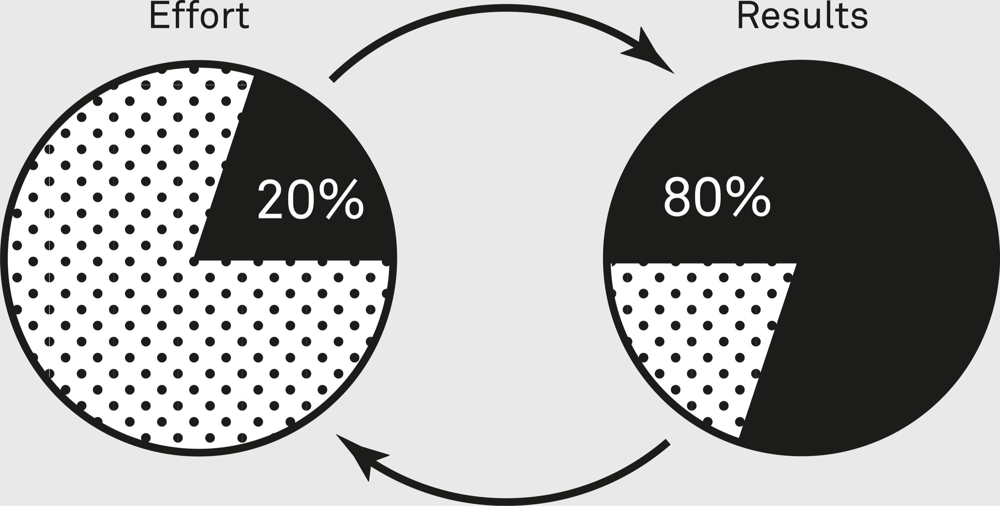

### Supporting Idea: Pareto Principle

In 1906, the Italian polymath Vilfredo Pareto was researching wealth distribution in Italy. He noticed that 20 percent of the population owned 80 percent of the land and wealth. He is also said to have observed the same distribution in the pea plants he grew, wherein 20 percent of plants produced 80 percent of the peas. In the 1940s, quality control consultant and engineer Joseph M. Juran noted that 80 percent of manufacturing defects were the result of 20 percent of production issues. Juran applied Pareto’s name to the principle he defined as a result: In systems, 80 percent of outputs are typically the result of 20 percent of inputs. The other 20 percent of outputs are the result of the remaining 80 percent of inputs.

We can apply the Pareto principle to numerous areas where this type of distribution holds roughly true: 20 percent of researchers in a field produce 80 percent of published research; 20 percent of words in a language are used 80 percent of the time; 20 percent of the population use 80 percent of healthcare resources and public services; 20 percent of a company’s customers create 80 percent of its profits. We often generate 80 percent of our personal results from 20 percent of our efforts. Of course, such distributions tend to be approximate, not precise. The Pareto principle is a rule of thumb, not a law of nature. However, the true split is often surprisingly close to 80-20.

Inputs and outputs are not evenly distributed. Not all inputs lead to the same sort of output. Not all the time you put into a project will be equally productive. Not all the money you put into a retirement fund will have the same impact on the final amount. Not all the employees in a company will be responsible for the same amount of its annual profits. Knowing this can teach us where to focus time and energy. If a company knows 80 percent of users of a piece of software will only ever touch 20 percent of its features, they know to make those as effective and user-friendly as possible.

> That is all there is to the 80/20 rule. We tend to assume that all items on a list are equally important, but usually, just a few of them are more important than all the others put together.
>
> —Hans Rosling[[23]](#s0054-55-Notes-EndnoteNumber346 "note")

