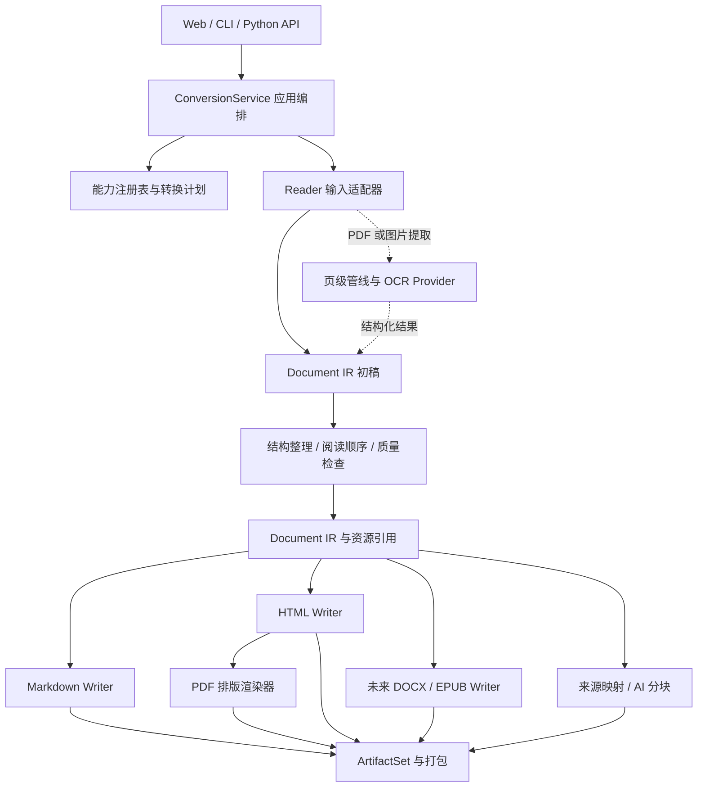
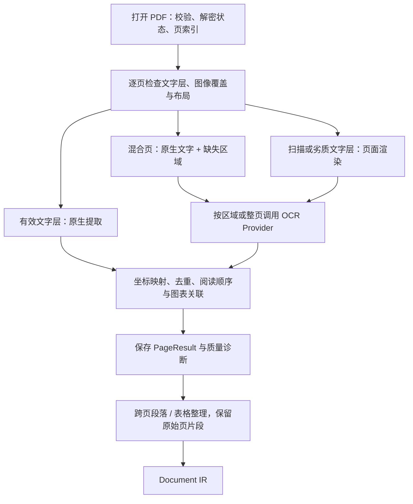

# 文档转换架构演进方案

状态：架构提案，尚未实现。日期：2026-09-16。

实际开发节奏与验收分工以 [人机协作实现 TODO](../TODO.md) 为准：按可用功能交付运行脚本，由用户执行和反馈；不安排编写单元测试或自动化测试套件。

书籍是本项目的核心场景。章节识别、完整层级、整体/分章 MD 的统一索引与文件命名详见 [书籍结构与导航专项设计](0003-book-structure-and-navigation.md)，目标源码目录和实施优先级以该细化方案为准。身份、目录修订、任务和导出位置的持久化见 [SQLite 设计](0004-sqlite-persistence.md)。

本方案基于当前仓库的静态代码分析，覆盖多格式互转、统一 Markdown 能力、AI 消费、PDF 分页与图表，以及未来本地小模型 OCR。此次只新增设计文档，不调整运行逻辑、依赖和 API。`0001-overview.md` 保留为早期 Web 服务设计记录；后续架构演进以本提案为讨论基础。

## 1. 核心决策

采用**模块化单体 + 统一文档中间模型（Document IR）+ 输入输出适配器 + 分阶段处理管线**。

所有正式支持的输入都必须有通向 Markdown 的路径。Markdown 是标准输出和 AI 阅读视图；转换过程还应保留页面、表格、图片及来源等信息，供其他格式导出和后续识别优化使用。

原文件、IR、导出文件分别负责原始证据、结构化内容、交付展示。IR 也不承诺保存原格式的全部排版细节，因此原文件和必要的页面预览仍需保留。

初期维持一个 Python 项目、本地文件存储、SQLite 和少量显式注册的组件；SQLite 持久化任务及书籍身份，原始文件和大产物存文件系统。等本地模型接入时，再增加独立推理 worker。暂不引入微服务、通用工作流平台、任意格式转换图搜索或复杂插件发现系统。

## 2. 当前实现与架构问题

以下是代码检查结果，尚未通过真实文件做效果验证。

| 现状及代码位置 | 对维护和扩展的影响 | 演进方向 |
|---|---|---|
| `web/services/converter.py` 同时进行格式分派、转换、渲染、ZIP 打包和任务更新 | 新格式需要修改中心分支，多处重复 MD → HTML → PDF | 应用层组织流程，Reader/Writer 负责格式适配 |
| `web/services/file_manager.py:get_available_outputs` 另有静态转换矩阵 | 格式声明和实现容易不一致；缺少 MD 输入；`.doc` 被映射为 DOCX，但没有独立旧版 Word 解析器 | 能力注册表统一驱动检测、规划和 UI；`.doc` 单独声明支持状态 |
| `epub_to_md/__init__.py` 约 700 行；EPUB → MD 和 EPUB → HTML 各自解析内容与资源 | 章节、锚点和图片规则需要重复维护；自定义表格转 MD 只读取单元格文本 | 合并输入语义提取，统一资源引用和表格模型 |
| `docx_to_md/converter.py` 先转 HTML 再 MD；Web 又可能把 MD 转回 HTML | 中间丢失的信息无法在后续导出恢复 | 在 HTML/原始结构阶段进入 IR，再分别导出 |
| `pdf_to_md/detector.py:is_scanned_pdf` 以默认前 5 页平均字符数分类整份文件，读取异常也返回扫描版 | 后半部分扫描页、混合页可能漏 OCR；坏文件和需要 OCR 混为一谈 | 逐页检测，必要时区域检测；错误独立分类 |
| `pdf_to_md/converter.py` 向上只返回 MD 路径；原生分支未建立显式页、坐标、图片和表格契约 | 无法在项目层验证页覆盖、定位识别错误或只重跑一页 | 页级结果、来源坐标和资源清单成为正式契约 |
| `ocr_to_md/converter.py` 直接读取 `web.config`，约定远端返回 `result.md + images/` | OCR 与 Web 配置耦合；服务返回值不足以承载结构化布局 | 注入 OCR 配置与 provider；保留旧服务适配器 |
| 转换器返回值混用 `Path`、对象和元组；任务仅记录 `download_filename` | HTML → MD 实际写入 `single/`，下载却从输出根目录按文件名查找；单 MD 下载也不包含配套图片 | 统一 ArtifactSet，保存相对路径与依赖关系 |
| `/fetch` 将 URL 保存为 `url.txt`，但任务 `filename` 存的是 URL；调度用 `filename` 定位上传文件 | 显示名称、来源地址、存储位置混用，读取路径不一致 | SourceRef 单独表达来源和存储标识 |
| Web 异步后台函数中直接执行同步解析和 PDF 渲染；任务状态为进程内字典 | 重计算可能阻塞服务；多 Web worker 不共享任务，长任务缺少恢复点 | 执行器与状态存储分离，计算有界并发 |
| 清理逻辑按目录时间删除文件，任务含义与文件生命周期分离 | 长时间 OCR 的在用文件可能被清理 | 按任务租约、引用和终态保留期回收 |
| `pyproject.toml` wheel 列表未包含 `pdf_to_md`、`ocr_to_md`、`docx_to_md`、`url_to_md`；PDF 字体引用位于 Java 历史目录 | 源码目录运行与安装后运行存在差异风险 | 统一包布局、显式资源打包和安装验证 |

上述路径和下载问题可在迁移第一阶段修复，不需要等待 OCR 或 IR 的完整实现。

## 3. 目标结构与依赖方向



数据流允许 Reader 内部采用成熟库完成中间转换。例如 DOCX Reader 可以先调用 Mammoth 生成 HTML，再交给共享 HTML 解析组件；PDF Writer 可以组合 HTML Writer 与 WeasyPrint。第三方返回值在适配器边界转换，避免进入公共模型。

通用职责划分如下，不立即创建空目录和空接口；实际目标目录采用书籍专项设计第 7 节，将章节语义、导出规划、语法渲染和 SQLite 适配进一步分开：

```text
src/any_to_md/
  domain/                    # 文档模型、来源、资源引用、错误、质量信息
  application/               # 请求、规划、管线编排、任务与产物契约
  ports/                     # Reader、Writer、OCR、Store、Executor 的小接口
  readers/                   # epub、html、markdown、docx、pdf、image
  writers/                   # markdown、html、pdf；后续 docx、epub
  processors/                # 阅读顺序、段落合并、表格整理、AI 分块
  adapters/
    ocr/                     # 现有 HTTP 服务、未来本地小模型
    acquisition/             # URL 抓取、文件导入
    storage/                 # 本地文件与任务存储
    execution/               # 本地进程执行器、未来模型 worker
  resources/                 # 渲染模板、样式及明确打包的字体资源
  bootstrap.py               # 注册实现、注入配置、组装应用
web/                         # 过渡阶段保留现有 API/UI
tests/                       # 契约与集成验证，实施时增加
evals/                       # 真实样本、标注、效果评估与版本对比
specs/                       # 架构决策与迁移记录
```

依赖只能由入口/适配器指向应用契约和领域模型；`domain` 不导入 Web、OCR SDK、数据库或第三方解析器。配置在 `bootstrap` 注入，解析模块不读取 Web 全局设置。库调用不要求启动 FastAPI。

## 4. Document IR：语义结构与版面来源分开建模

### 4.1 基本对象

| 对象 | 关键字段与责任 |
|---|---|
| `Document` | `schema_version`、`document_id`、`revision_id`、标题/作者/语言、`source_refs`、语义根节点、页索引、资源索引、诊断信息 |
| `Section` / `Block` | 稳定 ID、父子引用、有序内容；块类型包括标题、段落、列表、代码、引用、公式、图片、表格、脚注和未识别区域 |
| `Book` / `StructureNode` | 书籍/版本身份、完整章节树、章节角色、原书编号、规范阅读顺序与内容归属；章节粒度与文件切分独立 |
| `Inline` | 文本、强调、代码、超链接、内部锚点和脚注引用；避免段落只存字符串而丢失行内语义 |
| `Page` | 物理页 ID、从 0 开始的 `page_index`、可选印刷页码 `page_label`、宽高、旋转、处理状态和页面预览引用 |
| `SourceSpan` | `source_id`、可选页 ID、边界框/多边形、可选文字范围；流式文档可用 EPUB 路径、DOM 锚点等定位 |
| `Asset` | 内容哈希、媒体类型、尺寸、存储标识、来源；区分原始嵌入图、区域裁剪、页面预览及衍生缩略图 |
| `Table` / `Cell` | 行列数、单元格坐标、`rowspan`/`colspan`、表头角色、结构化内容、单元格来源、各页片段及原图引用 |
| `Provenance` | 提取方式、引擎与模型版本、规则版本、来源定位；原始置信度、分值含义和校准版本均可为空 |
| `Diagnostic` | 错误/警告代码、严重度、页或块 ID、原因、是否可重试、已采用的降级方式 |

正文树保存一份规范内容；页面通过来源关联内容，避免再复制一份全文形成不同步的两个版本。跨页段落、跨页表格允许一个语义节点关联多个 `SourceSpan`，因此 `Page.blocks` 不能作为唯一内容组织方式。

没有物理分页的 EPUB、HTML、MD 不虚构源页码，页面索引允许为空。单张图片可用一个明确标注为 `image_canvas` 的页面承载坐标；多帧图片需声明处理范围，不能静默只保留第一帧。DOCX 中的显式分页符可保存为提示，真实渲染页码要在排版后记录。

### 4.2 坐标、版本和不确定性

- PDF 来源坐标统一为应用旋转后、可见裁剪页左上角原点的 point 坐标，横向向右、纵向向下；同时保留原始页面框、旋转与可逆变换。OCR 返回像素坐标时必须携带渲染尺寸、DPI、裁剪偏移与变换，转换后再写入来源位置。
- `page_index` 是物理顺序，用户显示默认 `page_index + 1`，原文印刷页码独立保存；页级重试不改变页 ID。对跨页块的文字片段建立来源映射，避免只知道整段涉及哪些页。
- 每个节点只拥有一个父节点；引用、来源、单元格跨度及阅读顺序需通过模型校验。未知结构保留原始片段/图像和诊断，不能被静默删除。
- 同一文档修订内 ID 稳定；重跑产生新修订并记录节点对应关系。不同模型切块不同，不能承诺跨模型生成完全相同的 ID。
- 缺失置信度使用空值，不默认满分；不同模型的原始分数不直接比较，用统一评估和校准策略决定升级处理。
- 规范 JSON 序列化带 schema 版本；升级提供显式迁移，不支持的主版本应拒绝读取。扩展元数据按提供者命名，公共结构保持强类型。

## 5. 格式互转与能力注册

### 5.1 输入、输出和打包分开

URL 是获取来源的方式：`URL → Fetcher → HTML + base URL + 资源 → HTML Reader → IR`。获取时保存内容快照和哈希；重试解析使用同一快照，重新抓取产生新来源版本。

`md_single`、`md_chapters` 是旧 API 的展示选项。内部统一为 `target=markdown`，另设 `split=none|chapter|page` 和 `package=auto|file|bundle`。没有章节结构时，拒绝严格的 chapter 拆分或返回带诊断的单节结果，不能把每页冒充章节。

输入检测先识别内容和容器，再结合扩展名；PDF 是否需要 OCR 属于内容分析，不增加 `scanned_pdf` 这种互斥格式类型。

| 输入 | 当前代码路径 | 目标路径与新增范围 |
|---|---|---|
| EPUB | 分别转 MD、HTML，再经 HTML 转 PDF | EPUB Reader → IR；共用 MD/HTML/PDF Writer |
| HTML | 转 MD 或 PDF | HTML Reader → IR；允许注册保留样式的直接 PDF 路径 |
| DOCX | Mammoth → HTML → MD，再导出 | HTML/原始结构 → IR；逐步补齐复杂表格、脚注等能力 |
| PDF | 整份选择原生提取或远端 OCR → MD | 逐页/区域提取 → IR，再导出 |
| 图片 | 整文件送远端 OCR → MD | 图像页面 → OCR/布局阶段 → IR |
| URL | 抓取正文并直接输出 MD | 获取快照 → HTML Reader；正文提取为可配置处理策略 |
| MD | 当前未作为输入注册 | 新增 Markdown Reader → IR → HTML/PDF；保留元数据和资源 |
| DOCX / EPUB 输出 | Python 主流程尚未实现；Java 服务仅供参考 | 后续新增对应 Writer，并明确其格式保真范围 |

格式互转默认走 `Reader → IR → Writer`。有 n 个 Reader 和 m 个 Writer 时，主要维护 n+m 个适配器；具体保真能力仍由每个 Reader/Writer 及其组合决定，不能据此宣称任意转换无损。

### 5.2 最小接口契约

| 契约 | 输入 → 输出 | 边界 |
|---|---|---|
| `SourceResolver` | 文件/URL 引用 → 已落地的 `SourceRef` | 名称、URL 和文件存储标识独立 |
| `Reader` | SourceRef + ReadOptions + Context → DocumentDraft + Diagnostics | 允许流式提交页面；不决定下载格式 |
| `Processor` | 文档/页/块 + Options → 新修订或阶段结果 | 显式声明所需能力与产出，保留改动来源 |
| `Writer` | Document + WriteOptions + Context → ArtifactSet | 不承担 OCR、不更新 Web 任务 |
| `OcrProvider` | 页面/区域栅格 + OcrOptions → OcrResult | 不要求 provider 返回 Markdown；不自行打包交付物 |
| `ArtifactStore` | 资源或文件流 ↔ ArtifactRef | 路径分配、校验、引用和生命周期 |
| `TaskRepository` / `Executor` | 任务状态 / 阶段任务 → 持久状态 / 阶段结果 | 状态持久化与计算执行分别替换 |

同步解析走计算执行器，异步网络调用走 I/O 执行器；Context 只提供明确依赖，如资源读写、取消信号和进度事件。不要给所有适配器传可任意访问整个系统的服务容器。

注册项包含输入/输出格式、实现版本、可用状态、能力标签、限制、可选依赖和资源需求。例如 `page_provenance`、`table_spans`、`images`、`reading_order` 必须区分“支持”“尽力提取”“不可用”。

规划器先检验 `required_features`、OCR 策略和环境可用性，再选显式策略路径。对已知损失生成 `LossReport`；严格模式阻止不满足要求的转换。启动时的注册信息和当前输入分析结果共同决定 API 返回的可用选项，避免仅按扩展名承诺能力。

Markdown Writer 是核心组件；每个正式 Reader 都要通过 MD 导出契约。OCR 未配置时，扫描件可报告“需 OCR”，不能用空白 MD 冒充成功。只剩图片的降级 MD 必须明确标注“未识别文字”，并将任务标为部分完成。请求其他输出时可以附带 MD，AI 交付配置默认附带，但不要求用户每次只下载 MD。

直接转换只作为注册的、可说明保真收益的例外，如 HTML → 排版 PDF。它不能取代该输入的 MD 路径；同时请求 PDF 和 MD 时可以从同一来源执行两条明确路径，并分别记录损失与结果。

## 6. PDF 管线：以页和区域为处理单位



### 6.1 检测与提取

1. 建立完整页索引；空白页也有成功处理状态。坏文件、加密未解锁、渲染失败、无文字和需要 OCR 是不同状态。
2. 每页采集有效字符、乱码、文字与图像覆盖、现有 OCR 层重复情况及布局线索。阈值是可配置策略，通过样本评估调整；少量文字不能直接证明整页无需 OCR。
3. 文字页提取文字位置、字体线索和阅读顺序候选；扫描页渲染后识别；混合页优先补齐未覆盖区域。不能提供区域能力的引擎可整页识别，但必须进行位置与文本去重。
4. OCR、版面分析、表格结构识别、公式识别是可独立替换的阶段。一个模型可提供多个能力，但不能把“能 OCR”自动等同于“能识别表格结构”。
5. 汇总时保留正文、标题、页眉页脚、脚注、图片和表格关系。页眉页脚去除采用分类/过滤视图，原始结果仍可追溯；阅读顺序不能仅按 y 坐标排序。

### 6.2 分页保证

- 处理每个物理页，不因无文字、失败或合并段落而漏掉页记录；所有请求范围内的页都必须具有成功、空白或失败等终态。
- 物理分页与逻辑章节分开保存。连续 MD 允许跨页合并段落，同时通过来源映射保留文字对应的原始页；按页 MD 直接基于页片段渲染。
- MD 页边界标记仅用于引用和阅读，不代表目标格式的真实分页。重新排版导出的 PDF/DOCX 页码单独记录，不能覆盖源页码。
- PDF → PDF 区分 `reflow`（重排版）、未来 `searchable_overlay`（原页上叠加 OCR 文字层）和原件下载。现有 MD → HTML → PDF 属于重排版，不能作为“保持原页”的实现。
- 需要原版面时保留源 PDF/页面图；未来叠加文字层需具备词/行定位和坐标验证，只有纯 MD 的引擎不能宣称支持。

### 6.3 图片保证

- 保存可提取的原图；矢量图、组合图、复杂蒙版不能正确重建时，允许裁剪渲染并记录其为衍生图。
- 资源本体按内容哈希去重；同一图像在不同页的出现位置、图题和来源分别记录。整页扫描图与正文插图角色分开。
- MD 资源路径相对于最终文件位置统一生成，分章节和 ZIP 打包之后仍可解析；图像必须进入资源清单，不能只返回正文路径。
- 图中文字与可选模型生成的描述分别存储。模型描述标注为生成内容，不能替代原图或混入原文充当事实。

### 6.4 表格保证

- 先保存行列、跨度、表头、标题、单元格内容与来源，再由 Writer 决定展示格式；不能把表格只保存成一段管道符字符串。
- 简单矩形表格可导出 GFM 表格；合并单元格、嵌套内容等采用 HTML 表格或严格 MD 的逐行键值表达，并附结构化 JSON/原图。CSV 可作为简单表格的附加产物，但无法完整表达合并关系。
- 跨页表格保留各页片段，再根据表头、列位置、邻接关系等生成可追溯的逻辑合并。置信不足时保持分表并说明，避免错误拼接。
- 表格识别失败时保存区域图、已识别内容及失败原因；普通模式可部分交付，要求表格结构的严格模式应失败，不能悄悄把截图当成结构恢复成功。

这些保证首先是数据契约、处理状态和导出校验。OCR 正确率、表格还原率和阅读顺序准确率仍需要评估，不能只靠架构承诺。

## 7. 未来小模型 OCR 的接入边界

暂不选定具体模型、运行时或设备。模型选择依赖中文/英文、扫描质量、表格复杂度、机器内存/显存和吞吐目标；用同一批样本比较后再确定。

`OcrRequest` 至少包含页面或裁剪图引用、页/区域 ID、语言提示、坐标变换、需要的能力、超时与像素预算。`OcrResult` 包含文字片段、可选边界框、可选表格/布局结果、引擎版本、诊断和原始返回值引用。未知字段如置信度不能编造。

| 组件 | 责任 |
|---|---|
| `LegacyHttpOcrProvider` | 适配现有文件上传和 ZIP 返回；声明实际支持的整文件粒度。只有 MD 时，经 Markdown Reader 形成有限 IR，页码和坐标标为不可用 |
| 未来 `LocalModelOcrProvider` | 提供本地小模型能力；模型格式与推理 SDK 封装在此处 |
| `ModelRuntime` | 模型加载/预热、设备选择、内存预算、模型版本和释放 |
| `OcrWorker` | 有界队列、批处理、超时、取消、失败隔离；与 Web 进程分离 |
| `OcrPolicy` | `off/auto/force`、质量升级条件、重试预算、是否允许远端回退 |

本地模式默认不自动回退到远端。可通过配置显式启用其他 provider，记录每次回退理由和实际使用的引擎。`force` 仅强制对所选页识别，不能绕过无效文件检查。

整文件旧服务即使能返回 MD，也不自动满足页级重试、来源坐标和保留分页要求。若服务确认接受单页 PDF/图像，可以新增单页包装路径；仍无法得到坐标时必须继续声明限制。

执行时一次加载模型供多个任务使用，不随每个请求重复加载。限制并发页数、DPI、最大像素、批次和上下文大小；大页支持裁剪/分块并保留坐标映射，模型显存不足可按预算减小批次或重试，超过预算返回明确错误。

页提取、OCR、表格重建分别缓存。缓存键包含输入内容哈希、页/区域、渲染与预处理参数、引擎/模型/提示词版本和阶段参数；后处理键还包含上游结果摘要。缓存命中也必须校验配套资源存在。模型或规则变化只失效相关阶段，避免为了改 MD 样式重新跑 OCR。

## 8. AI 友好输出和统一产物

### 8.1 输出配置

| 配置 | MD 内容 | 辅助产物 |
|---|---|---|
| `reading` | 连续标题层级、段落、简单表格；复杂表格允许 HTML | 图片资源、损失/警告信息 |
| `ai` | 稳定标题与引用、原文和生成说明分离；复杂表格保留可读关系 | 来源映射、结构化表格、可选分块 JSONL |
| `strict_markdown` | 不使用原始 HTML；复杂表格改为逐行键值/列表表达，明确展示损失 | 原图和结构化表格数据 |
| `by_page` | 每个源页独立 MD，保留页索引 | 页映射、资源与处理状态 |

MD 渲染方言及其版本要明确记录。AI 配置不默认做摘要或改写；纠错、图像描述、公式推断是独立可选处理，保留原文、改动和来源。

可选分块以标题路径和完整语义块为基础，记录 `chunk_id`、节点 ID、来源范围和实际 tokenizer 版本。超大表格需要按行组拆分时，重复表头并标注分片关系；超长段落可拆分但保留偏移。不能用固定字符截断破坏表格、代码和来源定位。

### 8.2 ArtifactSet

下列是通用文档产物；书籍配置使用 `book.md`、`book.json`，增加 `TOC.md`、`toc.json`、`locations.json` 和统一章节命名。两份 MD 必须由同一 BookExportPlan 生成，详见书籍专项设计。

```text
result/
  document.md                # 请求 MD 或 AI 交付时生成
  document.json              # IR；可按输出配置提供下载
  source-map.json            # 最终 MD 文本范围 → 节点 → 来源页/区域
  manifest.json              # 主文件、其他产物、媒体类型、哈希和依赖
  report.json                # 页覆盖、警告、损失、质量与阶段状态
  assets/                    # 图像及可选页面预览
  tables/                    # 可选结构化表格产物
  chapters/ 或 pages/        # 可选拆分输出
  chunks.jsonl               # 可选 AI 分块
  document.html / .pdf       # 按请求生成
```

`ArtifactSet` 保存 `primary_artifact_id` 与全部产物的 ID、角色、相对路径、媒体类型、大小、哈希及依赖。任务通过产物 ID 下载，存储层解析真实路径；输出显示名不能参与实际路径寻址。

只有单个自包含 MD 时可以直接下载 `.md`；存在本地图片或拆分文件时，默认交付保留目录结构的 ZIP，同时可以暴露单文件和资源下载入口。下载方式及媒体类型在响应中说明。`package=file` 无法携带必需资源时应返回明确限制，不能静默丢图。

打包前统一验证所有本地链接、内部锚点和资源引用；来源映射基于最后一次路径重写完成后的文本生成，字符范围统一为 Unicode 码点的左闭右开区间，包含输出内容哈希。映射可以是多对多，不能强行按一行对应一块。

资源边界统一处理文件名、任务目录内路径、ZIP 解包大小和路径、网页资源获取规则；HTML 预览与 PDF 渲染使用受控资源解析器。导出器不能自行绕过资源层读取任意路径。

## 9. 执行、状态和效果优化

任务状态建议为 `queued → running → completed | partial | failed | cancelled`，页和阶段各有独立状态。`completed` 必须满足所选策略下的页覆盖与必需产物完整性；质量诊断可以存在，但缺页或必需能力失败不能标为完整成功。

应用层单独负责状态迁移，Reader/Writer 发出阶段事件；进度记录已处理页数、总页数与当前阶段，不由各格式手写固定百分比。取消后停止派发新页，处理不能中断的库调用时由执行器等待或终止受控子进程。

实施初期采用 SQLite 任务仓储与受控进程 worker，不必先引入消息中间件。通过原子状态更新、租约与 token 校验防止重复派发及过期 worker 提交；请求幂等键与转换缓存键分开。进程中断保留阶段完成记录，恢复时仅重试未完成部分。重试写入独立临时产物，文件就绪后再提交数据库发布状态；跨文件与数据库的一致性协议见 SQLite 设计，避免半成品被下载。

原文件属于可被多个转换任务引用的来源对象，每次转换拥有独立 job/output，避免同一上传连续选择不同输出时覆盖旧结果。过期回收依据活跃租约、产物引用和终态保留期，不能只看目录修改时间；未来共享缓存单独采用引用/保留策略。

效果优化拆为可版本化阶段：文字提取 → 布局/阅读顺序 → 表格 → 文本清理 → Markdown 渲染。保存原始结果和变更记录，使模型、规则与渲染器可以独立对比。

建立固定样本集：文字 PDF、扫描 PDF、文字与扫描混排、同页混排、多栏、旋转/裁剪页、空白页、页眉脚注、图片、复杂/跨页表格、中英混排，以及 EPUB/DOCX/HTML/MD 资源链接。质量指标包括文字字符错误率、阅读顺序、表格单元格与跨度准确性、图片覆盖、页覆盖、资源链接完整率，以及耗时和内存/显存。

指标需要标注口径和基线。页记录完整、必需资源可访问可以设为确定性验收条件；OCR/表格准确率的目标应在基线测量后确定。候选引擎采用同样本对比，只重跑相应阶段，不以“模型更大/更新”代替效果证据。

## 10. 分阶段迁移与验收

| 阶段 | 变更范围 | 验收条件 |
|---|---|---|
| 0：当前提案 | 确认模型、契约和迁移边界 | 仅文档；不接模型、不改运行行为 |
| 1：收敛基础边界 | SourceRef、ArtifactSet、SQLite 任务仓储、配置注入、资源打包与能力声明；保留现有转换实现 | URL 来源可定位；嵌套 MD 可下载；ZIP 图片有效；重启任务可查；wheel 安装后模块和资源可用 |
| 2：书籍 IR 闭环 | 优先 EPUB 章节树、身份持久化、共享 HTML 解析与 MD 导出计划，再适配 MD/DOCX 和其他 Writer | 层级完整；整体/分章定位及命名一致；图表/资源案例通过；Web、CLI 共用入口 |
| 3：PDF 页面基础 | 原生页提取、页来源、图片/表格结构与混合页路由；旧 OCR 适配保留限制 | 混合 PDF 无漏页；旋转页坐标能对齐预览；跨页内容可追溯；无 OCR 时明确部分结果或失败 |
| 4：小模型 OCR | 本地 provider、受控 worker、缓存、重试、质量升级策略 | 模型加载复用；故障后按页恢复；仅修改 MD 样式不触发 OCR；质量和资源占用满足实测目标 |
| 5：更多互转与 AI | DOCX/EPUB Writer、可选 AI 分块、更多结构优化 | 能力矩阵由注册项产生；每个正式输入都有 MD 路径；有损转换可观察且满足请求约束 |

阶段 2 只实现当前用到的节点类型和端口，不先构建完整通用文档编辑系统。旧的直接 MD 转换可暂时通过 Legacy Adapter 包装，必要时经 Markdown Reader 进入有限 IR；缺失结构必须标注，不能把包装视为高保真迁移完成。

保留原 CLI 和公共函数签名作为兼容壳，由其调用新应用层；逐个格式切换，可通过配置回退到原实现。`/api/convert` 等接口初期保留，旧 `output_format` 映射为新选项；新增版本化的产物和诊断响应后再调整前端下载逻辑。

每阶段只验证其引入的能力：适配器契约、真实样本转换、产物链接和安装包检查。真正的表格/OCR 效果采用 `evals` 的人工标注基线；本次仅文档变更，不执行转换测试，也不声称现有问题已修复。

## 11. 可复用方案与待评估项

现有 ebooklib、Mammoth、HTML 解析与 WeasyPrint 可继续封装复用；不因目录重构而同时替换全部转换引擎。

Docling 的文档模型包含层级结构、表格、图片和来源信息，可以作为模型设计及未来输入适配的参考。是否复用其核心模型或通过 Adapter 映射，需比较字段覆盖、依赖和升级成本；本提案暂采用项目拥有的最小公共契约，不要求引入 Docling。[官方文档](https://docling-project.github.io/docling/concepts/docling_document/)

PyMuPDF 的官方 OCR 文档区分页级/图像区域 OCR，并建议复用识别结果。其内置 OCR 基于 Tesseract，需要独立安装；未来小模型应接入本项目的 provider 边界，不假设内置 OCR 自动支持任意模型。[官方 OCR 文档](https://pymupdf.readthedocs.io/en/latest/recipes-ocr.html)

以上在线资料于 2026-09-16 查阅，只用于校核设计方向，不代表仓库锁定版本已经具备所有对应接口。实际实施前以锁定版本、样本效果和运行环境验证。

后续实施前需要通过样本和环境明确的事项：优先输出哪些新格式、小模型运行设备与资源预算、主要文档语言/版面、是否需要可搜索且保留原版面的 PDF、复杂表格的默认展示策略。这些选项通过配置和能力声明承载，不影响先收敛来源、产物和 IR 边界。
