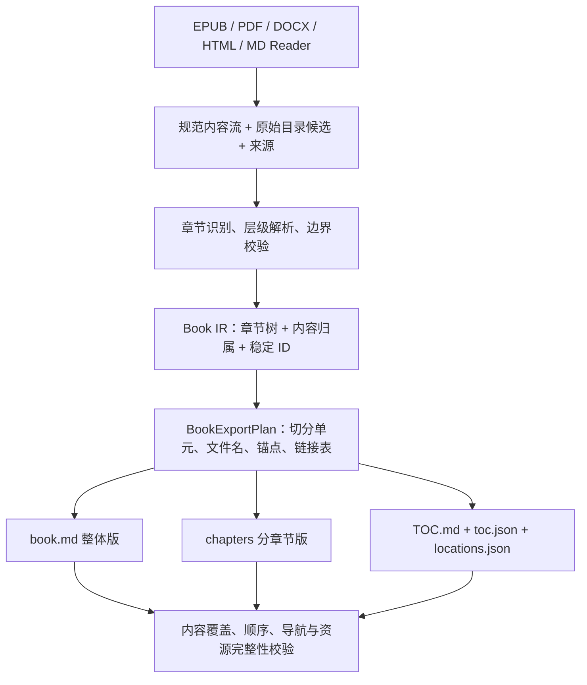

# 书籍结构、双版本 Markdown 与目录重组

状态：架构提案，尚未实现。日期：2026-09-16。

实际开发节奏与验收分工以 [人机协作实现 TODO](../TODO.md) 为准：章节、双版本和索引随可用功能交付，由用户执行脚本验证；本文样例要求作为人工观察项，不要求编写自动化测试。

这是 [转换架构方案](0002-conversion-architecture.md) 的书籍核心设计。项目以书籍转换为重点：章节识别、完整层级、可追溯索引，以及整体版/分章节版的一致定位属于基础能力，需要先于更多格式和模型实现。当前仅设计目录调整，不迁移源码或修改功能。

## 1. 核心约束：一份书籍结构，生成多个视图

**同一份 Book IR、同一棵章节树、同一次导出计划，生成整体 Markdown、分章节 Markdown 和目录索引。**

整体版不能靠“重新扫描分章节文件名”来拼接；分章节版不能对整体 MD 用标题正则再切分。两者从同一份有序内容和章节边界生成，允许标题显示和导航不同，但正文归属和来源一致。



当前代码的具体不足：

- `epub_to_md/__init__.py:_flatten_toc` 对 Section 和 tuple 只递归子项，没有保留父节点；`TocEntry` 和 `Chapter` 没有父 ID、深度和完整路径。目录层级在入口就消失了。
- `_build_chapter_filename` 主要按标题命名，可能只取方括号内容；重名用出现次数追加后缀，不能可靠表达章节顺序和身份。
- `_build_anchor_id` 将标题和顺序号组合为锚点；改名或插章后，旧定位可能改变。
- 单篇正文可能包含多个 TOC 锚点，当前切 HTML 片段的方式缺少统一覆盖校验，锚点缺失时也缺少明确的结构恢复契约。
- `convert_epub_to_single_markdown` 拼接章节字符串，没有全书导航映射；`convert_books.py` 走另一条 EPUB → HTML → MD 路径，不共享书籍层级模型。
- `html_to_md/converter.py` 按顶层 section 拆分，slug 主要保留 ASCII；中文标题可能退化为通用 section 编号。

## 2. 书籍模型：身份、层级、顺序、文件位置分开

`Book` 是 Document IR 的书籍语义配置，共享文字、图片、表格和来源模型，不维护第二套正文。

| 对象/字段 | 含义 |
|---|---|
| `Book.book_id` / `edition_id` / `revision_id` | 书籍、版本和处理修订身份；不同来源不能仅因标题相同自动合并 |
| `StructureNode.id` | 节点身份，独立于标题、序号、文件名和渲染格式 |
| `parent_id` / 有序 `children` | 章节树，保留卷、部、章、节、小节；不只保留叶节点 |
| `role` | volume、part、chapter、section、frontmatter、backmatter、appendix、unknown 等语义角色 |
| `title_original` / `title_display` / `label_original` | 原标题、可修正显示标题、原书编号如“第三章”“附录 A” |
| `depth` / `ordinal_path` / `reading_order` | 树深度、同级位置组成的层级序号、规范内容顺序；均不是身份 |
| `content_ranges` / `source_spans` | 节点直接拥有的有序内容区间和来源；子树内容通过子节点计算 |
| `recognition` | 识别依据、原始目录条目、冲突/置信信息、规则版本和人工修订来源 |
| `NavEntry` | 原始导航条目和目标节点；多个目录条目可引用同一节点，不复制正文 |
| `ExportUnit` | 一个实际 MD 文件承载的内容区间、节点锚点、上下文和顺序；允许包含多个小节 |

区分章节节点、目录条目和文件切分单元：有章名不代表一个源文件，有目录条目不代表独立正文，有小节也不代表必须独立输出文件。

正文规范顺序由有序 Block 流记录，每块只有一个直接归属节点。父章保存自己的引言等内容，子节内容只存一份；目录、导航和分隔符等导出生成内容标为 `generated`，不参与原文覆盖统计。

“参考文献/术语索引”等原书内容作为结构节点保存；项目生成的定位索引另外生成。人名、主题等语义索引属于未来能力，不从章节目录中自动推断。

### ID 与修订规则

- 完整 ID 是不透明值，生成安全 ASCII 锚点，如 `sec-完整ID`；同一节点改名、重排不因显示字段改变而换 ID。
- 首次导入建立持久身份表。优先根据 EPUB 路径+原始锚点、DOCX 可用段落标识等来源键分配；PDF 推断章节通过持久 ID 和修订匹配关联。
- 相同来源和配置重复导出得到相同 ID、切分和路径。无状态重建可采用固定来源命名空间确定性分配，但不能保证没有身份表时跨不同版本仍保持 ID。
- 重跑 OCR/结构规则，根据来源、邻接和文字证据匹配旧节点；不确定就新建 ID 并记录替代关系，不按标题猜测。
- 人工修改标题、父节点、边界作为结构覆盖记录，保留修改前后，无需重跑 OCR；章节合并/拆分显式记录旧到新 ID 的对应和歧义。身份与修订持久化见 [SQLite 设计](0004-sqlite-persistence.md)。

## 3. 章节识别：保留证据并校验边界

| 来源 | 优先证据 | 补充与回退 |
|---|---|---|
| EPUB | EPUB 3 导航目录，旧版 NCX；保留嵌套、无链接分组和锚点 | Spine 确定正文顺序，正文标题补齐遗漏层级；XHTML 文件边界不等于章边界 |
| PDF | 书签/outline 及目标位置，可选结构标签 | 编号、字号、样式、位置和上下文；扫描目录页 OCR 只提供候选，再与正文核对 |
| DOCX | 标题样式、outline level、编号关系与书签 | 目录字段与正文交叉校验，不能只按粗体识别章节 |
| HTML / MD | section、h1–h6、Markdown AST 标题和锚点 | TOC 链接辅助；代码块/引用内伪标题不参与识别 |

EPUB 的导航层级和 Spine 阅读顺序承担不同职责，标准分别定义目录导航与阅读顺序。因此项目保留两个来源并校验差异，不用 TOC 顺序无条件重排正文。[W3C EPUB 3.3](https://www.w3.org/TR/epub-33/)

处理步骤：

1. 收集原始目录、标题候选、锚点、页码、内容顺序及其证据。
2. 识别卷/部/章/节、前言、附录和编号关系；无编号标题仍可建树，同名标题不合并。
3. 将章节边界定位到实际 Block/文字范围。PDF 印刷页码与物理页码分别映射，目录页上的章名不能直接当正文起点。
4. 一个 EPUB 文件内多章按锚点切分，跨文件的一章按内容区间合并；PDF 允许页中起章、页中结束，不强行按整页切章。
5. 保留父章引言、子章后的补充及未进目录的内容。无正文容器节点仍入索引；悬空目录链接记录诊断，不能以复制整篇正文回退。
6. 标题跳级时保留源层级，必要时增加标为推断的容器或等待修订，不为补齐 h2 虚构章名。
7. 校验正文覆盖、归属和顺序。缺乏可靠结构时生成“未分章正文”并报告；要求可靠章节的严格模式应失败或待复核。

原书目录页作为内容保留并标注角色，生成 TOC 属于导航；两处相同章名不能产生重复章节。标题识别、层级推断、边界校验分别版本化，方便未来模型和人工修订。

## 4. 整体版与分章节版如何对应

### 4.1 先规划全部位置，再写文件

`BookExportPlan` 一次确定章节树修订、全书顺序、切分规则、文件路径、节点锚点、引用目标和资源位置。第一遍规划目标，第二遍渲染并重写引用；所有输出完成校验后作为同一修订发布。

同一节点在两份 MD 使用相同显式锚点。下表用短 ID 演示，实际锚点采用完整 ID：

| 节点 | 整体版位置 | 分章节版位置 |
|---|---|---|
| 第一部「基础」 | `book.md#sec-a431b829` | `chapters/001-000_基础--a431b829_index.md#sec-a431b829` |
| 第一章「文档结构」 | `book.md#sec-7b83e260` | `chapters/001-001_文档结构--7b83e260.md#sec-7b83e260` |
| 该章第一节「内容块」 | `book.md#sec-d920ca71` | 同一章文件中的 `#sec-d920ca71` |

**小节始终有节点 ID 和两处位置，即使不单独拆文件。** 目录索引可以细到小节，文件默认按章切分，两种粒度独立配置。

### 4.2 索引产物

- `TOC.md`：完整层级目录，每项显示 `[整体版]` 与 `[分章版]`，缩进对应章节树。
- `toc.json`：机器可读的规范目录树，含 ID、父子关系、原始/显示标题、编号、角色、顺序和来源。
- `locations.json`：节点和可引用 Block 的 ID → 每个导出视图的路径、锚点、文字范围，带导出修订和文件哈希。
- `book.md` 顶部目录：链接本文件锚点，可附每章的“分章阅读”链接。
- 章节文件：书名、祖先路径、章内目录、返回总目录、上一/下一阅读单元及整体版对应位置。

两个 JSON 均来自同一计划，不各自推断章节。位置示例（完整 ID 和校验字段省略）：

```json
{
  "node_id": "sec-d920ca71",
  "single": {"path": "book.md", "anchor": "sec-d920ca71"},
  "split": {
    "path": "chapters/001-001_文档结构--7b83e260.md",
    "anchor": "sec-d920ca71",
    "unit_id": "unit-chapter-7b83e260"
  },
  "source_spans": [{"page_index": 12}, {"page_index": 13}]
}
```

源页到章节是多对多关系，可从原 PDF 页/区域定位到两份 MD，也可反查来源。EPUB 用原路径和锚点定位，不虚构物理页码。

### 4.3 锚点、标题和引用

默认书籍 MD 使用显式 `<a id="sec-完整ID"></a>`，不依赖标题 slug；重复标题不冲突。在支持的目标阅读器上验收，过滤 HTML ID 的阅读器不保证页内跳转。

`strict_markdown` 不允许 HTML 时，可为指定阅读器输出其支持的标题锚点；没有指定兼容规则时只保证章节文件链接和机器映射，并报告通用页内跳转限制。本方案不把某个阅读器自动生成标题 ID 的规则当成跨阅读器契约。[CommonMark 规范](https://spec.commonmark.org/0.31.2/)

整体版可用 H1 书名、H2 部、H3 章、H4 节；分章版将章提升为 H1、节为 H2，通过面包屑保留全书层级。显示级别不同，ID 和真实深度不变；识别到系统章标题与原文标题相同时复用，不重复输出。

超过六级时 IR/TOC 仍保留完整层级，展示用 H6 加编号/面包屑等降级并记录。全书开头只生成一次 YAML front matter，不拼接各章元数据；分章文件各有自己的元数据。

内部引用在 IR 保存目标节点/Block ID；整体版渲染 `#anchor`，分章版渲染本文件锚点或目标文件相对路径。源 `#fragment` 按源文件命名空间解析，避免不同 EPUB 文件同名锚点冲突。

脚注、图表、公式编号同样有全书唯一身份。脚注为视图需要重复展开时标为生成展示，保持原脚注 ID；目标缺失保留原引用并报告，不误跳同名章。

## 5. 文件命名：排序、可读性和稳定性的取舍

### 默认方案：浅目录 + 完整层级序号

```text
{ordinal_path}_{title_slug}--{short_id}.md
```

每段序号默认三位，如 `001-003-002`，表示树中位置，不替代原书编号。根据全书最大同级数量确定统一宽度，超过 999 扩展；同输入/配置重复导出一致。

容器索引文件采用 `{ordinal_path}-000_{title_slug}--{short_id}_index.md`，额外的全零段仅表示容器自身导航，不是新章节层级。真实子节点从 001 开始，让部/卷的索引文件按名称排列时位于所属章节之前；位宽扩展时零段同步扩展。

短 ID 来自完整 ID，默认至少八位；全书检查冲突并确定性扩展。机器索引和锚点使用完整 ID；序号和标题改变不影响节点身份。

```text
book-output/
  book.md
  TOC.md
  toc.json
  locations.json
  manifest.json
  book.json
  source-map.json
  report.json
  chapters/
    001-000_基础--a431b829_index.md
    001-001_文档结构--7b83e260.md
    001-002_格式转换--830ead41.md
    002-000_实践--085cb02f_index.md
    002-001_文档结构--fb92a436.md
    003_附录-A-术语表--c220e531.md
  assets/
```

第一章的“内容块”小节留在该章文件中，仍进入完整 TOC。跨部重名章节由层级序号和 ID 区分。浅目录让资源深度统一、整包移动方便、路径长度可控；未来嵌套目录模式也复用同一计划与索引，不另建层级规则。

### 标题清理规则

1. 保留中文和其他 Unicode 字母，NFC 规范化，不默认拼音化；原标题不修改。
2. 空白折叠成短横线，替换路径分隔符、控制字符和 `<>:"/\\|?*#%`，去掉首尾空格/点；处理保留名、大小写折叠和 Unicode 等价冲突。
3. 按 UTF-8 字节预算截断且不截断字符；建议标题部分最多 96 字节、文件名最多 180 字节，并在根路径确定后校验完整路径长度。
4. 明确识别的章编号可从 slug 去重，如“第一章 文档结构”输出“文档结构”；原编号保留。不因括号存在而丢弃其余标题。
5. 空标题用“未命名章节”等角色默认名加 ID；中文标题不能普遍退化成 section。
6. 链接从最终路径生成并按 URI 规则转义，不能对显示标题重新 slugify 猜文件路径。

### 改名和增删章节

“序号排序、标题可读、路径永远不变”无法同时保证。默认面向离线阅读选择前两者：改名、插章和重排允许路径变化，ID 不变，包内全部链接一起更新。

增量导出保存旧路径及新地址映射，发布独立新版本目录，避免残留旧文件。需要兼容历史外链时，可选保留旧路径导航文件，或由应用按节点 ID 解析；合并/拆分有歧义时报告，不能承诺所有旧链接自动恢复。

长期笔记库可选 `filename_policy=stable_id`，命名 `sec-完整ID.md`，不用标题和序号，排序交给 TOC。节点身份和切分方式不变时路径稳定；节点合并或改变切分仍需映射。

## 6. 切分与正文不重不漏

默认 `split_policy=chapter`，章文件包含未进一步切分的节/小节。优先按语义角色选择切分点，固定深度仅作为可选策略，避免“有部的书”和“无部的书”产生不同含义。

卷/部的 `_index.md` 包含该节点标题、自身引言和子目录链接，不再嵌入子章全文。纯目录容器也保留导航文件；子章之后仍有父节点正文时创建按原位置排列的续段单元，如 `...--seg-0002.md`，不能把后记移到引言前。

切分单元为规范 Block 流的互不重叠连续区间。按计划阅读顺序遍历含正文单元，应恰好覆盖全部正文块一次。一个逻辑节点有多个片段时位置表记录 primary 和 segments，TOC 指向起点并用继续阅读链接连通后续片段。

区分“上一/下一阅读单元”和“上一/下一章”，前者按内容流，后者按章节节点。索引定义实际阅读顺序，文件字典序是常见结构下的浏览便利，不能替代索引。

正文一致性比较 Block ID 和规范内容摘要，不比较原始 MD 字节；导航、标题提升、路径及脚注展开会带来合理差异。只交付单一视图时，人类导航只显示实际交付目标，不能产生指向未交付文件的链接。

## 7. 项目目录重组

以下细化并替代通用方案的粗粒度目录建议，按阶段形成，不立即生成全部空模块。

```text
src/any_to_md/
  domain/
    book.py                    # 书籍、版本、元数据
    structure.py               # 章节树、身份、顺序、内容归属
    document.py                # 内容块、图片、表格、页
    provenance.py              # 来源坐标与识别证据
    artifacts.py               # 产物与定位引用
  application/
    convert_book.py            # Web/CLI 共用用例
    export_book.py             # 双视图导出编排
    ports.py                   # 小型接口，按需拆分
    requests.py
  structure/
    candidates.py              # 通用章节证据
    resolve.py                 # 层级与冲突处理
    boundaries.py              # 正文边界和覆盖
    identities.py              # ID 复用和修订对应
    overrides.py               # 可追溯修订
  readers/
    epub/                      # package/spine/nav/NCX
    pdf/                       # 页分析、提取、区域处理
    docx/
    html/
    markdown/
    image/
  export/
    planning.py                # 切分单元与阅读顺序
    naming.py                  # 文件名和路径预算
    anchors.py
    navigation.py              # TOC、面包屑、前后导航
    links.py                   # 跨章、脚注、图表与资源
    validation.py              # 双视图和链接一致性
  writers/
    markdown/                  # 共享块渲染，不同视图布局
    html/
    pdf/
  processing/                  # 清理、表格、阅读顺序、AI 分块
  adapters/
    ocr/                       # 现有远端与未来小模型
    persistence/sqlite/        # 连接、迁移、仓储
    storage/                   # 大文件与产物
    execution/
    acquisition/               # 文件/URL 来源
  interfaces/
    web/                       # FastAPI 与静态资源
    cli/                       # 单书和批量
  resources/                   # 样式、模板、打包字体
  bootstrap.py
tests/contracts/
tests/integration/
tests/fixtures/books/
evals/books/
scripts/
legacy/java/
specs/
var/                           # 书库、输出、缓存、SQLite；忽略版本控制
pyproject.toml
README.md
```

`structure/` 管书的语义，`export/` 管跨视图定位，`writers/` 管语法。EPUB Reader 只解析 EPUB 特有证据，通用层级规则共享。SQLite 仓储只实现持久化端口，领域和 Writer 不直接执行 SQL。

| 现有位置 | 目标归属 |
|---|---|
| `epub_to_md/`、`epub_to_html/` | EPUB Reader + structure + export/writers |
| `html_to_md/`、`html_to_pdf/` | HTML Reader、MD/PDF Writer，资源统一管理 |
| `pdf_to_md/`、`ocr_to_md/` | PDF Reader 页管线、OCR adapter、processing |
| `docx_to_md/`、`url_to_md/` | DOCX Reader；URL acquisition + HTML Reader |
| `web/` | interfaces/web，业务下沉 application，过渡入口保留 |
| `convert_books.py` | 薄批量 CLI，共用 convert_book |
| `group_verbs.py`、`refine_groups.py` | 核查后放 scripts，核心不依赖专项脚本 |
| `md_to_any/` | Java 参考代码归 legacy；先迁出 Python 使用的字体，再核查其他历史资源 |
| `books/`、`output/`、`temp/` | 统一可配置运行位置；不自动移动或删除已有用户书库 |

先收敛职责，再移动目录；旧函数和 CLI 保留兼容壳。包配置随迁移验证 wheel 安装、静态资源和字体。目录重组不顺带移动用户数据。

## 8. 优先级和验收

基础来源、产物、SQLite 身份/任务持久化先做；随后优先跑通 **EPUB 章节树 → 导出计划 → 整体/分章 MD → 索引一致性**，再扩展格式和小模型。

| 阶段 | 最小交付 | 验收 |
|---|---|---|
| A | Book/章节树、完整 EPUB 目录、来源与稳定 ID | 父节点不丢，一文件多章、一章多文件可表达 |
| B | ExportPlan、命名、锚点、双 MD、TOC/位置索引 | 每个索引节点两处可定位，小节不拆文件仍可跳转 |
| C | 资源/脚注/跨章引用、覆盖验证 | 预期本地链接可达，各视图正文块不重不漏且顺序一致 |
| D | 目录迁移、兼容入口 | Web/CLI/批处理共用流程，安装包独立运行 |
| E | PDF 章节接入页管线、结构修订 | 目录页不误作正文，页中章界和页码对应可定位 |

验收样本包括深层目录、父节点引言及尾段、前言附录、重复/中文/超长标题、保留字符、大小写/Unicode 冲突、短 ID 碰撞、超过 999 个同级节点；还要覆盖缺锚点、无目录、目录与 Spine 冲突、一章多文件、跨章脚注、插章改名及修订恢复。

PDF 样本覆盖目录页、印刷页码偏移、扫描目录、多栏、页中章界和低置信识别。整体版、分章版、双版本整包均校验实际链接；双版本整包是书籍推荐配置。

AI 分块记录 book/edition/node ID、祖先标题路径、来源和实际可用的 MD 位置，分块不能丢章节语境。人工验证样例、操作说明与运行脚本随对应功能节点交付，不编写自动化测试套件，本次仅设计。
